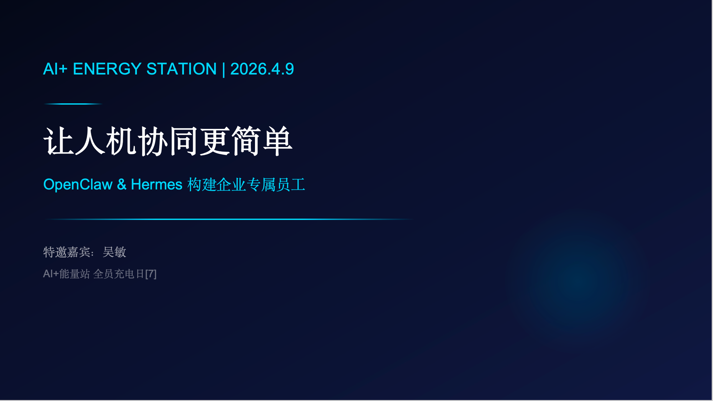
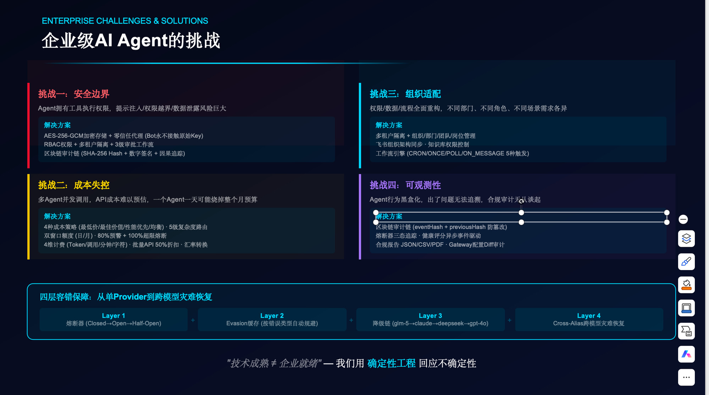
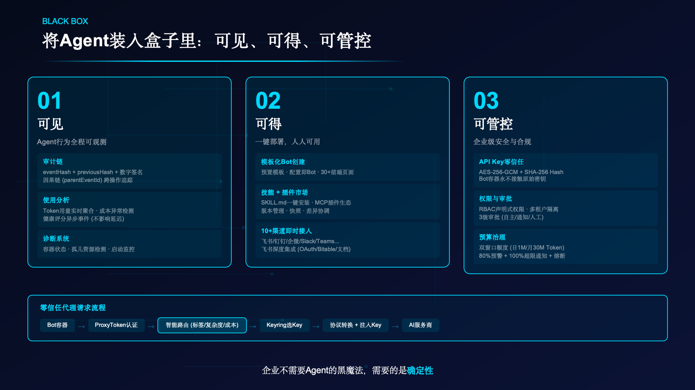
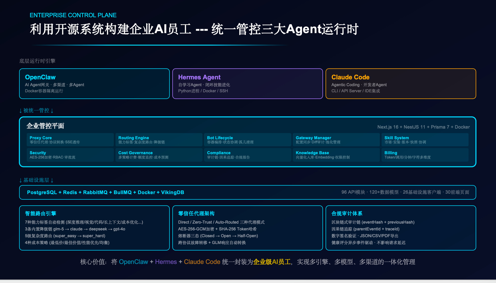
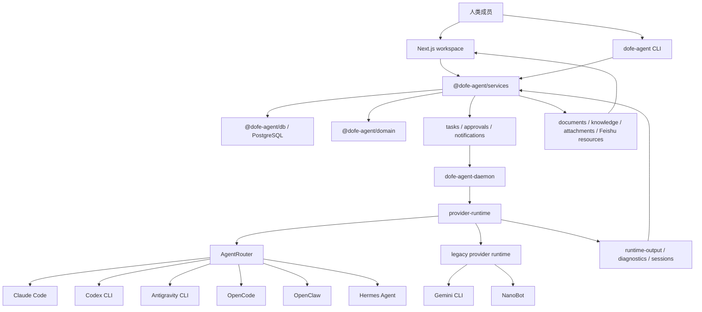

# DoFe.AI：人类 + AI 员工，共建企业护城河

> **Do For Employee · Do For Enterprise · Do For Empowerment**
>
> 让人机协同更简单。



DoFe.AI（agent.dofe）是一套为员工、企业与赋能而生的**执行力引擎**：一句话发起工作，AI 员工接力执行，人类在关键节点做决定。

AI 员工不是被调用的工具，而是有岗位、有 owner、可管理、可信任的一线队友。人与 AI 员工共同沉淀的流程、知识与治理边界，就是随使用不断加深的企业护城河。

---

## 愿景与使命

- **愿景** — 成为受世界尊敬的中国企业
- **使命** — 成就中国智造的全球竞争力
- **承诺** — 海豚般温暖，钢铁般可靠——连接孤岛、构建智能生态，让每一次执行都迈向卓越

---

## Do For E 理念

Do For E 是一份开放的生态宣言。dofe 不只是一套 AI 系统，更是为员工（Employee）、为企业（Enterprise）、为赋能（Empowerment）而生的执行力引擎。

**九个 E，九个承诺：**

| E | 为谁/为何 | 承诺 |
| --- | --- | --- |
| **Employee** | 为员工 | 始终以人为本，赋能每一位团队成员 |
| **Enterprise** | 为企业 | 志存高远，规模化驱动智能转型 |
| **Empowerment** | 为赋能 | 超越工具，延展并放大人的能力 |
| **Execution** | 为执行 | 一句话启动一切，想法即刻变成行动 |
| **Efficiency** | 为效率 | 夺回每一分钟，把吞吐量拉满 |
| **Excellence** | 为卓越 | 永不敷衍交付，AI 标准化执行追求品质 |
| **Ecosystem** | 为生态 | 打破孤岛，构建协作的数字神经系统 |
| **Evolution** | 为进化 | 点燃组织持续进化，面向未来设计 |
| **Escort** | 为护航 | 守护每一笔交易与资产，全天候 AI 安全护航 |

---

## 为什么需要 DoFe.AI

**技术成熟 ≠ 企业就绪。** Agent 能力越来越强，但团队使用 Agent 的方式还没有跟上——大多数 Agent 产品仍为个人使用而建：一个人、一个终端、一个聊天会话。真实组织一旦把 Agent 放进日常运营，问题就会暴露：



- **Agent 仍是个人工具** — 强大的 Agent 留在某个人的终端或账号里，对团队不可见。
- **上下文分散** — 消息、文档、审批、截图和 runtime 文件没有共享归宿。
- **执行路径割裂** — 每个 provider 都有自己的 CLI 行为、session 模型和诊断方式；切换 runtime 等于重建上下文。
- **治理缺失** — 凭据、文档、runtime access、工具调用和外发动作难以集中检查。
- **工作难以持续** — 跨天任务需要队列、交接、产物、重试和人类检查点，单一 Agent framework 很难覆盖。

企业不需要 Agent 的黑魔法，需要的是**确定性**。DoFe.AI 用工程化的治理与协作结构回应不确定性：人类负责方向和授权，AI 员工负责协调和执行。

---

## 三大原则：可见 · 可得 · 可管控



### 🔭 可见 — Agent 行为全程可观测

- 每个任务的执行 timeline、runtime output 和诊断保留在 workspace 里，而不是埋在某个人的终端里。
- 完整审计日志：动作、决策、审批与输出全程可追踪，可按资源树或 actor 反查。
- 预算、成本和性能仪表盘让 AI 员工的每一分消耗可见。

### 🚪 可得 — 人人可用，一键上岗

- 数字员工展板：角色、owner、技能、知识、ready 状态与 runtime binding 全组织可见。
- 技能库支持创建、导入、发布与回滚，优秀 Agent 能力可复用、可流转。
- 飞书 Bot 通信与文档/表格/多维表格资源绑定，AI 员工直接融入现有协作流。

### 🔐 可管控 — 每个动作都有边界、记录和 owner

- Workspace 角色、频道访问、文档权限、runtime 授权、daemon token 一个控制面集中治理。
- 高影响动作进入人类审批节点，快速审批循环让 Agent 继续推进、人类保持控制。
- 权限可撤销、可审计、可诊断漂移，问题不会静默扩大。

---

## 产品能力

agent.dofe 为 Agent 组织提供四个关键能力：

- **🗓 调度** — 同一个 Agent，选择最合适的 runtime。身份、instructions 和上下文在任务间稳定；AgentRouter 把任务路由到 Claude Code、Codex、OpenClaw、Hermes 等合适 harness，统一事件、session、产物和诊断。执行路径变化时只换 harness，技能、知识、权限和完整员工上下文保持不变。
- **🧑‍💼 能力共享** — 把私人 Agent 变成共享组织资产。全组织展示每个数字员工的岗位与能力，成员申请访问、借用 Agent，owner review queue 和管理员审批路径保持显式。
- **🤝 协作** — Agent 协调推进，人类审批关键节点。频道、直接会话、inbox 任务、文档和任务看板构成共享工作区；复杂请求经证据整理、预算检查、审批准备、执行到产物交付，无需人类手动交接。
- **🔐 安全** — 每个动作都有边界、记录和 owner。从一个地方治理角色、频道、文档、技能、知识、runtime、daemon token 和飞书资源绑定，支持文档权限请求、runtime tool approval、knowledge proposal review。

**团队可以立刻做的事：**

- 🗂 招募和分配有明确角色与 owner 的专用 Agent
- 🤝 在共享 workspace 内协调多 Agent 工作流
- 📅 自动调度 Agent 何时、如何执行任务
- 🔐 将敏感动作限制在治理边界内
- 📋 完整审计 Agent 的动作、决策和输出
- 🔄 让数字员工跨团队、跨部门流转

### 差异对比

| 没有 DoFe.AI | 使用 DoFe.AI |
| --- | --- |
| Agent 是藏在本地终端或私聊里的个人工具。 | Agent 成为有身份、owner、技能、知识和申请流程的数字员工。 |
| 每个 runtime 都有自己的执行路径、session 模型和诊断方式。 | AgentRouter 把所有 harness 归一到统一执行 contract 后面。 |
| 人类手动在聊天、文档、表格和任务之间搬运上下文。 | 共享 workspace 让人类和 Agent 拥有同一个操作上下文。 |
| 权限散落在工具、文件、凭据和外部账号里。 | 一个控制面集中管理授权、审批、委托和审计轨迹。 |
| 工作最终停留在对话记录里。 | 工作沉淀为任务、文件、文档、runtime output、审批和可追踪历史。 |

---

## 使用场景：创始团队执行系统

小团队需要速度，但没有控制的速度会制造债务。DoFe.AI 让创始团队获得接近更大组织的执行杠杆，同时不失去对实际工作流的可见性和责任边界。

1. **创始人在 workspace 频道里提出请求** — 不需要额外 ticket 系统，也没有启动成本。
2. **协调型 Agent 自动拆解** — 任务被拆分、界定范围，并分配给合适的专业 Agent。
3. **Agent 收集所需上下文** — 文档、知识页、已绑定的飞书资源和历史执行产物都会进入上下文。
4. **高风险动作在发生前被标记** — 工具调用、文档访问、外发动作和预算敏感动作进入人类审批节点。
5. **人类批准或拒绝** — 一次决策，完整可见，不需要微观管理。
6. **Agent 完成工作** — 结果写回任务、文档、附件和 runtime output，不会丢失。

目标不是更聪明的聊天机器人，而是一个受治理的操作界面，让人类和 AI 员工一起完成真实工作。

---

## 目录

- [部署与快速开始](#部署与快速开始)
  - [Path A：运行 Workspace](#path-a运行-workspace)
  - [Path B：使用 CLI](#path-b使用-cli)
  - [Path C：接入远程 Daemon](#path-c接入远程-daemon)
- [AgentRouter](#agentrouter)
- [架构](#架构)
- [高级配置与质量](#高级配置与质量)
- [代码结构](#代码结构)
- [文档](#文档)
- [路线图](#路线图)

---

## 部署与快速开始

| 模式 | 适合场景 | 如何开始 |
|------|----------|----------|
| ☁️ **Platform**（托管版） | 希望立即开始使用，不想维护基础设施、数据库或 daemon host 的团队。 | 访问 [hire-an-agent.online](https://hire-an-agent.online) |
| 🖥️ **Self-hosted**（本地自托管） | 需要完整掌控数据、基础设施、provider CLI、runtime 机器和内部部署策略的团队。 | Clone 本仓库，按下面的 setup guide 启动 |

两种模式运行同一套产品能力：数字员工、AgentRouter 调度、workspace 权限、审批流、远程 daemon 执行和可审计产物，二者没有功能断层。

需要部署 Web/API、Workflow Worker 和 Claude Code、Codex daemon 时，请使用 [deploy/self-hosted](deploy/self-hosted/README.md)。PostgreSQL、Redis、RabbitMQ 必须使用 `../docker-helm.dofe.ai` 提供的外部服务；其中 Claude daemon 会自动托管飞书 Bot worker，无需另行启动 worker。

### 环境要求

- 推荐 Node.js 24.19.0（Latest LTS，由根目录 `.node-version` 固定）。remote daemon package 最低要求 Node.js `>=24.19.0`，完整支持范围以各 `package.json` 的 `engines` 字段为准，详见 [docs/0814/node-runtime-matrix.md](docs/0814/node-runtime-matrix.md)。
- pnpm 10.26.2。
- 推荐 PostgreSQL 16。数据库由 `../docker-helm.dofe.ai` 统一管理，本仓库不创建数据库服务或数据卷。
- 可选 provider CLI：`codex`、`claude`、`agy`（Antigravity）、`gemini`（legacy）、`opencode`、`openclaw`、`nanobot`、`hermes`。
- 可选飞书自建应用和 Bot 配置。

### Path A：运行 Workspace

```bash
git clone <your-dofe-agent-repo-url>
cd DofeAgent

pnpm run setup
cp .env.example .env
# 将 DATABASE_URL、REDIS_URL 等配置指向 ../docker-helm.dofe.ai 管理的外部服务
# 由基础设施仓库的获准迁移流程完成 schema 变更
pnpm dev
```

打开：

```text
http://127.0.0.1:1455
```

> [!NOTE]
> 生产部署如果使用 Next.js Server Actions，请在构建和运行时设置稳定的 `NEXT_SERVER_ACTIONS_ENCRYPTION_KEY`，并让所有 Web 实例共享同一个值。

### Path B：使用 CLI

首次使用时，在项目根目录执行一次 `pnpm --filter @dofe-agent/cli link --global`，将 `dofe-agent` 添加到终端 `PATH`：

```bash
pnpm --filter @dofe-agent/cli link --global
dofe-agent help
dofe-agent doctor --json
dofe-agent workspace status --json
dofe-agent db status --json
dofe-agent im channels --json
dofe-agent channel list --json
dofe-agent task list --json
dofe-agent daemon status --json
```

数据库状态命令（schema 迁移由外部基础设施流程执行）：

```bash
pnpm run db:pg:status -- --json
pnpm run db:pg:status -- --json
```

### Path C：接入远程 Daemon

打包 daemon：

```bash
pnpm run daemon:pack
```

在远端主机安装并启动：

```bash
pnpm add --global ./dofe-agent-daemon-0.1.3.tgz

dofe-agent-daemon start \
  --foreground \
  --server-url "https://your-dofe-agent-domain" \
  --daemon-token "adt_xxx" \
  --daemon-id "daemon-prod-01" \
  --device-name "prod-daemon-host-01" \
  --runtime-name "Remote Agent" \
  --task-timeout "43200000" \
  --state-dir "$HOME/.dofe-agent-daemon"
```

provider 说明、OpenClaw health、Hermes 和故障排查见 [packages/daemon/README.md](packages/daemon/README.md)。

---

## AgentRouter

AgentRouter 是 provider harness 归一化层。它不替代 workspace，也不拥有业务队列。它负责启动不同 agent CLI，并归一化事件、结果、session 和诊断。

| Provider | 执行路径 | 诊断 |
| --- | --- | --- |
| Claude Code | AgentRouter | stream-json events、session fallback、tool approval bridge |
| Codex CLI | AgentRouter | JSON events、session fallback、runtime tool capability diagnostics |
| Antigravity CLI | AgentRouter | 通过 `agy -p` 的 prompt-mode CLI、可选 conversation 复用、timeout/nonzero/empty diagnostics |
| OpenCode | AgentRouter | JSON events、session propagation、timeout/nonzero/empty diagnostics |
| OpenClaw | AgentRouter | health/preflight、auth/profile/model/tool/protocol diagnostics、missing session fallback |
| Hermes Agent | AgentRouter | 文本输出、可执行文件兼容性检查、超时和空响应诊断 |
| Gemini CLI | legacy provider-runtime | legacy one-shot CLI fallback |
| NanoBot | legacy provider-runtime | one-shot CLI |

直接对 AgentRouter 做 smoke test（`agent-router` 与 daemon 同包发布，先执行 `pnpm --filter dofe-agent-daemon link --global` 加入 PATH）：

```bash
agent-router harnesses
agent-router detect
agent-router run --harness claude --cwd /workspace/project "summarize this repo"
agent-router run --harness codex --cwd /workspace/project --model gpt-5.1 "fix tests"
agent-router run --harness antigravity --cwd /workspace/project --model "Gemini 3.5 Flash" "summarize this repo"
agent-router run --harness opencode --cwd /workspace/project --model openrouter/openai/gpt-4.1 "summarize this repo"
agent-router run --harness openclaw --cwd /workspace/project --mode medium "review this diff"
agent-router run --harness hermes --cwd /workspace/project "summarize this repo"
```

---

## 架构





### 数字员工展板

展板把 Agent 暴露为可管理的组织资源：

- 角色、摘要、owner、ready 状态和运行状态
- 已分配技能和知识
- runtime 与 harness binding
- 共同频道和频道可用性
- 借用/request flows
- owner 和 admin 的 review queues

### 权限控制面

权限模型围绕资源、actor、grant source、执行能力和外部 delegation 组织。

| 控制面 | 能力 |
| --- | --- |
| Workspace 成员 | 成员资格与角色由 Dofe SSO 管理，DoFe.AI 只消费 SSO 目录 |
| 频道访问 | 加入、频道邀请、访问请求、读写断言 |
| 直接会话隐私 | 直接会话仅限参与者和相关 agent owner |
| Agent 管理 | owner、instructions、频道可用性、技能、知识、runtime binding |
| Runtime 授权 | user-level grants、runtime sharing、bind/unbind、runtime provider health |
| Daemon 安全 | API token 创建/撤销、远程 daemon 注册、runtime display name |
| 文档 | owner/editor/viewer 角色、agent access、permission requests、version rollback |
| 飞书 | Bot 绑定、文档/表格/多维表格资源绑定、受治理的数据操作 |
| 审批 | runtime tool approvals、knowledge proposal approvals、document permissions |
| 诊断 | missing grants、revoked credentials、orphaned grants、unavailable providers |

### 技能、知识和飞书

agent.dofe 包含可复用的执行构件：

- file-backed workspace skills，可创建、导入、导出并分配给 Agent
- knowledge pages、materials、attachments、channel docs 和 generated knowledge proposals
- 在 Agent 设置页完成飞书自建应用和 Bot 的接入引导
- 为 Agent 绑定飞书文档、表格和多维表格资源
- 缺少访问权限时的 permission request flows

---

## 高级配置与质量

环境变量和部署示例请从这里开始：

- [.env.example](.env.example)
- [deploy/systemd/dofe-agent.env.example](deploy/systemd/dofe-agent.env.example)
- [deploy/systemd/dofe-agent-daemon.env.example](deploy/systemd/dofe-agent-daemon.env.example)

质量检查命令：

```bash
pnpm run build
pnpm run typecheck
pnpm run lint:web
pnpm run test:web
pnpm run test:e2e:web
pnpm run quality:web
```

---

## 代码结构

这是一个 pnpm + Turborepo 的 monorepo，按「apps（可部署进程）/ packages（可复用库）」划分：

```text
DofeAgent/
├── apps/
│   ├── web/                 # Next.js 16 App Router workspace UI + API routes
│   ├── cli/                 # 本地控制台 CLI（dofe-agent）
│   ├── workflow-worker/     # 后台任务 worker（workflow engine、调度、运行历史游标）
│   └── mcp-egress-proxy/    # MCP 出站安全代理（Ed25519 lease 校验、策略防火墙、审计）
├── packages/
│   ├── domain/              # 共享领域模型和 daemon API 类型
│   ├── db/                  # PostgreSQL 持久化、runtime records、schema 初始化与迁移
│   ├── services/            # web 和 CLI 共用的业务服务（约 60 个域模块）
│   ├── daemon/              # 远程 daemon package + AgentRouter CLI（独立可分发产物）
│   └── sandbox/             # sandbox 抽象（local adapter + 实验性 Cube scaffold）
├── deploy/                  # systemd、nginx、PostgreSQL、self-hosted Compose、staging/drills、远程 daemon 脚本
├── scripts/                 # 质量门禁与运维脚本（test inventory、engines 审计、dev daemons、飞书 smoke）
├── docs/                    # 按日期组织的设计/实施文档（0724 ~ 0819），入口见 docs/README.md
└── asset/                   # 产品图片、GIF、视频和 contact sheets
```

### 各包职责与依赖方向

依赖方向自顶向下：`apps/*` → `services` → `db` → `domain`。`daemon` 是唯一可独立打包分发的库产物（`dofe-agent-daemon` tgz）：它依赖 `services/db/sandbox/domain`，构建时用 esbuild 把这些依赖（连同 CLI 入口）全量 bundle 进 `dist/`，因此**发布产物自包含、在远端运行时不需要仓库 checkout**。

| 包 | 职责 | 关键模块 |
| --- | --- | --- |
| `domain` | 跨包共享的类型与领域模型 | workspace、daemon API 类型 |
| `db` | PostgreSQL 访问、schema、迁移 | `postgres-schema.ts`、`postgres-cli.ts`（init/migrate/cutover-plan） |
| `services` | 业务逻辑核心 | channels、tasks、approvals、permissions、documents、knowledge、skills、mcp-center、runtime-provisioning、workflows 等 |
| `daemon` | 远程执行底座 | agent-router、provider-runtime、skill-runner、managed-runtime-provisioning、bundle |
| `sandbox` | 执行隔离抽象 | local adapter、实验性 cube |

### 质量与测试

- **类型检查**：`pnpm typecheck`（deps 类型 + web + cli + daemon + workflow-worker）。
- **测试**：`pnpm test`（`turbo run test --concurrency=2`）；单包用 `pnpm --filter <pkg> test`。
- **Node engines 门禁**：`pnpm audit:engines`（`scripts/audit-node-engines.mjs`），已接入根 `pretest`。
- **测试清单门禁**：`scripts/verify-test-inventory.mjs`，防止测试文件漂移漏测。
- **Web 质量**：`pnpm quality:web`（typecheck + lint + vitest）。

Node 版本策略与运行时矩阵见 [docs/0814/node-runtime-matrix.md](docs/0814/node-runtime-matrix.md)。

---

## 文档

- [远程 daemon 部署测试指南](deploy/REMOTE_DAEMON_TEST.md)
- [创始团队执行 showcase](deploy/FOUNDER_EXECUTION_SHOWCASE.md)
- [Self-hosted Docker Stack](deploy/self-hosted/README.md)
- [远程 daemon 安装脚本](deploy/install-remote-daemon.sh)
- [Daemon package README](packages/daemon/README.md)
- [Node 运行时矩阵与版本策略](docs/0814/node-runtime-matrix.md)
- [发布前人工预检清单](docs/0814/release-preflight-checklist.md)
- [Prisma 迁移评估与实施方案](docs/0808/db_migration_to_prisma/README.md)
- [深度分析与优化建议](docs/optimization-suggestions.md)
- [优化落地进度日志](docs/progress-log.md)
- [Web systemd unit](deploy/systemd/dofe-agent.service)
- [Web 环境变量模板](deploy/systemd/dofe-agent.env.example)
- [Daemon systemd unit](deploy/systemd/dofe-agent-daemon.service)
- [Daemon 环境变量模板](deploy/systemd/dofe-agent-daemon.env.example)

---

## 路线图

状态标记与 [docs/README.md](docs/README.md) 一致：✅ 已实现 · 🟡 进行中 · ⏳ 计划中。

### ✅ 已实现

#### 执行与调度

- AgentRouter 统一 harness 层：Claude Code、Codex、Antigravity、OpenCode、OpenClaw、Hermes；Gemini、NanoBot 走 legacy 路径
- 远程 daemon 执行、runtime sharing、OpenClaw provider health
- 可视化自动化工作流引擎（xyflow 画布、发布/调度/运行回放、双 Runner 五对象对照切流）
- 托管运行时供给（7 阶段状态机、凭据 vault、OpenMontage 作业集成）

#### 协作与能力

- 多租户工作空间、Dofe SSO 登录、成员体系和访问控制
- 频道文档、知识库、全局搜索、审批、任务看板、预算、成本和性能仪表盘
- 技能库（Skill 安装/导入/发布/回滚）与托管技能服务（Docker 隔离 + egress 防火墙）
- 飞书 Bot 通信、飞书文档/表格/多维表格资源绑定和受治理的数据操作

#### 治理与底座

- MCP 中心（连接管理、凭据加密、出站 egress 租约签名）与 MCP 出站安全代理
- 员工数据保护（备份恢复演练、法务保全 legal hold、孤儿 blob 回收）
- PostgreSQL 主存储（126 张表）、TOS 附件对象存储和可靠通知
- 可观测性：Pager 按告警域路由、SLO 窗口去重、完整审计日志

### 🟡 进行中

- **数据库访问渐进迁移到 Prisma**（A→B 路线）：Phase 2 已覆盖 22 个读域 + 4 条写路径，写流量 flag 仍关闭，待 shadow oracle 对照后切流。详见 [docs/0808/db_migration_to_prisma](docs/0808/db_migration_to_prisma/README.md)。
- **技能服务 Phase 5**：管理端 UI 易用性打磨与 Linux iptables egress 验证。
- **MCP 中心 E4 收尾**：真实 Codex 经 MCP gateway 注入的 E2E 验证（待指定 CI 环境）。
- **构建一致性**：daemon 分发镜像 tag 锁 digest、provider 默认模型目录去硬编码。

### ⏳ 计划中

- 更强的 AgentRouter 平台会话与更完整的 integration adapter contract
- 更深入的 OpenClaw provider 加固
- runtime tool marketplace 和更多 agent-native app harness
- 更严格的 attachment signed URL 与存储隔离策略
- 员工数据恢复的 API 路由、UI 与 daemon 接线（依赖权限模型定稿）
- 测试 CI 流水线建设（优化项 3.6-1）

已收口的方向不再列入：Cube sandbox 实验数据面已按优化项 3.5-5 决策移除（如需云沙箱从 git 历史恢复）；历史优化项的完整状态见 [docs/progress-log.md](docs/progress-log.md) 与 [docs/optimization-suggestions.md](docs/optimization-suggestions.md)。

---

## 许可证

[Apache License 2.0](LICENSE)
