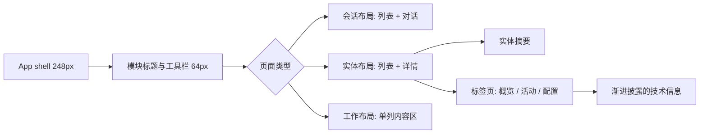

# 02. 信息架构与核心流程

## 目标用户与工作模式

| 角色 | 高频目标 | 首屏应回答的问题 |
| --- | --- | --- |
| 工作区负责人 | 分派工作、处理审批、监控交付 | 哪些工作阻塞？谁在负责？ |
| 运营管理员 | 连接执行引擎、排查离线、更新 Runtime | 哪个引擎异常？下一步能做什么？ |
| Agent owner | 配置数字员工、技能、权限和资料 | 这个员工能做什么，是否有权限执行？ |
| 协作成员 | 发起请求、跟进结果、查阅知识 | 当前对话/任务的上下文和最新产出是什么？ |

## 新的信息架构

侧栏不再以“页面类型”堆叠入口，而以用户任务域组织。未开放或无权限的项不占位。

本信息架构默认描述的是业务工作台。管理员和 owner 另有独立的管理控制台；两者的导航、首页问题和操作风险不同，具体边界见 [07-业务与管理双视图.md](./07-业务与管理双视图.md)。

```text
工作台
├── 收件箱                 待处理通知、提及和审批提醒
├── 协作
│   ├── 消息               频道与直接会话
│   ├── 任务               看板、日程和自动化
│   └── 知识               页面、文档与资料
├── 团队
│   ├── 数字员工           员工、组织结构和模板
│   └── 成员               人员与访问范围
├── 运营
│   ├── 执行引擎           Runtime、daemon、执行记录
│   ├── 审批               按风险聚合的待办
│   ├── 成本与绩效         用量、预算和绩效
│   └── 数据               多维表格
└── 管理
    ├── 技能与市场
    └── 设置               成员、集成、权限与偏好
```

### 导航规则

- 侧栏宽度固定为 `248px`；仅在 `>= 1280px` 常驻。不得再在侧栏内使用三张统计卡。
- `收件箱`、`审批` 和 `任务`只显示有行动意义的红点或数字；其余模块不显示零计数。
- 分组标题使用 12px 常规字而非全大写字距。组间以 16px 留白分隔，不使用显眼分隔线。
- 单个导航项高度 36px，图标 16px，活动态使用 3px 左侧指示条和浅色背景，不使用渐变卡。
- 将“创建频道”“添加运行时”等实体创建动作移到模块页标题区域，不放在导航行尾。

## 页面层级



| 页面类型 | 适用模块 | 宽屏布局 | 窄屏策略 |
| --- | --- | --- | --- |
| 会话布局 | 消息、频道、直接会话 | 会话列表 320px + 内容区 | 列表与内容全屏切换，保留返回按钮 |
| 实体布局 | 执行引擎、员工、技能、知识、审批 | 实体列表 336px + 详情最少 720px | 先显示列表，选择后进入详情页 |
| 工作布局 | 看板、自动化、成本、表格、设置 | 单一内容区，最大阅读宽度或数据宽度 | 工具栏折叠为筛选和更多菜单 |

## 关键流程：处理离线执行引擎

```text
1. 用户打开「执行引擎」
2. 标题区域显示：1 个离线 / 2 个需要更新（仅有异常才出现）
3. 列表按健康度与最近心跳排序，离线项置顶
4. 用户选中引擎，详情首屏看到状态、最后心跳、负责人和主要动作
5. 选择“更新 Runtime”或“查看诊断”
6. 操作面板给出进度、可恢复错误与下一步
7. 成功后行内状态与标题队列即时更新，并保留活动记录
```

### 状态优先级

| 优先级 | 状态 | 页面行为 |
| --- | --- | --- |
| 1 | 离线、认证失效、执行失败 | 页面标题出现行动提示；列表置顶；详情默认打开诊断 |
| 2 | 更新中、排队中、待审批 | 详情显示进度；列表显示短状态 |
| 3 | 需要关注但不阻塞 | 列表显示中性提示；在活动页保留细节 |
| 4 | 已连接、空闲、已完成 | 仅以低强调标签或图标表达，不抢占标题区 |

## 核心数据表达

对技术实体采取「名称 + 健康 + 摘要」模式。

| 区域 | 默认显示 | 放入二级区 |
| --- | --- | --- |
| 列表行 | 名称、Provider、健康、最后心跳、一个次要摘要 | daemon ID、设备 IP、完整版本、安装应用 |
| 详情头部 | 名称、备注、状态、负责人、主要动作 | 删除、重新配对、复制 ID |
| 概览 | 运行中工作区、队列、过去 24 小时失败、版本 | 完整执行历史和原始事件 |
| 活动 | 最近 10 条按时间排序的事件 | 全量日志下载与原始 payload |
| 配置 | Provider、执行目录、可用能力、更新入口 | API 令牌和高风险设置，单独确认 |
