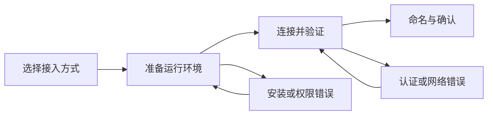

# 06. 引导与可点击性规范

## 目标

让用户在第一次执行关键配置时知道下一步该做什么，在熟练后不被教学打断；同时让每一个可点击元素都看起来可点击，每一个不可执行动作都说明原因。

引导应降低决策成本，不应增加页面噪音。因此不使用常驻的浮层、新手气泡连环提示、自动播放教程或在每张卡片上重复按钮。

## 引导策略

| 场景 | 呈现方式 | 何时消失 |
| --- | --- | --- |
| 页面没有数据 | 空状态 + 一个主行动 | 创建第一个实体或离开页面 |
| 首次高价值配置 | `GuidedFlow` 分步向导 | 成功、明确关闭或保存草稿 |
| 用户在字段上犹豫 | 字段下的短说明或帮助图标 | 失焦后保留必要校验信息 |
| 配置失败 | 错误面板 + 恢复行动 | 用户修复、重试或保存退出 |
| 熟练用户复查步骤 | 按需“接入帮助”入口 | 用户关闭 |

## 在线执行引擎接入向导

入口文案统一为 `接入执行引擎`。若该工作区已有引擎，入口位于页面标题右侧；若没有引擎，入口位于空状态。点击后在内容区打开宽度 `min(760px, 100vw)` 的分步面板，移动端全屏。

### 逐步流程



| 步骤 | 用户要完成的决定 | 页面内容 | 主要行动 | 退出与恢复 |
| --- | --- | --- | --- | --- |
| 1. 选择方式 | 接入本机还是远程在线引擎 | 两张单选卡：`本机`、`远程服务器`；每张 1 句说明 | `继续` | `取消` 不产生任何数据 |
| 2. 准备环境 | 在目标机器运行连接命令 | 一条可复制命令、系统要求、`我已运行命令` | `开始验证` | `返回`；命令只在需要时显示令牌 |
| 3. 连接并验证 | 等待或排查心跳 | 分阶段状态：等待注册、验证身份、读取能力；最长等待时间 | `重新验证` | `保存并稍后继续`；保留本次接入草稿 |
| 4. 命名与确认 | 设置易读名称和负责人 | 名称、备注、负责人、识别到的 Provider/版本摘要 | `完成接入` | `返回` 保留已输入内容 |

### 向导线框

```text
接入执行引擎                                      1 选择方式  —  2 准备  —  3 验证  —  4 完成
────────────────────────────────────────────────────────────────────────────────────────────────
在何处运行执行引擎？
选择目标机器；后续只展示与该方式相关的步骤。

  (●) 本机
      在当前设备运行。适合个人开发和快速验证。

  ( ) 远程服务器
      在已有的服务器或容器主机运行。适合共享运行时。

────────────────────────────────────────────────────────────────────────────────────────────────
                                                           取消                 继续
```

规范：

- 选择卡本身可点击，包含单选控件、标题和简短说明；选中态使用边框与单选标记，不能只变背景色。
- 一次只问一个决定。没有必要时不展示 daemon ID、原始版本、安装应用或高级开关。
- 令牌默认遮蔽；复制后显示“已复制”，不自动暴露到日志或 toast。用户离开向导时，令牌不写入草稿。
- 验证步骤显示真实、有限的等待状态。超过预期时间后转为错误恢复，而不是无限 loading。
- `完成接入` 仅在已成功验证且名称合法时可用；若不可用，按钮附近说明缺少什么。
- 成功后关闭向导、打开新引擎详情、在列表中显示新行，并在活动记录中写入“已接入”。

## 错误恢复

| 错误 | 用户可见表述 | 保留内容 | 恢复行动 |
| --- | --- | --- | --- |
| 未检测到进程 | 未检测到连接进程。请确认命令仍在目标设备运行。 | 接入方式、名称草稿 | 复制命令、查看要求、重新验证 |
| 认证失败 | 连接请求未被接受。请使用本次接入生成的命令重新运行。 | 非敏感草稿 | 生成新命令、重新验证 |
| 网络不可达 | 无法联系目标地址。请检查网络或服务器地址。 | 方式、地址、名称草稿 | 修改地址、重试、保存退出 |
| 权限不足 | 当前成员没有接入执行引擎的权限。 | 无草稿提交 | 查看所需权限、联系管理员 |
| 版本不兼容 | 已连接，但版本不支持当前能力。 | 已识别 Provider/版本 | 查看兼容要求、更新 Runtime、稍后处理 |

错误文案必须说明“发生了什么、是否会丢失内容、下一步怎么恢复”。不要显示裸 `403`、`timeout` 或内部 daemon 错误。

## 可点击性契约

以下规则是产品级硬约束：

1. 每个按钮必须处于 `default / hover / focus / active / loading / disabled` 中的明确状态，不能出现“看起来能点但无响应”的中间态。
2. 不允许执行的动作必须使用原生 `disabled`；跨元素复合控件使用 `aria-disabled="true"` 时，同时阻止点击与键盘触发。
3. 非禁用按钮必须具有明确的后续动作：改变页面状态、展开内容、提交数据或发生导航。hover/active 的视觉变化不算后续动作。异步动作点击后立即进入 loading，使用 `aria-busy="true"`，并在完成前阻止重复提交。
4. 禁用按钮不得响应 hover、active 或 tooltip 中的行动暗示；若禁用原因无法从上下文判断，必须在邻近位置说明。
5. 图标按钮必须有可访问名称；正在执行、成功和失败状态不能只依赖颜色表达。

| 元素 | 视觉线索 | 命中区与状态 | 行为规则 |
| --- | --- | --- | --- |
| 主按钮 | 实心蓝色、文字或图标+文字 | 最小 36px 高；hover、active、focus、loading | 每个区域最多一个；点击立即给出进度 |
| 次级按钮 | 白底细边框、明确标签 | 最小 36px 高 | 可逆或并列操作；不可与删除同色同权 |
| 图标按钮 | 熟悉图标、hover 容器、tooltip | 最小 32 x 32px；`aria-label` | 仅用于搜索、更多、关闭、复制等无歧义动作 |
| 列表行 | 可见 hover、箭头或选择态 | 整行可点，行内按钮必须独立命中 | 点击行打开详情；行内操作不会触发行点击 |
| 选择卡 | 边框、单选/复选、hover | 整卡可点，最小 44px | 只承担“选择”；不能混入提交动作 |
| 文本链接 | 颜色或下划线，不与静态文字混淆 | 可见 focus | 只用于导航、文档或外部跳转 |
| 禁用控件 | 降低对比度但保留文本 | 不可点击 | 必须在邻近处说明禁用原因或不渲染该控件 |

### 反干扰规则

1. 卡片只有在整个卡片可点击时才使用 hover 和指针光标；静态摘要卡不应伪装为按钮。
2. 同一结果只保留一个主要入口。例如“接入引擎”只出现在空状态或标题栏，不能同时出现在侧栏、列表头、详情卡和浮动按钮。
3. 行内点击与行内操作必须有清晰边界：操作使用图标按钮/更多菜单，并阻止行导航事件冒泡。
4. Popover 只说明局部概念；影响流程的说明必须在当前上下文中完整可读。
5. 任何自动刷新不得抢走焦点、滚动位置或用户正在填写的内容。
6. 高风险操作先解释对象与后果，再确认；确认按钮使用具体动词，例如 `删除 Claude Code 引擎`。

## 引导验收

| 测试 | 成功标准 |
| --- | --- |
| 第一次接入 | 用户不求助即可完成本机或远程引擎接入；完成率 >= 85% |
| 认证失败恢复 | 用户理解错误，能生成新命令并重试；成功率 >= 80% |
| 熟练用户效率 | 有现有引擎时可在两次点击内进入接入流程，不出现自动教学 |
| 可点击性识别 | 在 5 名受试者中，至少 4 人能正确判断主按钮、列表行、选择卡与静态指标是否可点击 |
| 键盘操作 | Tab 顺序符合视觉顺序；单选卡、复制、继续、返回和关闭均可操作 |
