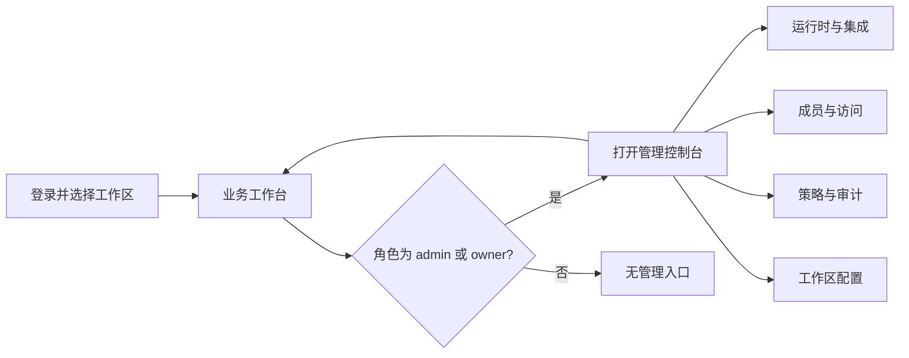

# 07. 业务与管理双视图

## 核对结论

现有系统已经有工作区角色：`owner`、`admin`、`member`，并由 `hasWorkspaceRole()` 判定层级。运行时管理、成员、访问控制和工作区设置已有角色判断；例如运行时连接对成员开放，而删除 Runtime、daemon 管理属于 `owner/admin`。

但当前界面仍是同一套工作台按权限显示不同入口：侧栏可见性还会保存在用户本地偏好中。这不是清晰的管理员视图与业务视图分离，容易让业务成员看到不相关的运营概念，也让管理员在协作导航中寻找治理动作。

因此重构应保留现有服务端 RBAC，同时增加两个明确的 UI surface。**视图不是新角色，视图只决定信息架构和操作密度；服务端仍然是最终授权方。**

## 两个 Surface

| Surface | 主要用户 | 首屏要回答的问题 | 设计气质 |
| --- | --- | --- | --- |
| 业务工作台 | 所有工作区成员，管理员也可使用 | 今天需要推进什么、谁在负责、哪里阻塞 | 简洁、任务导向、以协作对象为中心 |
| 管理控制台 | `admin`、`owner` | 系统是否健康、谁有权限、配置是否安全、有什么风险 | 克制、可审计、以资源和策略为中心 |

### 进入与退出

- 默认进入业务工作台。任何用户都从协作上下文开始，而不是进入管理页面。
- 只有 `admin` 或 `owner` 在侧栏底部账户区看到 `打开管理控制台`，使用带文字的控制台图标入口；普通成员不保留灰色占位。
- 管理控制台顶部显示 `管理控制台 / 工作区名称` 和 `返回业务工作台`。切换是明确的导航，不使用暗中改变菜单的开关。
- 推荐路由前缀为 `/w/:workspaceSlug/admin/...`；业务页面继续使用 `/w/:workspaceSlug/...`。这使深链、浏览器历史、权限守卫和 E2E 测试都可预期。
- 无权访问 `/admin` 时返回“无权访问管理控制台”页面，说明需要的角色并提供返回业务工作台；不能只抛出裸 `403`。



## 业务工作台的信息架构

```text
业务工作台
├── 收件箱                 需要我处理的消息、审批、异常和提及
├── 协作                   消息、频道、任务、日程、自动化
├── 团队                   数字员工、成员、技能、知识
├── 洞察                   成本、绩效、数据（按权限显示）
└── 个人                   搜索、偏好、账户
```

业务工作台不展示：daemon token、全局集成密钥、成员角色编排、访问策略树、运行时删除和系统级诊断。对于成员被允许接入的 Runtime，仍可出现 `接入我负责的执行引擎`；若工作区策略不允许，则替换为 `申请接入执行引擎`，而不是静默隐藏。

## 管理控制台的信息架构

```text
管理控制台
├── 概览                   待处理风险、运行时健康、失败趋势、最近变更
├── 运营
│   ├── 执行引擎            Runtime、daemon、版本、能力、诊断
│   ├── 集成                飞书、Google Workspace、外部连接健康
│   └── 自动化治理          规则、失败运行、执行上限
├── 治理
│   ├── 成员与角色          邀请、角色、成员状态
│   ├── 访问与权限          资源树、访问请求、外部访客策略
│   └── 审计                高风险变更、令牌轮换、导出
└── 工作区设置              基础信息、安全、数据保留与偏好
```

### 管理首页

管理首页只呈现需要行动的项目，而不是一面零值仪表盘：

1. 顶部注意队列：离线引擎、认证即将失效、待处理访问请求、失败自动化。
2. 运行健康摘要：仅有异常或显著变化时展开，正常项用低强调计数。
3. 最近治理操作：谁在何时做了何种高风险改动，可跳转审计详情。
4. 快捷行动：`接入执行引擎`、`邀请成员`、`查看访问请求`。每个区域最多一个主行动。

## 角色与能力矩阵

“可见”是 UI 发现性规则，“可执行”必须再次由服务端 action/API 校验。下表基于现有角色模型，并保留成员可连接 Runtime 的既有意图。

| 能力 | Member | Admin | Owner |
| --- | --- | --- | --- |
| 业务工作台、消息、任务、知识 | 可见/可执行（受资源权限限制） | 可见/可执行 | 可见/可执行 |
| 查看已授权的执行引擎状态 | 可见 | 可见 | 可见 |
| 接入本人负责的执行引擎 | 由工作区策略决定；不允许时可申请 | 可执行 | 可执行 |
| 更新、删除 Runtime；daemon 管理 | 不可见 | 可执行 | 可执行 |
| 运行时/集成全量诊断 | 不可见 | 可见/可执行 | 可见/可执行 |
| 邀请成员、管理成员和访问策略 | 不可见 | 可执行 | 可执行 |
| 工作区所有权、基础设置与高风险安全项 | 不可见 | 只读或不可见 | 可执行 |
| 查看个人偏好与账户 | 可执行 | 可执行 | 可执行 |

## 页面与交互边界

| 业务页面 | 管理页面 | 迁移规则 |
| --- | --- | --- |
| 数字员工详情：能力、任务、产出、负责人 | 员工治理：权限、运行时绑定、生命周期 | 对同一员工使用不同标签，不在业务详情塞入管理配置 |
| 任务/审批：业务目标和请求内容 | 策略/访问请求：风险、权限和审计 | 业务审批不强行移走；系统级审批归管理控制台 |
| 执行引擎状态：被授权资源的健康和结果 | Runtime 管理：接入、更新、删除、全局诊断 | 执行引擎页主归管理控制台；业务侧仅显示关联状态 |
| 个人设置 | 工作区设置、成员、集成、访问 | 账户与偏好留业务侧；工作区治理移入管理侧 |

## 对现有实现的改造要求

1. 保留 `WorkspaceRole`、`hasWorkspaceRole()` 和 action 级权限检查；不能只依靠前端路由/侧栏隐藏。
2. 在 `WorkspaceFrame` 之上增加 Surface 路由和 layout；业务与管理各自拥有一套导航数据，不在同一侧栏里靠 `if` 拼接所有条目。
3. 将目前的 `SidebarVisibilityProvider` 限定为业务工作台的个性化展示；管理控制台导航不应因 localStorage 偏好而缺失关键治理入口。
4. 将设置中的 `permissions`、`integrations`、`security` 等项重新逐项审计最小角色。目前部分 section 的导航最低角色是 `null`，这不应被视为授权完成的证据。
5. 给 `/w/:workspaceSlug/admin/*` 增加服务端页面守卫和 403 体验测试；不要依赖客户端重定向。

## 验收场景

| 场景 | 预期 |
| --- | --- |
| Member 登录 | 默认进入业务工作台，不见管理控制台入口、daemon 管理和破坏性 Runtime 操作 |
| Admin 登录 | 进入业务工作台后可明确切换到管理控制台；管理首页立即呈现风险和治理入口 |
| Owner 登录 | 拥有 Admin 全部能力，并可进入工作区基础设置和所有权相关页面 |
| Member 访问 Admin 深链 | 服务端拒绝；页面说明需要管理员权限并给出返回业务工作台入口 |
| Admin 在业务中查看员工 | 看到业务摘要；点击“管理配置”时才进入管理控制台的对应实体 |
| 权限被撤销 | 下一次导航/动作时及时失效，管理入口消失，服务端 action 返回可理解的无权限反馈 |
