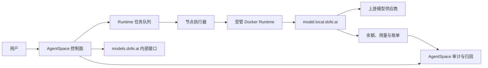
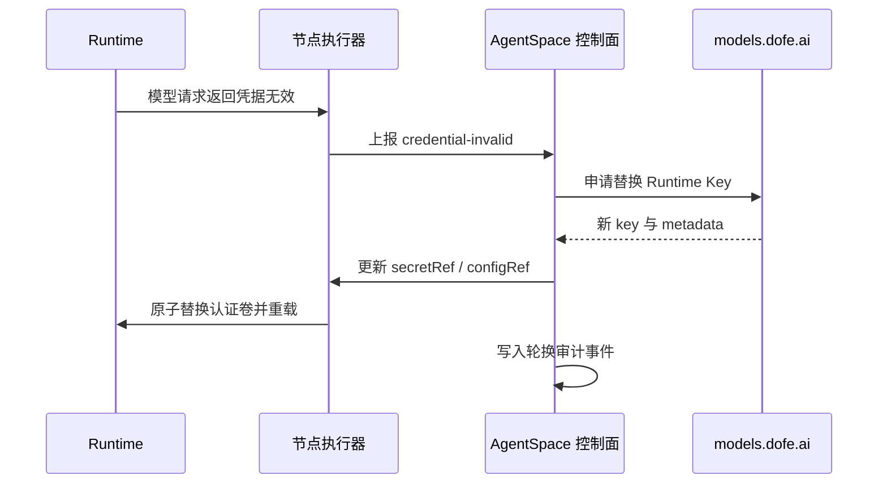

# AI员工 Runtime、模型与计费总体架构

状态：方案设计，尚未进入业务代码实施。

本文将 AgentSpace 中的 AI员工、受管 Runtime、`models.dofe.ai` 网关与计费责任划分为可独立演进的边界。目标是在不依赖用户手工部署或配置 CLI Provider 的前提下，支持按团队隔离模型凭据、模型目录、账单归属与审计证据。

配套文档：

- [产品需求与交付规格](./00-产品需求与交付规格.md)
- [models.dofe.ai 契约优化](./models-contract.md)
- [实施计划](./implementation-plan.md)

## 1. 产品目标与边界

### 1.1 目标

1. 用户通过 AgentSpace 创建或选择受管 Runtime；不允许在节点上手动安装 Runtime。
2. Runtime 安装是可观察、可重试、可恢复的异步任务，而不是同步等待操作。
3. 每个受管 Runtime 都由 `models.dofe.ai` 签发独立 Runtime Key，并仅注入该 Runtime 的环境与认证卷。
4. Runtime 支持不同协议：OpenAI 兼容、Anthropic 与 Gemini；可选模型必须由协议能力决定。
5. AI员工、Runtime 与会话可以分别声明默认模型，`/model` 仅影响当前会话。
6. 模型网关负责按 `tenantId`、`teamId`、API Key 进行真实扣费；AgentSpace 负责将调用量归因至 AI员工、Runtime 与会话。
7. 计费、模型配置、Runtime 凭据签发与密钥轮换均应留有可审计证据。

### 1.2 非目标

- 不在 AgentSpace 复制模型路由、余额扣减、供应商密钥管理或模型价格计算。
- 不允许在 AgentSpace 的数据库、日志或前端保存明文模型 API Key。
- 不要求每一个 AI员工拥有独立容器；Runtime 可以服务多个 AI员工。
- 不将 `/model` 作为 Runtime 的永久配置入口。

## 2. 核心对象与责任归属

| 对象 | 核心责任 | 归属系统 |
| --- | --- | --- |
| 租户 / 团队 | 隔离边界、余额与账单主体 | models.dofe.ai |
| Runtime | 受管执行环境、协议能力、运行状态 | AgentSpace |
| Runtime Key | Runtime 的模型网关访问凭据 | models.dofe.ai 签发；AgentSpace 节点短暂消费 |
| AI员工 | 业务身份、提示词、员工默认模型、成本归因主体 | AgentSpace |
| 会话 | 对话上下文、会话级模型临时覆盖 | AgentSpace |
| 模型目录 | 可见性、协议兼容性、可用状态 | models.dofe.ai |
| 真实用量与金额 | Token、金额、余额、供应商路由结果 | models.dofe.ai |
| AI员工成本视图 | 用量映射、估算 / 对账状态、审计展示 | AgentSpace |

## 3. 总体架构

### 3.1 模型网关地址

受管 Runtime 的适配器根据协议注入固定网关地址：

| 协议 | Base URL |
| --- | --- |
| OpenAI 兼容 | `http://model.local.dofe.ai/v1` |
| Anthropic | `http://model.local.dofe.ai/anthropic` |
| Gemini | `https://model.local.dofe.ai/gemini` |

Runtime 不直接使用用户在本地 Claude Code 或 Codex 配置过的 Provider。Provider、模型可见性、余额与最终路由均由模型网关统一控制。

## 4. 模型选择优先级

模型选择遵循从最具体到最通用的优先级：

1. 当前会话的 `/model` 覆盖；
2. AI员工专属默认模型；
3. Runtime 默认模型；
4. 团队 / 租户策略默认模型；
5. Runtime 协议可用模型中的系统兜底模型。

`/model` 仅更新会话设置，并写入会话审计事件；它不会修改 Runtime 默认模型，也不会影响同一 Runtime 中其他 AI员工或其他会话。

模型选择界面必须读取模型网关的协议过滤目录。例如 Claude Code Runtime 仅展示 Anthropic 协议可调用的模型，Codex Runtime 仅展示 OpenAI Responses 或 OpenAI 兼容协议可调用的模型。

## 5. Runtime Key 与凭据隔离

### 5.1 运行时凭据原则

- 每个 Runtime 使用一个独立的 `runtimeCredentialId` 与 API Key。
- Key 绑定 `tenantId`、`teamId`、`runtimeId`、协议能力、允许模型和生命周期策略。
- AgentSpace 控制面只保存不可逆引用，例如 `secretRef`、`configRef`、Key 指纹与有效期；不保存明文 Key。
- 节点侧 `ProviderCredentialResolver` 在启动、恢复或轮换时解析引用，仅向目标容器的专属环境变量和认证卷注入明文。
- 容器停止、删除或凭据轮换时，旧认证卷与临时文件必须清理。

### 5.2 续期与轮换

Runtime Key 可采用长期有效策略，但必须支持服务端失效、手动撤销、泄露处置和自动重签发。建议在请求被网关拒绝为无效凭据时触发一次受控恢复，而不是在每次调用失败时盲目重试。

自动续期必须有限流、幂等键和熔断保护。余额不足、团队被禁用、模型策略拒绝等业务错误不能触发无限制重签发。

## 6. 异步 Runtime 创建

Runtime 创建过程分为业务可见的任务状态：

`等待中 -> 申请凭据 -> 准备节点 -> 拉取镜像 -> 安装 CLI -> 写入凭据 -> 健康检查 -> 就绪`

失败状态需要明确失败阶段、可读原因、重试建议与是否已经回收资源。用户可以离开页面；前端通过任务详情、轮询或事件订阅展示进度，而非阻塞等待 Docker 安装完成。

现有 Runtime 可被选择复用。复用时必须校验：

- Runtime 所属租户、团队与访问权限；
- Runtime 类型、协议能力及所选模型兼容性；
- Runtime 当前健康状态与凭据可用状态；
- 是否允许新增 AI员工共享该 Runtime。

## 7. 计费与归因

### 7.1 账务事实与归因事实

模型网关按 `tenantId`、`teamId`、API Key 结算，因而 Runtime Key 是账务隔离的直接边界。一个 Runtime 可服务多个 AI员工，因此仅依据 Key 无法精确分摊到员工。

AgentSpace 在每次模型调用中附带或记录以下关联字段：

- `tenantId`、`teamId`、`runtimeId`、`runtimeCredentialId`；
- `employeeId`、`conversationId`、`requestId`；
- 协议、模型、输入 / 输出 / 缓存 Token、调用开始与结束时间；
- 网关返回的用量记录 ID 或可对账关联 ID。

模型网关的用量记录是实际账务事实；AgentSpace 使用员工关联字段呈现 AI员工成本。若价格、缓存计费、异步任务或网关聚合使逐请求金额无法直接获得，员工成本必须标记为“估算”，并在对账后更新为“已对账”。

### 7.2 费用展示

建议提供四个层级：

1. 租户 / 团队余额与账单总额；
2. Runtime Key 的实际消耗；
3. Runtime 的聚合消耗；
4. AI员工、会话和模型维度的归因消耗。

界面必须区分“真实扣费”“估算归因”“待对账”，避免把本地估算误表示为结算金额。

## 8. 审计与合规

以下事件需要不可篡改或可追溯的审计记录：

- Runtime 创建、复用、停止、删除、迁移；
- Runtime Key 创建、读取、挂载、轮换、撤销、失效；
- Runtime、AI员工和会话的模型变更；
- 模型调用关联、用量同步、对账修正；
- 余额不足、策略拒绝、模型不可用与凭据异常；
- 用户、团队管理员、平台管理员及自动任务的操作身份。

审计日志中只记录 Key 指纹、引用和脱敏配置；不得写入 API Key、Authorization 头或完整敏感提示词。

## 9. 已排除的方案

| 方案 | 排除原因 |
| --- | --- |
| 复用用户机器上的 Claude Code / Codex Provider 配置 | 无法稳定获得团队级账单、合规隔离与可审计性。 |
| 每个 AI员工一个容器 | 隔离更强，但成本、调度和运维复杂度过高，不适合作为默认模型。 |
| 仅按 Runtime Key 统计 AI员工费用 | 共享 Runtime 时无法准确归因，缺少员工、会话关联维度。 |
| 将 `/model` 写入 Runtime 全局配置 | 会造成同一 Runtime 下不同 AI员工 / 会话相互影响。 |

## 10. 验收标准

1. 用户无法绕过 AgentSpace 手工部署受管 Runtime。
2. Runtime 创建页面始终可查看异步任务阶段、失败原因和重试入口。
3. 每个 Runtime 仅加载自己的模型凭据；不同团队不能读取、复用或计费到对方的 Key。
4. 模型目录按 Runtime 协议和 Key 权限过滤。
5. 会话 `/model` 覆盖不会影响其他会话。
6. 模型网关账单可按租户、团队、Runtime Key 对账；AgentSpace 可按 AI员工、会话、模型展示归因。
7. 所有凭据与模型变更可审计，且不存在明文 Key 泄漏到数据库、日志或前端。
