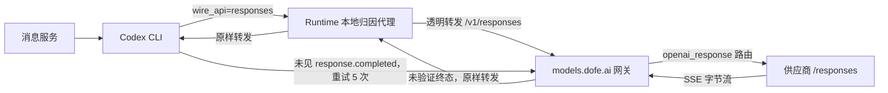

# 根因与证据

## 1. 现象定义

Codex 使用 DeepSeek 等非 GPT 模型时，消息页面最终显示：

> 模型的流式响应在完成前中断，自动重试后仍未完成。请检查模型连接或切换模型后重试。

底层 Codex 错误是：

```text
stream disconnected before completion: stream closed before response.completed
```

这句话的含义不是“HTTP 连接一定异常断开”，而是“连接结束时，Codex 仍未观察到合法的 Responses 成功终态”。即使 HTTP 200、文本已经输出、出现 `[DONE]`，仍可能失败。

## 2. 调用链



`agentspace.dofe.ai` 的归因代理不是协议转换器。它为请求补充 Runtime 凭据与归因头，解析 usage 后将每个上游 chunk 原样写给 Codex：

- `packages/daemon/src/managed-provider-credentials.ts:378-438`
- `packages/daemon/src/managed-provider-credentials.ts:495-505`

Codex 被明确配置为 `wire_api="responses"`。因此，协议兼容责任位于 `models.dofe.ai` 的模型准入、路由和代理层。

## 3. 关键发现

### F1：网关把传输结束误判为 Responses 成功结束，严重级别 P0

`models.dofe.ai/apps/api/libs/domain/proxy-core/proxy-core.service.ts:3037-3139` 在上游触发 `end` 时直接：

- 结束下游响应；
- 将资源 lease 结算为成功；
- 上报供应商健康成功；
- 记录 `upstream stream completed`。

这里没有要求观察到 `response.completed`。所以“HTTP 200 后正常 EOF，但业务流缺少终态”在网关是成功，在 Codex 是失败。

这也解释了为什么监控可能健康、用户却持续失败。

### F2：流解析器知道终态，但结果没有进入成功判定，严重级别 P0

`streaming-response-parser.service.ts:257-350` 返回 `ParseResult.isComplete`，但 `ProxyCore` 在每个 chunk 上调用解析器后丢弃返回值：

```ts
this.streamParser?.parseChunk(requestId, chunkStr);
```

同时，解析器把以下事件统一视为 `isComplete=true`：

- `[DONE]`
- `response.completed`
- `response.failed`
- `response.incomplete`
- 其他协议的结束标志

这个布尔值无法表达 Responses 所需的三种不同结局：成功、显式失败、无终态。`[DONE]` 对 Chat Completions 有意义，但不能替代 Responses 的 `response.completed`。

### F3：模型准入只测非流式 Responses，严重级别 P0

`openai-responses-probe.client.ts:8-30` 固定发送：

```json
{
  "input": "Reply with OK.",
  "max_output_tokens": 16,
  "stream": false
}
```

只要 JSON 响应为 `status: "completed"` 且包含 output，探测就成功。

`provider-key.service.ts:448-533` 随后把模型记录为：

- `isAvailable=true`
- `verificationMethod=responses_smoke`
- `verificationStatus=healthy`
- 请求摘要明确为 `stream=false`

因此，一个只支持非流式 Responses、流式实现不完整、或流式返回 Chat chunks 的模型，会被错误放入 Codex 可选模型集合。

### F4：`openai_response` 当前是原生透传，不是兼容转换，严重级别 P1

`protocol-router.service.ts:62-65, 127-135, 235-247` 要求配置独立的 `openai_response` endpoint，并把请求原样发往 `/responses`。它没有把 Responses 请求转换为 Chat Completions，也没有把 Chat SSE 转回 Responses SSE。

这是一种合理的 fail-closed 路由策略，但配置了名为 `openai_response` 的 endpoint 并不等于上游实现已符合协议。当前系统把“路径配置”误当成了“能力证明”。

### F5：现有集成测试会把无效流当作成功，严重级别 P1

`proxy-core.internal-fallback.spec.ts:297-328` 的流式 Responses 用例只断言：

- 请求走到 `/responses`；
- HTTP 结果是成功；
- 响应正文包含 `upstream unavailable`。

测试数据本身不是合法 Responses SSE，也没有 `response.completed`，但用例仍预期成功。这固定了当前错误行为，缺少协议一致性断言。

### F6：UI 错误文案是症状翻译，不是根因，严重级别 P2

`agentspace.dofe.ai/packages/services/src/messages/messages.ts:1230-1234` 把 Codex 的底层错误映射为中文提示。该映射能帮助用户理解失败，但无法修复上游流。

“模型 metadata 不完整”也不是本次主因。本地实验证明，未知模型名使用 fallback metadata 时，只要 SSE 合法完成，Codex 仍能成功。

## 4. 可控复现实验

环境：Codex CLI 0.145.0。模型名固定为不存在于 Codex 内建目录的 `deepseek-repro`，从而把“模型名/metadata”和“流协议”两个变量分开。

启动模拟 Responses 服务：

```bash
REPRO_RESPONSES_MODE=complete \
node docs/0731/codex-connect-other-models/repro-responses-stream.mjs
```

另一个终端执行：

```bash
REPRO_API_KEY=test codex exec \
  --ignore-user-config \
  --ephemeral \
  --skip-git-repo-check \
  --json \
  -s read-only \
  -m deepseek-repro \
  -c 'model_provider="repro"' \
  -c 'model_providers.repro={name="repro",base_url="http://127.0.0.1:43123/v1",env_key="REPRO_API_KEY",wire_api="responses"}' \
  'Reply only OK' </dev/null
```

通过 `REPRO_RESPONSES_MODE` 切换场景：

| 模式 | 返回内容 | Codex 0.145.0 结果 |
| --- | --- | --- |
| `complete` | 标准 Responses 事件并以 `response.completed` 结束 | 成功，输出 `OK`；只有未知 metadata 警告 |
| `truncated` | 已输出 text delta，随后正常 EOF，无终态 | 重试 5 次后失败 |
| `chat_chunks` | Chat chunks、`finish_reason=stop`、`[DONE]` | 重试 5 次后失败 |
| `failed` | `response.failed`、`[DONE]` | Codex 不视为成功并重试 5 次，最终报告缺少 completion |

结论：

1. 非 GPT 模型名本身不是阻断条件。
2. `[DONE]`、Chat 的 `finish_reason=stop` 和 HTTP 正常 EOF 都不能替代 `response.completed`。
3. 不应通过伪造 `response.completed` 掩盖截断；这会让不完整文本或工具调用被误判为成功。
4. 事后合成 `response.failed` 也不能作为“阻止 Codex 重试”的可靠手段。要避免重试放大，首选模型准入隔离、健康熔断，以及在尚未发送 2xx/SSE 首字节时返回明确 HTTP 错误。

## 5. 测试环境运行证据

对本地测试环境 `models.dofe.ai` 容器日志进行只读检查时，观察到：

- 请求入口为 `/v1/responses`；
- 模型为 `deepseek-v4-pro`；
- 目标协议为 `openai_response`；
- 路由到已配置的自定义 Responses endpoint；
- 上游多次返回 HTTP 200；
- 同一用户任务产生约 6 次相近请求，与 Codex 的初次调用加 5 次重试一致。

这与可控实验完全一致：HTTP 200 只能说明请求被接受，不能证明 SSE 以 Responses 成功终态完成。重复调用还会造成上游请求量与潜在费用放大。

## 6. 根因链

```text
非流式 /responses 探测成功
  -> supportedProtocols 写入 openai_response
  -> Codex 模型过滤允许选择该模型
  -> 网关把请求原样路由到供应商 /responses
  -> 供应商流缺少 response.completed 或返回 Chat chunks
  -> 网关把 EOF 记为成功并原样结束下游流
  -> Codex 判定未完成并重试 5 次
  -> 用户看到流式响应中断
```

根因归属是模型网关的“能力验证不足 + 流完成判定错误”；默认模型和 UI 错误提示仅是外围控制。
