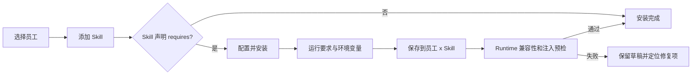
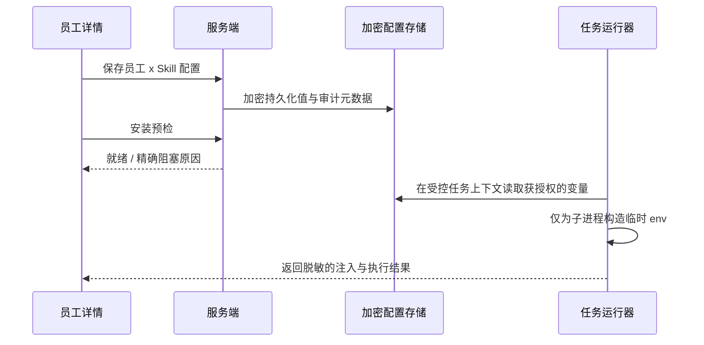

# 员工 Skill 环境变量配置：产品设计规格

> 状态：设计稿，Demo 阶段 MVP
>
> 范围：员工管理中的 Skill 安装、配置、运行前校验和后续维护；不建设工作区通用密钥库或第三方 Vault 管理界面。

## 0. 当前实现审查标注（2026-07-31，复核至工作区 `a1fe9d9`）

**审查基线**：初稿基线为 `6980985`（12:07），文档初稿记录于 13:36；其后工作区继续实现：`be01834`（14:49）完整落地员工 Skill 环境变量配置 MVP、`439d8f4`（16:05）敏感配置与审计增强。本节为对当前工作区 `a1fe9d9` 的复核，六项原「部分实现」能力均已闭环。状态含义：`已实现` 指已有业务代码和可达路径，`部分实现` 指后端或界面只完成一段链路，`未实现` 指当前无产品入口或业务能力。

| 规格能力 | 当前状态 | 代码依据与准确边界 |
| --- | --- | --- |
| 解析 `requires` 中的 `config`、`secret`、Runtime 要求 | 已实现 | `packages/services/src/skills/requirements.ts` 解析并校验六类要求；导入时会将 `SKILL.md` 前置元数据转为 Skill `configJson`。 |
| 为「员工 x Skill」收集普通变量和密钥并完成安装 | 已实现 | `SkillRequirementsModal` 已将 `config` 显示为文本字段、`secret` 显示为密码字段，并提供「敏感（加密保存）」开关与「复用已有值」选择；服务会先校验候选配置，再在同一员工行锁事务内保存并绑定。首次添加和已安装后的维护均有入口。 |
| 普通变量与密钥的持久化 | 已实现，但安全等级不同 | `agent_skill_requirement_config` 按员工和 Skill 存储；`config` 值位于普通 `config_json`（标记为敏感的键不落明文，其值移入加密存储），`secret` 使用 AES-256-GCM 加密保存于 `encrypted_secrets_json`。普通变量可在 UI 切换为敏感/加密。 |
| 运行时取得并注入变量 | 已实现（远程任务路径） | `readAgentSkillRequirementEnvSync` 只返回已声明 Key 并解密密钥；`resolveAgentSkillEnvironment` 合并 Skill 变量；input bundle 与 `remote-daemon` 将其传给 Provider 子进程。`skill.config.json` 不含变量值。 |
| 同名变量冲突 | 已实现：保存前阻断 + 复用引导 + 冲突预览 | 保存前 `assertNoInstalledSkillEnvironmentConflicts` 比对同员工其他已绑定 Skill 的实际环境，同 Key 异值报 Key 与 Skill 名、同值允许。员工详情按「此员工其他 Skill 已配置的 Key」构建 `reuseCandidates`（只含 skillId/name，不含值），弹窗提供「复用已有值」下拉与「同名异值会被拒绝」提示；配置与绑定在行锁事务内串行化，远程任务启动兜底阻断。 |
| 保留 Key 与 Runtime 凭据 Key | 已实现：声明、绑定、历史与未来全覆盖 | 新声明 `config/secret:DOFE_AGENT_*` 在声明解析时直接报错；`readInvalidSkillRequirementDeclarations` 将历史无效声明经摘要 `invalidDeclarations` 返回，UI 以 banner 提示需 Skill 作者修正；已绑定受管远程 Runtime 时，安装 action 把 Provider 凭据 Key 传入保存校验并拒绝覆盖，`bindWorkspaceAgentRuntimeAction` 反向反查既有 Skill 冲突；`credentialKeyWarnings` 在未绑定 Runtime 时于摘要与配置期 UI 提示未来冲突。 |
| Provider/模型/能力/工作目录要求 | 已实现 | 安装时校验声明值、模型选择和路径格式；`getSkillRequirementBlockers` 在提供 `runtimeCapabilities` 目录时对声明 `capability` 做真实能力比对（含 `clihub:*:name` 后缀匹配），不满足报「Runtime does not support capability」。员工级 `modelId` 经 `resolveEffectiveModelForTaskAsync` 以第 3 优先级（全部声明模型的 Skill 一致时）接入任务模型选择；`resolveSkillProjectWorkDirSync` 将一致的项目目录接入任务 prompt 上下文。 |
| 安装后状态、补配、轮换、删除 | 已实现：状态、维护、轮换、删除、审计 | `WorkspaceAgentRecord.skillRequirements` 返回统一 readiness 摘要；卡片显示就绪/需配置/Runtime 不兼容/等待验证/已过期并提供「管理环境变量」。普通变量可编辑，已有密钥留空保留、输入新值轮换；`deleteAgentSkillRequirementKeySync` 支持单 Key 删除（弹窗二次确认）；`updatedAt`/`updatedBy` 在卡片与弹窗展示；`rotateWorkspaceAgentSkillSecretAction` 与安装表单内的轮换检测均写独立审计事件。 |
| 需求升级后的失效提示 | 已实现：差异明细、已过期、任务级重校验 | 摘要按当前 `requires` 重算；`upgradeAddedKeys`/`upgradeRemovedKeys` 给出要求差异，新增必填项使状态置为 `expired`（`statusDetail` 码 `skill_expired`）。任务启动时 `prepareDaemonTaskContext` 经 `collectSkillReadinessBlockers` 重跑完整断言，input-bundle route 对不满足项返回 409 阻断任务；创建/绑定员工时的 `assertAgentSkillRequirementsReadySync` 同步前置校验。 |
| 日志与审计保护 | 已实现：命名模式 + 按注入 Key 值脱敏 | 安装/删除/轮换动作写不含值的审计事件（键名与数量，密钥轮换独立事件）；Provider/Router 除按名字模式（`TOKEN`、`SECRET`、`API_KEY`）脱敏外，`buildEnvValueRedactions` 还按员工 Skill 注入的 Key 名对其值逐一脱敏，覆盖 `MY_SERVICE_CODE` 等非命名模式敏感值。远程 input bundle 明文变量仅经已认证、已绑定的 daemon 传输，并从执行 stdout/stderr 全部脱敏后落库。 |

**已验证测试**：服务与 Runtime 相关用例单并发 41/41 通过（`agent-skill-requirements.test.ts` + `requirements.test.ts`），覆盖保留 Key 声明阻断、受管凭据 Key 阻断、保存前冲突、同值复用、复用来源解析、单 Key 删除、密钥轮换、需求升级差异与 `expired` 状态、`invalidDeclarations`、`credentialKeyWarnings`、capability 真实能力目录比对、`resolveSkillProjectWorkDirSync` 共识、`statusDetail` 状态码、摘要不泄露密钥、运行时合并与兜底冲突；`packages/daemon/src/task-context-skill-env.test.ts` 与 `agent-router/utils.test.ts` 10/10 通过（含按注入 Key 值脱敏）；`features/agents/actions.test.ts` 17/17、`features/dashboard/data.test.ts` 25/25 通过，`agents-page-client.test.tsx` 中「已安装 Skill 维护入口不泄露密钥」与「capability-only UI 交互」用例通过。相关数据库测试必须顺序执行；并行执行会因共享测试数据库产生版本冲突和重复键，不能作为并行隔离的回归证明。另：工作区存在与本能力无关的 pre-existing UI 用例失败（`agents-page-client.test.tsx` 知识/Feishu/引导类 14 项、`skills-page-client.test.tsx` 预设市场 1 项、workspace settings 路由 7 项），失败均为测试夹具文本不匹配或运行时模式断言，与本功能链路无关。

### 四项重点能力的链路边界

| 能力 | 配置 / 安装 | 绑定 Runtime | 远程任务执行 | 已安装后的维护 |
| --- | --- | --- | --- | --- |
| 同名变量冲突 | 保存前检测异值并拒绝；弹窗提供「复用已有值」下拉与冲突提示 | 绑定前 `assertAgentSkillRequirementsReadySync` 统一校验 | 同值合并；不同值拒绝任务兜底（input-bundle 409） | 维护入口可统一值；复用候选仅展示 skillId/name |
| `DOFE_AGENT_*` 与受管凭据 Key | 新声明拒绝 `DOFE_AGENT_*`；已绑定远程 Runtime 时拒绝 Provider 凭据 Key；配置期提示 `credentialKeyWarnings` | 绑定动作反查既有 Skill 冲突并拒绝 | 防御行为保留 | 历史无效声明经 `invalidDeclarations` banner 提示需作者修正 |
| Provider / 模型 / 能力 / 工作目录 | Provider、模型、能力声明和路径格式会被校验/确认 | 比对实际 Provider + `runtimeCapabilities` 真实能力目录 | 模型使用 `resolveEffectiveModelForTaskAsync`（skill 声明为第 3 优先级）；`projectWorkDir` 进入任务 prompt 上下文 | 摘要状态与「管理环境变量」入口可复查 |
| 配置的补配、轮换、删除 | 首次安装可填 | 不适用 | 解绑后配置被清理 | 支持状态、编辑、密钥轮换、单 Key 删除、`updatedAt/updatedBy` 展示与独立轮换审计 |

## 1. 结论与问题定义

Skill 的 `requires` 是一份可执行契约，而不是安装说明。管理员应能在给员工安装 Skill 时，知道缺什么、按类型配置、验证是否能在该员工的执行环境里生效，并在安装后安全地维护它。

当前实现已经具备部分基础：Skill 可以声明 `provider`、`model`、`capability`、`project`、`config` 和 `secret` 要求；安装操作会阻止缺少要求的绑定；密钥可以按「员工 x Skill」加密保存。但当前产品和运行路径存在以下断点：

| 观察 | 对用户的影响 | 设计含义 |
| --- | --- | --- |
| 在「添加 Skill」中只能看名称、描述、来源、文件数 | 用户选择后才知道需要配置什么 | 在选择前展示就绪状态和要求摘要 |
| 安装弹窗把环境变量称作「普通配置」，没有变量来源、敏感级别和注入范围 | 用户不知道填写的值是不是环境变量、会不会生效 | 使用明确的「环境变量」概念和两类字段 |
| 已安装 Skill 已具备配置状态与「管理环境变量」入口，含更新时间展示、单 Key 删除与独立轮换审计（`deleteAgentSkillRequirementKeySync`、`rotateAgentSkillRequirementSecretSync`） | 可补配、轮换与精确删除，长期运维与审计闭环 | 已达成 |
| 员工变量已进入远程任务的 input bundle 和 Provider 子进程；任务启动时经 `collectSkillReadinessBlockers` 重跑完整断言，不满足项以 409 阻断，执行 stdout/stderr 按注入 Key 值脱敏 | 用户可确认保存、预检与实际执行前阻断 | 已达成（任务级预检 + 脱敏执行结果） |
| `skill.config.json` 只保留静态要求，不含员工变量；员工级模型已接入任务模型选择（第 3 优先级），项目目录进入任务 prompt 上下文 | 已区分「已保存」「已通过绑定预检」「运行时已注入」 | 已达成（模型/工作目录进入执行控制；物理 cwd 依「服务端不访问该路径」安全承诺，由 provider 子进程自行进入） |

**问题陈述**：作为管理数字员工的管理员，我需要为某位员工安装依赖环境变量的 Skill，并有把握地知道变量将只在该员工的任务运行时以正确且安全的方式可用；当配置变更或 Skill 更新后，我也能发现并修复失效项。

## 2. 设计原则与非目标

1. **先声明、再配置、后安装。** 未声明的变量不在安装向导中出现；未通过预检的 Skill 不进入“已就绪”。
2. **配置归属清楚。** 默认作用域是「此员工的此 Skill」，不会因同名变量自动泄露给同一员工的其他 Skill。
3. **秘密默认不回显。** API Key、Token、Password、Secret 等变量默认视为密钥；保存后只显示“已配置”、更新时间和操作者。
4. **安装成功等于运行可用。** UI 的“已安装”只在变量已持久化、运行时绑定可解析、预检通过后出现。
5. **渐进披露。** 没有要求的 Skill 一步安装；有要求的 Skill 才进入配置流程。Demo 阶段不引入工作区级全局变量、模板批量分发和复杂继承。

非目标：把 Skill 作者要求的所有外部服务自动授权；读取、展示或导出已保存密钥；允许任意 Skill 读取另一 Skill 的变量；在浏览器直接检测远端 Runtime 中的变量明文。

## 3. 用户、权限和信息架构

### 目标用户

| 角色 | 核心任务 | 可见/可操作范围 |
| --- | --- | --- |
| 工作区管理员 | 安装、配置、轮换密钥、查看失败原因 | 全部变量的元数据；可写普通变量和密钥 |
| 员工管理者 | 为其有管理权的员工装 Skill、维护非密钥配置 | 变量名称、状态、来源；可写普通变量 |
| 密钥管理员（后续角色） | 提供或轮换密钥，不修改 Skill 绑定 | 密钥字段和审计记录，不可读取旧值 |
| 普通成员 | 使用已就绪员工 | 只看“可用/需管理员处理”，不见变量名和值 |

MVP 沿用当前“仅管理员可安装含要求的 Skill”的权限限制，避免在 Demo 阶段把密钥写入权限开放给非管理员。后续再根据上述角色矩阵拆分权限。

### 入口和层级

```
员工管理
└─ 员工详情
   └─ Skills（主入口）
      ├─ 添加 Skill
      │  └─ 配置并安装（有 requires 时）
      └─ 已安装 Skill 卡片
         └─ 管理环境变量 / 查看安装检查
```

不新增顶级“环境变量”导航。变量的第一责任人是员工与 Skill 的绑定关系，留在这个上下文中能避免“这个 Key 到底被谁使用”的问题。员工详情的设置页可增加一个只读的“环境变量概览”，用于汇总有问题的 Skill，点击后回到对应的 Skill 卡片。

## 4. 变量与要求模型

### 用户可见的类型

| 声明 | UI 名称 | 存储与显示 | 运行时行为 |
| --- | --- | --- | --- |
| `config:KEY` | 环境变量 | 普通值存 `config_json`；可在 UI 标为「敏感（加密保存）」后移入加密存储，永不回显明文 | 已在远程任务路径注入 `KEY=value` |
| `secret:KEY` | 密钥环境变量 | 加密保存；永不回显明文 | 为此员工执行此 Skill 时注入 `KEY=value` |
| `provider` / `model` / `capability` | 运行要求 | 已有选择项和绑定预检 | 绑定预检比对实际 Provider 与 `runtimeCapabilities` 真实能力目录；模型经 `resolveEffectiveModelForTaskAsync` 以第 3 优先级接入任务模型选择 |
| `project` | 工作目录 | 已有路径字段及格式校验 | `resolveSkillProjectWorkDirSync` 将一致的项目目录接入任务 prompt 上下文；物理 cwd 依安全承诺由 provider 子进程自行进入 |

名称保持与现有 `requires` 兼容，例如：

```yaml
requires:
  - provider:codex
  - config:NOTION_DATABASE_ID
  - secret:NOTION_API_TOKEN
```

在 Skills 编辑器中，要求摘要应显示为“环境变量 1 项、密钥环境变量 1 项”，而不是“credential center”。后续可扩展要求元数据（显示名称、说明、示例、是否允许为空），但不能先让 UI 依赖自由文本猜测字段含义。

### 作用域、冲突与来源

MVP 的变量记录逻辑上包含：`workspaceId`、`employeeId`、`skillId`、`key`、`kind`、`encryptedValue` 或 `value`、`status`、`created/updatedBy`、`updatedAt`。密钥和标记为敏感的普通变量均使用加密字段。

- 默认 `employee + skill` 作用域，同一变量名在不同 Skill 中互不复用。**现状：已实现。**
- 当另一个已安装 Skill 声明相同变量名时，界面给出“复用此员工现有变量”的显式选择；默认不复用。**现状：已实现。** 服务保存同值时允许、异值时阻断；员工详情构建 `reuseCandidates`（其他已配置该 Key 的 Skill），弹窗提供「复用已有值」下拉，只展示 skillId/name 不展示值。
- 同一次任务最终只有一个平面环境变量命名空间。若两个被调用的 Skill 为同一 Key 选择不同值，预检报“变量冲突”，用户只能统一复用、改用不同 Key 的 Skill 版本或卸载其中一个 Skill。**现状：已实现。** 安装/维护保存前（`assertNoInstalledSkillEnvironmentConflicts`）与远程任务启动（input-bundle 409）均阻断异值冲突；页面提供复用选择与冲突提示。
- 系统保留的 `DOFE_AGENT_*` Key 与受管 Runtime 的凭据 Key 必须在声明和保存阶段拒绝，或明确显示最终优先级。**现状：已实现。** 新声明拒绝 `DOFE_AGENT_*`；已绑定受管远程 Runtime 时拒绝 Provider 凭据 Key，绑定动作反向反查既有 Skill；历史无效声明经 `invalidDeclarations` 提示、未绑定 Runtime 时的未来冲突经 `credentialKeyWarnings` 提示。
- 用户可在“高级”中为已安装 Skill 添加额外变量。额外变量必须显式关联到一个 Skill，且受同样的命名、长度和密钥策略校验；不提供员工全局自由变量。**现状：未实现。**

## 5. 核心体验

### 5.1 安装流程



1. **添加 Skill 列表**：每一行显示 `就绪，可安装`、`需配置 2 项` 或 `运行环境不兼容`；点击有要求的 Skill 打开配置界面而不是立即绑定。
2. **配置并安装**：采用三段式单页向导，而不是长表单弹窗。
   - `安装检查`：Skill 描述、来源、需要的 Runtime/模型/能力；当前员工已绑定的 Runtime 结果。
   - `环境变量`：普通变量和密钥变量分组。字段包含变量名、说明、值输入；密钥用 password 控件，并明确“保存后不可查看，只可替换”。同名候选值以“复用已配置变量”动作展示，绝不展示值。
   - `确认安装`：只列出键名和状态，例如“2 个变量已配置、Runtime: Codex 兼容、依赖安装：待 Runtime 在线后执行”。
3. **预检失败**：不关闭界面；失败项就地标红并给出可执行动作，如“更换执行引擎”“填入 `NOTION_API_TOKEN`”“请求管理员配置”。已填密钥仅保存在浏览器内存，离开前明确提醒用户。
4. **保存成功**：显示“已为 {员工} 安装；运行前校验通过”。若 Runtime 离线，则状态是“已配置，等待执行环境验证”，不能显示为“运行就绪”。**现状：已实现。** 服务端在安装和绑定 Runtime 时做 readiness 校验；页面呈现「等待验证（Runtime 离线）」与「已就绪」两种状态（`awaiting_validation` / `ready`）；任务启动时经 `collectSkillReadinessBlockers` 重跑完整校验，不满足项返回 409。

低保真结构：

```
配置并安装：Notion 知识库同步                         [关闭]
员工：Researcher       执行引擎：Codex / runtime-01  [兼容]

安装检查  ----------------------------  通过
环境变量   ----------------------------  1 个普通变量，1 个密钥
  NOTION_DATABASE_ID                  [________________]
  NOTION_API_TOKEN   密钥              [••••••••••••••••]  [替换]
  已配置值仅用于 Researcher 的此 Skill，保存后不再显示。

                                      [取消] [保存并安装]
```

### 5.2 安装后的维护

Skills 标签内的每个卡片显示状态，而非仅显示名称。**现状：已实现。** 卡片显示就绪/需配置/Runtime 不兼容/等待验证/已过期五种状态，并提供环境变量维护与解绑。普通变量可补配，密钥可替换且不回显；`deleteAgentSkillRequirementKeySync` 支持单 Key 删除（二次确认）；卡片与弹窗展示最近更新人和时间（`updatedAt`/`updatedBy`）。

| 状态 | 视觉与文案 | 主操作 |
| --- | --- | --- |
| 已就绪 | 绿色状态点，“2/2 环境变量已配置” | 管理环境变量 |
| 需配置 | 警告状态点，“缺少 `NOTION_API_TOKEN`” | 完成配置 |
| Runtime 不兼容 | 错误状态点，“需要 Codex，当前为 Claude” | 查看安装检查 |
| 等待验证 | 中性状态点，“Runtime 离线，配置已保存” | 重试验证 |
| 已过期 | 警告状态点，“Skill 更新后新增 1 项要求” | 查看变更并更新 |

“管理环境变量”是安装界面的维护模式：普通变量可编辑，密钥只支持替换/删除；显示作用域、最近更新人和时间、关联的 Skill。删除被声明为必填的变量会二次确认，并将 Skill 立即标为“需配置”。

### 5.3 关键异常状态

- **没有绑定 Runtime**：允许保存为“待绑定”，但若 Skill 限定 Provider，则不能承诺可运行；安装确认页必须显示这一点。**现状：已实现。** 服务端允许无绑定 Runtime 时安装并保存；摘要 `runtimeOnline === false` 时状态置为 `awaiting_validation`，卡片显示「等待验证 · Runtime 离线」。
- **缺少平台加密密钥**：不接受密钥输入，显示平台配置错误和管理员处理路径；绝不把密钥降级存为明文。**现状：已实现。** 服务端拒绝保存且不降级（`readEncryptionKey` 抛错）；安装与轮换 action 对加密密钥缺失做定向处理，返回明确文案与管理员处置路径。
- **Skill 更新了 requires**：保留旧配置，计算差异；新增必填项使状态变为“已过期”，移除要求不自动删除变量。**现状：已实现。** 摘要按当前要求重算并给出 `upgradeAddedKeys`/`upgradeRemovedKeys` 差异明细；新增必填项使状态置为 `expired`；任务启动时 input-bundle 对不满足项返回 409 做任务级重新校验。
- **权限不足**：显示键名、类型和“由管理员配置”；不显示值输入，也不以模糊的“安装失败”结束。**现状：受限视图已实现。** 含要求的安装 action 限管理员；非管理员经 `redactSkillRequirementsForViewer` 仅见状态与计数（不含环境变量明细）。「转交管理员配置」入口仍为后续增强。
- **依赖安装失败**：变量配置仍保留，状态拆分为“环境就绪 / 依赖安装失败”，重试不要求重新输入密钥。**现状：已实现。** 服务端保留配置并返回依赖队列结果；卡片显示 `dependencyInstallStatus`（依赖安装失败/安装中/待安装）chip。
- **运行中认证失败**：错误日志只显示 Key 名和脱敏错误代码；从失败事件可直达该 Skill 的“替换密钥”。**现状：已实现。** 员工详情对 auth 形态错误（`isLikelyAuthError`）在首个含密钥 Skill 上提供「替换密钥」捷径，直达维护弹窗；日志经 `buildEnvValueRedactions` 按注入 Key 值脱敏。

## 6. 运行时与安全契约（研发验收前提）

产品不能仅新增表单。以下链路必须端到端成立：



1. 任务物化 Skill 时必须读取 **员工级** 配置，不能只读取 Skill 的静态 `configJson`。**现状：已实现。** 远程任务读取并注入 `config`/`secret`；员工级模型经 `resolveEffectiveModelForTaskAsync` 接入模型选择，项目目录经 `resolveSkillProjectWorkDirSync` 接入任务 prompt 上下文。
2. 秘密只能在服务端/受控 Runner 解密，写入该次子进程的内存环境或短生命周期权限受限文件；不得写入 `SKILL.md`、`skill.config.json`、任务产物、终端日志、审计 note 或浏览器响应。**现状：已实现。** 静态 Skill 文件不含值、数据库加密且 UI 不回显；解密值仅经 authenticated daemon 的 input bundle 传输，执行 stdout/stderr 经 `buildEnvValueRedactions` 按注入 Key 值脱敏后落库。端到端安全证明作为独立验证项维护。
3. `skill.config.json` 仅保留需求和非敏感状态，不包含变量值。运行器以员工和 Skill 的授权关系决定哪些键可注入。**现状：已实现。**
4. 注入前校验：员工归属、Skill 已绑定、变量完整、Runtime Provider/能力兼容、密钥加密键可用、键名合法、无冲突。**现状：已实现。** 安装/维护保存时校验完整性、格式、Provider、保留 Key、受管凭据 Key 和同名异值；任务启动时 `collectSkillReadinessBlockers` 重跑完整断言（含能力目录与需求升级缺项），input-bundle route 对不满足项返回 409 阻断。
5. 审计事件记录操作、对象、键名数量、来源、结果、时间；不记录值。密钥替换应产生独立审计事件。**现状：已实现。** 安装配置、单 Key 删除、密钥轮换均写不含值的审计事件（键名与数量）；轮换有独立 `workspace.agent_skill_secret_rotated` 事件。
6. 任务日志的脱敏策略须覆盖 `KEY=value`、JSON 字段、URL query 和异常回显；预检、实际注入和执行失败采用不同的可查询状态码。**现状：已实现。** 除按密钥式变量名做值替换（`buildRedactions`）外，`buildEnvValueRedactions` 按员工注入的 Key 名对其值脱敏；摘要提供 `statusDetail.code` 状态码体系（`skill_ready`/`skill_needs_configuration`/`skill_runtime_incompatible`/`skill_awaiting_validation`/`skill_expired`）。

## 7. 分期与验收

### MVP（Demo 可用）

- 员工详情的 Skill 列表展示要求摘要与五种配置状态。
- 有要求的安装使用“配置并安装”流程；已安装 Skill 可再次打开维护模式。
- 支持现有 `config:` 和 `secret:` 声明，按员工 x Skill 保存；所有密钥加密、不可回显、可替换。
- 将员工 x Skill 配置安全地注入实际任务运行环境，并支持任务前预检。**现状：已实现。** 变量注入与任务前预检均完成：任务启动时 `collectSkillReadinessBlockers` 重跑断言、input-bundle 对不满足项返回 409，执行结果按注入 Key 值脱敏。
- Runtime 离线、Provider 不兼容、缺变量、加密键缺失、依赖失败均有可理解的状态与修复入口。

### Beta 后续

- 可复用的员工级密钥引用、变量标签和批量轮换。
- Skill 作者提供字段描述、示例、格式规则、可选项和连接测试。
- 变量模板、审批流、Vault/云密钥管理器集成与过期提醒。
- 从任务运行日志自动关联“认证失败”与推荐的变量修复操作。

### 验收标准

| 场景 | 必须结果 |
| --- | --- |
| 无 requires 的 Skill | 一次点击安装，不出现配置负担 |
| `config` + `secret` Skill | 管理员在一次流程中完成配置；值在任务进程可用 |
| 安装后替换 Token | 旧值不可读取；下一次任务只使用新值；有审计记录 |
| 缺少变量/Runtime 不兼容 | Skill 不显示“已就绪”，界面指出具体键或兼容条件 |
| Runtime 离线 | 配置可保存，但状态明确为等待验证 |
| Skill 需求升级 | 旧绑定可见但标为已过期；新增项可定位并补配 |
| 安全验证 | 变量值不出现在页面数据、产物、日志和审计记录 |

## 8. 可用性与度量

首轮可用性测试招募 5-8 名实际负责配置数字员工的管理员，覆盖首次安装和密钥轮换。任务为：为一位员工安装声明 `NOTION_DATABASE_ID` 与 `NOTION_API_TOKEN` 的 Skill；识别 Runtime 不兼容并修复；在安装后替换 Token。

目标：核心安装完成率至少 85%，中位耗时少于 3 分钟，关键错误（误把密钥当普通字段、误认为“已安装即已可运行”）为 0，SUS 大于 68。上线后记录“配置开始到运行就绪时间”“各阻塞类型占比”“首次任务因缺配置失败率”“密钥轮换后成功率”，只记录结构化状态与数量，不采集变量名和值。

## 9. 工程落地顺序

1. 抽取并返回员工 x Skill 的配置摘要和状态，先让员工详情可观察。
2. 增加维护型配置接口与界面；保留目前的安装接口作为兼容入口。
3. 把员工级配置接入任务启动器，加入一次真实注入预检和脱敏日志。
4. 为状态计算、权限、密钥不回显、运行注入、Skill 要求升级和冲突分别增加测试。
5. 在测试环境使用 CI/Jenkins 路径验证：配置、运行、轮换、失败重试和日志脱敏的完整闭环。

当前代码已闭环：保留 Key 阻断、保存前冲突、readiness 回传、已安装维护入口、绑定 Runtime 的受管凭据反向反查、配置期复用引导、单 Key 删除与独立轮换审计、模型/工作目录的执行接入、任务级 readiness 重校验与按注入 Key 值脱敏均已实现（对应 §0 六项能力复核）。仍留待后续：为已安装 Skill 添加「额外变量」（§4）、非管理员「转交管理员配置」入口（§5.3），以及 input bundle 传输与日志脱敏的端到端安全证明文档（§6.2）。
