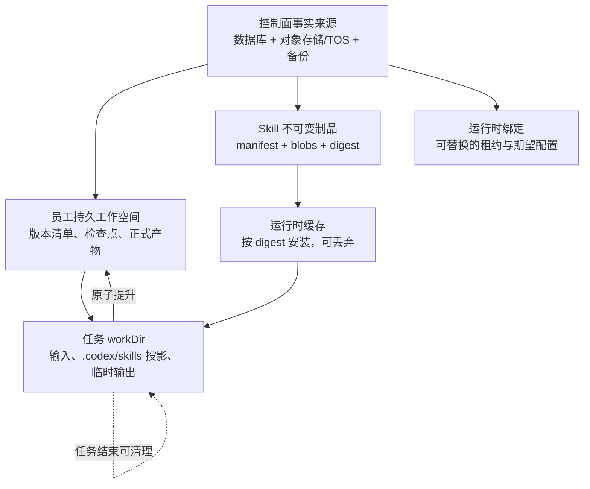
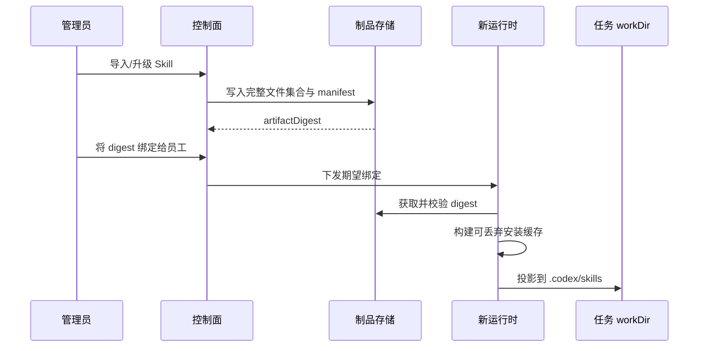
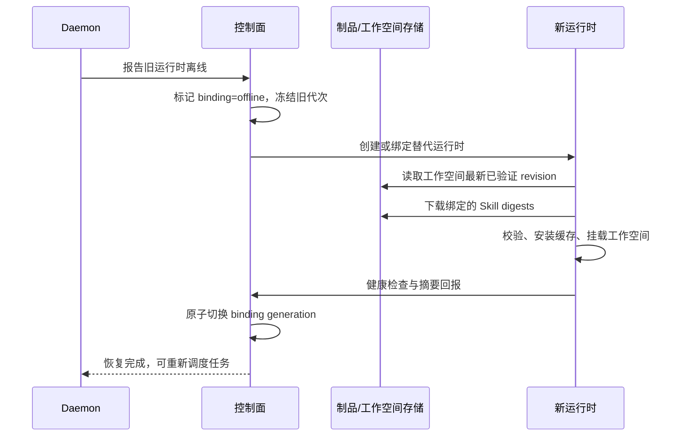

# 员工数据持久化与恢复架构

状态：Proposed
决策编号：EAD-001 至 EAD-005
日期：2026-08-01

## 1. 问题与边界

AgentSpace 当前会在任务准备阶段将已绑定 Skill 物化到 Provider 原生目录。对 Codex 而言，该目录为任务工作目录下的 `.codex/skills`。任务完成后，非会话型任务工作目录会被清理；因此该目录的存在只说明本次任务可用，不能说明 Skill 或员工成果已得到持久保护。

Docker named volume 在普通容器重启、停止后再次启动时通常仍会保留，但它仍有三个限制：

1. `docker compose down -v`、卷清理、主机丢失或错误的部署脚本可以删除它。
2. 即便卷存在，任务清理逻辑仍可能主动删除其中的非会话任务 `workDir`。
3. 卷与某个运行时节点耦合，不能作为员工跨节点重建、重新绑定和灾难恢复的唯一依据。

本设计保证以下故障场景中已提交数据不丢失：运行时容器重启或删除、镜像重建、Daemon 离线、员工重新绑定到新运行时、任务异常中断、运行时状态卷丢失，以及在备份可用时的主机级故障。它不承诺恢复尚未提交的内存状态，也不把外部系统中的不可逆副作用自动回滚。

## 2. 目标与非目标

### 2.1 目标

- 员工拥有与运行时无关的稳定 `employeeId`、工作空间和数据历史。
- 已导入的 Skill 能以固定版本、完整文件集合和校验摘要重新安装到任何兼容运行时。
- 正式产物、任务检查点和员工长期状态在运行时销毁后仍可恢复。
- 重新绑定、重建镜像和恢复操作可审计、幂等，并能报告每一步的状态。
- 运维人员可以明确区分“可丢弃缓存”与“需要备份的数据”，避免把 Docker 卷误当成唯一备份。

### 2.2 非目标

- 不将每个任务的临时文件永久保存。
- 不承诺恢复已泄露或已撤销的第三方凭证；凭证继续由既有密钥管理和注入机制负责。
- 不在 AgentSpace 的 Docker Compose 中新增 PostgreSQL、Redis 或 RabbitMQ。控制面依赖仍连接到集中管理的基础设施。
- 不在本地通过 Jenkins 部署或验证本方案。

## 3. 核心原则

| 原则 | 含义 |
| --- | --- |
| 事实来源优先 | 只有控制面数据库、对象存储/TOS 和受管备份可作为已提交数据的事实来源。 |
| 运行时可重建 | 镜像、容器、Provider Home、技能缓存和任务目录均可删除后重建。 |
| 员工身份稳定 | 员工、工作空间、Skill 绑定不依赖容器 ID、节点 ID 或显示名称。 |
| 不可变制品 | Skill 和快照按内容摘要寻址；更新产生新版本，不覆盖旧版本。 |
| 显式提升 | 临时输出只有在提升为工作空间快照或正式产物后才算提交。 |
| 默认可验证 | 每次安装、恢复、提升和删除均应有摘要、审计记录和健康检查。 |

## 4. 目标数据分层



### 4.1 数据分类与保存规则

| 分类 | 典型内容 | 唯一事实来源 | 可否随运行时删除 | 保存规则 |
| --- | --- | --- | --- | --- |
| 控制面元数据 | `employeeId`、指令、期望运行时、Skill 绑定、任务账本 | 数据库 | 否 | 事务写入、审计和备份。 |
| Skill 制品 | `SKILL.md`、脚本、二进制资源、manifest、摘要 | 对象存储/TOS + 数据库索引 | 否 | 一次写入、内容寻址、完整性校验。 |
| 员工工作空间 | 长期项目文件、状态、检查点、工作空间版本清单 | 受管对象存储或可备份持久卷 | 否 | 按员工隔离、快照化、按策略保留。 |
| 正式产物 | 报告、代码包、演示文稿、导出文件 | 产物存储 + 数据库元数据 | 否 | 从临时目录原子提升后发布。 |
| 运行时缓存 | 已解压 Skill、依赖环境、Provider 临时状态 | 运行时状态卷/本地磁盘 | 是 | 可通过制品重新构造，不作为备份目标。 |
| 任务临时数据 | 输入副本、`.codex/skills`、中间文件、日志缓冲 | `workDir` | 是 | 结束时清理；需保留的内容必须先提升。 |

## 5. 架构决策

### EAD-001：控制面与制品库是唯一事实来源

**决策**：员工配置、Skill 绑定、工作空间元数据、任务账本和产物索引写入控制面数据库；Skill 文件和工作空间/产物内容写入版本化对象存储或等价的受管持久存储。Docker volume 仅可作为运行时状态或加速缓存。

**原因**：容器和本地卷无法覆盖主机故障、卷清理和跨节点恢复。以外部事实来源保存已提交状态，才能在新镜像或新节点上恢复。

**后果**：每个业务写入路径都必须明确“提交点”。仅写入 `workDir`、Provider Home 或未注册的本地目录不能宣布任务成功。

### EAD-002：员工身份、工作空间和运行时绑定解耦

**决策**：以不可变的 `employeeId` 标识员工，创建一对一的 `employeeWorkspaceId`。运行时绑定采用带代次的 `employeeRuntimeBinding`，其中 `runtimeId`、容器、镜像和节点均为可替换的观察态资源。

**原因**：重建镜像、节点离线或人工重新绑定不应产生新员工，也不应让历史数据随旧容器消失。

**绑定状态**：

| 状态 | 含义 | 数据处理 |
| --- | --- | --- |
| `online` | 心跳、挂载和 Skill 校验通过 | 可接收任务。 |
| `degraded` | 仍可通信但缓存、挂载或依赖异常 | 暂停高风险任务，保留全部期望配置。 |
| `offline` | 心跳丢失或运行时不可达 | 不删除工作空间、Skill 绑定或未完成任务账本。 |
| `recovering` | 正在创建/绑定新运行时并回放期望状态 | 只允许恢复操作写入。 |
| `needs_attention` | 自动恢复未通过完整性或健康检查 | 由管理员选择继续、回滚或人工修复。 |

### EAD-003：员工持久工作空间独立于任务 workDir

**决策**：为每位员工提供逻辑上的持久工作空间，含 `state/`、`checkpoints/`、`artifacts/` 与可选 `repository/`。任务使用隔离 `workDir` 执行；工作空间通过受控读写接口或受管挂载暴露给任务，而不是直接把任务目录当作工作空间。

建议的逻辑结构：

```text
employee-workspaces/{workspaceId}/
  manifests/{revision}.json
  blobs/{sha256-prefix}/{sha256}
  checkpoints/{checkpointId}.json
  artifacts/{artifactId}/manifest.json
  repository/                         # 仅在启用项目工作区时存在
```

每次提交产生不可变 `workspaceRevision`。清单记录父版本、文件摘要、来源任务、创建者、时间、加密密钥引用和保留策略；内容可去重存放为 blob。恢复时按清单还原，不依赖旧容器中的目录结构。

### EAD-004：Skill 绑定锁定到不可变制品摘要

**决策**：Skill 导入生成不可变 `skillArtifact`，员工绑定保存 `artifactDigest`，而不是仅保存名称或 Git 地址。制品必须含所有原始文件，包括 `scripts/`、图片、字体、二进制资源及 manifest 中声明的依赖元数据。

安装链路如下：



运行时缓存键必须至少包含 `provider`、`artifactDigest`、安装器版本和目标平台。升级 Skill 时创建新制品并要求显式变更绑定；不得在任务运行中对同名 Skill 静默更新。

本决策与 `docs/0801/skill-install/02-架构设计.md` 中的 DSP 制品格式一致。本文额外要求：当前导入实现若跳过脚本、二进制或其他不支持文件类型，必须将导入标记为失败或不完整，不能生成可绑定的“成功”制品。

### EAD-005：恢复由声明式期望状态驱动

**决策**：恢复服务读取员工的期望状态，而不是复制旧容器文件。恢复操作以 `recoveryOperationId` 记录并支持重试：创建运行时、挂载工作空间、恢复检查点、安装锁定 Skill、验证健康状态，最后切换绑定代次。

恢复流程：



旧运行时如果恢复上线，只能以过期代次存在，不能重新写入当前工作空间。写入操作必须携带工作空间 revision 或租约代次，以避免脑裂覆盖。

## 6. 逻辑数据模型

以下是新增或需要明确的概念模型；字段名可在实现阶段按既有 Prisma/Drizzle 风格落地。

| 实体 | 关键字段 | 约束 |
| --- | --- | --- |
| `employee_persistent_workspace` | `id`、`employeeId`、`headRevision`、`storageRef`、`retentionPolicy` | `employeeId` 唯一；不引用运行时 ID。 |
| `employee_workspace_revision` | `id`、`workspaceId`、`parentRevision`、`manifestDigest`、`sourceTaskId`、`status` | 仅 `committed` 版本可恢复；不可原地修改。 |
| `employee_artifact` | `id`、`workspaceId`、`contentDigest`、`mediaType`、`sourceTaskId` | 发布与内容上传原子关联。 |
| `skill_artifact` | `id`、`digest`、`manifestVersion`、`source`、`storageRef` | 沿用 Skill 安装设计；摘要唯一。 |
| `employee_skill_assignment` | `employeeId`、`skillArtifactDigest`、`configRef`、`enabled` | 绑定固定摘要，配置和密钥引用分离。 |
| `employee_runtime_binding` | `employeeId`、`generation`、`desiredProvider`、`observedRuntimeId`、`status` | 同一员工仅一个当前 generation。 |
| `employee_recovery_operation` | `id`、`employeeId`、`fromGeneration`、`toGeneration`、`phase`、`error` | 可幂等重试，保存操作审计。 |
| `task_commit_journal` | `taskId`、`workspaceRevision`、`artifactIds`、`commitState` | 防止任务中断时重复发布或遗漏发布。 |

密钥不写入 manifest、工作空间内容或日志。Skill 所需的密钥继续引用既有加密 Secret 配置，并只在运行时以最小作用域注入。

## 7. 任务提交与中断语义

任务状态必须将“执行成功”和“数据已持久提交”分开。建议状态为 `running -> preparing_commit -> committed -> completed`，其中只有 `committed` 之后允许向用户宣告产物可用。

1. 任务在 `workDir` 内生成中间结果。
2. 服务计算内容摘要、上传 blob，创建未提交 revision/产物记录。
3. 数据库事务将 revision、产物索引、任务账本和审计记录一起切换为 `committed`。
4. 任务完成后可清理 `workDir`；清理失败不影响已提交结果。
5. 任务在第 3 步之前中断时，恢复器根据账本重试或回收孤儿 blob；在第 3 步之后中断时，按已提交 revision 幂等完成后续通知。

禁止让任务直接覆盖已发布的工作空间文件。需要修改时创建新 revision，并在冲突时基于父 revision 拒绝或进入合并流程。

## 8. Docker 与部署约束

### 8.1 卷的正确职责

| 位置 | 当前/建议用途 | 可靠性定位 |
| --- | --- | --- |
| Daemon 状态卷 | Provider 登录态、运行时元数据、安装缓存 | 可持久以缩短恢复，但可丢弃并重建。 |
| Provider Home（如 Codex Home） | 认证和工具本地配置 | 受密钥策略保护；不能保存唯一业务成果。 |
| 任务 `workDir` | 任务隔离、Skill 投影和临时输出 | 设计为可清理。 |
| 员工工作空间卷/挂载 | 仅作为工作空间内容的访问层 | 必须有可恢复快照与独立备份，不依赖单主机。 |
| 数据库与对象存储 | 员工和 Skill 的事实来源 | 使用外部受管基础设施与备份策略。 |

`deploy/daemon/docker-compose.runtimes.yml`、`deploy/daemon/docker-compose.remote-images.yml` 和 `deploy/self-hosted/docker-compose.yml` 中的 named volumes 可以保留作为运行时状态，但部署文档必须说明：

- 不得以 `down -v`、卷 prune 或删除运行时状态卷作为常规修复手段，除非已确认恢复演练通过。
- 重建镜像、重新创建容器和切换运行时不应要求复制 `.codex/skills` 或 `workDir`。
- 员工工作空间和制品库的备份在 Docker 之外执行；部署不新增数据库、Redis 或 RabbitMQ 容器。
- 每次启动应运行只读预检：控制面可访问、工作空间 revision 可读、绑定 Skill 摘要可获取、密钥引用可解析。

### 8.2 备份与恢复目标

下列数值是首期建议，需在上线前由产品和运维确认：

| 数据 | 提交语义 | 建议 RPO | 建议 RTO |
| --- | --- | --- | --- |
| 员工配置、绑定、任务账本 | 数据库事务提交 | 已提交数据为 0；数据库灾难恢复不超过 15 分钟 | 60 分钟 |
| Skill 制品与正式产物 | 上传校验并提交索引 | 已提交数据为 0 | 60 分钟 |
| 员工工作空间 | 显式 revision 提交 | 已提交 revision 为 0 | 60 分钟 |
| 可丢弃缓存与 `workDir` | 无 | 不适用 | 按需重建 |

对象存储应启用版本化或等价的不可变策略；数据库应使用集中管理的备份、WAL/PITR 或等价能力。必须定期在干净环境做恢复演练，而不是仅检查备份任务成功。

## 9. 可观测性与产品体验

员工详情页应提供“数据保护”状态，不将运行时在线误导为数据已安全。建议展示：

- 当前工作空间 revision、最近成功快照时间、保留策略和存储健康状态。
- 已绑定 Skill 名称、版本/摘要、完整文件数量、最近一次运行时安装校验结果。
- 当前绑定 generation、运行时状态、最近恢复操作及失败原因。
- 任务最后一次持久提交点，以及是否存在待恢复或待清理的任务账本。

“重新绑定”和“重建运行时”操作必须先展示将恢复的工作空间 revision 和 Skill 摘要。手动回滚工作空间属于有副作用操作，应要求选择目标 revision、二次确认并保留审计记录。

## 10. 安全、隔离与保留

- 工作空间、产物与 Skill blob 使用工作区/租户边界授权；运行时只能获得其员工所需的最小读写范围。
- 存储引用、manifest、日志和遥测中不得包含明文密钥。机密配置沿用既有员工 Skill 环境的加密 Secret 注入机制。
- 产物与工作空间删除采用“软删除 -> 保留期 -> 异步物理删除”，避免误操作立即不可恢复。
- Skill 版本被员工或历史任务引用时不得物理删除；先撤销新绑定，再按引用计数和保留期回收。
- 恢复、导出、删除、重新绑定和密钥重新解析均记录操作者、请求、目标摘要、时间和结果。

## 11. 已拒绝的方案

| 方案 | 不采用原因 |
| --- | --- |
| 只把 `/var/lib/...` 或 `/home/node` 设为 Docker named volume | 无法解决主动任务清理、卷删除、跨节点和主机级故障。 |
| 将 `.codex/skills` 直接作为 Skill 仓库 | 它是 Provider 格式投影，路径和生命周期受运行时影响，且当前会随任务准备重新生成。 |
| 每次启动从 Git 地址拉取最新 Skill | 不可复现，仓库变更、网络或默认分支变化会改变员工行为。 |
| 把整个任务目录永久保留 | 混合临时输入、密钥痕迹、缓存与成果，成本高且无法定义提交语义。 |
| 重新绑定时复制旧容器文件系统 | 旧运行时可能不可达或已损坏，且无法验证完整性与一致性。 |

## 12. 与现有实现的衔接

- `packages/services/src/skills/injection.ts` 的运行时物化能力保留，但其输出定位为任务投影层。它不承担 Skill 的唯一存储职责。
- `apps/cli/src/commands/daemon.ts`、`packages/daemon/src/remote-daemon.ts` 对非会话任务工作目录的清理符合本设计；业务成果应在清理前进入持久工作空间/产物库。
- `packages/db/src/storage-paths.ts` 定义的 Daemon 状态目录用于运行时状态，不应被扩展为唯一员工业务数据目录。
- `docs/0801/skill-install/` 负责 Skill 的导入、制品和安装中心；本方案要求其制品格式支持全量二进制文件和摘要校验，并将绑定扩展到员工恢复链路。

实施顺序、迁移策略、故障演练和验收标准见 [02-实施路线与验收.md](./02-实施路线与验收.md)。
