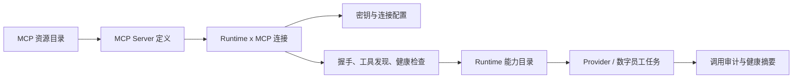
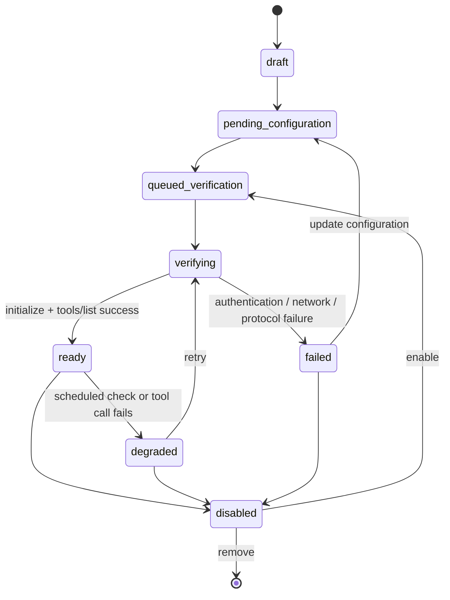

# 应用市场：MCP 中心与 CLI 市场产品文档

> 状态：设计稿，待进入 MVP 实现
>
> 范围：保留单一“应用市场”入口；在其中新增“MCP 市场”Tab，并将现有能力明确为“CLI 市场”Tab，继续管理 CLI-Anything Hub 等可执行应用。
>
> 非范围：在浏览器执行 MCP 工具、把 Runtime 暴露给公网、为任意第三方服务器自动授予企业数据权限。

## 0. 现状与结论

现有应用市场已经实现了 CLI-Anything Hub 的完整运行时扩展闭环：目录同步、选择在线 Runtime、异步安装操作、命令验证、已安装记录和 Skill 同步。它的核心假设是资源是可执行的 CLI，能力 ID 形如 `clihub:<source>:<name>`。该功能收敛为应用市场内的“CLI 市场”Tab。

MCP 不是另一个 CLI 目录。它是一个带传输协议、服务地址、鉴权配置、可发现工具和请求边界的连接器。直接把 MCP 描述成 `install_cmd + entry_point` 会导致四个问题：

| 现有 CLI 模型的缺口 | 对管理员的风险 | MCP 设计要求 |
| --- | --- | --- |
| 安装成功只需检查命令存在 | 服务可能不可连接或没有可用工具 | 安装后必须完成握手、工具发现和健康检查 |
| `install_cmd` 是单机操作 | 远程地址、服务生命周期和 Runtime 网络可达性没有表达 | 明确区分“托管服务安装”和“远程 MCP 连接” |
| Skill 只需要知道 entry point | 模型还需要工具名、描述和参数契约 | Runtime 报告按 Server 和 Tool 维度的能力目录 |
| 密钥多为 CLI 自己读取 | Header、OAuth、环境变量或代理认证需要受控注入 | 密钥按 Runtime x MCP 绑定保存，绝不写入目录或聊天上下文 |

**产品结论**：应用市场提供两个并列 Tab：`CLI 市场` 与 `MCP 市场`。CLI 市场继续承载可执行应用安装；MCP 市场的产品名称为“MCP 中心”，承载 Server 目录、Runtime 连接、工具权限、健康与审计。MVP 先连接经过审核的远程 MCP Server；服务器安装 MCP 的能力作为第二阶段的受管部署类型接入 MCP 中心。

**运行环境决策**：不把 CLI 或 MCP 直接安装在宿主机。CLI 保持在目标 Runtime 容器内按 Runtime 隔离；远程 MCP 只由 Runtime 连接，不需要安装；只有需要本地进程的 MCP 才部署为无特权、私有网络中的受管服务容器。完整证据与取舍见 [04-运行环境隔离决策.md](./04-运行环境隔离决策.md)。

## 1. 问题定义与目标

**问题陈述**：作为工作区管理员，我需要为一个或多个 Docker Runtime 安全地接入 MCP 服务，并能在启用前确认服务可达、所需凭据已配置、工具集合符合预期；任务执行后，我还要能追踪哪个 Runtime 调用了哪个 MCP 工具及其结果状态，而不暴露密钥和敏感参数。

### 目标

1. 管理员可在应用市场的 MCP 市场 Tab 从审核目录选择 MCP 服务，并绑定到一个在线 Runtime。
2. 绑定流程明确要求的配置项、网络可达性、权限范围和风险。
3. Runtime 仅在连接通过验证后向 Provider 暴露该服务的工具。
4. 管理员可以查看健康、工具清单、最近调用摘要，并可停用、重试或移除服务。
5. CLI-Anything Hub 已有体验不回归，现有 CLI 安装仍按命令计划运行。

### 非目标

- 不提供任意 URL 的匿名一键接入；自定义 MCP 需要管理员审核与显式风险确认。
- 不在 MVP 自动部署社区 MCP 包、执行 Registry 的 shell 命令或运行任意容器镜像。
- 不提供完整 MCP Inspector、请求参数回放、密钥导出或跨工作区共享连接。
- 不把 `stdio` 进程直接挂进宿主机。此模式只能在未来的受管 Runtime 镜像内以声明式包安装实现。

## 2. 用户与权限

| 角色 | 核心任务 | 权限 |
| --- | --- | --- |
| 工作区 Owner / Admin | 添加、配置、验证、启停、删除 MCP 连接；查看审计与脱敏错误 | 完整管理权限 |
| 数字员工管理员 | 为员工选择已经就绪的 Runtime 能力 | 只读连接状态与能力摘要；不能查看或修改密钥 |
| 普通成员 | 使用已配置数字员工 | 只看到任务是否可用及用户可理解的阻断原因 |
| 平台运维 | 发布审核目录、定义托管部署模板与网络策略 | 不读取工作区密钥，不直接使用工作区 Runtime 执行任务 |

MVP 沿用 Runtime 应用市场的 Owner / Admin 管理门禁。MCP 的密钥输入和轮换复用现有“员工 Skill 环境变量”安全约束：加密保存、保存后不回显、日志按注入值脱敏、操作留审计事件但不留值。

## 3. 概念模型



| 概念 | 含义 | 生命周期 |
| --- | --- | --- |
| MCP Server 定义 | 目录中的不可变版本描述：名称、来源、传输方式、配置 schema、风险和声明工具 | 平台审核发布、目录同步 |
| MCP 连接 | 一个工作区中某 Runtime 对某一 Server 定义的启用实例 | 管理员创建、配置、验证、停用、删除 |
| 连接配置 | endpoint、非敏感参数和密钥引用；密钥值不进入目录、操作计划或日志 | 仅此 Runtime x MCP 连接 |
| 发现快照 | 最近一次握手返回的 protocol version、工具名称/描述摘要和时间 | 每次验证或按策略刷新 |
| Runtime MCP 能力 | 任务执行时可调用的真实工具，ID 为 `mcp:<connectionId>:<toolName>` | 仅连接为 `ready` 且工具获准时存在 |

### 3.1 资源类型

| 目录字段 | `CLI 应用`（现有） | `MCP 服务`（新增） |
| --- | --- | --- |
| 主动作 | 安装到 Runtime | 连接到 Runtime |
| 可执行载体 | CLI Hub / pip / npm / uv | `streamable_http`、`sse`，后续 `managed_stdio` |
| 就绪判断 | 命令存在、`--help` 验证 | initialize 成功、工具发现成功、健康检查成功 |
| 能力表达 | entry point | Server + approved tool list |
| 主要风险 | 安装命令与本地依赖 | 目标地址、网络出口、鉴权、数据域、工具权限 |
| 密钥模型 | 由 CLI 或 Skill 管理 | MCP 连接专属的 Header / OAuth / 环境变量引用 |

## 4. MVP 范围与运输方式

### 4.1 MVP：审核的远程 MCP

MVP 支持 `streamable_http` 传输；如果现有 Provider adapter 已能稳定支持 SSE，可以同时开放 `sse`，否则目录中不得显示该类型为可安装。每个条目由平台审核后发布，包含固定或受限制的 endpoint 模板。

运行路径：

```text
管理员在应用市场的 MCP 市场启用连接
  -> 控制面保存加密配置并创建验证操作
  -> 目标 daemon 从 Runtime 容器发起受限握手
  -> 服务返回工具目录
  -> 控制面记录脱敏快照与 health=ready
  -> 下一任务把获准工具注册给 Provider adapter
  -> Provider 的工具调用经 Runtime MCP client 发至服务
```

连接请求永远从 Runtime 发出。浏览器和控制面不代理 MCP 工具调用，也不保存原始工具结果。这样可保持 Runtime 的数据、网络和执行边界一致。

### 4.2 第二阶段：服务器受管 MCP

“在服务器安装 MCP 给 Runtime 调用”采用 `managed_service` 部署类型，不等同于管理员粘贴一个安装命令。

1. 平台运维发布签名的部署模板，定义版本固定的镜像或包、健康检查、监听方式、资源限制和卸载策略。
2. 宿主机的受管部署代理创建 MCP 服务，服务只绑定私有网络或受控 Unix socket；不得映射任意公网端口。
3. Runtime 通过受管地址或内部网关访问，控制面只下发连接引用，不能让 Runtime 获得宿主机 Docker socket、SSH 凭据或任意文件系统权限。
4. 服务、Runtime 和它们所用的网络依赖均不得在本项目的 Docker Compose / Dockerfile 中创建 PostgreSQL、Redis 或 RabbitMQ；这些依赖继续由外部基础设施统一管理。

`stdio` 只可作为 `managed_stdio` 模板的内部实现，命令、镜像、环境变量白名单和版本必须由审核模板锁定。目录条目的自由 `install_cmd`、`npx -y` 或由任务文本生成的 shell 命令均不能进入此路径。

## 5. 信息架构与页面

保留 `/market` 作为唯一入口，页面标题为“应用市场”。标题下提供固定的 `CLI 市场` 与 `MCP 市场` Tab，URL 以 `?tab=cli` 和 `?tab=mcp` 表示当前选择，默认 `cli` 以保持现有用户路径。两个 Tab 共享搜索、刷新和 Runtime 上下文框架，但分别显示资源模型与操作；不能在同一列表混排。

```text
管理
└─ 技能与市场
   └─ 应用市场
      ├─ Tab：CLI 市场
      │  └─ CLI Hub 目录、安装、更新、卸载、Skill 同步
      └─ Tab：MCP 市场（MCP 中心）
         ├─ MCP 服务目录
         ├─ 已连接服务
         ├─ 连接详情：配置、工具、健康、活动
         └─ Runtime 详情中的 MCP 连接摘要
```

### 5.1 MCP 市场列表行

每项固定显示：`名称`、`来源`、`传输方式`、`风险等级`、`工具数（声明值）`、`已连接 Runtime 数`。筛选包含：来源、分类、传输、风险、当前 Runtime 是否已连接、健康状态。

列表不展示 endpoint 完整地址、Header 名称之外的鉴权信息或实际密钥。

### 5.2 MCP 详情与连接向导

详情面板默认以“可否安全接入”为中心，而非原始协议字段：

```text
GitHub MCP                                  [已审核] [中风险]
代表能力：仓库、Issue、Pull Request

传输：Streamable HTTP       预期工具：12
数据域：GitHub Organization  网络：仅 github-mcp.example.com:443

目标 Runtime  [Runtime - Codex Production v]
连接状态      未连接

[配置并连接]
```

点击后进入四步向导，整个流程是同一张可恢复的工作表，不把配置和验证拆成两段无关联页面：

| 步骤 | 页面内容 | 完成条件 |
| --- | --- | --- |
| 1. 选择 Runtime | 仅显示在线、兼容 Provider 且有对应网络策略的 Runtime | 选定一个 Runtime |
| 2. 连接配置 | 固定 endpoint 或允许的子域、声明的非密钥参数、密钥字段、数据权限说明 | schema 校验通过；密钥只在此输入 |
| 3. 工具范围 | 目录声明工具与风险标签；默认选推荐最小集合 | 至少保留一个工具，或显式选择“仅连接不暴露工具” |
| 4. 验证并启用 | 脱敏的配置摘要、外发域名、工具数量、风险确认 | 管理员确认后创建异步验证操作 |

高风险服务必须额外勾选“我确认该 Runtime 将访问指定数据域”；高风险确认只对本次连接有效，不能由客户端布尔值绕过服务端检查。

### 5.3 已连接 MCP 服务

Runtime 详情的“扩展”区域分为 `已安装 CLI` 与 `已连接 MCP`。每个 MCP 项显示：

```text
服务名称 | Ready / Needs configuration / Degraded / Disabled / Failed
传输 | 已获准工具数 | 上次验证 | 最近失败摘要
操作：查看工具、重新验证、管理配置、停用、移除
```

`Ready` 只表示最近握手和工具发现成功，不能承诺第三方服务永久可用。`Degraded` 保留上次成功工具清单供诊断，但任务运行前必须重新快速检查；检查失败则从本次任务能力目录中移除。

## 6. 状态与核心流程

### 6.1 连接状态机



| 状态 | 面向用户的解释 | 是否向任务暴露工具 | 允许操作 |
| --- | --- | --- |
| `pending_configuration` | 缺少必需配置或密钥 | 否 | 管理配置、移除 |
| `queued_verification` / `verifying` | 正在由目标 Runtime 验证连接 | 否 | 查看进度、取消（未开始时） |
| `ready` | 最近一次连接、认证与工具发现成功 | 是 | 查看工具、重新验证、管理配置、停用、移除 |
| `degraded` | 最近检查或调用失败，需要复核 | 否 | 重新验证、管理配置、停用、移除 |
| `failed` | 上次验证失败 | 否 | 查看脱敏错误、管理配置、重试、移除 |
| `disabled` | 管理员主动停止向任务提供该服务 | 否 | 启用、移除 |

### 6.2 验证行为

验证操作必须依次做以下受限动作：

1. 校验 endpoint 与目录允许范围、传输类型和配置 schema。
2. 由 Runtime 的 MCP client 连接并发送 initialize；超时、重定向和响应体大小采用平台限制。
3. 执行 tools/list，规范化工具名称，拒绝重复、超长或不合法名称。
4. 将发现工具与目录声明工具比较。新增工具不自动获准，消失的获准工具会将连接标为 `degraded`。
5. 记录协议版本、工具元数据摘要、耗时、错误分类与脱敏日志尾部；不持久化原始请求、响应、授权 Header 或工具 schema 中的示例密钥。

### 6.3 任务运行

任务启动时仅加载 `ready` 的 MCP 连接和其 approved tools；能力 ID 使用 `mcp:<connectionId>:<toolName>`。Provider adapter 不能把“目录里存在的 Server”当作可调用能力。

每次工具调用必须附带：`workspaceId`、`runtimeId`、`connectionId`、`taskId`、`toolName`、调用耗时、结果分类和安全摘要。工具输入与输出默认不落业务数据库；如后续需要可追溯性，必须按工具的敏感字段声明进行结构化脱敏后再保存。

## 7. 配置、权限与安全边界

### 7.1 MCP Server 定义字段

```ts
type McpTransport = "streamable_http" | "sse" | "managed_service" | "managed_stdio";
type McpRisk = "low" | "medium" | "high";

interface McpCatalogItem {
  id: string;
  source: "official" | "verified_partner" | "workspace_private";
  slug: string;
  displayName: string;
  version: string;
  transport: McpTransport;
  endpointTemplate?: string;
  allowedHosts: string[];
  configurationSchema: JsonSchema;
  secretFields: string[];
  declaredTools: Array<{ name: string; description: string; risk: McpRisk }>;
  defaultApprovedTools: string[];
  requiredRuntimeCapabilities: string[];
  dataDomains: string[];
  risk: McpRisk;
  documentationUrl?: string;
}
```

- `endpointTemplate` 只能引用 schema 中声明的非密钥字段，不能拼接或记录密钥。
- `allowedHosts` 由目录审核者维护；自定义 endpoint 必须通过精确 host 或受限子域规则验证。
- `declaredTools` 只是预览与 allow-list 候选。Runtime 实际调用以验证快照中的工具为准。
- `workspace_private` 仅对创建工作区可见，创建、编辑和发布均限 Owner / Admin，并默认高风险。

### 7.2 网络与密钥

1. 所有 URL 只允许 HTTPS，除受管内部地址外拒绝 loopback、link-local、私网 CIDR、metadata IP 和重定向到这些地址的请求。
2. 由 Runtime egress 策略执行 host allow-list；应用层校验是第二道防线，不能只依赖前端。
3. 密钥值加密保存在控制面，daemon 仅在执行握手或调用时获得最小有效配置；不得写入 `commandPlanJson`、Runtime metadata、审计内容、浏览器响应或 `SKILL.md`。
4. OAuth 在 MVP 仅允许平台审核的授权代理流程；不在浏览器或 Runtime 日志中处理 refresh token。
5. 每个连接可以只暴露工具 allow-list。高风险工具默认不选中，工具变更需要管理员重新确认。
6. Endpoint、配置、工具范围或密钥轮换后立即将连接降为待验证，旧的 `ready` 快照不得继续用于新任务。

### 7.3 审计事件

| 事件码 | 内容 |
| --- | --- |
| `mcp_connection.requested` | 资源、Runtime、传输、风险、获准工具数量 |
| `mcp_connection.verified` / `failed` | 时延、发现工具数、脱敏错误代码，不含 endpoint query 和密钥 |
| `mcp_connection.enabled` / `disabled` / `removed` | 操作者、目标连接、原因（可选） |
| `mcp_connection.secret_rotated` | 字段名称和操作者，不含值 |
| `mcp_tool.invoked` / `failed` | Task、工具名、耗时、结果分类、脱敏摘要 |

## 8. 后端交付契约

为避免把 MCP 塞入现有 `runtime_app_*` 表后产生大量可空字段，新增平行且命名明确的实体。市场页面在 view model 层把 CLI 和 MCP 合并成“扩展”列表。

| 层 | 新增责任 |
| --- | --- |
| `packages/domain` | `McpCatalogItem`、`RuntimeMcpConnection`、验证操作、工具发现快照与 `mcp:*` 能力类型 |
| `packages/db` | MCP 目录、Runtime 连接、加密配置、验证操作、工具快照、调用审计表；所有表按 `workspace_id` 约束 |
| `packages/services` | 目录同步/审核、配置 schema 校验、endpoint allow-list、连接状态机、操作计划、权限与审计 |
| `packages/daemon` | MCP client、握手/工具发现执行器、协议和网络错误分类、Provider tool bridge、运行前快速检查 |
| `apps/web` | 市场资源类型 Tab、连接向导、服务详情、Runtime 扩展列表、状态和错误摘要 |

建议的最小 API：

```text
POST /api/runtime-mcp-connections
PATCH /api/runtime-mcp-connections/:id/configuration
POST /api/runtime-mcp-connections/:id/verify
POST /api/runtime-mcp-connections/:id/disable
POST /api/runtime-mcp-connections/:id/enable
DELETE /api/runtime-mcp-connections/:id
GET /api/runtime-mcp-connections/:id/tools
GET /api/daemon/runtimes/:runtimeId/mcp-operations/claim
```

写操作全部在服务端基于当前工作区和角色授权，客户端传入的 `risk`、`approvedTools` 和 `status` 只能作为意图，服务端会从目录和已发现快照重新计算。

## 9. MVP 验收标准

| 场景 | 验收结果 |
| --- | --- |
| 浏览市场 | CLI 和 MCP 资源可按类型、风险和 Runtime 状态筛选；现有 CLI 安装操作不变 |
| 接入审核服务 | 管理员可选在线兼容 Runtime，填写声明的配置和密钥，确认风险后创建验证任务 |
| 验证成功 | Runtime 完成 initialize 和 tools/list；连接显示 `ready`，仅获准工具进入能力目录 |
| 验证失败 | 状态为 `failed` 或 `degraded`，展示可执行的脱敏原因，不暴露密钥、Authorization、完整 query 或原始响应 |
| 任务调用 | 只有 `ready` 连接的 approved tool 可被 Provider 调用；调用生成脱敏审计记录 |
| 配置变更 | 修改 endpoint、工具范围或密钥后立即移除任务可用性，必须重新验证 |
| 停用与删除 | 停用立刻阻断新任务调用；删除清理连接、配置和可恢复审计引用，不影响同 Runtime 的 CLI 应用 |
| 安全回归 | loopback/metadata/private IP、未审核 host、未声明工具、非管理员写操作和高风险未确认全部在服务端拒绝 |

建议测试分层：domain/services 状态机和 schema 单测；daemon 使用本地模拟 MCP 服务做握手/超时/鉴权/工具变更集成测试；web 覆盖连接向导的 happy path、失败路径和无权限状态；端到端覆盖一次真实 Runtime 的连接、调用、停用。

## 10. 分期与待确认项

| 阶段 | 交付 | 不包含 |
| --- | --- | --- |
| MVP | 审核远程 `streamable_http`、配置/密钥、工具 allow-list、验证、任务调用、健康与审计 | 自定义任意 URL、OAuth、服务端安装、SSE（若 adapter 未验证） |
| Phase 2 | 受管 `managed_service` 模板、私有网络部署、SSE、工作区私有目录审核 | 自由容器镜像、宿主机 shell 执行 |
| Phase 3 | OAuth、连接模板批量绑定、版本升级与回滚、细粒度工具级数据策略 | 跨工作区共享密钥 |

实施前需要产品与基础设施共同确认：

1. 首批审核 MCP 服务、对应数据域及工具风险分级。
2. Runtime Provider（Codex、Claude 等）各自的 MCP 注入和工具调用契约，尤其是 `streamable_http` 是否可直接支持。
3. Runtime 现有 egress 网络策略是否能强制 host allow-list，以及受管服务所在的内部网络拓扑。
4. 密钥的保留、轮换和删除期限是否沿用现有工作区合规策略。
