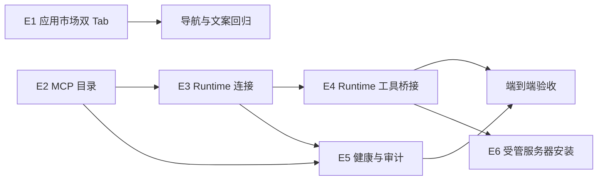

# 应用市场：MCP 中心与 CLI 市场需求分解

## 1. 交付目标

MVP 让工作区管理员在应用市场的 MCP 市场 Tab 中把审核过的远程 MCP Server 安全连接到一个 Docker Runtime，并让就绪的工具仅在该 Runtime 的任务中可用。现有内容成为 CLI 市场 Tab，不改变 CLI Hub 的安装、验证和 Skill 同步链路。

## 2. 范围与优先级

| Epic | 优先级 | MVP | 结果 |
| --- | --- | --- | --- |
| E1：应用市场双 Tab | P0 | 是 | 单一入口内清晰切换 CLI 与 MCP，既有功能无回归 |
| E2：MCP 目录 | P0 | 是 | 可浏览经过审核的 MCP Server 定义 |
| E3：Runtime MCP 连接 | P0 | 是 | 管理员可配置、验证、启用、停用、删除连接 |
| E4：Runtime 执行与工具桥接 | P0 | 是 | `ready` 服务的获准工具可被任务调用 |
| E5：健康、审计与告警 | P0 | 是 | 可定位连接或调用失败且不泄露秘密 |
| E6：受管 MCP 服务隔离部署 | P1 | 否 | 以审核模板在私有服务容器部署 MCP，不向 Runtime 或服务暴露宿主机权限 |
| E7：OAuth 与工作区私有目录 | P2 | 否 | 支持授权代理、私有服务审核与复用 |

## 3. Epic 与用户故事

### E1：应用市场双 Tab

| 用户故事 | 验收标准 |
| --- | --- |
| 作为管理员，我要从“应用市场”切换 CLI 市场和 MCP 市场，从而在同一工作流中管理两类扩展。 | `/market` 保持唯一入口；`?tab=cli` 与 `?tab=mcp` 可直达并支持浏览器返回；默认 `cli` 保持兼容。 |
| 作为现有用户，我要继续使用已安装应用，避免术语更新影响工作流。 | `clihub_*` 目录、已安装应用、操作历史、异步安装和 Skill 同步的记录与路由不迁移、不丢失。 |
| 作为管理员，我要在同一市场中发现“MCP 中心”。 | `MCP 市场` Tab 标注“MCP 中心”；没有 MCP 管理权限的用户可见只读目录但不显示连接管理动作。 |

### E2：MCP 目录

| 用户故事 | 验收标准 |
| --- | --- |
| 作为管理员，我要浏览审核 MCP 服务，按来源、类别、传输、风险筛选。 | 每项展示名称、描述、来源、传输、数据域、声明工具数、风险；不展示密钥和完整鉴权配置。 |
| 作为管理员，我要在连接前知道服务将访问何处。 | 详情显示允许的主机、传输、配置项摘要、数据域和风险说明。 |
| 作为平台运维，我要发布受约束的目录条目。 | 目录保存 endpoint allow-list、schema、工具声明、默认工具范围与版本；缺少这些字段的条目不能发布。 |

### E3：Runtime MCP 连接

| 用户故事 | 验收标准 |
| --- | --- |
| 作为管理员，我要选择一个可用 Runtime 并配置 MCP。 | 仅可选择在线、Provider 兼容且通过网络策略预检的 Runtime。 |
| 作为管理员，我要输入密钥但不能随后读取它。 | 密钥加密保存；再次打开只显示“已配置”和更新时间；轮换需重新输入；任何 API response 和日志都不返回值。 |
| 作为管理员，我要限制服务可提供给任务的工具。 | 向导默认推荐最小工具集合；高风险工具默认不选；后端验证 selected tools 是目录声明且实际发现的子集。 |
| 作为管理员，我要停用或删除不再需要的服务。 | 停用立即阻断新任务调用；删除只影响目标连接，不影响同 Runtime 的 CLI 或其他 MCP 连接。 |

### E4：Runtime 执行与工具桥接

| 用户故事 | 验收标准 |
| --- | --- |
| 作为管理员，我要在启用前验证真实网络、认证和工具协议。 | daemon 在 Runtime 网络命名空间中完成 initialize 和 tools/list；成功才进入 `ready`。 |
| 作为任务发起人，我只希望模型调用已获准、确实可用的工具。 | 任务启动只加载 `ready` 连接的 approved tools，能力 ID 为 `mcp:<connectionId>:<toolName>`。 |
| 作为管理员，我要防止 Server 更新后自动扩大权限。 | 新发现工具永不自动获准；已获准工具消失会将连接降级，并从任务能力目录移除。 |

### E5：健康、审计与告警

| 用户故事 | 验收标准 |
| --- | --- |
| 作为管理员，我要理解服务为何不可用。 | 展示网络、认证、协议、策略、超时五类脱敏错误及建议动作。 |
| 作为审计人员，我要追踪谁何时改动过连接。 | 连接创建、验证、配置变更、密钥轮换、启停、删除和工具调用生成工作区审计事件。 |
| 作为管理员，我要及时处理失效连接。 | 健康检查或工具调用失败进入 `degraded`；新任务不使用该连接；管理入口显示需处理计数。 |

## 4. 关键规则

1. MVP 只开放审核的 `streamable_http`。SSE 需按 Provider adapter 实测后启用；`stdio` 和服务器安装不进入 MVP。
2. 连接实例的最小作用域为 `workspaceId + runtimeId + catalogItemId`；同一服务接到不同 Runtime 时配置与密钥互不共享。
3. Endpoint 仅允许 HTTPS、目录声明的 host，并拒绝 loopback、私网、metadata 地址与违规重定向。
4. 配置、endpoint、工具范围或密钥任一变更后，连接立即失去 `ready` 资格，必须重新验证。
5. 目录条目不是 Runtime 能力；只有已验证连接的获准工具才能进任务上下文。
6. 所有写操作由服务端重新计算风险、权限、schema 和工具范围；浏览器输入不被信任。

## 5. 依赖与顺序

建议实施顺序：先完成 E1 和 E2 的数据/页面基础，再做 E3 的状态机和异步操作，随后接入 E4 的 daemon 验证与 Provider bridge，最后完成 E5 的观测和端到端验收。E6 必须在 Runtime 网络隔离、受管部署代理和独立服务容器镜像策略明确后再启动；不得以宿主机直接安装作为替代。

## 6. Definition of Done

- P0 用户故事都有服务层和 UI 层测试；daemon 有模拟 MCP Server 的协议、超时、认证、工具变更用例。
- 新表、API 和审计均按工作区隔离；非 Owner/Admin 无法写入或读取敏感配置。
- CLI 市场现有定向测试通过，且未引入对 CLI Hub 安装计划的行为改动。
- MCP 健康失败、禁用、配置变更、删除均能证明工具不会进入新的任务能力目录。
- 脱敏检查覆盖 authorization header、密钥值、URL query、工具输入和工具输出中的已知敏感字段。
- 部署未执行；本工作站禁止 Jenkins。后续由获授权的非 Jenkins 流程或指定 CI 环境处理。
