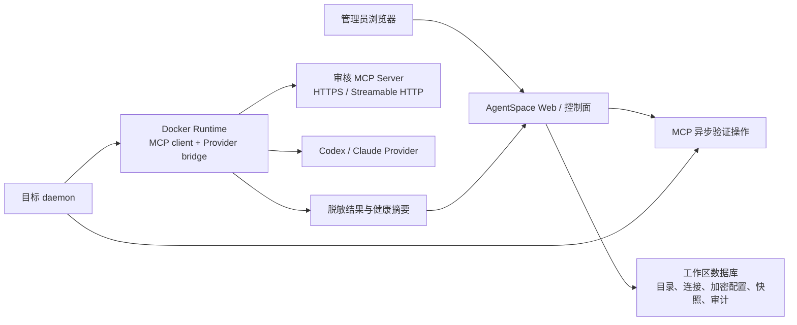
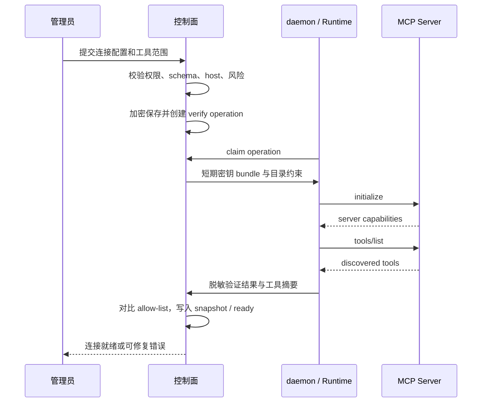

# MCP 中心：架构设计

## 1. 架构边界

MCP 中心采用“控制面保存意图，Runtime 执行面完成连接和调用”的结构。控制面不代发 MCP 请求，浏览器不直接连接 MCP Server，Provider 也不绕过 Runtime 网络策略。CLI 与 MCP 的环境边界决策见 [04-运行环境隔离决策.md](./04-运行环境隔离决策.md)：远程 MCP 不安装，本地 MCP 使用独立受管服务容器，禁止宿主机直接安装。



### 不可跨越的边界

- MCP Server 的网络请求从 Runtime 发起并由 Runtime egress 策略约束。
- 控制面只保存密文、配置元数据、发现摘要和脱敏结果，永远不保存运行期的明文 header。
- Provider 只能调用 Runtime bridge 注册的 `mcp:*` 工具，不能自行读取目录、连接密钥或自由访问 endpoint。
- 受管 MCP 服务只能由受管部署代理创建；Runtime 不挂载 Docker socket、宿主机目录或 SSH 凭据。

## 2. 核心实体

| 实体 | 主键与作用域 | 关键字段 |
| --- | --- | --- |
| `mcp_catalog_item` | `id`，全局或发布域 | source、slug、version、transport、allowed_hosts、configuration_schema、declared_tools、risk |
| `runtime_mcp_connection` | `id`，`workspace_id` | runtime_id、catalog_item_id、status、approved_tools、endpoint_fingerprint、last_verified_at、last_error |
| `runtime_mcp_secret` | `connection_id + field_name` | encrypted_value、key_version、rotated_at；禁止返回明文 |
| `runtime_mcp_discovery_snapshot` | `id`，`connection_id` | protocol_version、tools_metadata、tools_fingerprint、discovered_at、verification_latency_ms |
| `runtime_mcp_operation` | `id`，`workspace_id` | connection_id、operation、status、request_snapshot、safe_stdout_tail、safe_stderr_tail |
| `runtime_mcp_tool_audit` | `id`，`workspace_id` | connection_id、task_id、tool_name、outcome、latency_ms、safe_summary |

数据库约束：`runtime_mcp_connection` 的 `(workspace_id, runtime_id, catalog_item_id)` 唯一；所有运行时和连接通过工作区外键或服务端校验隔离；删除连接时密钥级联删除，审计只保留不可逆引用和脱敏摘要。

## 3. API 与操作协议

### 管理 API

```text
GET    /api/mcp/catalog
GET    /api/mcp/catalog/:slug
POST   /api/mcp/connections
PATCH  /api/mcp/connections/:id/configuration
POST   /api/mcp/connections/:id/verify
POST   /api/mcp/connections/:id/enable
POST   /api/mcp/connections/:id/disable
DELETE /api/mcp/connections/:id
GET    /api/mcp/connections/:id/tools
GET    /api/mcp/connections/:id/activity
```

`POST /connections` 和 configuration patch 的服务端行为：读取目录定义，校验角色、Runtime 归属/在线状态、schema、allowed hosts、工具 allow-list 和高风险确认，保存密文并将连接置为 `queued_verification`。绝不能接受客户端传入的最终 `status`、风险等级或未发现工具。

### daemon 操作协议

控制面向拥有该 Runtime 的 daemon 暴露 claim 接口。daemon 认领后只处理连接的 `verify`、`enable`、`disable`、`remove` 等受限任务，并回报结构化结果：

```ts
type McpVerificationResult = {
  status: "ready" | "failed" | "degraded";
  protocolVersion?: string;
  discoveredTools?: Array<{ name: string; description: string; inputSchemaDigest: string }>;
  latencyMs?: number;
  error?: { code: "network" | "auth" | "protocol" | "policy" | "timeout"; safeMessage: string };
};
```

Runtime 与控制面之间的请求使用既有 daemon 鉴权通道；密钥 bundle 只发送给已认证、已绑定目标 Runtime 的 daemon，并按连接 ID、单次操作和短期有效性限制。

## 4. 验证与调用序列

### 4.1 验证



### 4.2 任务工具调用

1. `prepareDaemonTaskContext` 读取目标 Runtime 的 `ready` MCP 连接。
2. 对每项连接执行低成本 freshness check；失败时标为 `degraded`，不注入本任务。
3. 只注册 `approvedTools ∩ discoveredTools`，工具 ID 稳定为 `mcp:<connectionId>:<toolName>`。
4. Provider 发出工具调用后，Runtime MCP bridge 校验 connection、tool 和参数大小，再通过该连接发送。
5. bridge 记录成功/失败、时延与脱敏摘要；原始输入/输出不落库。

## 5. Runtime 网络与安全控制

| 控制项 | 必须行为 |
| --- | --- |
| URL 校验 | 仅 HTTPS；DNS 解析后的地址拒绝 loopback、link-local、RFC1918、metadata 和非允许端口；每次重定向重新检查 |
| Egress | 容器网络策略对每个连接执行 host allow-list；应用层规则不能替代网络规则 |
| TLS | 默认校验证书和主机名；不提供“跳过 TLS 校验”选项 |
| 请求限制 | initialize/tools/list 和工具调用具有连接、响应体、超时、并发与重试上限 |
| 密钥 | AES-GCM 或现有加密设施保存；运行期最小注入；永不进入任务 prompt、browser payload、command plan 或日志 |
| 工具范围 | 目录声明、验证发现和管理员批准三者取交集；服务端二次校验 |
| 审计 | 按 workspace/task/connection/tool 记录脱敏摘要；值级脱敏优先于名称模式脱敏 |

错误不得把 URL query、Authorization、Cookie、密钥值、原始 schema 或 MCP 响应直接返回。错误代码应为 `mcp.policy_denied`、`mcp.network_unreachable`、`mcp.authentication_failed`、`mcp.protocol_invalid`、`mcp.timeout`、`mcp.tool_not_approved` 等稳定枚举。

## 6. Provider Bridge 抽象

在 `packages/daemon` 新增协议无关的 MCP client 与 runtime tool adapter，不在 Codex 或 Claude adapter 内各自实现连接逻辑。

```ts
interface RuntimeMcpTool {
  id: `mcp:${string}:${string}`;
  connectionId: string;
  name: string;
  description: string;
  inputSchema: Record<string, unknown>;
}

interface RuntimeMcpClient {
  verify(connection: ResolvedMcpConnection): Promise<McpVerificationResult>;
  call(input: { connection: ResolvedMcpConnection; toolName: string; arguments: unknown; taskId: string }): Promise<unknown>;
}
```

各 Provider adapter 只需要把 `RuntimeMcpTool` 转换为其本地工具定义，并把回调委托给 `RuntimeMcpClient.call`。这样可复用连接、校验、审计和安全策略，且不会重复实现不同 Provider 的网络逻辑。

## 7. 受管服务器安装（Phase 2）

受管部署新增 `managed_service` catalog 类型，模板包含固定版本镜像 digest、内部服务名、健康检查、资源限制、环境变量白名单和卸载语义。控制面发出 deployment operation，受管代理创建无特权的私有服务容器后返回连接引用，随后走同一套 verify/discovery 状态机。服务容器不能获得 Docker socket、Provider 凭据卷、Runtime state 卷或宿主机工作目录。

本项目的 Dockerfiles 和 Compose 文件不得创建、嵌入或启动 PostgreSQL、Redis、RabbitMQ。任何需要的这类依赖都通过外部集中管理基础设施配置连接；MCP 服务模板也不能借机引入这些服务定义。

## 8. 测试策略

| 层 | 覆盖重点 |
| --- | --- |
| domain/services | 状态机、workspace 隔离、schema、host 规则、approved-tools 交集、高风险确认、加密/脱敏 |
| db | 唯一约束、删除级联、审计保留、密钥不回显 |
| daemon | 模拟 streamable HTTP Server 的 initialize、tools/list、认证失败、重定向、超时、工具变更、调用审计 |
| adapter | Codex/Claude 工具定义转换与拒绝未批准工具 |
| web | 向导 happy path、错误恢复、密钥轮换、停用、删除、无权限、CLI 市场回归 |
| E2E | 在线 Docker Runtime 完成连接、任务调用、失效降级和停用阻断 |
