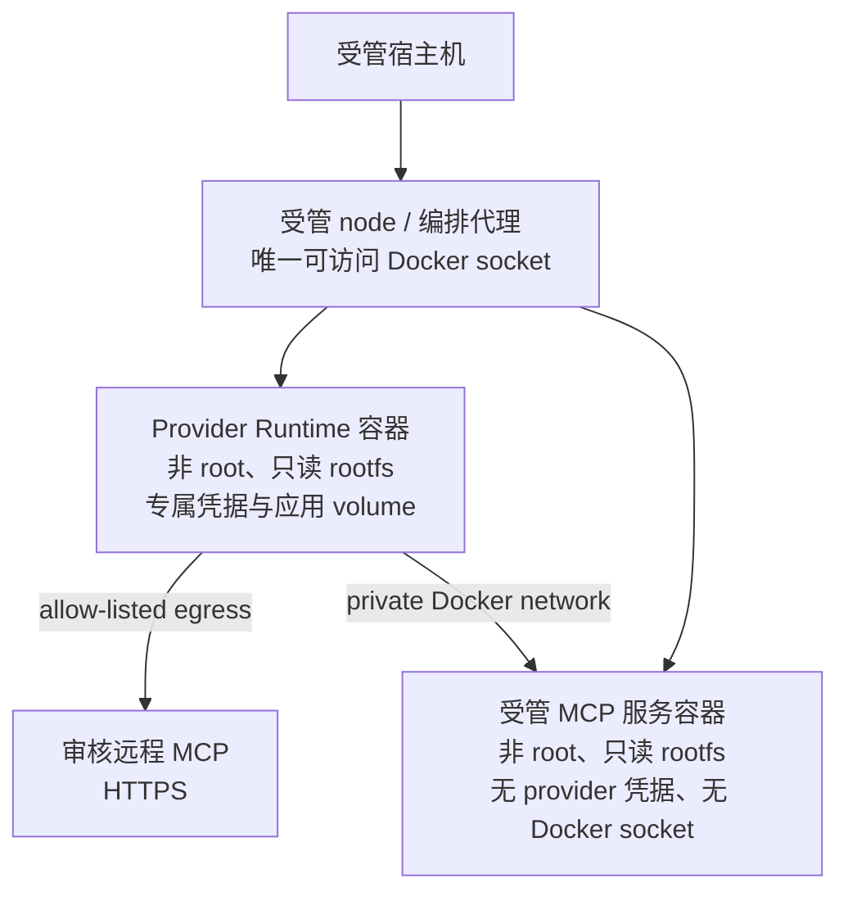

# CLI 与 MCP 运行环境隔离决策

> 状态：架构决策，建议采纳
>
> 决策：禁止将应用市场安装的 CLI 或 MCP Server 直接安装到宿主机。CLI 在每个目标 Runtime 容器内隔离安装；远程 MCP 不安装；需要本地进程的 MCP 以独立受管服务容器运行。

## 1. 当前基线

当前项目并不是“所有 Runtime 共同运行在一台宿主机”的松散模型，而是明确的一 Runtime 一容器模型。现有部署已经为 Runtime 建立了重要边界：

| 现有实现 | 证据 | 对本决策的影响 |
| --- | --- | --- |
| 每个 Provider Runtime 是独立容器 | [deploy/daemon/README.md](../../../deploy/daemon/README.md) 的 “One Runtime Per Container” | 不应把某个 Runtime 的扩展安装变成所有 Runtime 共享的宿主机状态 |
| Runtime 不共享 Docker socket、宿主机 worktree、provider auth 或 daemon token | 同一部署说明明确禁止这些挂载 | 直接宿主机安装会绕开 Runtime 身份和数据边界 |
| Runtime 根文件系统只读、使用非 root 用户、丢弃 Linux capabilities | [docker-compose.runtimes.yml](../../../deploy/daemon/docker-compose.runtimes.yml) 与 [docker-compose.remote-images.yml](../../../deploy/daemon/docker-compose.remote-images.yml) | 当前运行时将可写状态限制在专属 volume；宿主机安装会扩大可写面 |
| 现有 CLI 操作由 daemon 在 Runtime 内执行 | `packages/services/src/clihub/install-plan.ts` 产生 argument-array 计划，`packages/daemon/src/runtime-apps.ts` 执行 | CLI 市场已经是“安装到 Runtime”，不是“安装到服务器” |
| 受管 node 才持有 Docker socket | [docker-compose.managed-node.yml](../../../deploy/daemon/docker-compose.managed-node.yml) | socket 是受管编排能力，不应传给 Runtime、MCP 服务或普通应用市场操作 |

特别需要注意：现有 CLI Hub bootstrap 使用 `python3 -m pip install --user`，其可写目标是 Runtime 的 `/home/dofe-agent` 专属 volume。这不是宿主机安装，但 CLI 包与 Provider 的用户主目录共存，适合当前 MVP，不适合无限制扩展。

## 2. 结论：需要隔离，但不是所有东西再造一层容器

“CLI 和 MCP 是否需要隔离”有两个不同问题：

1. **是否从宿主机隔离？需要。** 当前容器边界、凭据隔离和一 Runtime 一身份是项目的安全前提。宿主机安装破坏这些前提，应禁止。
2. **CLI 与远程 MCP 是否各自需要一个新容器？不需要。** CLI 需要在目标 Runtime 命名空间中被 Provider 使用；远程 MCP 只是 Runtime 到外部服务的一条受控网络连接，不运行新的本地进程。
3. **本地/stdio MCP 是否需要与 Runtime 再隔离？需要。** 它是长期运行的第三方代码。若与 Provider daemon 同容器，会天然读取同一 HOME、认证文件、状态卷和进程环境，风险不可接受。

| 资源场景 | 推荐运行位置 | 是否宿主机安装 | 原因 |
| --- | --- | --- | --- |
| CLI-Anything Hub CLI | 目标 Runtime 的专属应用目录/volume | 否 | 命令须被该 Runtime 使用，且安装范围与 Runtime 身份一致 |
| 远程 `streamable_http` MCP | 外部审核服务；Runtime 内置 MCP client 发起连接 | 否 | 没有本地 Server 进程，重点是 egress、密钥和工具授权 |
| 受管 `stdio` / 本地 MCP | 每个 Runtime x MCP 连接的受管服务容器 | 否 | 隔离第三方代码、依赖、进程生命周期和配置 |
| 平台公共 MCP | 平台运维管理的独立服务集群，Runtime 仅经私网/网关连接 | 否 | 避免将共享服务和任一 Runtime 的凭据、文件系统耦合 |

## 3. 为什么不能直接安装到宿主机

直接安装在服务器上看似节约镜像构建时间和磁盘空间，但会造成不可接受的控制面退化：

| 问题 | 宿主机直接安装的后果 | 容器/受管服务方案 |
| --- | --- | --- |
| 工作区隔离 | 同一二进制、缓存、配置和可能的 token 被多个 Runtime 复用 | 每个 Runtime 或连接独立 volume/密钥范围 |
| 版本确定性 | `pip/npm` 更新会影响服务器上的所有 Runtime，难以回滚 | 目录版本或镜像 digest 绑定到具体连接 |
| 权限边界 | 第三方代码继承宿主机用户、网络和文件权限 | 非 root、只读 rootfs、cap drop、最小挂载与受限网络 |
| 生命周期 | Runtime 删除后安装物与服务进程残留 | 连接/Runtime 删除触发受控卸载和 volume 回收 |
| 可观测性 | 无法可靠归属“哪个工作区、Runtime、任务”在调用 | 连接 ID 与 task ID 贯穿验证、调用和审计 |
| 故障半径 | 一个有问题的升级或常驻 MCP 进程影响整台节点 | 仅影响对应连接/服务容器，可停止或回滚 |

即使宿主机安装只用于“本地 MCP Server”，Runtime 要访问它也需要暴露 host network、host gateway 或 socket。这样既使网络策略失效，也很容易把特权接口意外暴露给所有 Runtime。

## 4. 推荐目标架构

### 4.1 CLI 环境

继续将 CLI 应用装入目标 Runtime，但将写入位置从 Provider HOME 中逐步迁移到专属应用目录，例如 `/var/lib/dofe-agent-apps`：

- 每个 Runtime 一个 `runtime-apps` volume，生命周期绑定 Runtime。
- `PATH` 显式包含该目录；Provider auth 仍只留在其私有 `/home/dofe-agent` volume。
- 目录条目必须是审核的固定版本；安装与卸载使用现有 argument-array command plan，不执行 registry 返回的自由 shell。
- CLI 仍可调用网络，但需要遵守该 Runtime 的 egress 策略；高风险 CLI 继续经人工确认。

该迁移是加固项，不阻塞 MCP MVP。MVP 可兼容现有 `--user` 安装方式，但不应把它扩展为宿主机级软件管理器。

### 4.2 远程 MCP 环境

远程 MCP 不需要“安装到服务器”。在 Runtime daemon 中内置协议 client：

- 管理员在 MCP 市场创建 `Runtime x MCP` 连接，配置 endpoint、凭据和 approved tools。
- daemon 从 Runtime 容器完成 initialize、tools/list 和调用；浏览器、控制面与 Provider CLI 都不直连 Server。
- egress 同时受目录 `allowedHosts` 和容器网络策略限制；HTTPS、DNS/重定向地址、端口、超时和响应大小均做校验。
- 连接密钥按 `workspace + runtime + connection` 加密，任务时短期注入，绝不写入 Runtime 环境的长期全局变量。

这是最高优先级的 MVP 路径，因为它不改变 Runtime 镜像和宿主机软件生命周期。

### 4.3 本地 MCP 服务环境

需要本地文件、浏览器、专用 SDK 或 `stdio` 进程的 MCP，不能在 Provider Runtime 内启动。受管 node 根据审核模板运行一个独立服务容器：

- 默认作用域为一个 `workspace + runtime + mcp connection`，以避免客户密钥或本地状态跨 Runtime 混用；经威胁建模后才允许只读公共服务共享。
- 固定镜像 digest，不接受应用市场条目提供的 `docker run`、`npx`、`pip install` 或 shell 片段。
- 容器使用非 root、只读 rootfs、`no-new-privileges`、`cap_drop: ALL`、只写专属 state volume；不挂载 Docker socket、Provider HOME、provider credential、daemon state 或宿主机路径。
- 服务仅加入与目标 Runtime 对应的私有网络；无公开端口。Runtime 通过内部 DNS 名称或受控 Unix socket 连接。
- 受管 node 是唯一能创建/删除该服务的组件；它需根据 catalog template 重建容器，而非让 Runtime 执行 Docker API。
- 服务的密钥独立于 Provider 密钥，按连接短期注入或挂载到只读文件，不出现在镜像层、环境回显和操作日志中。

## 5. 分期与门槛

| 阶段 | 可交付能力 | 隔离要求 |
| --- | --- | --- |
| MVP | 应用市场 MCP Tab + 审核远程 HTTP MCP | 不安装 Server；仅 Runtime egress、连接密钥、工具 allow-list 与验证 |
| 加固 | Runtime 专属 CLI 应用 volume | 保持 CLI 在容器内，Provider HOME 与 CLI 包路径分离 |
| Phase 2 | 受管本地/stdio MCP | 独立服务容器、私网、固定镜像、无 host mount/socket/Provider 凭据 |
| Phase 3 | 平台共享 MCP | 独立服务集群、租户认证、数据域授权、容量与审计策略 |

本地 MCP Phase 2 的启动门槛：受管 node 已能按 digest 创建最小权限容器；网络策略能限制 Runtime 到指定服务；密钥分发支持短期连接级 bundle；删除连接能同时停止容器并删除其专属 state；安全测试证明服务容器无法读取 Provider 凭据。

## 6. 不采纳方案

### A. 所有 CLI 与 MCP 直接安装在宿主机

不采纳。它与当前一 Runtime 一容器、只读根文件系统、独立凭据和无 socket 的设计直接冲突，且无法安全区分工作区、Runtime 和版本。

### B. 所有 MCP 与 Provider Runtime 同容器运行

不采纳为通用方案。远程 MCP client 可以在 Runtime 内，常驻本地 MCP Server 不可以。后者会与 Provider 共享凭据与文件系统，且会让第三方服务故障拖垮任务 daemon。

### C. 每个 CLI 都启动一个服务容器

不采纳。CLI 是 Provider 的本地可执行依赖，额外服务容器增加 IPC、版本和故障复杂度，但并不改善当前按 Runtime 容器隔离的关键边界。

## 7. 验收检查

- Runtime 容器与任何 MCP 服务容器均不挂载宿主机 Docker socket、工作目录或其他 Runtime 的 credential/state volume。
- 安装一个 CLI 后，只在目标 Runtime 的 PATH 可见；另一个 Runtime 和宿主机均不可使用该命令。
- 连接远程 MCP 时宿主机不出现新进程、包或全局配置；只有目标 Runtime 能通过 allow-listed 网络调用服务。
- 本地 MCP 服务被停止、删除或降级后，目标 Runtime 的新任务不再获得其工具。
- 尝试连接 `localhost`、私网、metadata IP、未经审核 host 或未经批准工具时均在服务端拒绝，并产生不含敏感信息的审计事件。
