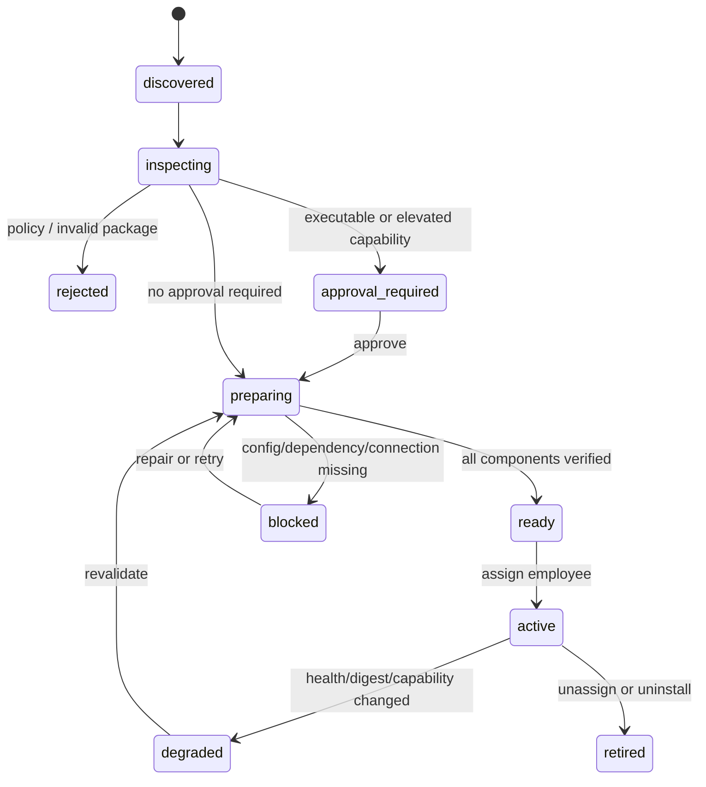

# 产品方案：任何受支持 Skill 可直接安装并使用

## 1. 问题与用户价值

今天的“导入成功”只代表部分文本文件进入工作区。管理员无法在安装前知道脚本是否会丢失、依赖是否能在目标 Remote Runtime 准备完成、MCP 是否真实可调用；员工也可能收到已挂载但不可执行的 Skill。问题不是缺少一个导入入口，而是缺少从来源到可用能力的可解释生命周期。

目标体验是：管理员选择任何受支持来源后，系统明确展示将导入什么、会在哪里执行、需要哪些权限和依赖；只有满足该 Runtime 的所有前置条件后，Skill 才显示为“可用”。任务启动时只看到已就绪的文件、脚本、CLI 和 MCP 工具。

## 2. 用户、场景与设计原则

| 用户 | 目标 | 当前风险 | 产品原则 |
| --- | --- | --- | --- |
| 工作区管理员 | 将社区或私有 Skill 安全给指定员工使用 | 把下载、安装、连接和激活混为一谈 | 先了解影响，再授予能力 |
| Skill 作者 | 发布含脚本、模板、依赖或 MCP 的可复用工作流 | 不同 Provider/Runtimes 行为不一致 | 一个可验证包，多种受控投影 |
| 员工/任务发起人 | 任务自动获得正确工具 | “已安装”却在执行中失败 | 只加载 ready 能力，失败可解释 |
| 平台运维 | 控制 Remote Runtime 风险和成本 | 任意脚本/MCP/全局包扩大攻击面 | Runtime 与连接最小隔离、可审计、可回滚 |

设计原则：完整性优先于静默降级；来源可信度不等于运行授权；Remote 模式保持与本地同样的产品能力，但不继承宿主机权限；状态应说明影响和下一步；密钥永不出现在包、Prompt 或日志中。

## 3. Skill 形态总表

### 3.1 来源形态

| 来源 | 示例 | 导入策略 | 默认信任 |
| --- | --- | --- | --- |
| 编辑器手工创建 | 管理员创建 `SKILL.md` | 创建首个 artifact | 工作区私有，仍需脚本审查 |
| 本地目录 | 标准 Skill 目录 | 递归打包、保留 mode 与二进制 | 本地来源，不自动豁免审查 |
| ZIP | 上传或任务产物 | 解包并验证清单、反 zip bomb | 未验证 |
| Git | GitHub/GitLab/私有 Git | 解析 ref 后锁定 commit SHA | 未验证或组织已验证 |
| 注册表 | Skills.sh、ClawHub | 获取包后锁定 digest；来源页不是安装物 | 未验证 |
| Runtime 产物 | Agent 生成的目录/ZIP | 仅从受控 artifact 区接收，要求显式确认 | 低信任 |
| CLI 市场同步 | CLI catalog 自带 `SKILL.md` | 绑定到已安装 CLI digest | 继承 catalog 审核结果 |

### 3.2 内容与运行形态

| 形态 | 包内表示 | 安装后如何使用 | 风险与门禁 |
| --- | --- | --- | --- |
| 指令型 | `SKILL.md` | Provider 激活后读取 | frontmatter 与引用完整性 |
| 知识/模板型 | `references/`、`assets/` | 按需读取或复制到任务 artifacts | MIME、大小、版权/敏感扫描 |
| 脚本型 | `scripts/` 或 manifest entrypoint | 通过 Skill Runner 调用 | 文件 hash、执行审批、最小能力 grant |
| 依赖型 | `dependencies` | 安装到 Runtime 专属 Skill cache | lock、漏洞/许可证策略、完成验证 |
| CLI 型 | `requires: cli:<catalog>` | Runtime App capability 注入 | App 已安装且 enabled |
| 远程 MCP 型 | `capabilities: mcp:<catalog-slug>` | 绑定 ready connection 的 approved tools | 管理员连接、验证、工具 allow-list |
| stdio/本地 MCP 型 | `mcpService` 声明或 catalog 引用 | 受管服务容器提供工具 | 审核镜像 digest、私网、无 Provider 凭据 |
| 支撑服务型 | `service: <catalog>@<version>` | 服务就绪后将 HTTP/MCP/队列能力绑定给 Skill | 审核模板、作用域、健康、版本和变更审批 |
| 复合型 | 上述任意组合 | 一份 installation plan | 所有必需 component 都 ready 才激活 |

## 4. 产品模型与状态机

将“Skill”拆为三个对象：**包（artifact）** 是不可变内容；**安装（installation）** 是它在一个 Runtime 的准备结果；**分配（assignment）** 是它对某员工的激活与配置。一个包可被多个 Runtime/员工复用，安装不能跨 Runtime 偷用。

`ready` 的严格含义：artifact 已验证；所有必需依赖已在目标 Runtime 的专属位置安装并验证；脚本 runner policy 满足；引用的 CLI 已 ready；每个 MCP capability 都有同 Runtime 的 ready connection，且至少一个批准工具满足声明；所需配置和密钥已保存。缺一项只能是 `blocked`，不得在任务里“尽力执行”。

常驻支撑服务同样是 required component。服务尚未部署、健康检查失败、配置 schema 不兼容或被运维停用时，依赖它的 installation 必须为 `blocked` 或 `degraded`；系统不允许将服务 URL 直接塞给模型后继续标记为 ready。

## 5. 核心流程

### 5.1 安装与激活

1. 管理员在 Skill Library 选择“添加 Skill”，输入链接、上传 ZIP、选择目录或从运行时产物收取。
2. 系统解析并展示内容清单、来源/commit/digest、依赖、脚本、资产大小、网络/MCP/CLI 能力、许可证和风险。
3. 管理员选择目标 Runtime 与员工。系统生成安装计划，而非直接执行。
4. 对需要审批的组件确认具体风险；机密只在连接/配置步骤输入。
5. daemon 在目标 Runtime 执行受控准备操作并持续回报。完成后可激活；失败显示可操作的缺失项。
6. 任务开始前执行低成本 freshness check。只有 ready 包的能力进入该任务。

服务型 Skill 在第 3 步额外选择“新建受管服务”或“绑定已有服务”。前者提交给运维队列，后者仅显示与该 Runtime、workspace、版本兼容且健康的实例。管理员不能输入任意容器命令、镜像标签或数据库连接；这些属于服务模板和运维变更。

### 5.2 升级、回滚与删除

升级永远是“发现新 artifact -> diff -> 新安装 -> 切换 assignment”，不原地覆盖。diff 至少展示新增/删除/修改文件、脚本权限变化、依赖版本、MCP/网络权限和风险变化。旧 artifact 与安装保留到回滚窗口结束；删除安装不删除其他 Runtime 的安装，也不删除审计摘要。

重新导入已有 active artifact 的 Skill 时，只创建并绑定候选 artifact，不提前修改 Skill 描述、来源配置或文本兼容投影。管理员在 active/ready Runtime 行查看候选变更数和 breaking 标识，显式创建升级计划；daemon 将候选准备为 ready 后才能发布。发布事务同时切换 active digest、员工 assignment pin 和兼容投影，任何 CAS、完整性或投影恢复失败都会整体回滚。

版本号用于人类沟通，digest 用于实际执行。一次有效升级至少锁定以下版本：Skill artifact digest、package schema、依赖 lock、支撑服务模板版本与 image digest、服务配置 schema、MCP 协议/工具 fingerprint、installation revision。任一项变化都生成新的候选 revision；只有风险 diff 为空且策略允许时，管理员才能选择自动推广。

## 6. 产品需求

| ID | 优先级 | 要求 | 验收要点 |
| --- | --- | --- | --- |
| SKI-01 | P0 | 接收全部来源形态并归一为 artifact | Git 锁 SHA；ZIP/目录保留 text、binary 和 executable mode |
| SKI-02 | P0 | 安装前给出结构化检查结果和计划 | 没有静默跳过文件；每个风险有原因与影响 |
| SKI-03 | P0 | Remote Runtime 以 Runtime x artifact 安装隔离 | 不写宿主机、不用全局 npm/pip、不共享凭据 |
| SKI-04 | P0 | 任务仅使用 ready Skill | pending/failed dependency、MCP 或脚本阻断任务或排除该可选能力 |
| SKI-05 | P0 | 可执行脚本经受控 runner 调用 | 不继承 Provider credential、Docker socket 或宿主机路径 |
| SKI-06 | P0 | MCP 声明只解析为 MCP Center connection 需求 | ready connection 和 approved tools 进入 Provider bridge |
| SKI-07 | P1 | 提供 upgrade diff、回滚和 provenance | 可准确复现历史任务使用的包版本 |
| SKI-08 | P1 | 为 Provider 输出原生和兼容投影 | Codex/Claude 等目录与兼容目录内容 hash 一致 |
| SKI-09 | P1 | 将支撑服务作为可审核、可观测的安装组件 | 只允许 catalog 模板；服务不健康时阻断依赖它的 Skill |
| SKI-10 | P1 | 联合版本控制、灰度和回滚 | 任意任务均能追溯 artifact、依赖、服务和 tool revision |

## 7. 成功指标与研究

上线前应访谈至少 3 名管理员、2 名 Skill 作者和 2 名使用者，验证来源、审批、连接与安装术语。MVP 可用性测试招募 5-8 名管理员。

| 指标 | 目标 |
| --- | --- |
| 将含依赖与 MCP 的 Skill 安装到指定 Remote Runtime | 85% 任务完成率，P90 小于 8 分钟 |
| 正确解释 ready 与 preparing 的差异 | 90% 参与者 |
| 高风险脚本或 MCP 权限误授权 | 0 次 |
| 已安装 Skill 在任务中因缺失前置条件失败 | 小于 2% |
| 可复现安装（相同 artifact digest） | 100% |
