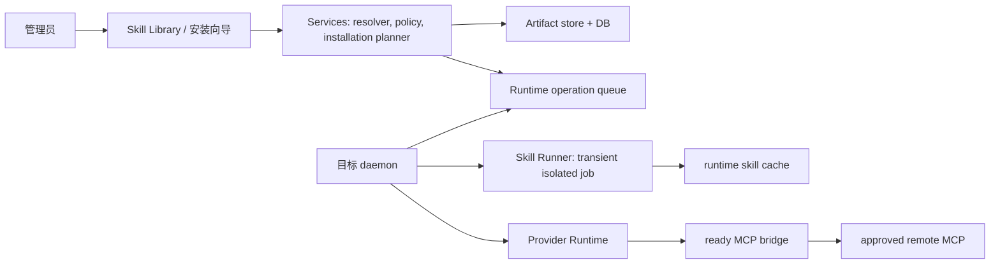

# 架构设计：统一 Skill Package 与 Remote Runtime 执行面

## 1. 架构决策

采用 **Dofe Skill Package (DSP) v1** 作为 Agent Skills 目录的不可变封装，而不是再定义一个不兼容的 Skill 格式。`SKILL.md` 保持原样；DSP 用 `.dofe/manifest.json` 补充不能由 Markdown 安全表达的文件、依赖、能力和 provenance 信息。

不采纳的方案：仅扩展现有 `WorkspaceSkillFile.content`；让 Runtime 按来源 URL 重装；让 `SKILL.md` 填任意 `install_cmd`；让 Remote Runtime 启动任意 stdio MCP；把 MCP 密钥存进 Skill config 或环境变量。

## 2. 包格式与验证

```text
my-skill/
  SKILL.md
  scripts/render.py
  references/api.md
  assets/template.docx
  .dofe/manifest.json
  .dofe/lock.json
```

```json
{
  "schemaVersion": 1,
  "artifact": { "name": "my-skill", "version": "1.2.0", "sha256": "..." },
  "files": [{ "path": "scripts/render.py", "sha256": "...", "size": 2143, "mediaType": "text/x-python", "mode": "0755" }],
  "dependencies": [{ "kind": "npm", "name": "example", "version": "1.4.2", "integrity": "sha512-..." }],
  "capabilities": [{ "kind": "mcp", "catalogSlug": "github", "requiredTools": ["search_issues"] }],
  "services": [{ "catalogSlug": "document-renderer", "templateVersion": "2.1.0", "required": true }],
  "entrypoints": [{ "id": "render", "kind": "script", "path": "scripts/render.py", "runtime": "python" }]
}
```

服务端必须使用完整 YAML parser 校验 `SKILL.md` 的 Agent Skills 基线字段，并保留未知 frontmatter。`manifest.json` 使用 JSON Schema 严格校验。导入后逐文件计算 SHA-256，验证路径无 `..`、无绝对路径、无未声明 symlink；ZIP 限制压缩/解压大小、文件数和嵌套深度。二进制通过 bytes 存储或对象存储引用保存，不转 UTF-8 字符串。源 artifact 的根 digest 是 canonical manifest 加按路径排序的文件 digest 的哈希。

## 3. 数据模型

| 实体 | 作用域 | 关键字段 |
| --- | --- | --- |
| `skill_artifact` | workspace 或已审核全局目录 | artifact digest、标准 metadata、来源、锁定 commit、风险、扫描版本 |
| `skill_artifact_file` | artifact | path、sha256、size、media type、mode、blob reference |
| `skill_installation` | workspace + runtime + artifact digest | status、resolved lock、prepared path、health、installed/verified time |
| `skill_installation_component` | installation | dependency/script/CLI/MCP component、status、error code、operation id |
| `skill_service_binding` | installation + service instance | catalog template version、service image digest、endpoint reference、health and compatibility revision |
| `managed_skill_service` | workspace + runtime + template | scope、status、resource profile、network identity、last health、rollout revision |
| `employee_skill_assignment` | workspace + employee + artifact | installation id、config revision、active state、rollout pin |
| `skill_installation_operation` | workspace + runtime | inspect/prepare/verify/activate/uninstall，request snapshot 和脱敏结果 |

当前 `skill`、`skill_file` 和 agent assignment 可继续作为兼容视图。迁移时为旧记录生成 artifact；文本文件存为 blob、mode 默认 `0644`，并标记 `legacy_unverified`，不擅自赋予脚本可执行权。

## 4. 控制面与执行面



### 4.1 Remote Runtime 安装

daemon 认领 `prepare` 后下载已验 artifact 到 Runtime 专属只读 cache，例如 `/var/lib/dofe-agent-skills/artifacts/<digest>`。依赖放入 `/var/lib/dofe-agent-skills/envs/<installation-id>`，不能写 Provider HOME、宿主机或全局 package path。安装命令必须来自 planner 生成的 argument array、精确版本/integrity 和 allow-listed registry；完成后执行独立 verify command 并写入 component status。

运行脚本时，daemon 只传入任务 scratch、显式输入 artifacts、指定 entrypoint 和必要的配置值。Skill Runner 为短生命周期受限 job：非 root、只读 rootfs、无 Docker socket、无 Provider HOME/credential、默认无网络、只挂载只读包与受限输入输出目录。需要网络或写入的脚本必须在 manifest 中声明并由管理员授予最小 capability；输出只可经既有 runtime-output artifact 协议回传。

### 4.2 Provider 投影

`materializeWorkspaceSkillsForProvider` 改为从 artifact 生成只读投影，并在 manifest 中写入 digest。Provider-native 根目录维持现有 Codex/Claude/OpenCode/OpenClaw/NanoBot 位置；没有原生支持的 Provider 使用 `.agent_context/skills`。投影同时携带全部允许文件，但 Provider 不可直接执行脚本；Prompt 指向 runner entrypoint/能力目录。

Runner launcher 名称必须由有界可读段和稳定作用域哈希生成；manifest entrypoint id 规范化后必须唯一，任务 broker 还要校验最终 key/命令唯一。命名算法变化必须提升 `providerCompatibilityRevision` 并进入 release lock，不能依赖文件写入顺序解决冲突。

同一任务只读取 assignment 所固定 artifact digest，确保重试和审计可重现。每次 materialization 校验文件清单；不一致立即标记 installation `degraded`。

### 4.3 支撑服务执行面

需要常驻 API、浏览器、索引器、专有 SDK 或 stdio server 的 Skill，使用 `Skill Service Catalog`，而非在 `scripts/` 中后台启动服务。Catalog template 是平台审核对象，包含固定 `imageDigest`、服务协议、端口、health/readiness probe、资源 profile、允许的 egress、配置 schema、密钥字段、外部托管依赖和升级/回滚策略。

服务实例有三种部署类型：`external_connection`（客户或第三方托管，仅连接和验证）、`managed_service`（managed node 创建的 workspace + runtime scoped 私网容器）、`platform_shared`（经过额外威胁建模的平台服务）。只有 managed node 可创建/删除 `managed_service`；服务容器非 root、只读 rootfs、无 Docker socket、无 Provider HOME/credential，且只挂载自己的 state volume 和短期服务密钥。服务如使用 PostgreSQL、Redis 或 RabbitMQ，只能引用集中管理的外部连接配置，模板和 Compose 不得创建这些依赖。

服务完成 health/readiness 与协议兼容性验证后，控制面创建 `skill_service_binding`。MCP 服务再进入 MCP Center 的 connection/discovery 状态机；普通 HTTP 服务只通过审核 connector 或 runner capability 调用。任务只收到绑定引用和允许能力，不能看到 endpoint secret 或 service management API。

## 5. MCP 与 CLI 的正确接线

Skill manifest 可声明 `mcp` capability，但不得内嵌 endpoint、header 或 secret。Services 将它解析成对 MCP Center 的需求：同 workspace、同 runtime、`ready` connection、catalog slug 匹配、`approvedTools ∩ discoveredTools` 覆盖 required tools。任务准备从 ready connections 构建 `mcp:<connectionId>:<toolName>`，由 Runtime MCP bridge 提供给 Provider。

远程 Streamable HTTP MCP 由 Runtime client 连接，不涉及本地安装。stdio/本地 MCP 只能引用审核 catalog 的受管服务模板：managed node 按 image digest 创建独立私网服务，再通过同一 MCP connection 验证。此设计遵守 [MCP 隔离决策](../mcp-extension/04-运行环境隔离决策.md)，也符合 MCP 对 stdio 子进程和 HTTP 独立服务的传输语义。

CLI capability 同样只引用 Runtime App catalog item；只有该 Runtime 的 installed/enabled app 可满足。它与 npm/pip 依赖不同，不能用同一“包已下载”状态代替。

## 6. 版本与升级模型

版本不是单个字符串。`SkillReleaseLock` 必须由 `artifactDigest`、`packageSchemaVersion`、`dependencyLockDigest`、`serviceTemplateVersions`、`serviceImageDigests`、`serviceConfigSchemaVersions`、`mcpToolFingerprints`、`providerCompatibilityRevision` 组成。作者可以提供 SemVer 作为发布标签；安装与任务只使用 lock 解析后的不可变 revision。

升级流程为：发现候选 -> 解析 lock -> 生成 semantic diff -> 策略/人工审批 -> 在目标 Runtime 新建 installation -> 验证 -> canary assignment -> 推广或回滚。任何新增 executable、网络 host、权限、依赖、服务 image、MCP tool、配置字段或不兼容 schema 都是 breaking-risk，必须重新批准。已运行任务固定在创建时的 revision；新任务只在 rollout 切换后使用新 revision。

回滚不重新下载旧分支，而是重新激活上一个 `ready` installation revision。若服务有状态，模板必须声明 `rollbackClass`：`stateless` 可蓝绿切换，`backward_compatible` 先扩展后收缩，`irreversible_migration` 不允许自动回滚并要求运维变更单。

## 7. API 与状态约束

```text
POST /api/skills/resolve-source
POST /api/skills/artifacts
GET  /api/skills/artifacts/:digest/inspection
POST /api/skill-installations
POST /api/skill-installations/:id/retry
POST /api/skill-installations/:id/activate
POST /api/skill-installations/:id/rollback
DELETE /api/skill-installations/:id
POST /api/skill-service-bindings
POST /api/managed-skill-services
POST /api/managed-skill-services/:id/{verify,upgrade,rollback,retire}
GET  /api/daemon/runtimes/:runtimeId/skill-operations/claim
POST /api/daemon/skill-operations/:id/{start,complete,fail}
```

控制面在创建安装时校验角色、artifact digest、Runtime 归属、风险批准和 capability 的目标可用性。daemon 只可回报自己认领的 operation；客户端不能写 `ready`、风险等级、文件 digest 或 discovered tools。任何 connection/依赖/runner 健康变化均使受影响 installation 进入 `degraded`，新任务不再加载它。

## 8. 安全、可观测性与限制

- provenance：记录原始 URL、解析 URL、commit SHA/registry digest、artifact digest、导入人和扫描版本；不得相信 mutable branch/tag。
- secrets：只留在 Credential Center 或 MCP connection secret store。Runner 用一次性短期 bundle；日志与 prompt 不含值。
- network：脚本默认断网；远程 MCP 使用 catalog allowed host、DNS/rebind/redirect 校验及 Runtime egress policy。
- policy：可执行文件、网络、写入、系统依赖、high-risk MCP tool 都独立审批。包重新解析后 capability 扩大必须重新审批。
- limits：每种来源有 body、文件数、单文件、总解压、执行时间、CPU、内存、输出大小和并发限制。
- audit：记录 resolve、inspect、approve、prepare、verify、activate、script invocation、MCP/CLI capability 使用、rollback 与 failure code；保存安全摘要而非原始参数/输出。
