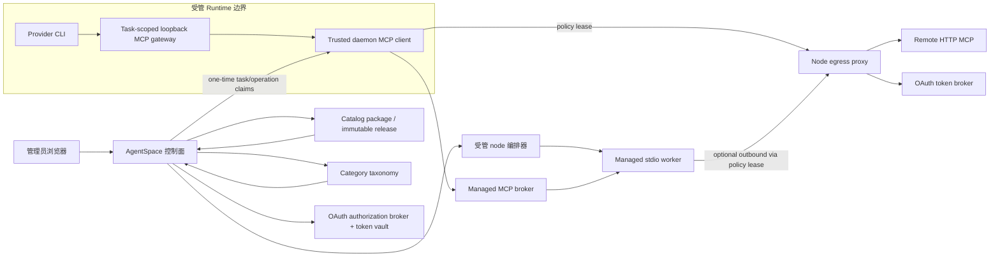
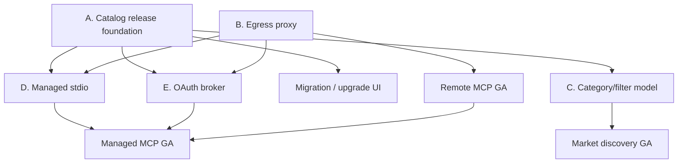

# MCP 安装与治理总体架构

> 状态：Proposed
>
> 决策类型：跨控制面、Runtime 与基础设施的架构决策

## 1. 背景与目标

当前系统已经具备以下可信基线：

- 目录内仅允许审核的远程 `streamable_http` 条目；
- 连接按 `workspace x runtime x catalog item` 管理，密钥加密保存；
- daemon 通过一次性任务 claim 获得连接材料，仅在内存中持有；
- Provider 只看到 daemon loopback MCP gateway，不看到远端 endpoint 和密钥；
- 工具调用前复核连接状态、approved tools 与 discovery snapshot；
- 工具调用审计逐条上报，参数和结果不落库。

但“可安全规模化安装 MCP”还缺少四个独立能力：

1. Runtime 无法绕过 gateway 的基础设施级 egress 约束；
2. 目录条目不能以不可变 release 管理升级、回滚与审计；
3. MCP 市场没有稳定、可运营的分类与组合筛选模型；
4. `stdio` 生命周期和 OAuth 授权不能被现有远程静态凭据模型安全表达。

目标不是一次提交实现全部能力，而是定义稳定契约，使四条工作流能够并行建设、分别灰度、最终组合。

## 2. 设计原则

| 原则 | 约束 |
| --- | --- |
| 执行固定 | 连接和任务使用 release ID + digest，不追随 latest |
| 默认拒绝 | 无 policy、无 lease、无 ready 状态均不得出网或调用工具 |
| Provider 零凭据 | Provider 只访问 task-scoped loopback gateway |
| 控制面不承载工具数据 | 控制面管理策略、授权和审计，不代理 MCP 参数与结果 |
| 发现与执行分离 | 分类、搜索、推荐可以变化；执行 policy 必须不可变 |
| 管理与工作负载分离 | managed node 可编排，Runtime/stdio worker 不持有 Docker socket |
| 升级显式 | 扩大 host、工具、scope、密钥 schema 或镜像权限时必须重新批准 |
| 可撤销 | connection disable、release yank、OAuth revoke 能阻止后续调用 |
| 可证明 | 发布依赖自动化负向测试和可保存的 evidence，不靠网络名称或配置声明 |

## 3. 目标架构



### 3.1 信任域

| 域 | 可以持有 | 不得持有 |
| --- | --- | --- |
| 浏览器 | 目录元数据、连接状态、OAuth 发起状态 | client secret、refresh token、Runtime 密钥 |
| 控制面 | release、policy、加密凭据、授权记录、审计 | 原始工具参数与返回内容 |
| 受信 daemon | 单次 operation/task 所需的短期 material | 长期 refresh token、目录写权限 |
| Provider | loopback gateway URL、工具 schema | endpoint、proxy lease、OAuth token、Docker socket |
| egress proxy | 短期 policy lease、目标主机、必要 OAuth 注入材料 | Provider auth、工作区数据库访问 |
| stdio worker | 其模板声明的临时 secret 与专属状态 | Runtime HOME、Provider auth、Docker socket、其他 worker volume |
| managed node | 编排句柄、模板与容器生命周期 | 工作区 OAuth 明文、任务内容 |

## 4. 四项工程的边界

### 4.1 Egress 工程

负责：网络拓扑、默认拒绝、proxy policy、短期 lease、DNS/TLS 策略、流量审计、负向验证。

不负责：目录版本生命周期、市场分类、OAuth consent UI、stdio 进程编排。

### 4.2 Catalog release 工程

负责：package/release 模型、不可变 manifest、签名/摘要、兼容性、升级/回滚、legacy 迁移。

不负责：具体容器启动、网络策略执行、分类运营规则。

### 4.3 分类与筛选工程

负责：taxonomy、package 分类、facet、搜索投影、URL 查询契约、运营审计。

不负责：决定连接能否运行。分类永远不是授权条件。

### 4.4 Managed stdio / OAuth 工程

该方向内部再拆两条子工作流：

- Managed stdio 负责模板、worker、broker、生命周期和资源隔离；
- OAuth 负责 provider 定义、PKCE/state、token vault、撤销和节点侧凭据注入。

二者都消费 immutable release；二者都可复用 egress policy/lease，但不能共用生命周期表或状态机。

## 5. 核心标识与契约

| 标识 | 含义 | 稳定性 |
| --- | --- | --- |
| `package_id` | 一个 MCP 产品/服务的稳定身份 | 永久稳定 |
| `release_id` | 一次不可变发布 | 永久稳定 |
| `manifest_digest` | canonical manifest 的 `sha256:` 摘要 | 内容寻址 |
| `connection_id` | Runtime 对某 release 的配置实例 | 可停用/迁移，不复用 |
| `policy_revision_id` | 从 release 和连接派生的有效 egress policy | 不可变 |
| `lease_id` | task/operation 级短期出网授权 | 一次性、短 TTL |
| `managed_instance_id` | stdio release 在某 Runtime 的受管实例 | 生命周期稳定 |
| `oauth_grant_id` | 工作区或用户对 provider 的授权 | 可撤销、不可回显 token |

任务启动时冻结以下最小快照：

```ts
interface McpTaskExecutionPin {
  connectionId: string;
  releaseId: string;
  manifestDigest: `sha256:${string}`;
  policyRevisionId: string;
  discoveryFingerprint: string;
  approvedTools: string[];
  oauthGrantRevision?: number;
  managedInstanceRevision?: number;
}
```

运行中仍执行逐调用撤销检查。冻结快照保证可复现，逐调用检查保证管理员停用能够及时生效，两者不能互相替代。

## 6. 关键端到端流程

### 6.1 远程静态凭据 MCP

```text
发布 release
  -> 分类并进入市场
  -> 管理员创建 connection，固定 release
  -> 生成 policy revision
  -> daemon 验证时领取 operation lease
  -> egress proxy 校验 lease/host/port/DNS 后连接上游
  -> discovery 成功，connection ready
  -> task 冻结 execution pin 并领取 task lease
  -> Provider -> loopback gateway -> daemon -> egress proxy -> remote MCP
```

### 6.2 OAuth MCP

```text
管理员发起 OAuth
  -> authorization broker 生成 state + PKCE
  -> provider callback
  -> broker 换取 token 并加密写入 vault
  -> connection 仅保存 oauth_grant_id
  -> task lease 引用 grant revision
  -> node proxy 向 token broker 取得短期 access token并注入
  -> Provider 和 daemon 均不获得 refresh token
```

### 6.3 Managed stdio MCP

```text
发布 managed_stdio release（模板 + image digest）
  -> 管理员创建 connection
  -> managed node 创建 isolated worker
  -> broker 与 worker stdio 握手并暴露内部 MCP endpoint
  -> daemon 通过 broker 验证并发现工具
  -> task 调用仍经过 loopback gateway
```

## 7. 依赖关系与并行性



可并行开始：release schema、egress proxy prototype、taxonomy 设计。Managed stdio 与 OAuth 可以先定义接口，但生产实现必须等 release pin；任何需要公网访问的 stdio/OAuth 路径还必须等 egress lease。

## 8. 明确非目标

- 不支持管理员粘贴任意 `npx -y`、shell 命令或任意镜像地址。
- 不在 Provider Runtime 内安装 stdio MCP。
- 不允许连接自动跟随 `latest` 或可变 tag。
- 不用分类、关键词或推荐分数做授权判断。
- 不让控制面成为所有 MCP 工具调用的数据代理。
- 不在本项目部署 PostgreSQL、Redis 或 RabbitMQ。
- 本工作站不启动或触发 Jenkins；本地只做设计、实现和受约束验证。

## 9. 成功指标

| 维度 | 指标 |
| --- | --- |
| 安全 | 负向探针证明 Provider 无 lease 时无法访问公网 MCP、代理或原始 IP |
| 可复现 | 任意工具审计可还原 release digest、policy revision 与 discovery fingerprint |
| 变更安全 | release 扩权不会自动影响已有连接；升级必须显式批准 |
| 运维 | release yank、connection disable、OAuth revoke 在设定 SLA 内阻止新调用 |
| 体验 | 分类筛选可分享 URL，空结果可解释，升级影响可预览 |
| 可靠性 | proxy、broker、worker 故障均 fail closed，不回退直连 |
