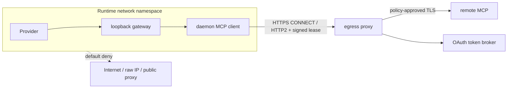
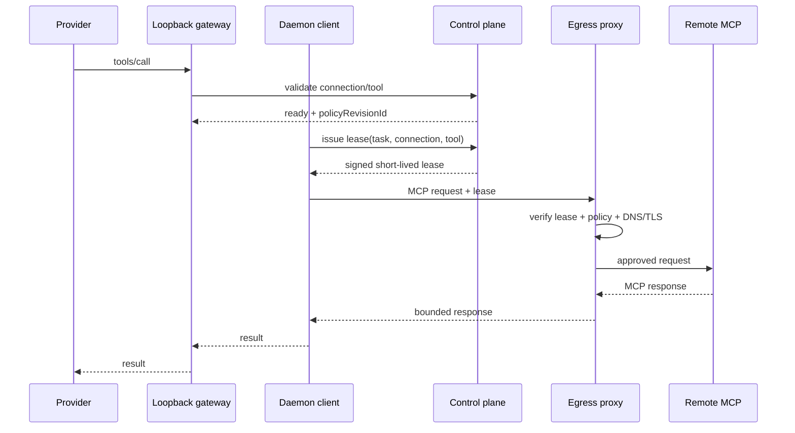

# 二层 egress 出口代理设计

> 状态：Proposed
>
> 目标：即使 Provider 或第三方 MCP 代码尝试绕过 daemon gateway，也无法直接访问未授权外部目标。

## 1. 术语澄清

本文的“二层”是纵深防御中的第二道出口控制：

1. 第一层：现有应用层 endpoint/header/schema 校验、DNS 重解析、私网/metadata 拒绝和 TLS socket pinning；
2. 第二层：基础设施网络默认拒绝 + L7 egress proxy 的 lease/policy 校验。

它不是“用以太网二层实现域名 allow-list”。域名、SNI、HTTP CONNECT 和 OAuth 注入都属于 L7；L3/L4 的职责是确保工作负载没有绕过 proxy 的其他路径。

## 2. 威胁模型

| 威胁 | 必须阻止的行为 |
| --- | --- |
| Provider 绕过 gateway | 直接请求 MCP endpoint、公共代理或原始 IP |
| DNS rebinding | allow-list 域名在校验后解析到私网、metadata 或新地址 |
| Redirect 绕过 | 上游将请求重定向到未授权 host/port |
| Proxy 滥用 | 没有 task/operation lease 的进程借 proxy 任意出网 |
| 租约重放 | 另一 task、connection、host 或过期时间复用 lease |
| 策略竞态 | connection disable/release yank 后旧 lease 继续长期有效 |
| IPv6/UDP 旁路 | 只封 IPv4/TCP，工作负载改用 IPv6、QUIC 或自建 DNS |
| 管理面突破 | Runtime 修改 iptables、network namespace、proxy 配置或 Docker 网络 |

## 3. 网络拓扑



网络层允许 Runtime 访问的目标只有：

- AgentSpace 控制面必要 API；
- models gateway 等既有批准目标；
- MCP egress proxy 的固定 service IP/port；
- DNS stub，且 DNS stub 自身执行策略并禁止任意外部 resolver。

Runtime 不获得 `NET_ADMIN`、Docker socket、宿主机网络 namespace、iptables/nftables 或自定义 route 能力。IPv4、IPv6 与 UDP 同时默认拒绝；MCP MVP 禁用 QUIC/HTTP3。

## 4. 组件

### 4.1 Policy compiler

控制面根据不可变 release 与 connection 配置生成不可变 policy revision：

```ts
interface McpEgressPolicyRevision {
  id: string;
  workspaceId: string;
  connectionId: string;
  releaseId: string;
  manifestDigest: string;
  allowedHosts: Array<{
    pattern: string;       // exact 或受审核的单级/后缀规则
    ports: number[];       // 远程 HTTPS 默认为 [443]
    resolvedCidrs?: string[];
  }>;
  denyPrivateNetworks: true;
  denyMetadata: true;
  redirectPolicy: "deny";
  tlsMode: "verify_system" | "verify_private_ca";
  authMode: "none" | "static_header" | "oauth_proxy";
  createdAt: string;
}
```

release 定义允许上限，connection 只能收窄，不能扩大。`allowedHosts`、port、TLS mode、auth mode 任一变化均产生新 revision 并使 connection 重新验证。

### 4.2 Lease issuer

只有已认证 daemon 能为现有 operation 或 task 申请 lease：

```ts
interface McpEgressLeaseClaims {
  iss: "agentspace-control-plane";
  aud: "mcp-egress-proxy";
  jti: string;
  workspaceId: string;
  runtimeId: string;
  connectionId: string;
  releaseId: string;
  policyRevisionId: string;
  purpose: "verify" | "health_check" | "task_call" | "oauth_refresh";
  taskId?: string;
  operationId?: string;
  toolName?: string;
  exp: number;
}
```

- 建议 TTL：验证 120 秒，健康检查 60 秒，工具调用 60 秒；
- `jti` 首次使用后绑定 proxy session，不能跨 session 重放；
- lease 只由 daemon 内存持有，不进入 Provider argv、env、文件、日志或 task bundle；
- connection disable、release yank、OAuth revoke 通过 deny cache/短 TTL 双重生效；
- proxy 不接受 workspace/runtime 等身份的客户端自报字段，只信签名 claims。

### 4.3 Egress proxy

proxy 负责：

1. 验证签名、audience、时钟、jti、purpose 与当前撤销状态；
2. 读取 policy revision，检查请求 host/port 与 connection 绑定；
3. 自行解析 DNS，拒绝任一私网、loopback、link-local、multicast、documentation、metadata 地址；
4. 将 socket 固定到检查后的地址，同时保留正确 SNI 与证书 hostname 验证；
5. 拒绝 redirect，限制 header、body、响应大小、并发、时长与空闲连接；
6. OAuth 模式下按 opaque credential reference 注入 Authorization；
7. 只记录结构化元数据，不记录 URL query、Authorization、工具参数或响应体。

推荐先实现专用 MCP forward proxy，而不是开放通用 `HTTP_PROXY`。客户端显式调用受控 proxy API：

```http
POST /v1/mcp/forward
Authorization: DofeEgressLease <lease>
X-Dofe-Upstream-Origin: https://mcp.example.com
X-Dofe-Connection-Id: mcp_conn_123
Content-Type: application/json
```

proxy 只转发 MCP 所需的 `POST/GET/DELETE` 与协议 header。不得支持任意 CONNECT、SOCKS、WebSocket 或用户自定义 proxy URL。

### 4.4 Revocation feed

proxy 维护短时本地 deny cache：

- `connection_id` disabled/removed；
- `release_id` yanked；
- `oauth_grant_id` revoked；
- `runtime_id` quarantined；
- 单个 `jti` 被撤销。

控制面推送失败时不放宽策略。缓存过期后无法确认有效状态的 lease fail closed。

## 5. 请求时序



lease 获取可以在 task session 创建时小批量预取，但必须绑定 connection，且高风险工具建议绑定 `toolName`。不得为整个 Runtime 发放通用出网 token。

### 5.1 Daemon 与 Provider 的凭据隔离

当前 Provider 由 daemon 在同一 Runtime 容器内启动，因此“lease 不写 argv/env/file”只是必要条件，不是充分条件。同 UID 进程在部分 Linux 配置下可能通过 `/proc`、`ptrace` 或 `process_vm_readv` 读取另一进程内存。

生产 enforce 前必须至少完成：

- lease、proxy connection 和 credential fd 一律 `close-on-exec`，不继承给 Provider；
- trusted daemon 设置 non-dumpable，Provider seccomp 明确拒绝 `ptrace`、`process_vm_readv/writev` 等跨进程读取；
- Provider 与 daemon 使用不同 UID，并限制 `/proc` 可见性；
- 容器负向测试从真实 Provider 身份读取 daemon `environ`、`fd`、`mem` 均失败；
- 中长期将 trusted daemon gateway 与 Provider worker 拆为独立容器/PID namespace，二者只通过 task-scoped loopback/Unix socket 协议交互。

在这项门禁完成前，egress proxy 只能作为 canary/observe 能力，不能宣称能抵御被攻陷 Provider 对 daemon 内存的主动窃取。

## 6. 部署模型

### 6.1 受管 node

- 每个 node 或可控故障域部署一组 egress proxy；
- Runtime 通过内部 service address 访问；
- proxy 使用独立非 root 身份、只读根文件系统、无 Docker socket；
- proxy 到外部的网络策略由基础设施管理，不由 Runtime Compose 动态生成；
- policy/signing key 通过现有 secret 管理注入，不写镜像。

### 6.2 本地与 CI

本地可使用 internal Docker network + fake upstream + proxy 完成确定性测试。需要真实公网的测试单独标记，不成为单元测试前置。

Docker Compose 只引用外部管理的 PostgreSQL、Redis、RabbitMQ，不创建这些服务、初始化 job 或 volume。

### 6.3 Kubernetes/生产建议

- namespace NetworkPolicy：Runtime 仅允许 control plane/models gateway/egress proxy；
- proxy namespace 的外连由 CNI egress policy、cloud firewall 或 egress gateway 控制；
- DNS 只允许 cluster DNS，禁止 53/853 到其他目标；
- 拒绝 IPv6 未管理路径；
- proxy 使用 topology spread 与 PDB，但安全策略不可因故障回退为直连。

## 7. 数据与 API

建议新增：

```text
mcp_egress_policy_revision
  id, workspace_id, connection_id, release_id, manifest_digest,
  policy_json, policy_digest, created_at

mcp_egress_lease_audit
  id, lease_jti_hash, workspace_id, runtime_id, connection_id,
  task_id, operation_id, purpose, policy_revision_id,
  issued_at, expires_at, first_used_at, outcome, safe_error_code

mcp_egress_request_audit
  id, lease_jti_hash, connection_id, task_id, upstream_host_hash,
  upstream_port, method, outcome, latency_ms, bytes_in_bucket,
  bytes_out_bucket, created_at
```

审计保存 host 可采用明文受控字段或 keyed hash，由合规要求决定；永远不保存完整 URL、query、header 值、body。

控制面 API：

```text
POST /api/daemon/mcp-egress/leases
POST /api/daemon/mcp-egress/leases/:jti/revoke
GET  /api/admin/mcp-egress/policies/:connectionId
GET  /api/admin/mcp-egress/audits?connectionId=&taskId=
```

## 8. 故障语义

| 故障 | 行为 |
| --- | --- |
| policy 不存在/摘要不匹配 | 拒绝，连接置 degraded |
| lease 过期/重放 | 拒绝，不自动换成长 TTL |
| proxy 不可用 | 调用失败，不回退直连 |
| DNS 多答案含私网 | 整体拒绝，不挑选“看起来安全”的答案 |
| TLS/SNI 不匹配 | 拒绝 |
| redirect | 拒绝并记录 `mcp.egress_redirect_denied` |
| OAuth 注入失败 | 拒绝；必要时触发 grant refresh/reconnect 状态 |
| 控制面撤销查询不可用 | 新 lease 不发；现有 lease 只活到短 TTL |

## 9. 发布门禁

以下必须全部提供容器内负向证据：

- 无 lease 访问 proxy 返回拒绝；
- 正确 lease 不能访问另一 connection 的 host；
- Provider 不能直连允许 host、阻止 host、原始 IPv4/IPv6、公网代理；
- DNS rebinding、私网多答案、redirect、非 443 端口被拒绝；
- lease 过期、jti 重放、connection disable、release yank 后调用被拒绝；
- proxy 故障时无直连 fallback；
- 日志扫描不出现 secret、Authorization、query 或测试 payload；
- Runtime 无 Docker socket、`NET_ADMIN`、iptables/nftables 修改权限。
- Provider 无法读取 daemon 的 lease、环境、fd 或进程内存。

## 10. 取舍

### 采用：专用 MCP proxy + policy lease

优点：调用身份细、能注入 OAuth、可审计、能区分 Provider 的无授权请求。缺点：需要理解 MCP streaming/session，并成为新的可用性组件。

### 不采用：只设置 `HTTP_PROXY`

环境变量对 Provider 同样可见，而且通用 proxy 无法可靠绑定 connection/tool，容易成为任意出口。

### 不采用：只靠 Docker network 名称或 label

名称和 label 是证明材料的索引，不是网络执行机制；现有验证只证明若干探针不可达，不能表达每个 catalog release 的 host policy。

### 不采用：控制面统一转发所有工具数据

会扩大敏感数据面、延迟和合规范围，违背控制面不承载 MCP payload 的既有边界。
