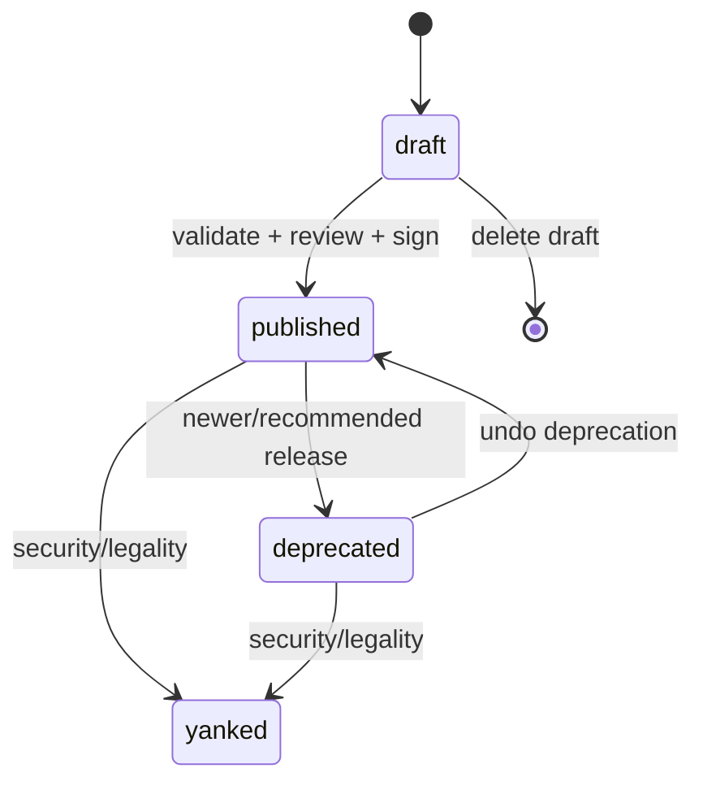

# MCP 目录不可变 release/version 设计

> 状态：Proposed
>
> 目标：目录发布可审计、连接可复现、升级可预览、回滚不依赖可变 latest。

## 1. 当前问题

当前 `mcp_catalog_item` 使用 `UNIQUE(workspace_id, slug)`，`version` 只是普通字段。服务层已经拒绝同 slug 覆写，这是正确的临时保护，但还不能：

- 为同一 MCP 服务发布多个版本；
- 区分稳定产品身份和一次发布；
- 固定连接使用的 manifest digest；
- 表达 draft/published/deprecated/yanked；
- 预览 host、工具、schema、OAuth scope、镜像等升级差异；
- 对 release 执行签名、回滚和供应链审计。

## 2. 决策

将目录拆为：

- `mcp_catalog_package`：稳定身份与发现元数据；
- `mcp_catalog_release`：不可变执行 manifest；
- `mcp_catalog_release_signature`：可选签名/审核凭证；
- `runtime_mcp_connection.catalog_release_id`：连接固定引用 release。

`version` 是人类可读的 SemVer；`manifest_digest` 才是执行、审计和去重的内容身份。

## 3. 数据模型

```sql
CREATE TABLE mcp_catalog_package (
  id TEXT PRIMARY KEY,
  scope TEXT NOT NULL,                   -- platform | workspace
  workspace_id TEXT NULL,
  namespace_key TEXT NOT NULL,           -- platform | workspace:<workspace_id>
  source TEXT NOT NULL,                  -- official | verified_partner | workspace_private
  slug TEXT NOT NULL,
  display_name TEXT NOT NULL,
  summary TEXT NOT NULL DEFAULT '',
  documentation_url TEXT,
  publisher_id TEXT,
  visibility TEXT NOT NULL,              -- public | workspace_private | hidden
  created_at TIMESTAMPTZ NOT NULL,
  updated_at TIMESTAMPTZ NOT NULL,
  UNIQUE(namespace_key, slug)
);

CREATE TABLE mcp_catalog_release (
  id TEXT PRIMARY KEY,
  package_id TEXT NOT NULL REFERENCES mcp_catalog_package(id),
  version TEXT NOT NULL,
  manifest_schema_version INTEGER NOT NULL,
  manifest_json JSONB NOT NULL,
  manifest_digest TEXT NOT NULL,
  lifecycle_status TEXT NOT NULL,        -- draft | published | deprecated | yanked
  compatibility_class TEXT NOT NULL,     -- compatible | approval_required | breaking
  release_notes TEXT NOT NULL DEFAULT '',
  published_at TIMESTAMPTZ,
  published_by_user_id TEXT,
  deprecated_at TIMESTAMPTZ,
  yanked_at TIMESTAMPTZ,
  safe_yank_reason TEXT,
  created_at TIMESTAMPTZ NOT NULL,
  UNIQUE(package_id, version),
  UNIQUE(package_id, manifest_digest)
);

CREATE TABLE mcp_catalog_release_signature (
  release_id TEXT NOT NULL REFERENCES mcp_catalog_release(id),
  signer_key_id TEXT NOT NULL,
  algorithm TEXT NOT NULL,
  signature TEXT NOT NULL,
  signed_at TIMESTAMPTZ NOT NULL,
  PRIMARY KEY(release_id, signer_key_id)
);
```

生产实现应使用现有迁移机制和命名规范；以上为逻辑 DDL，不表示在应用 Compose 中创建数据库服务。

`namespace_key` 避免 PostgreSQL 中 `NULL` 不互相冲突导致多个 platform slug 通过唯一约束。服务端必须校验 `scope=platform` 时其值为 `platform`，`scope=workspace` 时其值严格等于 `workspace:<workspace_id>`，调用方不能自由填写。

## 4. 不可变 manifest

```ts
interface McpReleaseManifestV1 {
  schemaVersion: 1;
  transport: "streamable_http" | "managed_stdio";
  endpoint?: {
    template: string;
    allowedHosts: string[];
    allowedPorts: number[];
    tlsMode: "verify_system" | "verify_private_ca";
  };
  configurationSchema: Record<string, unknown>;
  secretFields: string[];
  auth: {
    mode: "none" | "static_header" | "oauth";
    oauthProviderKey?: string;
    requiredScopes?: string[];
  };
  declaredTools: Array<{
    name: string;
    description: string;
    risk: "low" | "medium" | "high";
    inputSchemaDigest?: string;
  }>;
  defaultApprovedTools: string[];
  requiredRuntimeCapabilities: string[];
  dataDomains: string[];
  risk: "low" | "medium" | "high";
  managedTemplate?: {
    templateVersion: string;
    imageDigest: `sha256:${string}`;
    command: string[];
    resources: { cpuMillis: number; memoryMiB: number; pids: number };
    egressProfile: string;
    stateSchemaVersion: number;
  };
}
```

### 4.1 Canonical digest

发布前执行：

1. schema 校验和归一化；
2. JSON key 递归按 UTF-8 字节序排序；
3. 数组仅在语义声明为 set 时排序并去重，`command` 等有序数组保持顺序；
4. 拒绝浮点、非有限数、不支持字段和模糊默认值；
5. 以 UTF-8 编码 canonical JSON；
6. 计算 `sha256:<hex>`；
7. 签名内容至少覆盖 `package_id + version + manifest_digest + published_at`。

读取 published release 时重新计算 digest。数据库行与 digest 不一致视为完整性故障，禁止连接或升级。

## 5. 生命周期



- `draft` 可修改，但不能被连接引用；
- `published` 的 manifest、version、package 不可修改；
- `deprecated` 仍可供已连接实例运行和回滚，但默认不建议新装；
- `yanked` 禁止新连接和新 task lease；是否立即中止运行中调用由安全等级决定；
- published/yanked 行不可物理删除。

不可变性必须同时在服务与数据库执行：普通应用数据库角色没有更新 manifest/version/package/digest 的权限，或由 trigger 拒绝这些列在非 draft 状态下变化；只允许生命周期列按状态机更新。不能只依赖 TypeScript 服务层约定。

展示名、摘要、文档链接和分类属于 package 发现元数据，可以审计后修改，不进入 release digest。

## 6. 发布与升级 API

```text
POST /api/admin/mcp/packages
POST /api/admin/mcp/packages/:packageId/releases/drafts
PUT  /api/admin/mcp/releases/:releaseId/draft-manifest
POST /api/admin/mcp/releases/:releaseId/publish
POST /api/admin/mcp/releases/:releaseId/deprecate
POST /api/admin/mcp/releases/:releaseId/yank
GET  /api/admin/mcp/packages/:packageId/releases
GET  /api/admin/mcp/connections/:connectionId/upgrade-candidates
POST /api/admin/mcp/connections/:connectionId/upgrade
POST /api/admin/mcp/connections/:connectionId/rollback
```

所有状态变更需要幂等 key、actor、审计事件与 optimistic version。发布接口不能接受客户端提交的 digest 作为事实来源，服务端必须自己 canonicalize/hash。

## 7. 差异与兼容性

升级预览按安全语义分类，不只比较 SemVer：

| 变更 | 默认分类 | 行为 |
| --- | --- | --- |
| 描述、文档、分类 | 非 release 变更 | 不影响连接 |
| 减少 allowed host/port | approval_required | 重新验证，可能导致旧 endpoint 不可用 |
| 增加 allowed host/port | breaking/security expansion | 必须管理员确认 |
| 新增声明工具但默认不批准 | approval_required | 不自动授权 |
| 移除已批准工具 | breaking | 阻止升级，除非管理员调整工具范围 |
| 提高工具/服务风险 | breaking | 重新风险确认 |
| 新增必填配置或 secret | breaking | 进入待配置 |
| 增加 OAuth scope | breaking/security expansion | 必须重新 consent |
| image digest/command 变化 | approval_required | stdio 重新扫描、部署和验证 |
| state schema 不可逆迁移 | breaking | 禁止自动回滚，要求维护窗口 |

兼容性分类由服务端 diff engine 计算，发布者声明只能作为说明，不能降低计算结果。

## 8. 连接固定与升级状态机

连接新增：

```text
catalog_release_id NOT NULL
release_manifest_digest NOT NULL
desired_release_id NULL
upgrade_status NULL | planning | approval_required | verifying | ready | failed | rollback_required
previous_release_id NULL
```

升级流程：

```text
ready(old)
  -> plan diff(new)
  -> admin approval/config/OAuth consent
  -> desired_release_id = new
  -> 用 new release 创建新 policy 并验证
  -> 原子切换 active release
  -> 保留 previous_release_id 和验证证据
```

在验证成功前，旧 release 继续服务新任务；发生安全 yank 时例外，旧 release 立即停止领取新 lease。不得就地修改连接所引用 release 的 policy 字段。

## 9. Legacy 迁移

### Phase 1：扩展表

- 新建 package/release/signature；
- 为每个现有 `(workspace_id, slug)` 创建 package；
- 为每条旧 item 创建 release；空 version 使用 `0.0.0-legacy.1`，冲突时递增 suffix；
- canonicalize 当前安全字段生成 manifest 与 digest；
- release ID 可复用 legacy item ID 以降低追踪成本，但新旧字段仍分开迁移。

### Phase 2：双读与影子校验

- connection 增加 nullable `catalog_release_id` 和 digest；
- 服务同时读取 legacy item 和 release，比较所有执行字段；
- 不一致只告警，不自动修复；
- 新创建连接只写 release 引用。

### Phase 3：固定引用

- 完成 backfill 后设置 NOT NULL；
- claim、验证、市场详情全部从 release 读取执行字段；
- legacy `catalog_item_id` 保留只读一个发布周期。

### Phase 4：移除 legacy 路径

- 删除旧写接口和 slug-only lookup；
- 保留映射/审计表，避免历史审计失去解释能力；
- 最后再删除旧列，不级联删除 connection/audit。

## 10. 并发与幂等

- 同 package/version 只有一次发布成功；
- 同 digest 重复提交返回现有 release；
- publish 使用事务锁定 draft，并检查仍为 draft；
- upgrade 使用 connection revision compare-and-swap；
- 重试不得创建多个 active release 或多个升级 operation；
- task snapshot 在队列准备时固定 release/digest，重试沿用同一快照。

## 11. 验收

- published manifest 的任意字段 UPDATE 被数据库/服务拒绝；
- 同 slug 可以存在多个 release，同 package/version 不可重复；
- 旧连接不会因新 release 发布而变化；
- host/tool/scope 扩权必须人工批准；
- yanked release 不能创建连接或领取新 task lease；
- upgrade 失败保留旧 release，rollback 有完整审计；
- legacy backfill 前后 resolved policy 完全一致；
- 审计能定位 package、version、release ID、manifest digest 和 signer。
