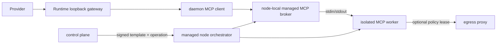
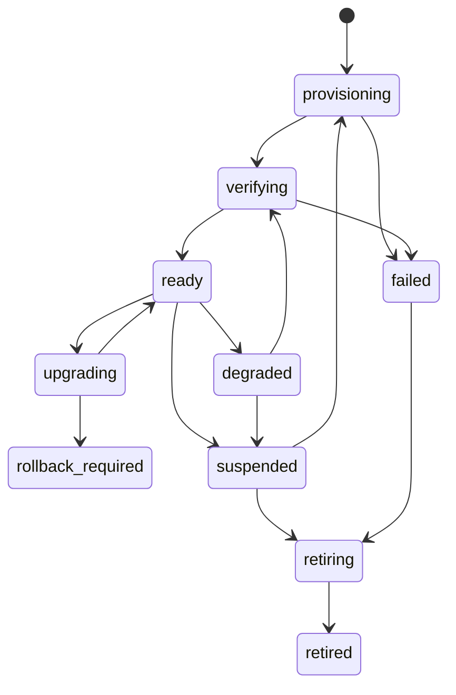

# 受管 stdio MCP 设计

> 状态：Proposed
>
> 目标：支持必须以本地进程运行的 MCP Server，同时不把第三方代码安装进 Provider Runtime 或宿主机。

## 1. 核心决策

`managed_stdio` 是一种受管部署类型，不是自由命令执行能力：

- 只接受 immutable release 中审核的模板；
- 镜像必须固定 digest，command 必须是参数数组；
- 每个 installation 在独立 worker 容器中运行；
- worker 的 stdin/stdout 由 node-local managed MCP broker 独占；
- daemon 通过 broker 暴露的内部 Streamable HTTP MCP 调用 worker；
- Provider 仍只看到现有 task-scoped loopback gateway；
- Runtime、worker 都不持有 Docker socket。

## 2. 为什么需要 broker

直接把 stdio 子进程放进 daemon/Runtime 会使第三方代码读取 Provider HOME、认证文件、任务状态卷、环境变量和同 UID 进程。由 broker 隔离后：

- stdio framing 和进程生命周期由受信组件管理；
- worker 只获得模板声明的最小配置；
- daemon 不需要执行任意安装命令；
- 一个崩溃/卡死的 Server 不拖垮 Provider Runtime；
- HTTP gateway、白名单、审计、撤销路径可以继续复用。

## 3. 架构



broker 与 worker 可以同 pod 的独立容器，也可以是 node-local broker 管理多个 worker。MVP 推荐“一实例一 worker + 节点级 broker”，并对 workspace/runtime/instance 做强身份隔离。

## 4. 模板契约

模板是 release manifest 的一部分：

```ts
interface ManagedStdioTemplateV1 {
  schemaVersion: 1;
  imageDigest: `sha256:${string}`;
  command: string[];
  workingDirectory: "/work" | "/state";
  environment: Array<{
    name: string;
    source: "literal" | "connection_config" | "secret_ref";
    required: boolean;
  }>;
  mounts: Array<{
    target: "/state" | `/data/${string}`;
    mode: "ro" | "rw";
    sourceType: "dedicated_state" | "approved_dataset";
  }>;
  resources: {
    cpuMillis: number;
    memoryMiB: number;
    pids: number;
    tmpfsMiB: number;
    maxStdoutBytesPerMinute: number;
  };
  health: {
    initializeTimeoutMs: number;
    toolsListTimeoutMs: number;
    startupGraceMs: number;
  };
  network: {
    mode: "none" | "egress_proxy_only";
    egressProfile?: string;
  };
  stateSchemaVersion: number;
  rollbackClass: "stateless" | "backward_compatible" | "irreversible_migration";
}
```

禁止：shell 字符串、可变 image tag、host path 任意挂载、privileged、host network、额外 capabilities、Docker socket、SSH agent、Provider credential 目录。

## 5. 数据模型

```text
managed_mcp_instance
  id, workspace_id, runtime_id, connection_id, release_id,
  template_version, image_digest, status, revision,
  desired_revision, node_id, broker_endpoint_ref,
  state_schema_version, last_health_at, last_error_code,
  created_at, updated_at

managed_mcp_operation
  id, instance_id, type, source, status, idempotency_key,
  request_snapshot_json, safe_result_json, requested_by,
  created_at, started_at, completed_at

managed_mcp_secret_binding
  instance_id, field_name, encrypted_secret_ref, revision,
  rotated_at
```

状态：



connection 只有在 instance `ready`、release 未 yanked、discovery/approved tools 新鲜时才能 `ready`。

## 6. 编排协议

控制面创建幂等 operation，managed node claim 后执行：

```text
provision -> start -> verify -> suspend -> resume -> upgrade -> rollback -> retire
```

claim payload 只包含：固定 template、release/digest、instance revision、短期 secret lease、资源限制和预期结果。不得包含任意 shell 或控制面数据库凭据。

managed node 的 Docker socket 权限仅用于受管编排器本身；broker、worker、Runtime 均不挂载 socket。编排器必须校验最终容器 spec 与模板完全一致，拒绝额外 mount/env/capability/network。

## 7. Broker 协议

broker 对 daemon 暴露内部 MCP endpoint，但不是开放目录代理：

- endpoint 仅在私有网络或受控 Unix socket 上；
- daemon 使用绑定 `runtime_id + instance_id + task/operation` 的短期 broker lease；
- broker 将 MCP JSON-RPC 映射到单一 worker stdio；
- 限制 message size、并发请求、server notification、日志速率和 session TTL；
- stderr 只保留脱敏尾部，stdout 只解析 MCP protocol，不写业务日志；
- worker 退出、协议污染或超限后关闭 session 并将 instance degraded；
- broker 绝不把 worker endpoint 或 lease 暴露给 Provider。

## 8. Secret 与状态

- secret 在 worker 启动前通过一次性 lease 获取；
- 优先通过内存文件/tmpfs 或受限 fd 注入，避免长期 env；
- 不写镜像层、container inspect 可见 label、operation JSON 或持久卷；
- 日志脱敏字典包含本次注入值和常见编码形式；
- 每个 instance 使用独立 state volume，只挂载 `/state`；
- 无状态模板不创建持久卷；
- 升级前按 rollback class 决定 snapshot/备份策略；
- 不可逆 migration 必须维护窗口和显式二次确认。

## 9. 网络

- `network.mode=none`：完全无网络；
- `egress_proxy_only`：worker 只能访问 egress proxy 和 broker 必要地址；
- release egress profile 只定义上限，connection 可进一步收窄；
- worker 不获得通用 proxy 凭据，每次出网由 broker/sidecar 使用短期 policy lease；
- DNS、IPv6、UDP 与原始 IP 旁路要求同 egress 方案；
- 依赖 PostgreSQL、Redis、RabbitMQ 的 MCP 模板只接受外部服务配置，不在应用 Dockerfile/Compose 创建依赖服务。

## 10. 供应链门禁

发布 `managed_stdio` release 前：

- image digest 存在且架构兼容；
- SBOM、许可证、漏洞和恶意行为扫描通过；
- command 不经 shell；
- 容器以非 root、只读 rootfs、cap_drop ALL、no-new-privileges 运行；
- 无 setuid binary、Docker client/socket、包管理器运行时安装；
- 模板 schema、工具声明与实际 discovery 对比通过；
- 网络和文件系统负向探针通过；
- 资源超限、stdout flood、fork bomb、hang、crash 的恢复测试通过。

## 11. 升级与回滚

采用 replace，不在运行中容器内更新：

1. 创建 desired revision 的新 worker；
2. 注入新 revision 配置并验证；
3. 比较 discovery tools/schema；
4. 管理员确认新增工具/风险；
5. broker 原子切换新 session；
6. 排空旧 session；
7. 保留旧 worker 到 rollback window 结束后销毁。

stateful worker 只有声明 backward compatible 才允许蓝绿共享/复制状态；不可逆迁移不提供自动回滚承诺。

## 12. 验收

- Runtime/Provider/worker 均看不到 Docker socket；
- worker 无法读取 Runtime HOME、Provider auth、其他 instance state；
- 可变 tag、shell command、额外 mount/capability 被拒绝；
- broker lease 不能跨 runtime/instance/task 使用；
- worker crash/hang/flood 不影响 daemon 主循环；
- connection disable 或 release yank 阻止新 broker session；
- 无网络模板确实不能出网；proxy-only 模板不能直连；
- upgrade 验证失败保持旧 revision；
- retire 清除容器、lease、tmpfs secret，持久状态按保留策略处理并留审计。
