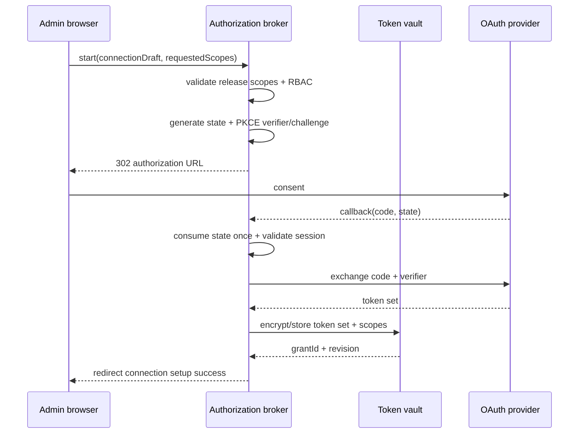
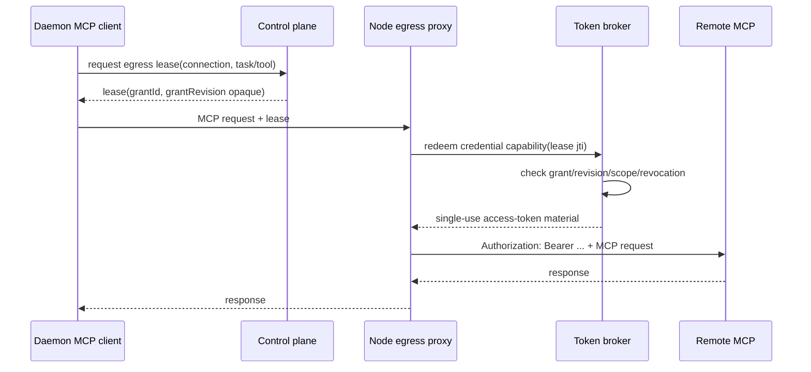

# OAuth 授权与凭据代理设计

> 状态：Proposed
>
> 目标：支持审核的 OAuth MCP，同时让 refresh token 永远不进入浏览器持久存储、Provider、Runtime 文件或普通审计。

## 1. 组件拆分

OAuth 能力拆成三个职责：

1. **Authorization broker（控制面）**：发起 consent、校验 state/PKCE、处理 callback；
2. **Token vault/broker（控制面受限域）**：加密保存 refresh/access token，刷新、撤销、scope 核对；
3. **Credential injection（节点 egress proxy）**：凭短期 lease 获取一次性注入材料，向批准上游添加 Authorization。

浏览器只得到授权状态；daemon 只得到 opaque `oauthGrantId/revision` 与 egress lease；Provider 不得到任何 OAuth token。

## 2. OAuth provider 定义

OAuth 不是工作区自由填写的 token endpoint。定义必须是审核、版本化的 release 引用：

```ts
interface McpOAuthProviderDefinitionV1 {
  key: string;
  issuer?: string;
  authorizationEndpoint: string;
  tokenEndpoint: string;
  revocationEndpoint?: string;
  jwksUri?: string;
  clientRegistration: "platform_managed" | "workspace_managed";
  tokenAuthMethod: "client_secret_basic" | "client_secret_post" | "private_key_jwt";
  pkceRequired: true;
  allowedScopes: string[];
  defaultScopes: string[];
  audience?: string;
  resource?: string;
  accessTokenPlacement: "authorization_bearer";
}
```

- endpoint 必须 HTTPS、固定 host，并走专用 OAuth egress policy；
- 不支持 implicit flow、password grant、token 放 query；
- 默认 Authorization Code + PKCE S256；
- client secret/private key 保存在平台密钥管理中，不进入 package manifest；
- 动态客户端注册留到后续，MVP 只支持预注册 provider。

## 3. 数据模型

```text
mcp_oauth_provider
  id, provider_key, definition_version, definition_json,
  definition_digest, status, created_at, published_at

mcp_oauth_authorization_session
  id, workspace_id, user_id, connection_draft_id,
  provider_id, state_hash, pkce_verifier_encrypted,
  requested_scopes_json, redirect_uri,
  expires_at, consumed_at, status

mcp_oauth_grant
  id, workspace_id, subject_type, subject_id, provider_id,
  status, granted_scopes_json, provider_subject_hash,
  credential_ciphertext, key_version, revision,
  access_token_expires_at, last_refreshed_at,
  revoked_at, created_at, updated_at

mcp_oauth_connection_binding
  connection_id, grant_id, required_scopes_json,
  bound_grant_revision, created_at, updated_at

mcp_oauth_audit
  id, workspace_id, grant_id, connection_id, actor_id,
  event_type, scopes_json, safe_error_code, created_at
```

`credential_ciphertext` 是包含 token set 的加密 envelope；任何通用 read API 都不得返回。provider subject 使用 keyed hash，除非产品明确需要展示账号标识。

## 4. 授权流程



安全要求：

- state 至少 128 bit，库中只存 hash，单次消费，10 分钟内过期；
- PKCE verifier 加密保存，仅 callback handler 可读取，使用后删除；
- redirect URI 固定 allow-list，不接受请求参数覆盖；
- callback 不把 code/token 写日志、URL history 或错误追踪；
- callback 成功不自动把所有 tools/scopes 批准给 connection；
- 授权 actor 必须有管理 MCP 权限；用户级 grant 还要绑定实际 user subject。

## 5. Scope 规则

有效 scope 必须满足：

```text
requiredScopes(release)
  ⊆ requestedScopes(admin)
  ⊆ allowedScopes(provider definition)
  ⊆ grantedScopes(provider response)
```

- release 新增 scope 是 breaking/security expansion；
- connection 升级不能静默复用不足或更宽的旧 consent；
- provider 返回额外 scope 时可以保存实际集合，但 connection policy 只使用所需集合；
- scope 降低可通过新 grant revision 或 provider 支持的 downscope 完成；
- UI 显示人类可理解的权限说明，不展示 token。

## 6. 运行时凭据注入

推荐数据路径：



token broker 不把 refresh token发给 proxy；access token只在 proxy 请求内存中短暂存在。proxy 日志必须在 header 解析前后都执行结构化拒绝，禁止 dump request headers。

如果一期实现尚不能让 proxy 注入，可临时向受信 daemon 发放短 TTL access token，但必须满足：不进入 Provider、文件、argv、env、审计，并明确标记为过渡架构。refresh token 仍不得离开 vault。

## 7. Refresh、撤销与失效

### Refresh

- 在 token 过期前由 token broker 单飞刷新，同 grant 并发请求只执行一次；
- refresh response 必须处理 refresh token rotation，并原子替换旧 envelope；
- 失败分类为 transient、interaction_required、revoked、scope_changed；
- transient 使用有限退避；interaction_required 将 connection 置 `pending_authorization`；
- 不无限重试 invalid_grant。

### Revoke

管理员解除授权时：

1. 原子将 grant 标记 revoked 并递增 revision；
2. 使相关 connection 失去 ready 资格；
3. 推送 egress deny；
4. 尝试调用 provider revocation endpoint；
5. 无论远程 revoke 成功与否，本地都禁止继续使用；
6. 删除/加密擦除 token envelope，保留非敏感审计。

### Release/connection 变化

- release yanked：不发新 lease；
- connection disabled：不发新 lease，正在调用在短 TTL 后终止；
- scopes 改变：旧 binding 不再满足，要求重新授权；
- workspace 成员离开：其 user grant 立即 revoke；
- platform client secret 轮换：不要求用户重新 consent，除 provider 限制外。

## 8. 多租户与授权主体

支持两类 grant：

| subject | 用途 | 规则 |
| --- | --- | --- |
| `workspace` | 共享服务账号，由管理员授权 | 所有获准任务共享，但审计仍记录 task/actor |
| `user` | 代表具体用户访问其个人数据 | task actor 必须匹配 binding，不可被其他用户复用 |

第一期若任务 actor 语义不完整，只开放 workspace grant。不能把 user grant 降级为 workspace 共享凭据。

所有查询和唯一键都带 workspace；callback session 同时绑定 workspace、actor、connection draft 和 provider。

## 9. 审计与隐私

记录：授权发起/成功/失败、scope 集合、grant revision、refresh 结果分类、绑定/解绑、撤销 actor、关联 connection。

不记录：authorization code、state 原值、PKCE verifier、client secret、access/refresh/id token、完整 provider subject、Authorization header、callback query。

错误消息使用稳定 code：

```text
mcp.oauth.state_invalid
mcp.oauth.session_expired
mcp.oauth.exchange_failed
mcp.oauth.scope_insufficient
mcp.oauth.interaction_required
mcp.oauth.grant_revoked
mcp.oauth.provider_unavailable
mcp.oauth.injection_failed
```

## 10. API

```text
POST /api/workspaces/:workspaceId/mcp/oauth/sessions
GET  /api/mcp/oauth/callback/:providerKey
GET  /api/workspaces/:workspaceId/mcp/oauth/grants
POST /api/workspaces/:workspaceId/mcp/connections/:id/oauth-binding
DELETE /api/workspaces/:workspaceId/mcp/oauth/grants/:grantId

POST /api/internal/mcp/oauth/credential-capabilities
POST /api/internal/mcp/oauth/credential-capabilities/:id/redeem
```

内部 redeem 必须绑定 egress proxy workload identity、lease jti、connection、grant revision 和一次性 nonce。普通 daemon/browser API 无 token read 端点。

## 11. 验收

- state 重放、过期、跨 workspace、跨 connection callback 被拒绝；
- PKCE、固定 redirect URI 和 scope 子集校验完整；
- Provider、Runtime 文件、argv/env、普通日志中扫描不到 token；
- refresh token rotation 原子，不会并发覆盖新 token；
- revoke 后新 lease 立即失败，旧 lease 在 SLA/TTL 内失效；
- user grant 不能被另一 actor 使用；
- release 新增 scope 强制重新 consent；
- provider 不可用时 fail closed，不回退静态 token；
- OAuth endpoint 出网同样经过专用 egress policy；
- token vault 密钥轮换有恢复演练和审计。
