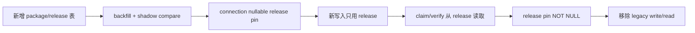

# MCP 安装与治理实施路线

> 状态：Proposed
>
> 原则：四项工程独立立项、独立 feature flag、独立回滚；先冻结契约和数据，再开放生产流量。

## 1. 工作流拆分

| 工作流 | 交付物 | 首个可发布结果 | 依赖 |
| --- | --- | --- | --- |
| A. Immutable catalog | package/release schema、manifest、diff、迁移、升级 | 远程静态 MCP 连接固定 release | 无 |
| B. Egress proxy | policy compiler、lease、proxy、network policy、evidence | 远程 MCP 无直连旁路 | A 的 release ID 契约，可先 stub |
| C. Category/filter | taxonomy、assignment、服务端查询、URL/UI | 可运营市场发现 | A 的 package ID |
| D. Managed stdio | template、worker、broker、编排、升级 | 审核 stdio MCP 内测 | A；有外网时依赖 B |
| E. OAuth | provider、consent、vault、refresh/revoke、注入 | 审核 OAuth MCP 内测 | A + B injection |

工程所有者可以并行，但共享契约必须先合并：`package_id`、`release_id`、`manifest_digest`、`connection_id`、`policy_revision_id`、`lease` claims。

## 2. Phase 0：基线冻结与契约（1 个迭代）

### 交付

- 冻结 manifest v1、canonical JSON 与 error code；
- 定义 package/release、policy/lease、managed instance、OAuth grant domain types；
- 为现有连接生成 resolved-policy golden fixtures；
- 为所有新表和 API 定义 workspace/RBAC/审计约束；
- feature flags：
  - `MCP_IMMUTABLE_RELEASES_SHADOW`
  - `MCP_EGRESS_PROXY_ENFORCE`
  - `MCP_MARKET_TAXONOMY_V1`
  - `MCP_MANAGED_STDIO_ENABLED`
  - `MCP_OAUTH_BROKER_ENABLED`

### Exit gate

- schema/contract review 通过；
- legacy fixtures 可 canonicalize，digest 稳定；
- 没有代码路径把 `latest`、可变 tag、任意 command 当执行标识；
- 现有远程 MCP 行为无变化。

## 3. Phase 1：不可变目录与分类基础（2 个迭代）

### A. Catalog

1. 新增 package/release/signature 表与 domain types；
2. backfill legacy item 到 `0.0.0-legacy.*` release；
3. 双读并 shadow compare resolved policy；
4. 新发布只写 release；
5. connection 新增 nullable release pin；
6. 发布/弃用/yank/diff API；
7. 影子期无不一致后切换读路径。

### C. Category

1. seed taxonomy v1；
2. backfill 所有 package 主分类，未知进入 `other`；
3. 服务端 search/facet/cursor API；
4. 市场 UI 改为 URL 状态；
5. taxonomy 审计与 retired replacement。

### Exit gate

- 每个 connection 能解析到唯一 release/digest；
- 发布新 release 不改变旧连接；
- package 分类变更不改变 release digest；
- legacy 与 release resolved policy 逐字段一致；
- 市场 ACL、分页、facet 组合测试通过。

## 4. Phase 2：Egress observe 与 enforce（2 至 3 个迭代）

### Observe

- 部署 proxy，但现有路径仍直连；
- policy compiler 影子生成 revision；
- 测试 task 同时记录“若 enforce 是否允许”，不复制业务 payload；
- 对 host、DNS、port、auth mode 不一致告警；
- 建立 proxy SLO、容量与撤销 feed。

### Enforce canary

- 仅 fake/test MCP 和内部 canary workspace 走 proxy；
- Runtime 网络切为默认拒绝；
- 执行全部 raw IP/IPv6/public proxy/DNS/redirect 负向探针；
- 逐 Runtime/daemon node 灰度，不全局一键切换；
- proxy 故障验证 fail closed。

### Exit gate

- 100% canary MCP 流量带可验证 lease；
- Provider 无 lease 不能访问 proxy 或任何公网目标；
- 真实 Provider 身份不能读取 daemon `/proc`、fd 或进程内存中的 lease；
- connection disable/release yank 满足撤销 SLA；
- proxy p95 额外延迟、错误率、session 稳定性达到既定 SLO；
- 日志与 evidence 无敏感 payload。

远程 MCP “任务可调用”GA 必须以本阶段通过为网络前置，真实 CLI E2E 仍需按原 MCP 文档单独通过。

## 5. Phase 3：受管 stdio 内测（3 个迭代）

1. 只实现 `network=none` 的无状态模板；
2. 实现 managed node operation 与 spec validator；
3. 实现 broker stdio/HTTP 转换、资源限制和 crash recovery；
4. 实现独立 instance 状态、活动页和 retire；
5. 再开放 `egress_proxy_only`；
6. 最后实现蓝绿 upgrade/rollback 和 stateful 模板。

### Exit gate

- 两个审核模板完成生命周期 E2E；
- worker 逃逸面、文件系统、进程、网络、资源负向测试通过；
- worker/broker/managed node 任一重启都有确定恢复状态；
- 升级失败保持旧 revision；
- Docker socket 只存在于 managed node 编排器。

## 6. Phase 4：OAuth 内测（2 至 3 个迭代）

1. 先支持一个预注册 provider、workspace grant、固定 scope；
2. 完成 PKCE/state/callback/vault；
3. 完成 egress proxy credential capability redeem；
4. 完成 refresh rotation、interaction_required 和 revoke；
5. 完成 release scope diff 与重新 consent；
6. actor 语义成熟后再开放 user grant。

### Exit gate

- OAuth 安全测试和跨租户测试通过；
- token 全链路泄漏扫描为零；
- revoke/成员移除/connection disable 的行为可证明；
- access token 注入仅发生在 node proxy 内存；
- token broker/外部 provider 故障 fail closed。

## 7. 数据迁移顺序

规则：

- 每步可独立回退到上一读路径；
- 不级联删除历史 connection/discovery/audit；
- backfill 分批、幂等、有 checkpoint；
- 不一致进入 quarantine report，禁止自动猜测；
- schema expand 与 contract 分不同发布完成；
- 大表索引按生产数据库支持的 online/concurrent 方式执行。

## 8. 测试策略

### 单元

- canonical digest golden tests；
- release diff/compatibility；
- taxonomy/facet query；
- policy compile/host rules；
- lease claims/replay/expiry；
- OAuth state/scope/token rotation；
- managed template/spec validation。

### 服务集成

- package/release/connection 事务与并发；
- legacy shadow compare；
- publish/yank/upgrade/rollback；
- OAuth callback/revoke 使用 fake provider；
- broker 使用 deterministic fake stdio MCP；
- egress proxy 使用 fake DNS、TLS、redirect 和 upstream。

### 容器安全集成

- Runtime direct egress、raw IP、IPv6、UDP、public proxy 全部失败；
- stdio worker 跨 volume、Runtime HOME、Docker socket、capability 访问失败；
- proxy/broker/worker 故障不触发直连 fallback；
- 日志/inspect/env/argv/volume 扫描无 secret。

### UI E2E

- 分类筛选 URL、返回/前进、0 结果；
- current vs recommended release；
- breaking upgrade 确认与失败回退；
- OAuth consent/cancel/expired/reconnect/revoke；
- managed stdio provision/health/upgrade/retire。

测试遵守仓库资源限制：优先最小相关测试；单 API Jest 文件使用 `--runInBand`；全量 pnpm/Turbo/Jest 必须限制 concurrency/max workers 为 2。

## 9. 发布、回滚与 feature flag

| 能力 | 开启条件 | 回滚 |
| --- | --- | --- |
| immutable read | shadow compare 零差异 | 回 legacy read，保留双写数据 |
| taxonomy UI | backfill 完成、ACL/URL 测试通过 | 回旧筛选，保留 assignment |
| egress enforce | canary evidence + SLO | 关闭该 Runtime MCP 资格；不得回退直连 |
| managed stdio | template allow-list + node capacity | suspend instances，远程 MCP 不受影响 |
| OAuth | provider allow-list + vault/injection gate | 禁止新授权，现有 grant revoke/冻结 |

安全能力的“回滚”不能降低边界。例如 egress proxy 故障时的回滚是关闭 MCP 调用或将连接 degraded，不是恢复无约束直连。

## 10. 可观测性与 SLO

| 组件 | 指标 |
| --- | --- |
| catalog | publish latency、digest mismatch、shadow diff、upgrade outcome |
| market | query latency、facet 0-result、taxonomy other ratio、ACL denial |
| egress | lease issue/reject、policy deny、DNS/TLS failure、proxy p95、active streams |
| stdio | provision time、startup failure、restart count、resource kill、broker latency |
| OAuth | consent success、state reject、refresh success、interaction_required、revoke latency |

所有 metric label 避免 workspace 名、endpoint、tool 参数和 token 等高基数/敏感值。connection/release 可使用受控 ID 或 hash。

## 11. 上线清单

- [ ] published release 真正不可变，连接固定 digest
- [ ] legacy backfill 与 shadow compare 报告归零
- [ ] taxonomy ACL、facet、URL 和国际化稳定
- [ ] Runtime 网络默认拒绝，proxy lease 负向证据通过
- [ ] Provider 不持有 endpoint、proxy/OAuth 凭据
- [ ] stdio worker 固定 digest、无 socket、无 host mount、资源受限
- [ ] OAuth PKCE/state/scope/revoke/token rotation 通过
- [ ] disable/yank/revoke 在 SLA 内阻断调用
- [ ] 审计可还原 release/policy/discovery，不含工具 payload
- [ ] Docker/Compose 未创建 PostgreSQL、Redis、RabbitMQ
- [ ] 本地未启动或触发 Jenkins；部署按另行提供的非 Jenkins 工作流执行

## 12. 建议的首批工程任务

1. 在 domain package 定义 release manifest、execution pin、policy revision 和 lease claims；
2. 增加 package/release 表和只读 backfill report，不切换生产读路径；
3. 为现有 catalog fixtures 生成 digest golden tests；
4. 实现 release diff engine，先覆盖 host/tool/schema/scope/image；
5. 建立 egress proxy fake upstream prototype 与无 lease/跨 host 负向测试；
6. seed taxonomy v1，将现有条目全部归到 primary/other；
7. 用一个无网络、无状态 fake stdio MCP 验证 broker 生命周期；
8. 用一个 fake OAuth provider 验证 PKCE、rotation、revoke 和 credential injection 契约。

这些任务完成后再分别建立生产实现 Epic，避免先写 UI 或编排代码后反复修改标识与安全契约。
