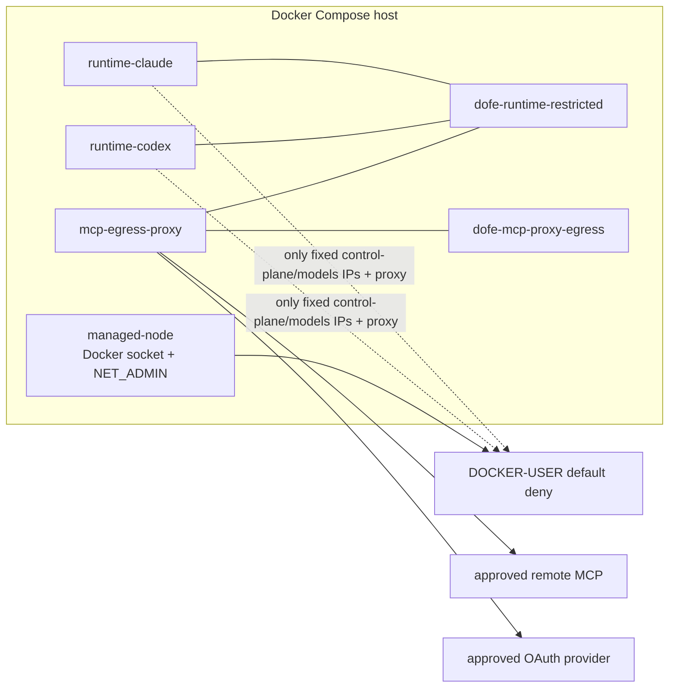

# Docker Compose 网络拓扑与出口强制

> 状态：Phase 0/1/2 已实施，managed-node entrypoint 已在 Runtime 启动前调用 `reconcile-runtime-egress.sh`
>
> 目标：保证 Runtime 只能直连固定控制面目标和 proxy，不能绕过 proxy 访问任意 MCP/public proxy/raw IP。

## 1. 先决结论

Docker Compose 自身能创建网络与隔离网络，但不能按域名可靠实现 egress allow-list。因此生产的远程控制面模式必须组合：

1. Compose 自定义 bridge network；
2. 宿主机 `DOCKER-USER` 防火墙默认拒绝；
3. `mcp-egress-proxy` 的 L7 policy + lease 校验；
4. 现有 egress release gate 的容器探针证据。

网络 label `dofe.managed-egress=restricted` 是部署证明的标记，不是安全策略本身。

## 2. 推荐模式：远程控制面

这是 AgentSpace 当前受管 node 的主要形态：daemon 需要访问远程控制面/models gateway，同时 MCP endpoint 是动态目录配置的公网目标。



### 2.1 Compose service boundary

以下是拓扑示意，不应原样复制到生产；实际 image tag、env、secret 入口和 TLS 配置由部署配置明确提供。

**已实施的 Compose 文件**：

- proxy service: [`deploy/daemon/docker-compose.mcp-egress.yml`](../../../deploy/daemon/docker-compose.mcp-egress.yml)
- runtime networks: [`deploy/daemon/docker-compose.runtimes.yml`](../../../deploy/daemon/docker-compose.runtimes.yml)

```yaml
services:
  mcp-egress-proxy:
    image: dofe/mcp-egress-proxy:${MCP_EGRESS_PROXY_IMAGE_TAG}
    restart: unless-stopped
    read_only: true
    user: "10001:10001"
    tmpfs:
      - /tmp
    security_opt:
      - no-new-privileges:true
    cap_drop:
      - ALL
    networks:
      dofe-runtime-restricted: {}
      dofe-mcp-proxy-egress: {}
    expose:
      - "8080"
    # No ports, Docker socket, host network, NET_ADMIN, Runtime volume,
    # Provider credential mount, database URL, HTTP_PROXY or HTTPS_PROXY.

  runtime-claude:
    networks:
      dofe-runtime-restricted: {}

networks:
  dofe-runtime-restricted:
    name: dofe-runtime-restricted
    driver: bridge
    labels:
      dofe.managed-egress: restricted
  dofe-mcp-proxy-egress:
    name: dofe-mcp-proxy-egress
    driver: bridge
```

proxy 不发布 host port。Runtime 只用 Docker DNS 名 `mcp-egress-proxy:8080` 调用它；外部服务不能通过宿主机端口进入 proxy。

当前 Compose 固定 restricted subnet 与 proxy ingress IP，并将 proxy 的 egress network 设置为更高 `gw_priority`，避免 proxy 上游请求从 Runtime subnet 发出后被 `DOCKER-USER` 默认拒绝规则误伤。proxy 的 policy/revoke 与 JTI/session 状态保存在 UID 10001 可写的单副本 volume；验签只挂载 Ed25519 公钥。

### 2.2 宿主机防火墙责任

只有现有 `managed-node` 编排器可以在宿主机维护 `DOCKER-USER` 规则。规则逻辑必须为：

```text
runtime subnet -> proxy runtime-network IP:8080                  ACCEPT
runtime subnet -> configured control-plane IP:443                ACCEPT
runtime subnet -> configured models-gateway IP:443               ACCEPT
runtime subnet -> DNS resolver IP:53/853 (如已明确需要)          ACCEPT
runtime subnet -> any other IPv4/IPv6/TCP/UDP                    DROP

proxy egress subnet -> external network                          仅由 proxy 自身 L7 policy 决定
```

**已实施的脚本**：[`deploy/daemon/reconcile-runtime-egress.sh`](../../../deploy/daemon/reconcile-runtime-egress.sh) 通过 `RUNTIME_SUBNET`、`PROXY_RUNTIME_IP`、`CONTROL_PLANE_IPV4`、`MODELS_GATEWAY_IPV4`、`DNS_RESOLVER_IPV4` 生成上述规则，并支持 `apply`/`remove`。

所有放行规则应在连接追踪的 `ESTABLISHED,RELATED` 规则之后，并在默认 `DROP` 规则之前；该细节由受管 node 的幂等防火墙 reconciler 负责。Runtime 无权调用 iptables/nftables，proxy 也无此权限。

### 2.3 IPv6、DNS 与绕过

- Runtime subnet 的 IPv6 默认拒绝，直到有等价 IPv6 policy 和验证；
- UDP 默认拒绝，MCP 首期禁用 QUIC/HTTP3；
- 不允许 Runtime 自定义 `HTTP_PROXY`、`HTTPS_PROXY`、`ALL_PROXY`、`NO_PROXY`；
- 若 daemon 需要 DNS，resolver 只能是受控地址；MCP 上游 DNS 由 proxy 自己解析并校验；
- 任何 Runtime 到公网 80/443 的直连探针都必须失败，包括允许 MCP host 的原始 IP。

## 3. 本地一体化模式：全部关键服务同网

当控制面和 models gateway 都作为同一 Compose stack 的内部服务时，可使用更强但适用面更窄的模式：

```text
runtime-* + web/control-plane + models-gateway + mcp-egress-proxy
  -> dofe-runtime-internal (internal: true)

mcp-egress-proxy
  -> dofe-runtime-internal + dofe-mcp-proxy-egress
```

此时 Runtime 在 Docker 层没有默认外网路由，proxy 是唯一双网卡服务。该模式不适用于控制面仅存在于远程地址的当前节点；不要为了使用 `internal: true` 而让 Runtime 失去控制面连通性。

## 4. 为什么不能只靠 Compose

| 做法 | 缺口 |
| --- | --- |
| 默认 `bridge` | Runtime 仍可任意出网 |
| 网络 label | 只是声明，不执行过滤 |
| `internal: true` | 远程控制面/models gateway 不可达 |
| `HTTP_PROXY` | Provider 可见、可滥用，也不能确保没有直连 |
| proxy 仅双网卡 | Runtime 仍可通过自己的 bridge 网关出网 |
| 单元测试通过 | 不能证明容器/宿主机真实没有旁路 |

## 5. 运行操作要求

- 防火墙 reconciler 必须在启动 Runtime 之前安装规则；不能先起 Runtime 后异步补规则；
- proxy ready 前，Runtime 不得标记为可使用 MCP；
- proxy 重启或 policy cache 不可用时，MCP connection 变为 degraded，不直连；
- 新 proxy image 先在 canary node 验证全部负向探针，再逐节点升级；
- 不把 PostgreSQL、Redis、RabbitMQ 添加到此 Compose 文件；控制面与 proxy 都使用既有外部服务配置。
