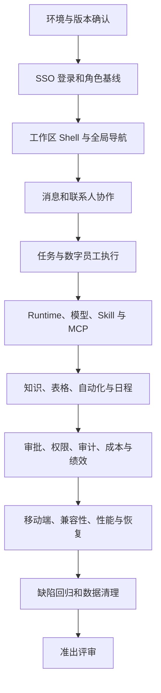

# 01. AgentSpace 全量测试流程

## 1. 测试目标

以 `13800138000` 的真实登录态验证以下事项：

1. 用户能通过 Dofe SSO 安全进入正确工作区，并只看到当前角色允许的资源。
2. 用户能从消息发起工作，经过任务、数字员工、Runtime、技能、审批和产物回写形成闭环。
3. 页面状态、侧栏计数、审计事件、成本与绩效在跨模块操作后保持一致。
4. 失败、离线、权限不足、重复提交和刷新恢复等异常路径给出可理解、可恢复的结果。
5. 桌面端和移动端的核心旅程可完成，不出现内容遮挡、状态丢失或误触高风险动作。

## 2. 测试边界

### 2.1 包含

- Web 用户界面、Next 路由/API、服务层与 PostgreSQL 数据落盘。
- SSO、飞书、模型服务、Daemon/Runtime、Skill/MCP 等已配置测试依赖。
- 角色可见性、服务端授权、审计、错误处理和数据恢复。
- 现有 Vitest/Node/Playwright 自动化与人工浏览器验收。

### 2.2 不包含

- 生产环境验证和生产账号操作。
- 未经授权的真实外部群、真实客户数据或计费资源。
- 本工作站上的 Jenkins 启动、配置、构建或部署。
- 对 PostgreSQL、Redis、RabbitMQ 的本地部署改造。

## 3. 角色判定与分支

测试账号名称为“测试管理员”不等于已证明具备所有权限。首次登录必须在测试记录中写明：

| 项目 | 记录内容 |
| --- | --- |
| SSO 身份 | 手机号后四位、显示名、账号启用状态 |
| 当前工作区 | 名称、slug、是否有多个可切换工作区 |
| 工作区角色 | `member`、`admin` 或 `owner` |
| 平台权限 | 是否为 `platform admin` |
| Runtime 模式 | `local` 或 `remote` |
| 外部依赖 | SSO、模型服务、Daemon、飞书、MCP 是否已配置 |

执行规则：

- 当前角色有权限：执行正向、异常、重复提交和刷新恢复测试。
- 当前角色无权限：验证入口隐藏、深链拒绝和服务端 action/API 拒绝，结果记为“通过”，不是“不适用”。
- 需要更高角色才能产生测试数据：由测试环境管理员预置，不使用前端绕过权限。
- 平台管理员专属页面在账号无平台权限时，验证入口不可见及深链拒绝即可。

## 4. 环境矩阵

| 维度 | 主验证 | 补充验证 |
| --- | --- | --- |
| 桌面浏览器 | Chrome/Chromium 最新版，`1440 x 900` | Edge 最新版，Safari 最新版 |
| 移动视口 | `390 x 844` | `375 x 667`、`430 x 932` |
| 语言 | 简体中文 | English，重点检查布局和关键操作 |
| 网络 | 正常网络 | Fast 3G、离线后恢复、请求超时 |
| 数据 | 有数据工作区 | 空工作区、长文本、大列表、异常状态 |
| Runtime | 在线且可执行 | 离线、凭据缺失、排队、失败、重试 |

浏览器 E2E 运行前必须提供独立测试数据库：`DOFE_AGENT_TEST_DATABASE_URL` 或 `DOFE_AGENT_PG_TEST_URL`。不得连接生产数据库。

## 5. 测试数据设计

所有新数据使用 `QA-0803-<模块>-<序号>` 命名，建议准备：

| 数据 | 最小集合 | 用途 |
| --- | --- | --- |
| 工作区 | 当前账号可访问 2 个 | 验证切换、隔离与深链 |
| 人员 | 1 个 Member、1 个 Admin、1 个 Owner | 权限与协作 |
| 数字员工 | 在线、离线、未配置各 1 个 | 展板、聊天、任务和状态 |
| 频道 | 普通频道、受限频道、外部访客频道各 1 个 | 消息与资源权限 |
| Runtime | 在线、离线各 1 个 | 执行、模型、技能/MCP |
| Skill | 可安装、需依赖、安装失败各 1 个 | 安装状态与恢复 |
| MCP | ready、待验证、failed/disabled 各 1 个 | 连接与审计 |
| 内容 | 知识页、文档、附件、数据表、模板各 1 个 | 检索、权限与回写 |
| 业务记录 | 任务、审批、自动化、定时任务各 2 条 | 状态流转与计数 |

禁止把测试密码、MCP Secret、Provider Token 或飞书密钥写入普通文本字段。需要测试敏感字段时使用专用测试 Secret，并在完成后轮换或删除。

## 6. 总体执行顺序



### 阶段 0：环境与版本确认

1. 记录测试环境 URL、Git commit、分支、构建时间、数据库标识和浏览器版本。
2. 检查 `/api/health`、SSO、数据库、模型服务、Daemon/Runtime、飞书和 MCP 依赖。
3. 确认使用独立测试数据库，备份/恢复机制可用，系统时间和时区为预期值。
4. 运行静态检查和最小自动化冒烟；环境不满足时停止写操作并登记阻塞。

### 阶段 1：登录与工作区基线

1. 无登录态访问首页，确认只提供 Dofe SSO 入口。
2. 使用测试账号完成登录，验证取消、密码错误、会话过期和回调失败提示。
3. 记录账号角色、工作区列表和默认工作区；验证切换后 URL、数据与权限同步变化。
4. 复制工作区深链到新标签页，验证恢复到同一页面；退出后深链必须重新认证。

### 阶段 2：工作区 Shell 与导航

1. 检查待处理计数、侧栏分组、当前项、折叠状态和刷新后的持久化。
2. 使用全局搜索检索消息、任务、知识与文档，并验证无结果、特殊字符和权限过滤。
3. 快速连续切换模块、浏览器前进后退和刷新，确认最终页面、URL 与选中态一致。
4. 切换中英文、隐藏/恢复侧栏模块，确认设置只影响本人且不绕过授权。

### 阶段 3：协作闭环

1. 创建频道并添加人类/数字员工，发送文本、提及、长文本和附件。
2. 在联系人中发起人类私聊，在数字联系人中发起 Agent 私聊。
3. 验证发送后输入框及时清空、消息状态更新、未读数变化和刷新后消息保留。
4. 从通知跳转到来源，从消息创建/关联任务，再返回原会话检查上下文。
5. 验证频道访客只能看到授权频道，无法搜索或深链访问其他工作区数据。

### 阶段 4：任务与数字员工执行闭环

1. 创建任务，填写负责人、优先级、截止时间和描述，跨看板列流转。
2. 新建或选择数字员工，检查岗位、Owner、技能、知识、Runtime 绑定和 Ready 状态。
3. 在会话中选择模型并发起任务，观察 `queued -> running -> completed/failed` 时间线。
4. 检查审批暂停、重试、取消、失败诊断、附件/产物下载和刷新恢复。
5. 任务完成后核对看板、会话、通知、成本、绩效和审计中的关联记录。

### 阶段 5：Runtime、Skill、应用市场与 MCP

1. 验证 Runtime 在线/离线、最后心跳、模型目录、默认模型和凭据缺失提示。
2. 管理员执行创建、重试、取消、更新、删除前确认；非管理员验证授权拒绝。
3. 从技能库安装、导入、配置依赖、更新和卸载 Skill，检查 operation 状态和重复操作幂等性。
4. 从应用市场选择 Runtime App，验证安装、更新、失败重试和运行时隔离。
5. 创建/配置 MCP 连接，验证凭据遮罩、连接测试、工具可见性、禁用与审计。
6. 在新任务中调用已安装 Skill/MCP，确认能力快照在任务期间稳定且结果可追溯。

### 阶段 6：知识与业务工具

1. 创建、编辑、检索知识页/文档，验证并发修改、权限申请、审批和版本冲突。
2. 新建数据表并编辑记录，验证列表/详情移动端切换和刷新持久化。
3. 创建自动化规则与定时任务，验证启停、触发、失败记录、时区和重复执行保护。
4. 使用模板创建对象，确认模板变更不反向污染已创建对象。
5. 检查组织架构、费用、预算和绩效统计是否与前述操作一致。

### 阶段 7：治理与安全

1. 验证 Member/Admin/Owner 在审批、Runtime、权限、集成、审计和设置上的边界。
2. 验证审批通过、拒绝、重复处理、已过期请求和并发处理。
3. 检查资源树、Actor 视图、继承权限和撤销后的即时生效。
4. 验证个人会话注销、其他会话撤销、所有权转移和 SSO 管理页跳转。
5. 检查审计事件是否包含操作者、时间、对象、动作和结果，且不泄露 Secret。

### 阶段 8：非功能与恢复

1. 在桌面、窄屏和移动端完成 P0 旅程，检查遮挡、溢出、键盘和返回手势。
2. 使用键盘完成导航、弹窗、表单与列表操作，检查焦点、标签和错误播报。
3. 模拟慢网、断网、重复点击、刷新、标签页并发和后端超时。
4. 验证主要页面首屏、模块切换和消息发送响应时间，记录 P50/P95。
5. 对数据库备份/恢复、员工工作区恢复和任务产物恢复执行指定环境演练。

### 阶段 9：回归、清理与准出

1. 修复后先回归失败用例，再回归同模块 P0，最后执行跨模块主链路。
2. 删除 `QA-0803-` 数据，撤销邀请、连接、Token 和测试授权。
3. 检查无孤儿 Runtime、后台任务、MCP 会话、外部群绑定或计费任务残留。
4. 汇总通过率、缺陷、阻塞、残余风险和不适用项，召开准出评审。

## 7. 自动化执行建议

遵守仓库的并发限制，优先执行最小相关范围：

```bash
# Web 静态检查
pnpm --filter @dofe-agent/web run typecheck
pnpm --filter @dofe-agent/web run typecheck:test
pnpm --filter @dofe-agent/web run lint

# Web 全量组件/API 测试，最多两个 worker
pnpm --filter @dofe-agent/web exec vitest run --maxWorkers=2

# 浏览器 E2E，需要独立测试数据库
DOFE_AGENT_TEST_DATABASE_URL='<test-database-url>' pnpm --filter @dofe-agent/web run test:e2e

# Monorepo 全量测试，根脚本已经限制 Turbo 并发为 2
pnpm test -- --maxWorkers=2
```

禁止执行未限制并发且会扩散到整个 monorepo 的 `pnpm test`。单文件测试应使用对应 runner 的单文件命令。

## 8. 证据标准

每个失败至少保留：

- 用例 ID、环境、commit、账号角色、工作区和发生时间。
- 前置数据、最短复现步骤、实际结果和预期结果。
- 页面截图或 30 秒内录屏；接口错误附 request ID，不附 Cookie/Token。
- 浏览器 console、失败请求状态码和经过脱敏的响应摘要。
- 是否稳定复现、影响范围、临时绕行和清理状态。

## 9. 缺陷分级

| 等级 | 判定 | 示例 |
| --- | --- | --- |
| S0 | 数据泄露、越权、不可逆数据破坏、全站不可用 | Member 可读取未授权工作区；删除错误 Runtime |
| S1 | P0 主链路中断、登录失败、消息/任务/执行结果丢失 | 无法登录；任务完成但产物丢失 |
| S2 | 主要功能受损但有绕行，统计或状态明显错误 | 审批计数不更新；Skill 安装可重试后成功 |
| S3 | 低频、展示、文案或轻微兼容性问题 | 英文标签溢出；非关键焦点顺序异常 |

S0 立即停止相关写操作；S1 阻断发布；S2 必须有明确修复版本或书面风险接受；S3 可进入后续迭代。
