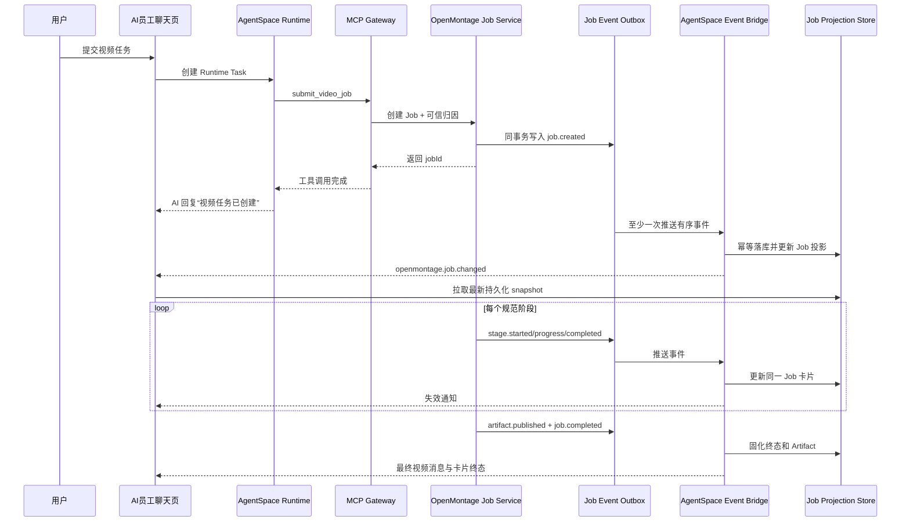

# AI 员工聊天阶段可视化方案

> 状态：Proposed，作为 OpenMontage 生产开放的强制门禁
>
> 日期：2026-08-05

## 1. 产品目标

用户在 AI 员工聊天页提交视频任务后，应当始终能回答：

1. 任务是否已经创建，当前由谁执行？
2. 当前处于哪个视频生产阶段，已经完成哪些阶段？
3. 当前是否需要用户审批、补充信息或调整预算？
4. 已产生多少权威模型消费和多少本地渲染用量？
5. 失败发生在哪一阶段，能否重试，以及重试会不会重复消费？
6. 最终视频、预览和相关产物在哪里？

“每个阶段清晰输出”定义为：每个**用户可感知的规范阶段**都必须由服务端事实事件驱动，在同一视频 Job 卡片内按顺序展示，并能在页面刷新、原 Runtime Task 结束、网络重连和服务重启后恢复。它不等同于展示每条内部日志、模型 token 流或函数调用。

## 2. 不可接受的实现

- 依赖 AI 员工在 Prompt 中记住定时调用 `get_video_job`。
- 让长时间运行的 MCP 调用一直占用 Runtime Task，等待整个视频完成。
- 把每次进度变化都发成独立聊天气泡，造成刷屏和上下文污染。
- 只通过 SSE 内存事件更新页面，不保存可重建的持久化状态。
- 在已完成的通用 `task_message` 上继续追加 OpenMontage 阶段，并假设聊天页会自动刷新。
- 用“正在处理”“快完成了”等无事实依据的文案替代具体阶段和步骤。
- 由浏览器直接调用 OpenMontage 私网 endpoint 或携带 delegation secret。

## 3. 架构决策

采用“事务事件 + AgentSpace 持久化投影 + 实时失效通知 + 主动补偿”模式。



选择该方案的原因：

- OpenMontage 才是视频阶段事实来源，AI 只能解释事实，不能创造事实。
- Job 生命周期通常长于一次 Runtime Task，必须解除两者的存活绑定。
- outbox 保证状态迁移与事件不会一边成功、一边丢失。
- 至少一次投递配合幂等消费比追求脆弱的“恰好一次网络投递”更可实现。
- SSE 只做页面失效通知，丢失后仍能从持久化 snapshot 恢复。

## 4. 规范阶段模型

首期 `reference_clone` 工作流使用以下用户可感知阶段；其他工作流可裁剪，但必须从版本化 workflow definition 生成，不能由 LLM 自由命名。

| stage code | 用户文案 | 完成事实 | 可产生付费调用 | 典型产物 |
| --- | --- | --- | --- | --- |
| `INTAKE` | 正在确认需求 | brief 和输入校验通过 | 否 | 规范化 brief |
| `ANALYSIS` | 正在分析参考视频 | 转写、镜头和风格分析完成 | 是 | transcript、analysis |
| `PLAN` | 正在生成制作方案 | 分镜、素材计划和预算估算完成 | 是 | storyboard、estimate |
| `ASSETS` | 正在生成素材 | 所有必需素材完成或明确跳过 | 是 | 图片、音频、片段 |
| `COMPOSE` | 正在合成视频 | Remotion/HyperFrames composition 完成 | 可能 | composition |
| `REVIEW` | 正在检查成片 | 自动质检和必要修订完成 | 是 | preview、QA report |
| `DELIVERY` | 正在发布视频 | 最终 Artifact 登记完成 | 否 | final MP4 |

每个阶段拥有独立状态：

```text
PENDING -> RUNNING -> WAITING_APPROVAL -> RUNNING -> SUCCEEDED
                   -> FAILED
                   -> CANCELLED
PENDING -> SKIPPED
```

Job 终态只能是 `SUCCEEDED`、`FAILED` 或 `CANCELLED`。终态不可被迟到事件回退；需要重新执行时创建新的 attempt，并明确关联原 Job。

## 5. 事件合同

### 5.1 Envelope

```json
{
  "schemaVersion": 1,
  "eventId": "evt_01...",
  "eventType": "openmontage.stage.progressed",
  "occurredAt": "2026-08-05T10:00:00.000Z",
  "jobId": "om_job_01...",
  "sequence": 18,
  "workspaceId": "ws_01...",
  "employeeId": "emp_01...",
  "runtimeId": "rt_01...",
  "rootTaskId": "task_01...",
  "conversationId": "conv_01...",
  "sourceInvocationId": "mcp_01...",
  "traceId": "trace_01...",
  "payload": {
    "stage": "ASSETS",
    "stageAttempt": 1,
    "status": "RUNNING",
    "progress": {
      "completedUnits": 2,
      "totalUnits": 5,
      "labelCode": "openmontage.assets.generating"
    }
  }
}
```

可信归因字段在 Job 创建时由 MCP Gateway 固化。OpenMontage 后续事件只能引用这些字段，AgentSpace 必须与已有 Job Link 核对，不信任事件自行改变 workspace、员工、会话或根任务归属。

### 5.2 事件类型

| 事件 | 是否更新卡片 | 是否产生新聊天提醒 |
| --- | --- | --- |
| `openmontage.job.created` | 是 | 否，复用创建 Job 后的员工回复 |
| `openmontage.stage.started` | 是 | 否 |
| `openmontage.stage.progressed` | 是 | 否 |
| `openmontage.stage.completed` | 是 | 否 |
| `openmontage.job.waiting_approval` | 是 | 是，提供审批动作 |
| `openmontage.approval.resolved` | 是 | 仅跨用户处理时通知发起人 |
| `openmontage.usage.updated` | 是 | 否 |
| `openmontage.artifact.published` | 是 | 预览或最终产物才提醒 |
| `openmontage.job.completed` | 是 | 是，发送最终结果和 MP4 |
| `openmontage.job.failed` | 是 | 是，发送失败原因和允许动作 |
| `openmontage.job.cancelled` | 是 | 是，确认取消结果 |

阶段事件只能携带稳定 `labelCode` 和安全参数。用户文案由 AgentSpace 本地化资源生成，不能直接显示模型响应、堆栈、宿主路径、命令行、服务地址或 Provider 原始错误。

### 5.3 顺序与幂等

- OpenMontage 在单个 Job 内生成从 1 开始、严格递增的 `sequence`。
- AgentSpace 对 `eventId` 和 `jobId + sequence` 建唯一约束。
- `sequence <= lastAppliedSequence` 的重复事件确认接收但不重复执行副作用。
- `sequence > lastAppliedSequence + 1` 时标记 `SYNCING`，不越过缺口更新用户可见终态。
- Bridge 使用 `GET /api/v1/jobs/:jobId/events?afterSequence=` 拉取缺失事件；事件保留期不得短于 Job 审计保留期。
- 若历史事件不可用，则获取带 `snapshotVersion/lastSequence` 的权威 snapshot 重建投影，并记录审计事件。
- Artifact 消息、审批记录和终态通知分别使用稳定幂等键，避免重放产生重复副作用。

## 6. AgentSpace 持久化模型

### 6.1 `openmontage_job_links`

保存 Job 与用户上下文的不可变关联：workspace、employee、runtime、root task、conversation、source invocation、delegation reference、workflow version 和创建时间。

### 6.2 `openmontage_job_events`

保存原始规范事件、sequence、schema version、验签结果、接收时间、应用时间和失败原因。payload 需经过 schema 校验和敏感字段过滤。

### 6.3 `openmontage_job_projections`

保存聊天页读取所需的当前 snapshot：Job 状态、当前阶段、完整阶段列表、进度、预算摘要、权威消费摘要、Artifact、待审批动作、`lastAppliedSequence` 和同步状态。

### 6.4 `openmontage_chat_bindings`

保存 `jobId -> channelName/conversationMessageId` 的稳定绑定。它独立于 pending AI 回复，使 Runtime Task 结束后仍能更新同一张卡片。

数据库更新顺序为：事件 inbox 幂等落库、投影更新、outbox 写入聊天失效通知，三者在 AgentSpace 同一事务完成。实时通知发送失败不回滚事实，通知 outbox 后续重试。

## 7. 聊天页信息架构

### 7.1 单一 Job 卡片

聊天流中每个视频 Job 只存在一个主卡片，避免阶段刷屏。默认展示：

```text
产品介绍视频                                      制作中
正在生成素材 · 2/5

✓ 确认需求        12:01
✓ 分析参考视频    12:03
✓ 生成制作方案    12:05
● 生成素材        2/5
○ 合成视频
○ 检查成片
○ 发布视频

模型实际消费 ¥6.20    本地渲染 00:00
[取消任务] [查看详情]
```

信息层级：

- 第一层始终可见：Job 名称、总状态、当前阶段、真实步骤、需要用户采取的动作。
- 第二层展开可见：阶段时间、阶段尝试次数、消费摘要、产物和安全化错误。
- 第三层跳转详情：usageId、trace、资源用量和运维诊断，仅对有权限角色开放。

不在卡片中显示模型 chain-of-thought、完整工具输入输出和内部日志。

### 7.2 高关注消息

以下节点除更新卡片外还生成正常聊天消息，以确保用户不会错过：

- 等待审批或预算扩额。
- 需要用户补充素材或修改 brief。
- 任务失败且需要选择是否重试。
- 任务取消完成。
- 最终视频发布完成。

普通 `stage.started/progressed/completed` 只更新卡片。相同阶段的高频进度事件在服务端合并，页面更新频率上限建议为每 Job 每秒 2 次，但最后一个进度和终态绝不能被丢弃。

### 7.3 状态表现

| 状态 | 视觉和文案 | 用户动作 |
| --- | --- | --- |
| `QUEUED` | 等待处理，显示排队而非假进度 | 取消 |
| `RUNNING` | 当前阶段带 spinner，已完成阶段带 check | 取消、查看详情 |
| `WAITING_APPROVAL` | 警示状态和明确原因 | 批准、驳回、调整预算 |
| `SYNCING` | “正在同步最新进度”，保留最后可信状态 | 无需重复提交 |
| `FAILED` | 失败阶段、可理解原因、是否产生消费 | 重试允许的阶段、查看详情 |
| `CANCEL_REQUESTED` | “正在停止”，不承诺立即中断上游调用 | 无 |
| `CANCELLED` | 已停止，保留已完成阶段与产物 | 复制任务 |
| `SUCCEEDED` | 已完成，突出最终视频 | 预览、下载、创建新版本 |

### 7.4 移动端与无障碍

- 卡片在窄屏使用单列阶段列表，操作按钮可换行，不横向滚动。
- 状态不能只靠颜色表达；同时使用图标、文本和 `aria-live="polite"`。
- 审批、取消等动作具备键盘焦点、加载、成功、失败和防重复点击状态。
- 进度更新不抢夺键盘焦点；只有审批和终态使用通知区域播报。
- 时间、金额和语言遵循当前 workspace locale，金额明确区分“估算”和“实际”。

## 8. 审批与用户动作

AgentSpace 是用户动作和权限判断入口：

1. 用户点击卡片动作。
2. AgentSpace 校验 workspace 成员、Job 绑定、动作权限和当前 projection sequence。
3. AgentSpace 创建带幂等键的 approval/action command。
4. 服务端适配器调用 OpenMontage，不让浏览器访问服务地址。
5. UI 进入“提交中”，但不乐观地把 Job 标记为已批准。
6. 收到 `approval.resolved` 或新 snapshot 后显示最终结果。

审批请求至少展示：原因、即将执行的阶段、非权威增量估算、当前权威实际消费、额度变化和审批有效期。审批只允许增加当前 Job delegation 的上限，不能扩大模型能力或跨 Job 使用。

取消采用两阶段语义：先显示 `CANCEL_REQUESTED`，只有 OpenMontage 确认停止并发布事件后显示 `CANCELLED`。重试必须携带失败阶段、上一 attempt 和幂等键；已成功且已计费的阶段默认复用 checkpoint，不静默重复消费。

## 9. 产物和费用展示

### 9.1 Artifact

- `artifact.published` 先登记 Artifact Bridge，再写入可见 projection，避免显示无法访问的产物。
- 中间预览默认只在卡片详情展示；`final_video` 生成正常聊天附件。
- 下载使用短期、单用途授权，链接过期时由 AgentSpace 重新签发。
- Artifact 转码或安全扫描未完成时显示“正在准备预览”，不能显示损坏播放器。

### 9.2 费用

- 卡片可展示 OpenMontage 估算，但必须标记“估算”，不得计入实际总额。
- 模型实际金额仅来自 models Billing Report/ledger 对账结果。
- 本地 CPU/GPU/渲染/存储先显示用量；没有独立资源账本时不显示推测金额。
- `usage.updated` 不产生聊天消息，只更新卡片摘要；详细 usageId 在成本中心下钻。
- Job 失败或取消后仍显示已经实际发生的消费，不能归零。

## 10. 服务端接口

建议 AgentSpace 增加以下内部和用户接口：

```text
POST /api/internal/openmontage/events
GET  /api/workspaces/:workspaceId/openmontage/jobs/:jobId
POST /api/workspaces/:workspaceId/openmontage/jobs/:jobId/cancel
POST /api/workspaces/:workspaceId/openmontage/jobs/:jobId/approvals/:approvalId/review
POST /api/workspaces/:workspaceId/openmontage/jobs/:jobId/retry
```

事件入口要求 mTLS 或服务身份加请求签名、时间窗和 nonce 防重放。接收成功只表示事件已持久化，不表示浏览器已刷新。用户查询接口必须从 AgentSpace projection 读取，不允许浏览器透传查询 OpenMontage。

频道 SSE 增加：

```text
event: openmontage.job.changed
data: { workspaceId, channelName, jobId, lastAppliedSequence, changedAt }
```

事件只携带失效信息，不携带完整 Job payload。客户端收到后重新读取授权后的 snapshot；断线重连后也执行一次 snapshot 校验。

## 11. 失败与恢复策略

| 故障 | 用户表现 | 系统恢复 |
| --- | --- | --- |
| OpenMontage 暂时不可用 | 卡片显示服务暂不可用，保留最后可信阶段 | 指数退避重试并探测健康 |
| 事件推送失败 | 页面可能短暂不更新 | OpenMontage outbox 重试；AgentSpace reconciler 主动拉取 |
| 事件乱序/缺口 | 卡片显示同步中，不越过缺口 | 按 sequence 补偿或 snapshot 重建 |
| AgentSpace 重启 | 页面从持久化 projection 恢复 | inbox/outbox worker 继续处理 |
| OpenMontage 重启 | 显示恢复中的 Job 状态 | 从 stage checkpoint 和 outbox 恢复 |
| 原 Runtime Task 已完成 | Job 卡片继续更新 | Chat Binding 与 Runtime Task 解耦 |
| 页面关闭后重新打开 | 显示完整当前状态和历史阶段 | 初始请求读取 snapshot |
| Artifact 登记失败 | 不发布损坏的最终消息 | 保持 DELIVERY 失败/重试状态 |
| usage 对账延迟 | 显示“实际费用对账中” | 后台按 usageId 对账后更新卡片 |

后台 reconciler 至少扫描：长时间无事件的非终态 Job、存在 sequence 缺口的 Job、OpenMontage 已终态但 AgentSpace projection 未终态的 Job，以及 Artifact/usage 尚未完成关联的 Job。

## 12. 可观测性与服务目标

关键指标：

- `job_event_ingest_latency_ms`
- `job_projection_latency_ms`
- `job_event_gap_total`
- `job_event_reconcile_total`
- `job_projection_stalled_total`
- `chat_job_card_refresh_latency_ms`
- `approval_command_latency_ms`
- `terminal_artifact_delivery_latency_ms`

生产目标：

- Job 事件持久化成功率 99.99%。
- 非高频阶段事件从 OpenMontage 提交到 AgentSpace projection 的 p95 小于 2 秒。
- projection 更新到已打开聊天页可见的 p95 小于 5 秒。
- 终态和审批事件不得采样或丢弃。
- 24 小时内终态 Job 的 `lastAppliedSequence` 与 OpenMontage `lastSequence` 一致率 100%。
- 不存在跨 workspace 投影、审批或 Artifact 泄漏。

Job ID、employee ID 和 trace ID 只进入日志/trace，不能作为 metrics 高基数 label。

## 13. 实施拆分

### Slice A：合同和 OpenMontage 事件源

- 冻结 workflow stage definition、event schema 和 fixtures。
- Job 状态迁移与 outbox 原子提交。
- 实现签名推送、重试和 `afterSequence` 事件查询。
- 单测状态迁移、事件顺序、重复提交和容器恢复。

### Slice B：AgentSpace Bridge 和 projection

- 实现 Job Link、Event Inbox、Projection、Chat Binding 和通知 outbox。
- 实现验签、schema 校验、归因核对、幂等、缺口检测和补偿。
- 对现有频道实时事件增加 `openmontage.job.changed`。
- 单测跨租户拒绝、重复事件、乱序、缺口和终态保护。

### Slice C：聊天 Job 卡片

- 实现阶段时间线、状态、真实步骤、费用摘要和 Artifact 区域。
- 实现移动端、键盘操作、ARIA 和中英文 labelCode。
- 审批、取消、重试走服务端 action，并覆盖所有加载/错误状态。
- 组件测试不允许长文案溢出或动态状态引发布局跳动。

### Slice D：终态、费用和恢复

- Artifact Bridge 完成后发送最终附件消息。
- 对接 models 权威 usage 对账和本地资源用量。
- 实现 reconciler、告警、操作审计和运维诊断页。
- 完成真实 Docker、Remotion、HyperFrames、FFmpeg 和付费模型 E2E。

实施顺序不能把 Slice C 作为只有 mock 数据的孤立 UI 长期发布。灰度至少同时具备 A、B、C 的完整垂直链路；D 可以在不宣称生产完成的前提下继续灰度。

## 14. E2E 验收矩阵

| 场景 | 必须观察到的结果 |
| --- | --- |
| 正常 7 阶段视频 | 每阶段只出现一次且顺序正确，最终 MP4 可播放和下载 |
| Runtime Task 提前结束 | 后续阶段继续实时更新，最终结果仍进入原会话 |
| 页面中途关闭并重开 | 卡片恢复完整阶段、当前状态、费用和产物 |
| 重复投递 100 次 | 只有一条事件事实、一个阶段结果和一个终态消息 |
| 交换两个相邻事件顺序 | 卡片进入同步中并补偿，不错误完成阶段 |
| 丢失一个事件 | reconciler 找回缺口，投影最终与 OpenMontage 一致 |
| OpenMontage 在 ASSETS 重启 | 从 checkpoint 恢复，不重复已成功的付费素材生成 |
| 超预算 | 新付费调用前停在审批，批准后从同一 Job 继续 |
| 无权限用户尝试审批 | 服务端拒绝且不改变 Job，写入安全审计 |
| 用户取消 | 先显示停止中，确认后显示已停止且不再发起新调用 |
| 渲染失败并重试 | 显示失败阶段，重试 attempt 可追踪且不重复前序消费 |
| Artifact 登记失败 | 不发送无效视频，DELIVERY 显示可恢复失败 |
| models 对账延迟 | 显示实际费用对账中，完成后金额更新且不重复累计 |
| 两个员工并发任务 | Job、聊天卡片、审批、Artifact 和费用完全隔离 |

所有场景必须同时验证桌面和移动视口、中文和英文、页面刷新、审计记录及数据库最终状态。

## 15. 可用性验证

在灰度开放前邀请 5-8 名目标用户完成可用性测试，至少覆盖首次使用者、视频任务高频用户、具有审批权限的管理员和移动端用户。测试数据使用无敏感信息的测试 Job，不使用生产凭据。

核心任务和通过标准：

| 任务 | 通过标准 |
| --- | --- |
| 判断视频当前阶段和已完成阶段 | 90% 以上参与者在 5 秒内回答正确 |
| 判断当前是否需要自己操作 | 100% 识别审批/补充信息状态，不误点取消 |
| 审批一次预算扩额 | 90% 完成，并能正确复述增量估算与当前实际消费的区别 |
| 找到失败阶段并选择允许的恢复动作 | 90% 在 30 秒内完成，不发起重复 Job |
| 找到最终视频并下载 | 100% 完成，移动端和桌面端均无阻塞 |
| 区分模型实际费用、本地资源用量和估算 | 90% 回答正确 |

记录任务完成率、完成时间、错误次数、误审批/误取消次数和 SUS。生产门禁要求不存在严重级可用性问题、误审批与误取消为 0、关键任务完成率达到表中目标、SUS 不低于 75。发现的问题必须记录严重性、复现步骤和修复验证，不能只以访谈主观反馈结案。

## 16. 生产完成定义

只有以下条件全部满足，才能对用户承诺“每个阶段都能在 AI 员工聊天页清晰输出”：

- 规范阶段、事件、状态机、错误码和用户文案均已版本化。
- 阶段状态与 outbox 原子提交，AgentSpace 幂等持久化并支持事件补偿。
- Job 卡片不依赖 pending AI 回复和 Runtime Task 存活。
- 页面刷新、网络断开和双端登录后状态一致。
- 审批、取消、重试、费用和 Artifact 均完成服务端权限闭环。
- 终态、审批和 Artifact 消息拥有稳定幂等键。
- E2E 验收矩阵全部通过，且真实 Docker 视频任务通过。
- 5-8 名目标用户的可用性测试达到阶段识别、审批、恢复、产物查找和 SUS 门槛。
- 监控能够识别停滞投影、事件缺口、未送达终态和未对账消费。
- 灰度数据满足延迟、完整性和租户隔离目标后再逐步开放。
