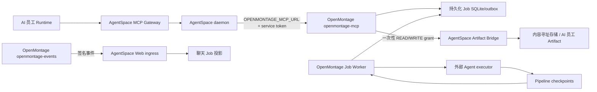

# 实施状态、部署与联调手册

> 状态：实施中
>
> 日期：2026-08-05

## 1. 当前可用能力

当前版本已经能够把**预先部署的 OpenMontage Docker 服务**作为 AgentSpace 官方受管 MCP 能力使用：

1. 管理员在 MCP 市场打开页面时，系统同步官方 `official-openmontage` 目录项。
2. daemon 把目录中的不透明 `managed-service://openmontage` 引用解析为部署侧 `OPENMONTAGE_MCP_URL`，服务地址和 token 不进入浏览器或 Runtime。
3. AI 员工调用 `submit_video_job` 时，Gateway 注入 workspace、employee、runtime、task、conversation 和 invocation 的可信归因。
4. OpenMontage 原子创建 Job 与 `job.created` 事件，并返回完整 snapshot。
5. Gateway 把 snapshot 回报 AgentSpace，建立不可变 Job Link；创建回报失败时不向 AI 员工伪报成功。
6. OpenMontage outbox 向 AgentSpace 推送签名事件；AgentSpace 按 sequence 幂等投影，并在缺口时主动补偿。
7. 聊天页展示持久化视频 Job 阶段卡片；有权限用户可审批或取消，动作带幂等键和服务端 sequence 围栏。
8. OpenMontage 可用 Job 绑定的一次性 grant 下载输入附件、流式上传输出；AgentSpace 校验大小和 SHA-256 后登记为原 AI 员工/根任务的正式 Artifact。
9. OpenMontage 持久化已发布产物并发出 `artifact.published` 有序事件；REST 与 `list_video_artifacts` MCP 工具可查询同一份清单。
10. OpenMontage Job Worker 已具备 SQLite 租约、心跳、过期接管和 token fencing；它按单阶段调用外部 Agent executor，以合法 checkpoint 对账 Job 状态，崩溃恢复时不会重复执行已有完成 checkpoint 的阶段。
11. Worker 会自动下载 Artifact 输入并校验本地收据；所有阶段成功后，只接受 Job workspace 内由 `publish_log`/`render_report` 声明的 MP4，先上传并持久化 `artifact.published`，再完成 Job。
12. Worker 镜像固定安装 Codex CLI 0.146.0；每个阶段从 AgentSpace 获取短期 Job 委托，通过 loopback proxy 为 Codex 请求签名，并为原生媒体调用直接签名。
13. models 对委托调用执行能力、模型、预算、调用幂等和生命周期门禁，并把员工、会话、根任务、Job、Stage、调用 ID 固化进 usage、charge 和 ledger 快照。
14. Remotion 与 HyperFrames 已在最终只读 Worker 镜像内完成真实 MP4 渲染；聊天卡片通过 AgentSpace 受权路由支持最终视频预览、Range 播放和下载。

这条链路已经在代码和本地自动化层覆盖“谁调用、哪个任务创建 Job、每个阶段如何执行和计费、最终产物如何回到原聊天”。尚未完成的是依赖部署环境的付费模型和故障注入 E2E，因此仍不能把本地结果解释为生产环境已经开放。

## 2. 两仓实施证据

### AgentSpace 分支 `techwu/montage-mcp-connect`

| 能力 | 主要提交 |
| --- | --- |
| Job/Event 合同、持久化、签名 ingress、SSE、缺口补偿 | `488ad4f`、`fc7e589`、`980e6ea`、`f2f612e` |
| 聊天查询、阶段卡片、审批/取消、实时刷新 | `8c0e90b`、`91d3c6a`、`a273cf6`、`f356bc7` |
| 严格 Job snapshot、可信绑定和 Gateway 回报 | `da71042`、`9f80f1e`、`bbfe42f` |
| 官方受管 MCP、私网解析、动作围栏、归因编码 | `c16fa1a`、`d40a04f`、`eebf829` |
| Artifact READ/WRITE grant、流式对象入库、员工产物登记 | `1543df2`、`7743720`、`faad9d3`、`4468867`、`455759c` |
| 产物查询目录与严格事件合同 | `8e171f3`、`d141d4c` |
| Job 委托签发、密钥托管、终态 drain | `879af4f` |
| 完整媒体能力范围 | `8564577` |
| 最终 MP4 聊天预览、Range 播放与下载 | `6dca055`、`b06398c` |

### OpenMontage 分支 `codex/dofe-integration`

| 能力 | 主要提交 |
| --- | --- |
| Job Service、REST/MCP、归因、outbox、事件发布 | `76ac1ec` |
| 取消/审批动作幂等持久化和 sequence fencing | `1a997df` |
| Artifact 输入/输出客户端、持久清单与 MCP 查询 | `95e0f6f`、`afbe30c`、`f9f4201`、`acdb175` |
| Worker 租约、外部 Agent executor、checkpoint 状态机 | `b960456`、`6a7da67`、`38f9f07` |
| Worker 自动 Artifact 输入/最终 MP4 回收、CLI/Compose 入口 | `8f35c44`、`1f2a1fe` |
| Codex 身份、阶段委托代理、Job 写隔离、Remotion/HyperFrames 镜像 | `4ba3ada` |

### models 分支 `techwu/openmontage-delegation`

| 能力 | 主要提交 |
| --- | --- |
| 历史用量保留、委托契约与生命周期 | `f2ab4588`、`63d6cb5d`、`ecbf491e` |
| 预算预留、可信签名归因与清理对账 | `17c86174`、`61e07e07`、`99e5c063` |
| 原生生成任务的委托计费闭环 | `037255c0` |

## 3. 部署拓扑和配置

AgentSpace 不自动启动 OpenMontage。先用 OpenMontage 自身 `compose.yaml` 部署 `openmontage-mcp` 和 `openmontage-events`，再让 AgentSpace daemon 连接它。两者可以共享私有 Docker 网络，也可以通过 `host.docker.internal` 联通。



### 3.1 OpenMontage `.env`

```dotenv
OPENMONTAGE_SERVICE_TOKEN=<高熵服务令牌>
OPENMONTAGE_EVENT_SIGNING_SECRET=<独立的高熵事件签名密钥>
OPENMONTAGE_EVENT_ENDPOINT=http://host.docker.internal:1455/api/internal/openmontage/events
OPENMONTAGE_ARTIFACT_BRIDGE_BASE_URL=http://host.docker.internal:1455
OPENMONTAGE_MODEL_CREDENTIAL_BASE_URL=http://host.docker.internal:1455
OPENMONTAGE_JOB_DB=/data/projects/.openmontage/jobs.sqlite3
OPENMONTAGE_AGENT_EXECUTOR_JSON=["codex","exec","--skip-git-repo-check","--ephemeral","--ignore-user-config","-s","workspace-write","-C","/app","--add-dir","{project_dir}","-"]
OPENMONTAGE_AGENT_TIMEOUT_SECONDS=3600

# 按实际 models 部署明确配置，不依赖默认值。
DOFE_DOCKER_NETWORK=modelsdofeai_default
DOFE_INTERNAL_BASE_URL=http://api:3101
```

不要把 `OPENMONTAGE_SERVICE_TOKEN` 或事件签名密钥复用为模型凭据。OpenMontage Compose 只连接既有 models 网络，不创建 PostgreSQL、Redis 或 RabbitMQ。

启动：

```bash
cd ../OpenMontage
docker compose --profile agentspace up --build -d \
  openmontage-mcp openmontage-events openmontage-worker
curl --fail http://127.0.0.1:8765/healthz
```

`OPENMONTAGE_AGENT_EXECUTOR_JSON` 必须是 argv JSON 数组，命令从 stdin 读取阶段 assignment，并按 OpenMontage checkpoint 协议写结果；禁止配置 shell 字符串。只有完整 argv 项 `{project_dir}` 会被替换为可信 Job 目录。镜像内 `/app` 为只读，Codex sandbox 只额外开放当前 Job 目录。未配置 executor、Artifact Bridge 或模型凭证 Bridge 时 Worker fail closed，不回退到 Python 创意编排或共享模型 Key。

### 3.2 AgentSpace Web/控制面

```dotenv
OPENMONTAGE_BASE_URL=http://host.docker.internal:8765
OPENMONTAGE_SERVICE_TOKEN=<与 OpenMontage 相同的服务令牌>
OPENMONTAGE_EVENT_SIGNING_SECRET=<与 OpenMontage 相同的事件签名密钥>
```

`OPENMONTAGE_BASE_URL` 用于事件缺口对账和审批/取消服务端动作。浏览器不读取这些变量。

OpenMontage 应使用它实际访问 AgentSpace 的内部 origin 作为 `OPENMONTAGE_ARTIFACT_BRIDGE_BASE_URL`。AgentSpace 会基于请求 origin 返回同源的一次性下载/上传 URL；不要配置浏览器公网地址、内嵌凭据 URL 或 Runtime 私有文件路径。

### 3.3 AgentSpace daemon

```dotenv
OPENMONTAGE_MCP_URL=http://host.docker.internal:8765/mcp
OPENMONTAGE_SERVICE_TOKEN=<与 OpenMontage 相同的服务令牌>
```

若两个服务位于同一私有网络，可替换为 `http://openmontage-mcp:8765/mcp`。URL 必须是无内嵌凭据的 HTTP(S) 地址并以 `/mcp` 结尾。修改后重启 daemon；不需要给 Runtime 容器添加 OpenMontage token。

## 4. 产品侧安装和使用

1. 打开 AgentSpace 的 MCP 市场页，触发官方目录同步。
2. 选择 OpenMontage，创建工作区连接并只批准需要的工具。
3. `submit_video_job` 与 `approve_video_stage` 是高风险工具，首次调用应走现有工具确认体验；查询和事件重放保持低风险。
4. AI 员工提交 Job 后，聊天页立即从服务端投影读取阶段卡片。Runtime Task 即使结束，后续签名事件仍会刷新同一张卡片。
5. 审批和取消只从卡片进入 AgentSpace 服务端动作；不要让用户填写 OpenMontage URL、token 或 Job 归因字段。

官方首批工具为：

- `openmontage_capabilities`
- `submit_video_job`
- `get_video_job`
- `cancel_video_job`
- `approve_video_stage`
- `list_video_job_events`
- `list_video_artifacts`

OpenMontage 仍保留 `prepare_reference_clone`、`reference_clone_status` 兼容工具，但官方目录不默认批准它们。

## 5. 已完成的本地验收

- models 委托、proxy/generation 归因与账务聚焦测试：4 个 suite、102 个测试通过；API TypeScript 与目标 ESLint 通过。
- AgentSpace 委托服务测试、最终视频路由/UI 共 8 个测试通过；services 与 Web TypeScript、目标 ESLint 通过。
- OpenMontage Worker/委托/渲染聚焦测试：168 个通过；Python `compileall` 与 Compose 配置解析通过。
- Docker 镜像验证 Codex 0.146.0、只读 `/app`、Job 目录写权限、512 MB `/dev/shm`、Remotion/HyperFrames 共享 Chrome。
- Remotion 真实输出 1920×1080 H.264 MP4；HyperFrames 完整 scaffold、lint、validate、render、`ffprobe` 测试通过。
- 真实跨仓协议 smoke：本地启动 OpenMontage Streamable HTTP MCP，AgentSpace daemon client 完成 initialize、tools/list 和 `submit_video_job`，得到 `QUEUED` Job，`workspaceId=ws-e2e`、`lastSequence=1`。

该 smoke 证明 token 认证、base64url 归因、受管 transport、Job 创建和 wire result 可互通；它不等价于真实视频渲染或计费 E2E。

完整逐项证据和未执行项见 [07-委托计费与清理E2E.md](./07-委托计费与清理E2E.md)。models 全量 `quality:gate` 被仓库既有的 `media.upload` internal contract binding 缺口阻断；本轮相关聚焦测试和类型检查已通过，该无关缺口未在本轮越权修改。

## 6. 下一批逐项优化

按依赖关系继续实施，顺序不能颠倒：

1. **部署环境三仓 E2E**：用真实 AgentSpace、models 和 OpenMontage 服务完成一个跨审批点 Job，核对 usage、charge、ledger、Job Stage 和聊天 Artifact。
2. **故障注入与大文件**：覆盖 100 MB 以上输入/输出、Worker kill、网络中断、异步生成 drain、重复 invocation 和恢复，不重复登记或计费。
3. **双员工账单隔离**：并发执行两个员工的 Job，确认委托、实际金额和账单下钻无法串 Job。
4. **服务生命周期与健康**：在明确部署平台后实现 OpenMontage 自动升级、回滚和 degraded 状态；当前不假设由 AgentSpace 管容器。

## 7. 当前禁止宣称

以下说法在剩余门禁通过前均不成立：

- “AI 员工已经可以自动完成完整视频生产”。
- “部署环境中 OpenMontage 的每笔模型消费已经完成统一账单核对”。
- “AgentSpace 会自动部署和管理 OpenMontage Docker 服务”。

当前准确表述是：**三仓已实现任务级 Codex 身份、模型委托计费、真实双渲染器和最终 MP4 聊天回收，并通过本地自动化与容器渲染验证；生产环境付费模型、故障注入和双员工账单核对仍待执行。**

## 8. 回滚

- 在 MCP Center 禁用或删除 OpenMontage connection，可阻止运行中 Task 的下一次工具调用。
- 清除 daemon 的 `OPENMONTAGE_MCP_URL` 或停止 OpenMontage 服务会使新调用失败，不会删除已持久化 Job 和聊天投影。
- 停止 `openmontage-events` 不会丢事件；outbox 保留未投递记录，恢复后继续发送。
- 回滚应用版本时保留 OpenMontage SQLite、AgentSpace Job Link/Event/Projection 和审计数据，不回退到共享模型 Key。
