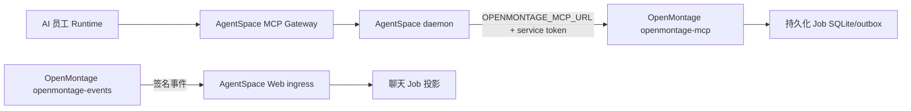

# 实施状态、部署与联调手册

> 状态：实施中
>
> 日期：2026-08-05

## 1. 当前可用能力

当前版本已经能够把**预先部署的 OpenMontage Docker 服务**作为 AgentSpace 官方受管 MCP 能力使用：

1. 管理员在 MCP 市场打开页面时，系统同步官方 `official-openmontage` 目录项。
2. daemon 把目录中的不透明 `managed-service://openmontage` 引用解析为部署侧 `OPENMONTAGE_MCP_URL`，服务地址和 token 不进入浏览器或 Runtime。
3. AI 员工调用 `submit_video_job` 时，Gateway 注入 workspace、employee、runtime、task、conversation 和 invocation 的可信归因。
4. OpenMontage 原子创建 Job 与 `job.created` 事件，并返回完整 snapshot。
5. Gateway 把 snapshot 回报 AgentSpace，建立不可变 Job Link；创建回报失败时不向 AI 员工伪报成功。
6. OpenMontage outbox 向 AgentSpace 推送签名事件；AgentSpace 按 sequence 幂等投影，并在缺口时主动补偿。
7. 聊天页展示持久化视频 Job 阶段卡片；有权限用户可审批或取消，动作带幂等键和服务端 sequence 围栏。

这条链路已经覆盖“谁调用、哪个任务创建了哪个 Job、每个阶段能否恢复展示”。它尚未覆盖“Job 自动执行完整视频流水线、产物回收以及 models 权威账单归因”。

## 2. 两仓实施证据

### AgentSpace 分支 `techwu/montage-mcp-connect`

| 能力 | 主要提交 |
| --- | --- |
| Job/Event 合同、持久化、签名 ingress、SSE、缺口补偿 | `488ad4f`、`fc7e589`、`980e6ea`、`f2f612e` |
| 聊天查询、阶段卡片、审批/取消、实时刷新 | `8c0e90b`、`91d3c6a`、`a273cf6`、`f356bc7` |
| 严格 Job snapshot、可信绑定和 Gateway 回报 | `da71042`、`9f80f1e`、`bbfe42f` |
| 官方受管 MCP、私网解析、动作围栏、归因编码 | `c16fa1a`、`d40a04f`、`eebf829` |

### OpenMontage 分支 `codex/dofe-integration`

| 能力 | 主要提交 |
| --- | --- |
| Job Service、REST/MCP、归因、outbox、事件发布 | `76ac1ec` |
| 取消/审批动作幂等持久化和 sequence fencing | `1a997df` |

## 3. 部署拓扑和配置

AgentSpace 不自动启动 OpenMontage。先用 OpenMontage 自身 `compose.yaml` 部署 `openmontage-mcp` 和 `openmontage-events`，再让 AgentSpace daemon 连接它。两者可以共享私有 Docker 网络，也可以通过 `host.docker.internal` 联通。



### 3.1 OpenMontage `.env`

```dotenv
OPENMONTAGE_SERVICE_TOKEN=<高熵服务令牌>
OPENMONTAGE_EVENT_SIGNING_SECRET=<独立的高熵事件签名密钥>
OPENMONTAGE_EVENT_ENDPOINT=http://host.docker.internal:1455/api/internal/openmontage/events
OPENMONTAGE_JOB_DB=/data/projects/.openmontage/jobs.sqlite3

# 按实际 models 部署明确配置，不依赖默认值。
DOFE_DOCKER_NETWORK=modelsdofeai_default
DOFE_INTERNAL_BASE_URL=http://api:3101
```

不要把 `OPENMONTAGE_SERVICE_TOKEN` 或事件签名密钥复用为模型凭据。OpenMontage Compose 只连接既有 models 网络，不创建 PostgreSQL、Redis 或 RabbitMQ。

启动：

```bash
cd ../OpenMontage
docker compose --profile agentspace up --build -d openmontage-mcp openmontage-events
curl --fail http://127.0.0.1:8765/healthz
```

### 3.2 AgentSpace Web/控制面

```dotenv
OPENMONTAGE_BASE_URL=http://host.docker.internal:8765
OPENMONTAGE_SERVICE_TOKEN=<与 OpenMontage 相同的服务令牌>
OPENMONTAGE_EVENT_SIGNING_SECRET=<与 OpenMontage 相同的事件签名密钥>
```

`OPENMONTAGE_BASE_URL` 用于事件缺口对账和审批/取消服务端动作。浏览器不读取这些变量。

### 3.3 AgentSpace daemon

```dotenv
OPENMONTAGE_MCP_URL=http://host.docker.internal:8765/mcp
OPENMONTAGE_SERVICE_TOKEN=<与 OpenMontage 相同的服务令牌>
```

若两个服务位于同一私有网络，可替换为 `http://openmontage-mcp:8765/mcp`。URL 必须是无内嵌凭据的 HTTP(S) 地址并以 `/mcp` 结尾。修改后重启 daemon；不需要给 Runtime 容器添加 OpenMontage token。

## 4. 产品侧安装和使用

1. 打开 AgentSpace 的 MCP 市场页，触发官方目录同步。
2. 选择 OpenMontage，创建工作区连接并只批准需要的工具。
3. `submit_video_job` 与 `approve_video_stage` 是高风险工具，首次调用应走现有工具确认体验；查询和事件重放保持低风险。
4. AI 员工提交 Job 后，聊天页立即从服务端投影读取阶段卡片。Runtime Task 即使结束，后续签名事件仍会刷新同一张卡片。
5. 审批和取消只从卡片进入 AgentSpace 服务端动作；不要让用户填写 OpenMontage URL、token 或 Job 归因字段。

官方首批工具为：

- `openmontage_capabilities`
- `submit_video_job`
- `get_video_job`
- `cancel_video_job`
- `approve_video_stage`
- `list_video_job_events`

OpenMontage 仍保留 `prepare_reference_clone`、`reference_clone_status` 兼容工具，但官方目录不默认批准它们。

## 5. 已完成的本地验收

- AgentSpace OpenMontage domain tests：8 个通过。
- daemon Gateway/Client/managed-service 相关测试通过；MCP connections 34 个、Runtime capabilities UI 9 个通过。
- AgentSpace web lint 与 typecheck 通过。
- OpenMontage `tests/openmontage`：48 个通过；Python `compileall` 通过。
- 真实跨仓协议 smoke：本地启动 OpenMontage Streamable HTTP MCP，AgentSpace daemon client 完成 initialize、tools/list 和 `submit_video_job`，得到 `QUEUED` Job，`workspaceId=ws-e2e`、`lastSequence=1`。

该 smoke 证明 token 认证、base64url 归因、受管 transport、Job 创建和 wire result 可互通；它不等价于真实视频渲染或计费 E2E。

## 6. 下一批逐项优化

按依赖关系继续实施，顺序不能颠倒：

1. **OpenMontage Job Worker**：把 durable Job 接入实际 workflow executor，阶段 checkpoint 与付费调用边界一致，重启不重复执行已计费阶段。
2. **Artifact Bridge**：输入只传 Artifact grant，输出登记 final MP4；禁止大型媒体进入 MCP JSON。
3. **models delegation**：由 AgentSpace 为每个 Job 签发短期、带员工/任务/预算绑定的凭证，OpenMontage 不持有 Runtime 原始密钥。
4. **Usage Link 与成本中心**：保存 models `requestId/usageId`，按 AI 员工、Job、Stage 下钻，金额只取 models ledger。
5. **聊天高关注闭环**：审批、失败、取消和最终产物创建幂等独立消息；最终 MP4 可预览和下载。
6. **服务生命周期与健康**：在明确部署平台后再实现 OpenMontage 自动部署、升级、回滚和 degraded 状态；当前不假设由 AgentSpace 管容器。
7. **生产门禁**：完成 FFmpeg、Remotion、HyperFrames、至少一个付费模型、取消、审批、断网补偿、重启恢复与双员工账单隔离 E2E。

## 7. 当前禁止宣称

以下说法在剩余门禁通过前均不成立：

- “AI 员工已经可以自动完成完整视频生产”。
- “OpenMontage 的每笔模型消费已经进入 AI 员工统一账单”。
- “最终视频已经自动回收到聊天页”。
- “AgentSpace 会自动部署和管理 OpenMontage Docker 服务”。

当前准确表述是：**AgentSpace 已具备对已部署 OpenMontage 的受管 MCP 控制面、可信 Job 绑定和持久化阶段展示能力。**

## 8. 回滚

- 在 MCP Center 禁用或删除 OpenMontage connection，可阻止运行中 Task 的下一次工具调用。
- 清除 daemon 的 `OPENMONTAGE_MCP_URL` 或停止 OpenMontage 服务会使新调用失败，不会删除已持久化 Job 和聊天投影。
- 停止 `openmontage-events` 不会丢事件；outbox 保留未投递记录，恢复后继续发送。
- 回滚应用版本时保留 OpenMontage SQLite、AgentSpace Job Link/Event/Projection 和审计数据，不回退到共享模型 Key。
