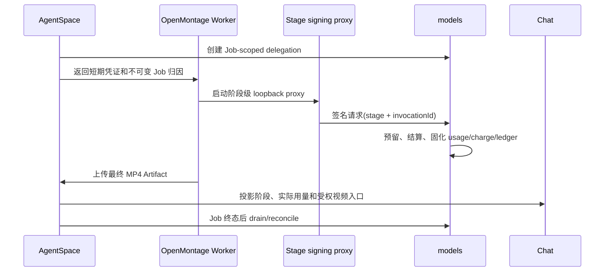

# 委托计费与清理 E2E

> 日期：2026-08-05
>
> 结论：代码与本地容器硬门禁通过；部署环境 E2E 待执行。

## 1. 验收边界

本轮把 OpenMontage 的控制面、执行面、模型数据面和产物面连成同一条 Job 链路。models 的 usage、charge 和 ledger 是实际金额权威源；AgentSpace 只保存 Job/员工维度的关联和展示投影；OpenMontage 不保存 Runtime 父密钥或自行计算模型费用。

## 2. 本地已验证矩阵

| 场景 | 结果 | 证据 |
| --- | --- | --- |
| 委托密钥签发与一次性托管 | 通过 | AgentSpace delegation service tests |
| 伪造 Stage/Invocation 签名 | 被拒绝 | models generation/proxy attribution tests |
| 能力越权和跨 Job 查询 | 被拒绝 | models capability 与 delegation scope tests |
| 相同 invocation 重试 | 不重复预留/计费 | models invocation idempotency tests；OpenMontage 重试复用签名头 |
| Job 预算不足 | 请求失败并释放父账务预留 | models generation delegation tests |
| 成功、失败、取消 | 分别 settle/release | models generation lifecycle tests |
| CLI/MCP/父凭证清理后的历史账单 | usage 快照保留 | retention schema 与 delegation reconciliation tests |
| Worker 获取阶段凭证失败 | 有界重试后失败，不回退共享 Key | OpenMontage Job Worker tests |
| 控制面 secret 进入 Agent 进程 | 被清除 | OpenMontage executor environment tests |
| Job 文件隔离 | `/app` 只读，只开放当前 `{project_dir}` | Docker 与 executor tests |
| Remotion 真实渲染 | 通过 | 最终镜像生成 1920×1080 H.264 MP4，`ffprobe` 成功 |
| HyperFrames 真实渲染 | 通过 | scaffold、lint、validate、render、`ffprobe` 全链路通过 |
| 最终 MP4 回到聊天 | 通过 | Artifact manifest + 工作区/频道鉴权 + Range 路由 + UI 预览/下载 tests |

## 3. 清理不丢账原则

1. 删除或禁用 MCP connection 只阻止新 Job；既有 Job Link、事件、Artifact 和账务快照不删除。
2. Runtime credential 采用受限删除；历史 usage 对可清理控制记录使用 `SET NULL`，金额和不可变归因保留。
3. Job 终态先进入 delegation draining；只有 active invocation 和未决 charge 清零后才撤销数据面 key。
4. Worker、CLI、镜像或本地 secret 消失不会删除 models 中的 invocation、usage、charge 或 ledger。
5. AgentSpace 展示金额只能来自 models 权威结算结果，不从 OpenMontage token 数或供应商响应二次估算。

## 4. 部署环境待执行矩阵

以下项目需要真实数据库、对象存储、付费模型和三仓服务实例，本工作站未启动 Jenkins，也未进行部署：

| 场景 | 通过标准 |
| --- | --- |
| MCP 在 Codex 请求中途被删除 | 已接受调用结算一次；新调用被拒；Job 进入可解释终态 |
| Worker 在上游成功后被 kill | reconcile 找回 provider/usage 状态，不重复消费 |
| 异步生成期间 delegation drain | 允许既有 operation 收口，拒绝新 operation |
| Runtime 在 Job 完成后删除 | usage、charge、ledger、Job 和 Artifact 均可查询 |
| 100 MB 以上输入和最终 MP4 | 不进入 MCP JSON；Range 播放可用；重试不重复登记 |
| 两个员工并发执行 | delegation、Job、Stage、usage 和账单下钻完全隔离 |
| 实际付费模型全流水线 | models ledger 合计等于 AgentSpace Job 实际消费展示 |

在上述部署矩阵全部通过前，能力状态应保持“本地集成完成，生产验收中”。
