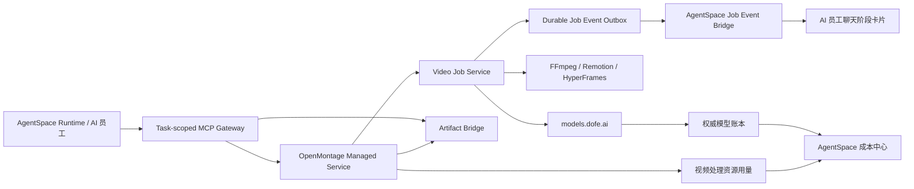

# OpenMontage Runtime 接入与统一计费方案

> 状态：Proposed
>
> 日期：2026-08-05

本目录记录将 `../OpenMontage` 作为独立 Docker 视频处理服务接入 AgentSpace Runtime，并把 OpenMontage 经 `models.local.dofe.ai` 产生的模型消费归因到具体 AI 员工、任务和视频 Job 的实施方案。

## 结论

采用以下组合，而不是在 MCP 与 CLI 之间二选一：

- OpenMontage 以不可变 Docker 镜像运行完整视频处理服务。
- AgentSpace Runtime 通过 task-scoped MCP Gateway 调用 OpenMontage。
- OpenMontage 内部以异步 Job Service 执行 FFmpeg、Remotion、HyperFrames 和模型调用。
- CLI 只是同一 Job API 的运维、调试和降级客户端，不承载另一套业务逻辑。
- 视频文件通过 Artifact Bridge 传输；MCP 只传任务控制和产物元数据。
- OpenMontage 通过事务事件与补偿对账把每个用户可感知阶段投影到 AI 员工聊天页；阶段展示不依赖 AI 主动轮询或自行总结。
- 聊天页使用一个可持续更新的视频 Job 卡片承载完整阶段时间线，审批、失败和最终产物另行触发高关注消息。
- `models.dofe.ai` 继续作为模型用量和金额的唯一权威账本。
- 每个 OpenMontage Job 使用短期、可撤销、带预算上限的 Runtime 委托凭证，消费继承原 AI 员工归因。
- OpenMontage 本地渲染资源成本单独计量，不伪装成模型 Token，也不重复计算 models 账单。

## 文档导航

1. [目标架构与接入决策](./01-目标架构与接入决策.md)
2. [统一归因与计费设计](./02-统一归因与计费设计.md)
3. [接口与数据契约](./03-接口与数据契约.md)
4. [实施路线与验收标准](./04-实施路线与验收标准.md)
5. [AI 员工聊天阶段可视化方案](./05-AI员工聊天阶段可视化方案.md)

## 边界

本方案不授权以下行为：

- 把宿主机 `../OpenMontage` 路径直接挂载给任意 Runtime。
- 把 Docker socket 暴露给 Runtime 或 OpenMontage。
- 让浏览器提交任意 shell、容器参数、私有地址或本地文件路径。
- 将 Runtime 原始模型密钥交给 OpenMontage。
- 用 OpenMontage 的本地估算金额替代 models 权威账单。
- 在 AgentSpace 部署中创建 PostgreSQL、Redis 或 RabbitMQ；如后续需要，必须连接 `../docker-helm.dofe.ai` 管理的外部服务。
