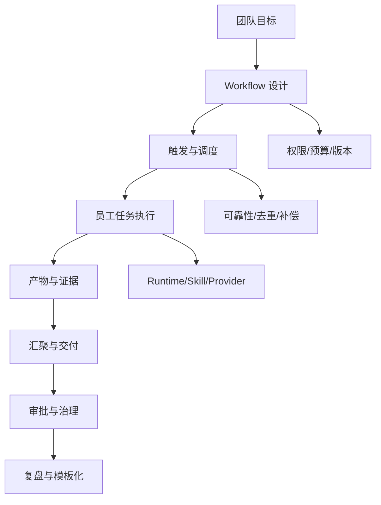
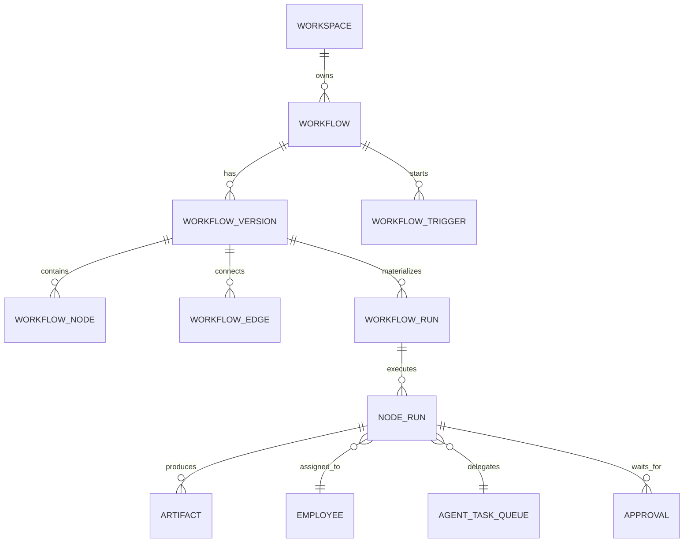
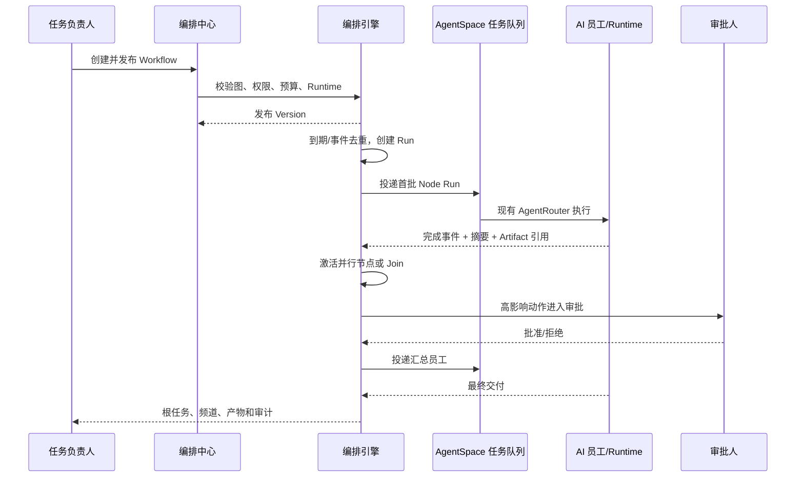

# AI 员工团队编排：业务架构文档

> 实施边界（2026-08-06）：本文件同时描述业务目标和首期实现。模板化、人工接管、实际成本运营、备用负责人通知和根任务专用投影仍为二期；当前完成度以 [07-规格实施覆盖矩阵.md](./07-规格实施覆盖矩阵.md) 为准。

## 1. 业务能力地图

| 能力域 | L1 能力 | 首期业务结果 |
| --- | --- | --- |
| 计划管理 | 定义、版本、发布 | 可复用且可审计的协作计划；模板为二期 |
| 触发管理 | 手动、日历、事件 | 在正确时间只创建一次 Run |
| 图调度 | 依赖解析、并行、Join | 不依赖人工交接推进步骤 |
| 执行治理 | 员工、Runtime、Skill、预算 | 只在就绪和授权条件满足时执行 |
| 交付管理 | 摘要、Artifact、频道回写 | 根任务有可消费的最终结果 |
| 人类控制 | 审批、暂停、恢复、取消 | 高影响动作保持人类决策权；接管为二期 |
| 运营分析 | 运行、失败、调度与事件 | 可定位执行瓶颈；实际成本运营为二期 |

## 2. 角色与责任矩阵

| 活动 | Workspace 管理员 | 任务负责人 | 员工 owner | 审批人 | AI 员工 |
| --- | --- | --- | --- | --- | --- |
| 创建草稿 | A/R | R | C | I | I |
| 配置员工步骤 | A | R | C | I | I |
| 发布版本 | A/R | R（若被授权） | C | I | I |
| 触发运行 | A | R | I | I | I |
| 执行步骤 | I | A（结果负责） | C | I | R |
| 高影响审批 | I | C | C | A/R | I |
| 节点重试 | A | R | C | I | I |
| 修改员工能力 | A | I | A/R | I | I |
| 删除 Workflow | A/R | C | I | I | I |
| 复盘 | A | R | C | C | I |

说明：A=Accountable，R=Responsible，C=Consulted，I=Informed。权限校验最终由服务端执行，不以 UI 隐藏作为安全边界。

## 3. 核心业务对象

### 业务不变量

1. Workflow 至少有一个 AI Task Node，且必须存在唯一开始和结束路径。
2. 发布版本必须是 DAG；所有节点都可从开始到达，所有终点都能到达结束。
3. Node 的员工绑定使用稳定 `employeeId`，展示名称只是快照。
4. Run 永远绑定已发布版本；编辑草稿不能改变历史 Run。
5. Node Run 的输入只能来自触发参数、静态配置和已完成上游的显式输出。
6. Join 只消费声明的上游，不读取任意同 workspace 任务或聊天历史。
7. 一个 Node Run 最多有一个活动 attempt；重试必须带递增 attempt 序号和幂等键。

## 4. 生命周期

### Workflow

主路径为 `draft → validating → published → archived`；`published` 可进入 `paused`，恢复后回到 `published`。

- `draft` 可编辑；`validating` 执行依赖、权限和图完整性预检。
- `published` 可被触发；修改必须生成新版本。
- `paused` 不创建新 Run，已运行实例按 Run 策略继续或暂停。
- `archived` 不可重新触发，但历史数据可读。

### Workflow Run

主路径为 `created → queued → running → succeeded | partially_succeeded | failed | cancelled`；`running` 可进入 `waiting_approval` 或 `paused`，批准/恢复后回到 `running`。

### Node Run

`pending → ready → queued → running → waiting_approval | retry_wait | succeeded | failed | skipped | cancelled`

状态迁移必须带 `actorType`、`reasonCode`、`occurredAt` 和关联事件 ID。UI 只显示本地化文案，数据库保存稳定代码。

## 5. 端到端业务流程

## 6. 业务规则

### 调度规则

- 时区存储在 Trigger 上，时间点统一转 UTC 计算；展示使用用户选择的 workspace 时区。
- 重复触发使用 `workflowId + triggerId + scheduledAt` 去重；同一时点不创建两个 Run。
- 迟到触发默认跳过过期窗口；可配置一次性“补跑最近一次”，不默认追赶全部历史。
- Workflow 暂停时不创建新 Run；恢复后只按未来时间计算。
- Run 暂停后不领取新任务；已经 `claimed` 或 `running` 的在途任务仍可取输入、开始并完成，避免卡在执行边界。

### 协作规则

- 并行节点只有在所有前置条件满足后才一起进入 ready；同一组内节点互不阻塞。
- Join 默认等待全部上游成功；“允许部分成功”必须在发布前显式确认。
- 汇总员工必须绑定一个稳定员工；不能用“自动选择”替代权限和责任。
- 上游失败时，Join 不得伪装成功；Run 进入失败或部分成功并显示缺失节点。
- 同一员工并行任务以 `taskQueueId` 关联等待消息、最终回复、附件和 AI 输出提及；任一任务失败或重试不得替换其他任务的消息。
- 完成结果只有在外部副作用已形成可重放检查点、产物已持久化并完成队列/节点原子终态后，才可对用户宣布成功。

### 成本和风险规则

- 发布前显示预估最大并发节点数和每次运行预算上限。
- 发布预检按节点预计成本和重试配置核对预算；实际重试成本归集、运行中暂停和通知为二期。
- 发送外部消息、修改外部数据、写入生产资源等动作须通过现有审批/工具授权。

## 7. 运营模型

运营人员关注四类队列：待发布的草稿、即将触发的计划、阻塞/审批中的运行、可重试的失败节点。首期观测覆盖成功率、调度延迟、失败原因、重试和人工审批；实际成本归集与人工接管率在二期补齐。

每个 Workflow 都应有 owner、通知频道和停用策略。发布时执行完整预检；若员工 Runtime、Skill 或频道权限在发布后变化，Run 可以先物化，但节点会在 dispatch 前进入受控重试等待且不会调用 Provider。备用负责人通知为二期能力。

## 8. 现有能力映射

| 现有能力 | 业务架构中的位置 | 处理方式 |
| --- | --- | --- |
| `/calendar` + `ScheduledTask` | Schedule Trigger | 迁移为单节点 Workflow；保留兼容读取 |
| `/automations` + `AutomationRule` | Event Trigger / Action Adapter | 可转换的规则进入版本草稿；复杂 legacy 规则保留适配器 |
| `/task-board` + `TaskRecord` | Workflow 创建/查看入口 | 首期提供共享向导深链；根任务专用投影为二期 |
| `agent_task_queue` | AI Task Node 的执行委托 | 不改变 Provider claim contract，增加 workflow metadata |
| AgentRouter session | Node Run 的 Runtime 执行上下文 | 重试生成新的队列执行，Node Run 保留递增 attempt 计数 |
| approvals | Human Approval Node / 工具审批 | 复用现有来源、审计和通知机制 |
| task execution event | 节点完成/失败桥接来源 | 通过 task queue 反查 Node Run 并推进 Workflow 事实事件 |
