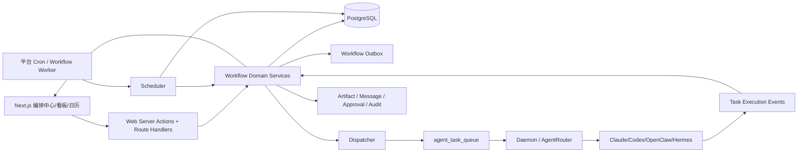
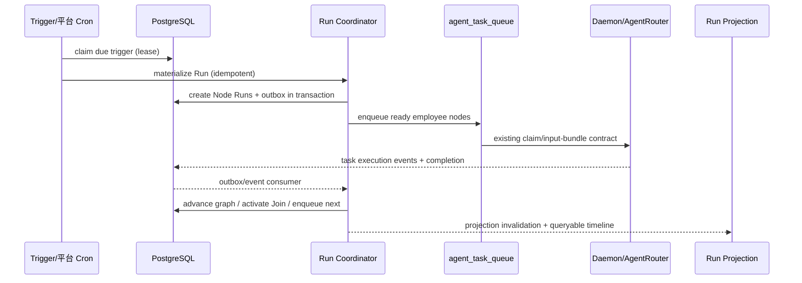

# AI 员工团队编排：技术架构文档

> 实施边界（2026-08-06）：持久化 DAG、Worker、Scheduler、Outbox、队列桥接、审批、事件入口、并发领取和恢复代码已落地。隔离 PostgreSQL 集成、真实容量和环境部署仍未验证；模型/Runtime generation/Skill 全量快照与实际成本熔断不属于首期已实现范围。

## 1. 架构决策

采用事件驱动的持久化 Workflow Engine。Web 负责配置和查询，编排服务负责图校验、Run 物化和状态推进，Scheduler 负责到期触发，Dispatch 负责把 AI Task Node 委托给现有 `agent_task_queue`，daemon/AgentRouter 继续负责实际 Provider 执行。PostgreSQL 是唯一持久协调面；不引入应用自带的 PostgreSQL、Redis 或 RabbitMQ 服务。

## 2. 组件边界

| 组件 | 责任 | 不负责 |
| --- | --- | --- |
| Web UI/BFF | 表单、画布、查询、权限提示、Server Action | 图调度、秘密解密、最终授权 |
| Workflow Domain | 定义、版本、图校验、输入映射、状态机 | Provider 进程和长连接 |
| Scheduler | 到期触发、事件去重、错过策略 | 直接调用 Provider |
| Run Coordinator | 物化 Node Run、Join、重试、暂停/取消 | 修改已发布版本 |
| Dispatcher | 把 ready AI Task Node 写入现有队列 | 绕过 Runtime/Skill readiness |
| Daemon/AgentRouter | Provider、session、runtime、工具授权和脱敏 | 解释 Workflow 拓扑 |
| Projection/Events | Run 列表、时间线、频道通知 | 生成模型式用户文案 |

代码归属确定为：Workflow 纯类型放 `packages/domain`，持久化放 `packages/db/src/workflows`，编排规则放 `packages/services/src/workflows`，Web 模块放 `apps/web/features/workflows`，主调度进程放独立的无状态 `apps/workflow-worker`。受保护的 `/api/cron/workflows/reconcile` 只调用同一 Service 做低频恢复兜底，不承担正常调度主路径。两者只连接共享 PostgreSQL，不创建或内嵌数据库、Redis、RabbitMQ。

## 3. 数据与事件流

状态事件采用至少一次投递、幂等消费。事件必须携带 `workspaceId`、`workflowId`、`versionId`、`runId`、`nodeId`、`nodeRunId` 和单调 sequence；缺序列时暂停投影并主动补偿。

## 4. 可靠性设计

- 事务内写入状态变更、outbox 和幂等记录；外部队列投递由 dispatcher 依据 outbox 重试。
- Scheduler 与 Coordinator 使用数据库 lease、`FOR UPDATE SKIP LOCKED` 和短事务，不依赖进程内内存状态。
- 每个 Trigger、Run、Node Run、Attempt 都有唯一幂等键；重复消息只能得到已有记录。
- Provider 完成事件和 Web 重试均可重复消费；状态迁移使用条件更新，禁止终态回退。
- Worker 崩溃时 lease 到期后由恢复扫描把可恢复工作重新排队；超过最大重试次数进入可解释的失败终态，人工接管为二期。
- 运行时间长于单次 Runtime Task；Workflow Run 不绑定某个 Provider 进程的存活。

## 5. 安全与治理

1. 所有查询和写入先解析 workspace，再检查用户权限；不接受客户端提供的 workspace 作为可信身份。
2. 发布预检调用已有 employee/runtime access、Skill readiness、channel access 和 policy 服务。
3. Run 固化不可变 Version 和 governance，Node Run 固化员工 ID/展示名称；dispatch 前重新校验当前 employee、Runtime、Skill 和频道 readiness。模型、Runtime generation 与 Skill 全量快照为二期增强，不在首期证据范围内。
4. secrets 仍由现有加密配置和 input bundle 机制管理；Workflow 数据只保存变量引用，不保存密钥值。
5. 运行事件和错误按现有脱敏规则落库；UI 不展示原始 Provider stdout/stderr、凭据、路径或任意工具输入。
6. 跨 workspace Artifact、消息、审批和队列引用在服务端做归属核对；Join 不允许通过 ID 读取其他 workspace。

## 6. 性能与容量目标

首期目标：单 workspace 1000 个 Workflow、100 个启用定时 Trigger、每分钟 1000 个到期 Trigger；单 Run 最大 100 个节点、最大并发 20 个 AI Task Node。Scheduler 目标 P95 延迟 60 秒，Run 列表查询 P95 500ms，事件投影在 5 秒内可见。

容量超过目标时优先按 workspace 分片扫描和批量 claim；不得通过无界并发压垮 Runtime。Run 最大并发已由原子 claim 强制执行；预计成本预算在发布前校验。实际 Provider 成本归集和运行中预算熔断为二期。

## 7. 观测与告警

首期指标契约：`workflow_trigger_lag_seconds`、`workflow_run_duration_seconds`、`workflow_node_failures_total`、`workflow_join_wait_seconds`、`workflow_manual_intervention_total`。`workflow_runs_created_total`、dispatch retry 和实际成本指标待接入统一 metrics exporter 后启用。

结构化日志按 `workspaceId/workflowId/runId/nodeRunId` 关联，禁止仅用标题关联。测试环境仍需实际配置连续触发延迟、outbox 堵塞、重复 Run、Join 长时间等待、事件序列缺口、Runtime 无可用绑定和恢复扫描告警；预算超限告警随二期实际成本链路补齐。

## 8. 迁移策略

1. 新增表和读模型，不删除现有 `scheduledTasks`、`automationRules` 字段。
2. 一次性脚本把有 assignee 的 `ScheduledTask` 转为单 AI Task Node Workflow；无 assignee 的记录转为禁用草稿并提示补配。
3. 可静态映射的 Automation Rule 转为 Event Trigger + 受控 Action；依赖运行时自由解释的规则保持 legacy adapter，避免静默改变行为。
4. 首期双写新对象和现有投影，验证新 Engine 后再把 `/calendar`、`/automations` 的读路径切到新投影。
5. 切换时按 `legacySourceId` 去重，禁止旧 cron 和新 Trigger 同时创建 Run。
6. 保留回滚开关：新 Engine 只读/暂停，旧配置可继续查看；切换前先完成一轮 dry-run 报告。

## 9. 技术决策与取舍

| 决策 | 选择 | 理由 |
| --- | --- | --- |
| 编排模型 | 持久化 DAG + 版本 | 支持并行/Join、历史复现和未来分支 |
| 协调存储 | 现有 PostgreSQL | 事务、锁、审计和部署约束一致 |
| 叶子执行 | 复用 `agent_task_queue` | 不重复实现 Runtime、Provider、session 和成本链路 |
| 调度 | Worker + 每分钟 Cron 兜底 | 及时推进且能在 worker 故障时恢复 |
| 事件 | Outbox + 至少一次幂等消费 | 避免跨 DB/队列双写不一致 |
| 画布 | React 节点编辑器抽象 | 保持 UI 可视化，业务规则仍由服务端校验 |
| 高级能力 | 预留接口、首期隐藏 | 避免首期开放循环和脚本造成治理风险 |
