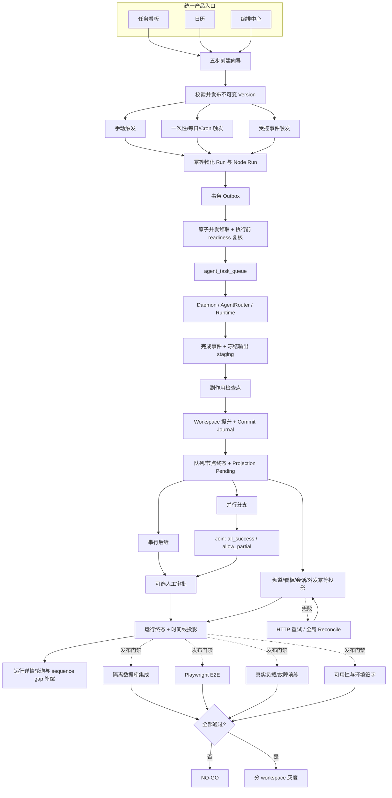

# AI 员工团队编排：规格实施覆盖矩阵

更新时间：2026-08-07

代码证据：本轮深审起点 `5e3fa1d`，最终范围以本目录所在提交为准

发布结论：**NO-GO**，核心代码已落地，但数据库集成、浏览器端到端、真实容量与环境签字尚未完成。

## 1. 状态口径

| 状态 | 含义 |
| --- | --- |
| `DONE` | 功能代码已实现，并有本地确定性测试、类型检查或静态契约证据 |
| `ENV-BLOCKED` | 代码和测试入口已存在，但必须在隔离 PostgreSQL 或指定测试环境执行 |
| `EXTERNAL` | 需要真实用户、运维、安全或业务负责人完成的外部验收 |
| `R2` | 明确不属于首期代码完成范围，不得作为首期已实现能力宣传 |

完成度只按本表和 [release-checklist.md](./release-checklist.md) 判断。`plans/` 与 [implementation-plan.md](./implementation-plan.md) 中的复选框是施工步骤，不是完成台账。

## 2. 端到端实施视图

## 3. 产品与业务覆盖

| ID | 规格要求 | 状态 | 实现证据 | 验证 / 门禁 |
| --- | --- | --- | --- | --- |
| P01 | 看板、日历、编排中心进入同一创建向导 | `DONE` | `apps/web/features/workflows/`、对应 page 与入口测试 | Web 定向 Vitest |
| P02 | 手动、一次性、每日、Cron、受控事件触发 | `DONE` | `scheduler.ts`、`events.ts`、内部 events route | Scheduler/Event 单测 |
| P03 | Workflow 草稿、不可变版本、DAG 校验 | `DONE` | Domain、DB workflows、`publishing.ts` | Domain/Publishing 单测；DB 实库仍受 T03 约束 |
| P04 | 串行、并行、`all_success` / `allow_partial` 汇聚 | `DONE` | `coordinator.ts`、画布并行助手 | Coordinator 决策单测；实库链路受 T03 约束 |
| P05 | 声明式输入映射与 Artifact 引用传递 | `DONE` | `inputs.ts`、Dispatcher/Coordinator 集成 | Input 单测与类型检查 |
| P06 | 人工审批节点及批准/拒绝推进 | `DONE` | `approvals.ts`、approval bridge、Builder | Approval/Coordinator 单测 |
| P07 | 有限自动重试、人工追加重试、暂停、恢复、取消、失败传播 | `DONE` | `retries.ts`、`coordinator.ts`、运行控制 UI | Control/Coordinator/Web 单测；部分成功重试的实库链路受 T03 约束 |
| P08 | 发布预检与 dispatch 前员工、Runtime、Skill、频道复核 | `DONE` | `validation.ts`、`dispatcher.ts` | Validation/Dispatcher 单测 |
| P09 | Run 最大并发与预计成本预算预检 | `DONE` | 原子 claim、version governance、治理表单 | Publishing/Dispatcher/UI 单测 |
| P10 | 节点级执行超时 | `R2` | 首期未实现 Workflow 独立 timeout/watchdog | 二期需补状态机、恢复与 E2E |
| P11 | 实际 Provider 成本归集与运行中预算熔断 | `R2` | UI 可展示已有成本事件；当前仅做预计成本发布预检 | 二期需完成成本事件桥接和预算暂停 |
| P12 | “从此处继续”、人工接管、失败转人工 | `R2` | 首期仅有失败节点重试、暂停/恢复、取消 | 二期需定义补偿和权限模型 |
| P13 | 可复用模板库/模板发布 | `R2` | 编排中心保留模板空状态，不提供模板 CRUD | 二期产品与数据模型 |
| P14 | 根任务专用投影和最终频道回写 | `R2` | 节点可复用现有频道任务链路；未物化专用 `root_task_id` | 二期定义投影一致性与通知契约 |
| P15 | 暂停只阻止新 dispatch，已领取任务可继续 | `DONE` | start/input-bundle 统一在途门禁 | Completion 纯函数测试；实库路由受 T03 约束 |
| P16 | 同一员工并行任务消息和后续提及隔离 | `DONE` | `source_task_queue_id`、稳定 mention idempotency key、任务级等待消息替换 | Message/Queue 测试；实库受 T03 约束 |

## 4. UI/UX 覆盖

| ID | 规格要求 | 状态 | 实现证据 | 验证 / 门禁 |
| --- | --- | --- | --- | --- |
| U01 | 目标、触发、流程、治理、预览五步向导 | `DONE` | `workflow-builder-client.tsx` | Builder Vitest |
| U02 | 画布、列表替代视图和键盘可达操作 | `DONE` | `workflow-canvas.tsx` | Canvas Vitest；真实无障碍检查受 T04 约束 |
| U03 | 图、字段、输入引用、权限与预算预检定位 | `DONE` | Builder + server validation | Builder/Validation 单测 |
| U04 | 计划/运行/模板 tabs、搜索和状态筛选 | `DONE` | `workflow-list-client.tsx`；模板仅为空状态 | 列表测试；owner 筛选为 `R2` |
| U05 | 运行流程、节点状态、时间线、Artifact、权限操作与断点补偿 | `DONE` | `workflow-run-client.tsx`、服务端 `canControl` 投影、events route | Web 测试；实库刷新链路受 T04 约束 |
| U06 | 桌面与窄屏响应式，无整页横向溢出 | `DONE` | 响应式 Builder/Run/CSS | 1280px、390px 本地视觉抽查；发布前须在 T04 复核 |
| U07 | 5-8 名用户完成率、时长、SUS 指标 | `EXTERNAL` | 研究方案已定义 | 完成率 ≥85%、中位 ≤5 分钟、SUS ≥68 |
| U08 | 副作用不确定时隐藏重试并提示人工补偿 | `DONE` | Run 节点错误码投影与控制门禁 | Run Client/Control 单测 |

## 5. 后端、可靠性与安全覆盖

| ID | 规格要求 | 状态 | 实现证据 | 验证 / 门禁 |
| --- | --- | --- | --- | --- |
| B01 | workspace 隔离表、唯一约束、状态转换 | `DONE` | schema `109`、`packages/db/src/workflows/` | 静态/仓储测试；实库受 T03 约束 |
| B02 | 时区、DST、once/daily/Cron、misfire 语义 | `DONE` | `cron-parser` + `scheduler.ts` | Scheduler 单测 |
| B03 | 事件名称白名单、去重键与受保护入口 | `DONE` | Domain `WORKFLOW_EVENT_NAMES`（`task.completed`、`document.updated`、`message.matched`）+ `events.ts`/`scheduler.ts` 双端校验、`/api/internal/workflows/events` | Event/Scheduler 单测；未知事件拒绝 |
| B04 | lease、Outbox、幂等消费、恢复扫描 | `DONE` | DB outbox、worker、recovery；失败与自动重试原子提交 | Worker/Service 单测；真实故障受 T05 约束 |
| B05 | 复用 `agent_task_queue` 和 daemon completion | `DONE` | Dispatcher 原子 create/link；任务成功/失败与 Workflow 推进原子提交 | 定向单测与类型检查；全链路受 T03/T04 约束 |
| B06 | 原子并发领取，避免超限 dispatch | `DONE` | DB `FOR UPDATE` claim + governance snapshot | 纯函数/类型检查；并发实库受 T03 约束 |
| B07 | 最终失败、审批拒绝、Join 与下游终态传播 | `DONE` | 按图关系识别被部分 Join 消化的失败；审批拒绝立即终止活动分支 | Coordinator 决策单测；实库拒绝链路受 T03 约束 |
| B08 | secret 不入图、诊断脱敏、低基数指标 | `DONE` | `security.ts`、`observability.ts`、Workflow Provider 错误码归一化 | 安全/观测/Completion 单测 |
| B09 | 执行快照边界 | `DONE` | Run 固化 version/governance，Node 固化员工展示；dispatch 复核当前 readiness | 不宣称已固化模型、Runtime generation、Skill 全量快照 |
| B10 | JSON Schema 运行输入值校验 | `R2` | 首期校验引用语法和上游可达性，不校验任意业务 schema | 二期接入 schema registry/AJV 运行校验 |
| B11 | 输出副作用检查点、Workspace 提升和业务投影分阶段提交 | `DONE` | complete route、local daemon、`task_commit_journal`、共享 staging；local daemon 在完成事务边界内持久化 token usage | Completion/Output Bundle/Token Usage 定向测试；原子性受 T03 约束 |
| B12 | 提交后崩溃、跨 workspace 对账与 HTTP 即时重驱 | `DONE` | 全局 stale journal scan、committed crash-gap recovery、幂等 finalizer、共享 `projectTaskCompletion`；频道消息已存在时仍按稳定消息/分片键补偿 Feishu outbox；独立 `/api/cron/task-commit-reconcile` 由 local/remote maintenance 调用 | Reconciliation/Route 定向测试；outbox DB 幂等测试受 T03/T05 约束 |
| B13 | Daemon/Runtime 心跳竞态与孤儿任务回收 | `DONE` | 条件离线更新、队列/Workflow 原子失败、重试策略 | Daemon/Recovery 测试入口已补；实库受 T03/T05 约束 |
| B14 | 完成附件、频道回复与 AI 输出提及幂等 | `DONE` | task namespace 附件 ID、`source_task_queue_id` 回复、稳定队列键 | Output/Message/Queue 定向测试；实库受 T03 约束 |
| B15 | 首期节点白名单与跨 workspace Run/Node Run 护栏 | `DONE` | Domain/DB 强制 `employee_task|join|approval`，Run 创建核对 Definition/Version/Trigger/root task，Node Run 物化核对 Run workspace | Domain 单测；DB 实库受 T03 约束 |

## 6. 迁移、部署与运营覆盖

| ID | 规格要求 | 状态 | 实现证据 | 验证 / 门禁 |
| --- | --- | --- | --- | --- |
| M01 | Legacy dry-run、稳定映射和冲突统计 | `DONE` | `scripts/workflows/migrate-legacy.ts`、migration service | 夹具单测；真实数据受 M05 约束 |
| M02 | `legacy_only` 到 `legacy_archived` 单一 trigger owner | `DONE` | feature flags 与路由适配 | Feature flag 单测 |
| M03 | Worker Docker/systemd/Compose 只连接共享依赖 | `DONE` | `deploy/workflow-worker/`、`deploy/self-hosted/` | 静态部署契约；无内置 PG/Redis/RabbitMQ |
| M04 | 回滚、Outbox、gap、重复 Run、Runtime、留存手册 | `DONE` | `runbooks/workflow-operations.md` | 文档与脚本静态检查 |
| M05 | 真实迁移、镜像构建、测试环境切流 | `ENV-BLOCKED` | 执行入口已提供 | 需隔离环境、owner、digest、dashboard 证据 |
| M06 | Jenkins 部署 | `R2` | 本工作站明确禁止 | 未执行；不属于本机完成路径 |

## 7. 验证与发布门禁

| ID | 门禁 | 状态 | 已有证据 | 关闭条件 |
| --- | --- | --- | --- | --- |
| T01 | Domain/Service/Web/Worker 定向测试 | `DONE` | 2026-08-07：Domain/Service 33 项、Web Completion/Reconcile/Cron 18 项、CLI Completion/Client 4 项及部署配置 13 项通过 | 数据库、TOS 与浏览器链路分别由 T03/T04 管理 |
| T02 | Workflow 相关类型检查、ESLint、diff check | `DONE` | Web/CLI 及依赖包类型检查、定向静态检查通过 | 最终提交前复跑 diff/link/lint check |
| T03 | PostgreSQL 仓储、事务、并发、提交恢复和迁移集成 | `ENV-BLOCKED` | Journal/Queue/Message/Route/Reconciliation/Recovery 测试文件已存在 | 提供 `DOFE_AGENT_TEST_DATABASE_URL` / 隔离 PostgreSQL 后全绿 |
| T04 | Playwright 五场景与最新 UI 视觉/无障碍复核 | `ENV-BLOCKED` | E2E 场景已编写、类型可检查 | 隔离测试库 + 本地/测试站点执行通过 |
| T05 | 真实 1000 Trigger / 100 Run / 并发 20 与故障演练 | `ENV-BLOCKED` | 有受限模拟脚本，不等同真实容量证据 | P95 ≤60s、零重复、清理成功、恢复证据齐全 |
| T06 | 目标用户可用性验证 | `EXTERNAL` | 任务脚本和指标已定义 | 5-8 人指标达标，P0/P1 清零 |
| T07 | 产品、工程、安全、运维签字 | `EXTERNAL` | 清单已预留 | 所有责任人和证据链接填写完成 |

## 8. 当前剩余路径

1. 在隔离 PostgreSQL 上执行 T03，先验证 schema `109`、事务幂等、并发领取和真实 legacy dry-run。
2. 通过 T03 后执行 T04 五场景，并复核最新治理/节点配置在 1280px 与 390px 下的布局、键盘和可访问名称。
3. 在受控测试 workspace 执行 T05，记录原始结果、清理结果、镜像 digest 和 dashboard。
4. 完成 T06、T07 后，才允许按 workspace 从 `legacy_only` 灰度；任何未关闭项都保持 `NO-GO`。
