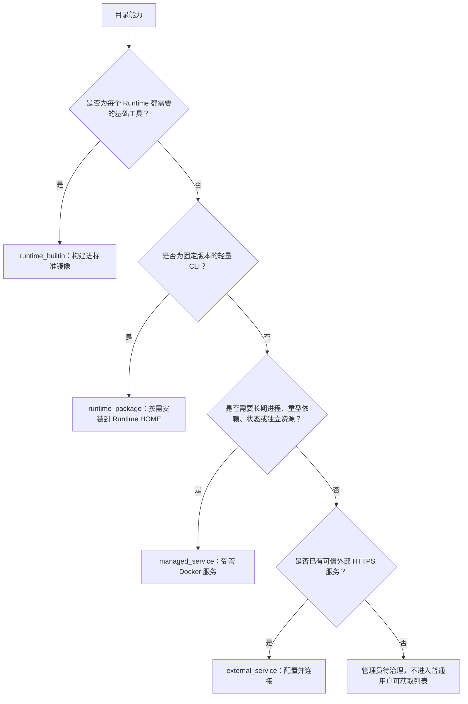

# 方案总览与产品决策

## 1. 问题定义

当前市场把“目录中存在”与“当前 Runtime 可以安装”放在同一列表中。用户选择应用后，可能看到“不可安装”和一个禁用的“安装”按钮，原因却是：

- 上游版本为 `latest`，没有不可变 release；
- 安装声明无法转换为受控执行计划；
- 依赖桌面、本地服务或交互登录；
- 缺少 npm、Python、pip 或 CLI-Hub；
- 需要凭据，但目录没有安全配置流程；
- 服务实际上应该以独立 Docker 容器运行，而不是安装到 Runtime。

这些原因属于不同责任人，却被压缩成同一个“不可安装”结果。普通用户无法判断是自己需要配置、管理员需要部署，还是目录维护者需要修复。

### 1.1 已确认的三类证据

1. 上游公共目录包含大量 `latest`、自由安装命令和本地应用依赖，目录可发现不等于远程 Runtime 可安装。
2. 现有预检会正确拒绝可变版本、不安全命令和不支持的策略，但页面只提供禁用按钮，缺少可执行的下一步。
3. Provider Runtime 镜像已包含 Node/npm、Python/pip、Chromium 和 git 等主要基础工具；大多数阻塞并非“服务器什么都没装”，而是 release 治理与部署类型不匹配。

## 2. 目标与非目标

### 2.1 目标

- 普通用户从目录到能力可用，始终有明确的下一步。
- 管理员能在页面完成审核、部署、配置、升级和故障处理，无需手动进入服务器。
- Docker Runtime 提供稳定的基础环境，减少重复准备和环境差异。
- 轻量 CLI、重型服务和外部服务使用与其运行特征匹配的部署方式。
- 保留固定版本、完整性、签名、隔离、最小权限和审计门禁。
- 服务首次启用时间可控，同时避免预运行大量闲置容器。

### 2.2 非目标

- 不支持把任意 shell 命令提交给 Runtime 或宿主机执行。
- 不允许 Runtime、MCP Worker 或业务服务挂载 Docker socket。
- 不把所有 CLI 包装成 Docker 服务。
- 不把所有服务容器长期预启动。
- 不在本方案的 Dockerfile/Compose 中创建 PostgreSQL、Redis 或 RabbitMQ。
- 不使用本机 Jenkins 进行部署或验证。

## 3. 方案比较

| 方案 | 用户体验 | 运维成本 | 安全与隔离 | 结论 |
| --- | --- | --- | --- | --- |
| 所有应用构建进 Runtime 镜像 | 首次使用快 | 镜像巨大，更新任一应用都要重建 | 供应链面和攻击面扩大 | 不采用 |
| 所有应用首次使用时执行上游命令 | 看似简单 | 失败类型多，难复现 | 无法保证固定版本和命令安全 | 禁止 |
| 所有能力都运行成 Docker 服务 | 入口统一 | 大量适配器、容器和网络开销 | 隔离较好 | 仅用于服务型能力 |
| 管理员手动部署，页面只展示结果 | 实现快 | 高度依赖人工，状态容易漂移 | 难以证明配置一致 | 仅作为过渡导入方式 |
| 基础镜像 + 受控 CLI + 受管服务 + 外部连接 | 用户入口统一 | 可分层治理和自动化 | 保留现有安全边界 | **采用** |

## 4. 能力分类决策树

### 4.1 `runtime_builtin`

标准 Runtime 镜像应包含：

- Node.js 与 npm；
- Python 3 与 pip；
- CLI-Hub 固定版本；
- Chromium；
- git、ca-certificates；
- Runtime 安装执行器与健康探针。

镜像只承载稳定、跨能力复用的工具，不承载具体业务 CLI。版本随 Runtime image release 固定，并通过 readiness 上报。

### 4.2 `runtime_package`

仅接受可以生成确定性安装计划的包：

- npm：`package@1.2.3`；
- PyPI：`package==1.2.3`；
- 审核后的 artifact URL + SHA-256；
- 固定 Git commit 的受支持来源。

安装目标为 Runtime 私有 HOME 或依赖目录，不修改 Provider 基础镜像，不使用宿主机全局状态。

### 4.3 `managed_service`

适用于：

- OpenMontage、视频/音频/图像流水线；
- 浏览器服务和需要独立 Chromium 生命周期的能力；
- 长期运行的 MCP Server；
- 有独立 CPU、内存、状态卷、网络和健康要求的能力；
- 不应接触 Provider HOME 的第三方服务。

使用固定 image digest、签名验证、资源限制、只读根文件系统、最小网络和独立身份。用户启用能力时由受管节点编排，不要求管理员 SSH 到服务器。

### 4.4 `external_service`

适用于供应商托管的 HTTPS MCP/API。平台只保存经过声明的 endpoint、密钥引用、网络白名单和批准工具，通过连接验证后向任务暴露。

### 4.5 Runtime 能力协商，不按 local/remote 粗暴分流

`daemonMode=local|remote` 描述 daemon 和工作目录所在位置，不等于能力的运行方式。远程受管 Docker Runtime 只要拥有持久可写 HOME、受控安装执行器和匹配的基础工具，就仍然可以安全安装 CLI；本地 Runtime 也可以连接远程 MCP 或受管服务。

因此不采用“remote 只能 MCP，local 才能 CLI”的规则。目标矩阵为：

| Runtime 类型 | Runtime CLI | MCP / 受管服务 |
| --- | --- | --- |
| Local Runtime | 支持 | Gateway/网络满足时支持 |
| Remote 受管 Docker Runtime | 持久 HOME 和安装器满足时支持 | Gateway/网络满足时支持 |
| Remote 只读或第三方 Runtime | 不支持 | 支持时优先使用 |
| 无 MCP Gateway 的 Runtime | CLI 条件满足时支持 | 不支持 |

服务端按以下顺序选择路径：

1. 读取 release 的 `deployment_mode` 和允许的实现；
2. 读取 Runtime execution profile，而不是只读取 `daemonMode`；
3. 应用工作区安全、网络、凭据和管理员策略；
4. 只有一条可用路径时自动选择；
5. CLI 与 MCP 都可用时按能力特征推荐，管理员可在高级设置中切换。

推荐规则：

- 需要 Runtime 本地文件、工作目录、原生命令或低延迟进程时优先 CLI；
- 重型依赖、长期进程、共享状态、独立扩缩容或服务密钥时优先 MCP/managed service；
- 第三方只读 Runtime 不允许落盘安装时使用 MCP-only；
- 普通用户不直接选择“local/remote/CLI/MCP”，只看到系统推荐的“安装”或“连接”。

## 5. 供应策略

### 5.1 不全部预运行

100 个目录条目不应对应 100 个持续运行的容器。推荐按热度分层：

| 层级 | 策略 | 适用对象 |
| --- | --- | --- |
| 基础层 | 构建进 Runtime 镜像 | Node、Python、CLI-Hub、Chromium |
| 镜像缓存层 | 管理节点提前 `pull` 并校验 | 已审核的常用 managed service |
| 暖实例层 | 保持少量 ready 实例 | 高频且启动慢的核心服务 |
| 按需层 | 首次启用时启动，空闲后回收 | 低频或资源昂贵服务 |
| 外部层 | 只验证连接 | 第三方托管服务 |

### 5.2 管理员请求机制

当能力已审核但目标节点未准备好时：

- 普通用户点击“申请管理员部署”；
- 系统创建结构化部署请求；
- 管理员在“能力待办”中批准或拒绝；
- 批准后系统自动预拉镜像、部署、健康检查、授权并连接；
- 原请求人可持续查看进度，并在完成后收到站内通知。

若用户本身是管理员，主按钮直接显示“部署并启用”，无需先创建人工申请。

## 6. 最终产品合同

对普通用户，目录中的每一项必须属于以下一种可解释状态：

- `安装`：系统可以自动完成；
- `连接`：服务已存在，只需配置连接；
- `配置凭据`：用户或管理员需要提供声明字段；
- `申请管理员部署`：基础设施尚未准备；
- `处理中`：已有安装或部署任务；
- `暂未开放`：目录尚未通过治理，不提供无效主按钮。

“不可安装”只作为管理员诊断分类，不再作为普通用户的最终行动状态。

## 6. 实施状态（2026-08-11）

- **决策落地**：四种部署模式 + 用户面 9 个 nextAction + 统一 envelope。详见 `README.md` §6。
- **未落地**：目录 release 治理（Phase 3）、managed service lifecycle 接入（Phase 5）。
