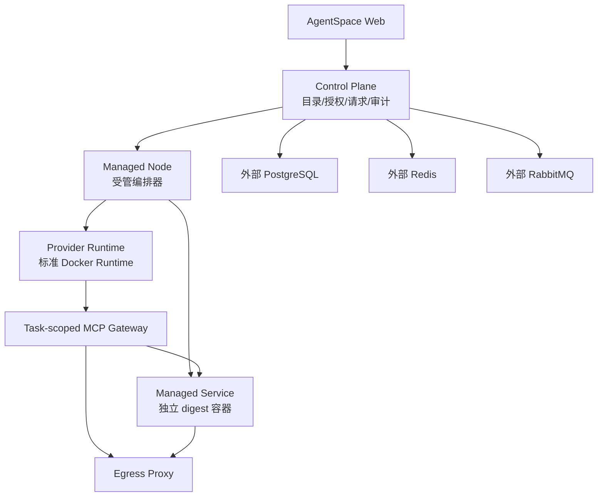
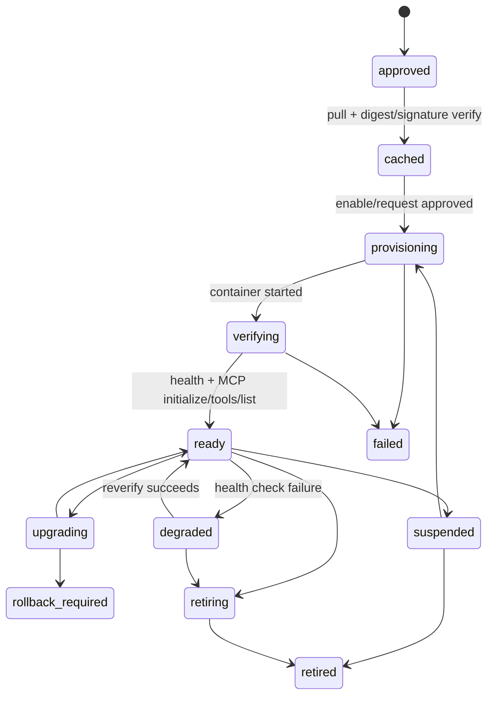

# Docker 服务与 Runtime 部署架构

## 1. 架构原则

1. Runtime 是 AI 员工的执行边界，不是任意 Docker 编排器。
2. 只有受管节点可以创建服务容器；Provider、Runtime 和浏览器不能获得 Docker socket。
3. CLI 安装进入 Runtime 私有 HOME，managed service 运行在独立容器。
4. 服务通过受管 connection reference 接入 MCP Gateway，浏览器不持有私网 endpoint。
5. 镜像以 digest 固定，必要时使用 cosign 公钥验证后才能拉取。
6. PostgreSQL、Redis、RabbitMQ 使用外部集中管理实例，不由应用部署创建。
7. `daemonMode` 不作为 CLI/MCP 分流开关；Runtime 通过 execution profile 声明实际能力。

## 2. 逻辑拓扑



应用部署只连接右侧外部依赖，不在本仓库 Docker Compose 中声明这些依赖服务。

## 3. 标准 Runtime 镜像

### 3.1 基础层

Provider Runtime 镜像应明确声明并锁定：

```text
Node.js      固定 major/minor/patch，包含 npm
Python       固定 minor，包含 python3 -m pip
CLI-Hub      固定版本，安装到受控 PATH
Chromium     与浏览器 MCP 兼容的发行版本
git          仅在目录批准的安装计划需要时保留
ca-certificates
dofe-agent-daemon 与 runtime-app executor
```

Dockerfile 只负责基础环境，不复制用户私有 CLI，也不写入工作区密钥。

### 3.2 Readiness 合同

Runtime heartbeat 或注册时上报：

```ts
interface RuntimeReadiness {
  checkedAt: string;
  architecture: string;
  writableHome: boolean;
  persistentHome: boolean;
  runtimePackageExecutor: boolean;
  mcpGateway: boolean;
  managedServiceReachable: boolean;
  node: { available: boolean; version?: string };
  npm: { available: boolean; version?: string };
  python: { available: boolean; version?: string };
  pip: { available: boolean; version?: string };
  cliHub: { available: boolean; version?: string };
  chromium: { available: boolean; version?: string };
  networkProfile: string;
  diskAvailableBytes?: number;
}
```

readiness 是部署决策输入，不是用户可修改的前端布尔值。若检查过期，状态应为“需要重新检查”，而不是直接声称可安装。

### 3.3 Local/Remote 语义

`local` 和 `remote` 只描述 daemon/工作目录位置。能力支持由 readiness/execution profile 决定：

| 条件 | CLI 结论 | MCP 结论 |
| --- | --- | --- |
| `writableHome && persistentHome && runtimePackageExecutor` | 可以评估 `runtime_package` | 不受影响 |
| `mcpGateway && managedServiceReachable` | 不受影响 | 可以评估 MCP/managed service |
| Remote 但具备以上全部条件 | CLI 可用 | MCP 可用 |
| Local 但没有 MCP Gateway | CLI 可用 | MCP 不可用 |
| Remote 且只读、无安装器 | CLI 不可用 | MCP 可用时使用 MCP-only |

这避免把远程受管 Docker Runtime 错误降级为 MCP-only，也避免本地 Runtime 因为“本地”标签就被假定支持所有能力。

### 3.4 镜像发布门禁

- 基础镜像来源固定并记录 digest；
- 生成 SBOM 和漏洞扫描结果；
- readiness 探针在构建和启动阶段执行；
- Node/Python/CLI-Hub/Chromium 版本有兼容矩阵；
- 镜像升级先在隔离 Runtime 运行 CLI/MCP smoke tests；
- 基础工具升级不自动升级已安装业务应用。

## 4. CLI Runtime 安装

### 4.1 执行位置

CLI 安装在 Runtime 的隔离目录中：

```text
/dofe-home/.local/bin
/dofe-home/.cli-hub
/dofe-home/.dofe-runtime/apps/<source>/<name>/<release>
```

安装器使用参数数组，不执行目录中的原始 shell 字符串。目标目录、环境变量和 PATH 由 daemon 固定生成。

### 4.2 供应链锁定

CLI release 至少要有：

- 精确版本；
- 包名和入口命令；
- install strategy；
- registry 来源；
- artifact integrity；
- 依赖和凭据声明；
- 验证命令；
- 兼容的 Runtime readiness。

公共目录中的 `latest` 不直接进入普通用户目录。目录同步器应解析候选版本，生成平台 release；无法解析时进入管理员治理队列。

### 4.3 CLI-Hub

CLI-Hub 应作为标准 Runtime 基础工具预装，但 CLI-Hub 目录中的业务应用仍然按 release 安装。预装 CLI-Hub 只解决执行器缺失，不会使未审核的应用自动变为可安装。

## 5. Managed Service 生命周期

### 5.1 状态机



### 5.2 预拉取与启动

管理员批准一个 release 后，受管节点可以执行：

1. 验证 catalog 的 digest、签名和资源模板；
2. `docker pull` 到节点缓存；
3. 将状态置为 `cached`；
4. 不启动业务容器，除非策略要求暖实例；
5. 用户或管理员点击启用时再创建 workspace/runtime scoped 容器；
6. 执行健康检查、MCP initialize 和 tools/list；
7. 成功后创建/更新 connection 为 ready。

镜像缓存是节点级的，容器实例是 workspace/runtime 级的。不能因为同一个镜像被缓存，就把不同工作区的状态、密钥或 session 复用。

### 5.3 容器硬化

默认服务容器：

- digest 固定；
- 非 root 用户；
- read-only rootfs；
- `cap-drop=ALL`；
- 禁止 privileged、host network、host PID；
- 只挂载独立 state volume 或批准的数据集；
- 无 Docker socket、Provider HOME、SSH agent；
- CPU、内存、PID、临时空间和日志速率受限；
- 网络为 `none` 或仅允许 egress proxy；
- stderr 脱敏尾部，不把完整 payload 写入业务日志。

### 5.4 服务容量策略

```text
镜像缓存 -> 实例配额检查 -> 创建实例 -> 健康检查
         -> ready -> 空闲 TTL -> suspend/retire
```

高频服务可设置最小暖实例数；低频服务使用空闲回收。回收前必须确认没有运行中的 task、job 或 pending operation。

## 6. MCP 连接边界

```text
Provider Runtime
  -> task-scoped loopback gateway
  -> daemon MCP client
  -> managed service connection reference
  -> node-local service endpoint
```

浏览器只提交 catalog item、runtime、工具选择和声明配置。真实 endpoint、服务 token、内部网络名称和短期 lease 由服务端解析与注入。

服务只有同时满足以下条件才向任务暴露：

- catalog release 未撤回；
- service instance 为 `ready`；
- connection 为 `ready`；
- approved tools 是当前 discovery 的子集；
- 健康检查没有过期；
- workspace/runtime/task 的授权仍有效。

## 7. 故障处理

| 故障 | 自动处理 | 用户看到 |
| --- | --- | --- |
| 镜像拉取失败 | 指数退避，保留 cached/failed 状态 | 服务部署中或暂时不可用 |
| 签名校验失败 | 立即阻止启动并告警 | 管理员需治理 release |
| 容器启动失败 | 有限重试，记录 failed stage | 管理员已收到故障 |
| MCP 握手失败 | 实例 degraded，禁止新任务 | 服务暂不可用 |
| Runtime 离线 | 暂停安装/连接操作，保留意图 | 等待 Runtime 上线 |
| 节点磁盘不足 | 拒绝新实例，建议清理缓存 | 管理员需释放容量 |
| 服务空闲 | 依据 TTL 回收实例，保留 connection | 下次使用会重新启动 |

## 8. 安全边界

本方案不通过“提前装 Docker 服务”绕过供应链安全。每个服务仍需 immutable release、网络策略、secret schema、工具批准和审计。集中管理的数据库、缓存和消息队列不作为应用服务附带部署。
