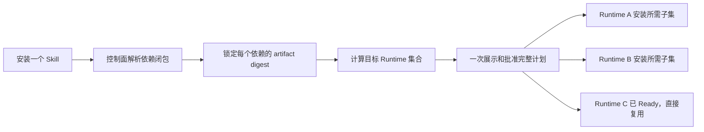

# 01 整体安装方案：依赖闭包统一解析与多 Runtime 批量安装

## 1. 背景与问题

0801 已把“安装”拆成导入内容包、准备依赖、绑定 Runtime 能力、激活到员工四种语义，且 installation 按 Runtime 隔离、artifact 只导入一次。但当前模型是**单 artifact 视角**：安装 `novel-production` 这类编排入口时，用户并不知道它会拉起 5 个生产 Skill、分布在 3 个 Runtime 上，也无法一次审批整个依赖闭包。

问题不是缺一个导入入口，而是缺一条“从根 Skill 到依赖闭包 × 目标 Runtime 集合”的可解释生命周期：

- 用户要逐个处理依赖，或每台 Runtime 分别处理。
- 依赖按显示名称关联，可重命名导致歧义。
- 批量安装并发时“先查询再 INSERT”可能撞唯一键。
- 高风险审批一次只消费一个 installation，批量安装要重复审批。

## 2. 核心结论

**依赖由 AgentSpace 控制面统一解析和锁定，Runtime 只执行安装计划，不自行决定安装哪些 Skill。** 默认也不给所有 Runtime 全量安装，而是安装到“实际会执行该 Skill 的 Runtime 集合”。

- 控制面负责：解析传递依赖、检测循环、检测同名/版本/Runtime 兼容冲突、把版本范围锁定为确切 digest、去重、汇总风险、生成安装项、幂等创建各 Runtime operation。
- Runtime Adapter 只负责：验证环境、复用缓存、执行计划、报告失败。**不能**搜索 Skill、选择版本、修改依赖图、或从任意 URL 下载。

## 3. 三种安装身份

“一个 Skill”在系统里是三个不同对象，身份约束已在 schema 落地：

| 身份 | 约束 | 含义 |
| --- | --- | --- |
| Skill 逻辑身份 | `UNIQUE(workspace_id, name)` | 用户可见、可重命名、可升级的入口 |
| Artifact 内容身份 | `UNIQUE(workspace_id, digest)` | 不可变内容包，只导入一次 |
| Runtime 安装身份 | `UNIQUE(workspace_id, runtime_id, artifact_digest, revision)` | 某个 artifact 在某个 Runtime 的准备结果 |

参见 `packages/db/src/postgres-schema.ts:1303`（skill）、`:3342`（skill_artifact，`UNIQUE(workspace_id, digest)` 在 `:3358`）、`:3517`（skill_installation）。

含义：artifact 只导入一次；同一 artifact 可在多个 Runtime 各有一份 installation；安装不能跨 Runtime 偷用。依赖解析锁定的是 digest，不是显示名称。

## 4. Runtime 范围（目标集合）

安装计划必须显式计算“目标 Runtime 集合”，而不是默认全量。提供三个范围：

| 范围 | 行为 | 使用场景 |
| --- | --- | --- |
| 当前员工/当前 Workflow | 自动计算涉及的 Runtime，推荐默认值 | 日常使用 |
| 指定 Runtime | 管理员多选 | 预热、灰度验证 |
| 所有兼容 Runtime | 显式批量操作，不作为默认 | 工作区公共 Skill |

对应到小说 Workflow：

- 五个 Skill 若都由一个 Runtime 执行，就一次性把五个装到该 Runtime。
- 若角色/场景/剧本/分镜由不同员工执行，只装到各自绑定的 Runtime。
- `novel-production` 编排 Skill 只装到协调者 Runtime。
- Workflow 发布或运行前做 preflight；缺安装就生成计划并等 `ready`，**不能在任务执行中途临时安装**。

## 5. 安装计划与一次审批

当前高风险审批是单 installation 消费一次（`packages/services/src/skills/installations.ts:140`：`consumeSkillInstallApprovalSync` 消费一次即置 `consumedAt`）。批量安装需要新的审批载体 `skill_rollout_plan`：

> 一次审批绑定“依赖闭包 + 目标 Runtime 集合 + planDigest”，由所有子安装引用该批准记录。

planDigest 由依赖闭包（各 artifact digest 的有序集合）、目标 Runtime 集合、`policyVersion`、风险项集合共同哈希得到。任何一项变化都会产生新的 planDigest，必须重新审批。子安装引用 `rolloutPlanId` 而非各自消费独立审批。

用户体验收敛为**一个操作**：

> 安装 `novel-production` → 页面提示“将补齐 5 个 Skill，涉及 3 个 Runtime，12 项已就绪、3 项待安装”，一次确认后并行下发各 Runtime 子安装。

## 6. Runtime Adapter 职责边界

把“决定装什么”和“怎么装”彻底分离，是防止 Runtime 越权、保证可复现的关键：

| 允许 | 禁止 |
| --- | --- |
| 验证目标环境与缓存 | 自行搜索 Skill、解析版本范围 |
| 复用已就绪的缓存/环境 | 修改依赖图或替换 digest |
| 执行控制面下发的安装项 | 从任意 URL 下载 artifact |
| 上报成功/失败与脱敏证据 | 自行决定跳过或降级必需项 |

安装项必须来自 planner 生成的参数数组（精确版本 + integrity + allow-listed registry），与 0801 依赖隔离安装的约束一致。

## 7. Preflight 与 Workflow 激活门禁

Workflow 发布/运行前执行 preflight：

1. 遍历图中所有 `employee_task` 节点声明的 `requiredSkillIds`。
2. 对每个 Skill 解析依赖闭包并锁定 digest。
3. 映射到节点绑定的员工 → Runtime。
4. 校验每个 `Runtime × Artifact` 是否已有 `ready` installation（复用 `readHighestRevisionSkillInstallationSync` 语义）。
5. 缺项则生成 rollout plan，等待 `ready`；必需目标全部 `ready` 后才允许 Workflow 激活。

这与现有 `validateWorkflowNodeDependencies`（`packages/services/src/workflows/validation.ts:228`，缺失即 `workflow_skill_not_ready`）一致，只是把“已分配 Skill”升级为“已解析依赖闭包且各 Runtime ready”。

## 8. 与 0801 的衔接

- 0801 的 artifact 校验、依赖隔离安装、Skill Runner、release lock、风险逐项审批、`ready` 语义全部保留。
- 0815 只在其上增加**闭包解析层（planner）**和**批量审批载体（rollout plan）**，不改变单个 installation 的执行路径。
