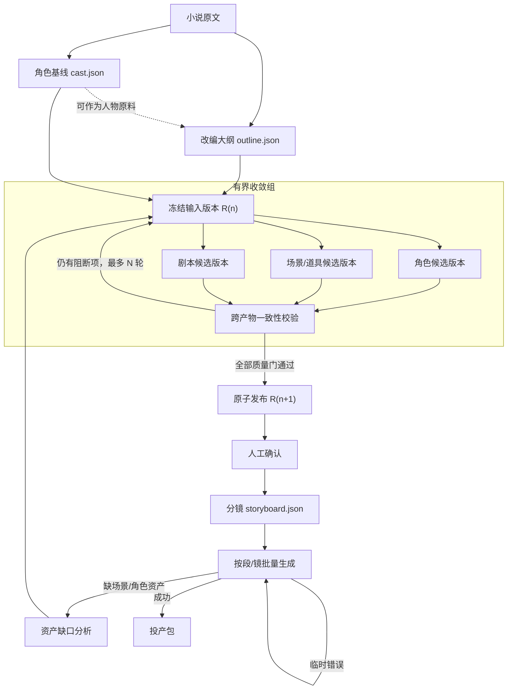

# 03 novel-production 编排落地

## 1. 决策：不合并成超级 Skill

不建议把 5 个 Skill 合并成一个“大 Skill”。更合适的结构是：

- 5 个现有 Skill 保持独立，继续作为可单独升级、校验、重跑的 Module。
- AgentSpace Workflow 负责顺序、并行、审批、重试和产物传递。
- 新增一个很薄的 `novel-production` 编排 Skill，作为用户入口，只负责收集参数、启动 Workflow、解释进度，不在内部复制五套实现。
- 新增真正缺失的“批量生成”和“失败归因”能力。

上游仓库本身也是这样定位的：五个 Skill 独立交付 JSON，并强调剧本、场景、角色同步迭代，分镜不做新决策。

## 2. 现有 Skill 的契约

| Module | 主产物 | 主要输入 |
| --- | --- | --- |
| `novel-characters` | `cast.json` | 小说原文 |
| `novel-outline` | `outline.json` | 原文，可复用 `cast.json` |
| `novel-art` | `art.json` | `outline.json` + `cast.json` |
| `novel-script` | `script.json` | `outline.json` + `art.json` + `cast.json` |
| `novel-storyboard` | `storyboard.json`、生成批次单 | `script.json` + 前述资产 |

其中 `novel-storyboard` 明确不负责视频生成与剪辑，所以图里最后的“批量生成”不是现有五个 Skill 能完成的，需要增加 `shot-generation` Module 和不同视频模型的 Adapter。

## 3. 目标流程图



## 4. 新增能力

### 4.1 novel-production 编排 Skill（薄入口）

只做三件事：收集参数（原文、目标集数、画风、预算等）→ 启动 Workflow → 解释进度。所有生产逻辑留在五个独立 Skill 里，不在编排 Skill 里复制。

### 4.2 shot-generation Module + Adapter

`storyboard.json` 只描述“要生成什么”，不执行生成。新增 `shot-generation` Module 读取批次单，按视频模型 Adapter 逐批生成；临时错误重试、缺资产时进入失败归因。

### 4.3 失败归因（资产缺口分析）

批量生成失败分两类：

| 失败类型 | 处理 |
| --- | --- |
| 临时错误（限流、超时、瞬断） | 就地重试（图上 `G -->|"临时错误"| G`） |
| 缺场景/角色资产（结构性缺口） | 资产缺口分析 → 回填到收敛组的输入版本 `R` |

归因产物应可解释：指出是哪个镜、缺哪个角色/场景资产、回到哪一轮收敛。

## 5. AgentSpace Workflow 现状与两步落地

### 5.1 现状约束

当前图只有 `employee_task`、`join`、`approval` 三种节点，并明确拒绝环路（`packages/domain/src/workflows.ts:1`，`workflow_graph_cycle`）。因此不能把上面的三角循环直接画进现有 Workflow。

### 5.2 第一步：静态展开两轮 DAG（不修改引擎）

把收敛轮次静态展开成两轮或三轮 DAG：

```text
候选生成(角色/场景/剧本 并行) → Join → 一致性校验 → [有阻断] 下一轮候选生成 → Join → 一致性校验 → [仍阻断] 人工审批
```

- 每轮是一段无环 DAG；超过轮次进入 `approval` 节点（人工决策）。
- 产物按 `Artifact Revision` 传递（见 02 §4），每轮产生 `cast/art/script` 的新 revision。
- `quality-report.json` 作为 Join 后校验节点的输入，决定是否进入下一轮。

### 5.3 第二步：iteration_group / 子 Workflow 节点（产品化后）

增加 `iteration_group` 或“子 Workflow”节点：

- 内部允许有界迭代，外部仍是一个深 Module。
- Interface 只暴露 `maxRounds`、质量门、超限策略和输入输出版本集。
- 收敛组收敛成一个外部节点，图结构不再被展开。

## 6. 256 KB 约束与产物传递

节点 `outputJson` 通道目前有 256 KB 上限（`packages/services/src/workflows/completion.ts:21`，`MAX_WORKFLOW_OUTPUT_BYTES = 256 * 1024`）。大型 JSON、报告和图片不能放进 `outputJson`：

- 节点只返回 artifact ID、digest 和校验摘要。
- 完整文件走 artifact manifest（`inputs.ts` 的 `collectWorkflowArtifactRefs` 已能汇总上游 artifact 引用）。

这样既规避了 256 KB 限制，也让大产物可寻址、可校验、可复现。

## 7. 最终产品形态

**Workflow 模板 + 编排入口 Skill + 独立生产 Skill**，而不是一个包含全部逻辑的超级 Skill。

| 层 | 职责 | 交付物 |
| --- | --- | --- |
| 生产 Skill（5 个 + shot-generation） | 单一生产步骤，可独立升级/校验/重跑 | `cast/outline/art/script/storyboard` JSON |
| Workflow 模板 | 顺序、并行、审批、重试、收敛、产物传递 | 两轮收敛 DAG |
| 编排入口 Skill | 收集参数、启动 Workflow、解释进度 | 一次调用 |

## 8. 安装到 Runtime 的映射

衔接 01 §4 的目标 Runtime 集合：

- 若五个 Skill 都由一个 Runtime 执行：一次性把五个装到该 Runtime。
- 若角色/场景/剧本/分镜由不同员工执行：只装到各自绑定的 Runtime。
- `novel-production` 编排 Skill 只装到协调者 Runtime。
- `shot-generation` 装到实际执行视频模型 Adapter 的 Runtime（通常带 GPU/出网能力）。

下一步应先定义 `cast/art/script/storyboard` 的 Artifact Revision 契约和统一 `quality-report.json`，然后用现有 DAG 落地一个两轮收敛的 `novel-production` Workflow 模板。
