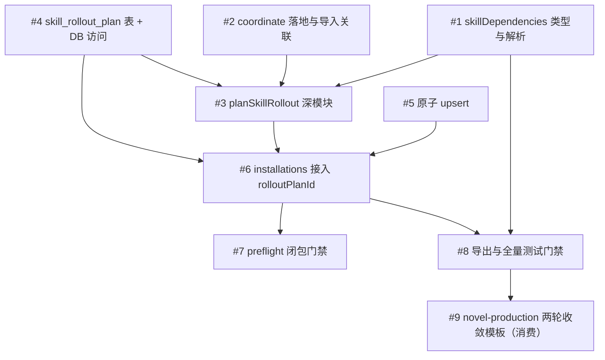

# 06 Issue 拆解与 PR 顺序

把 [05-SkillRolloutPlan落点与测试矩阵.md](./05-SkillRolloutPlan落点与测试矩阵.md) 的改动拆成**可独立交付、可独立验证**的 issue/PR。每个 issue 一个主题、一份验收、一个依赖关系；合并门禁是“测试绿 + 不破坏既有单装路径”。

## 1. Issue 依赖关系

- I1/I2/I4/I5 互不依赖，可并行开工。
- I6 汇聚 I3+I4+I5，是核心集成点。
- I9 是业务消费场景，依赖 I8 全部能力，可延后。

## 2. Issue 清单

### Issue #1 —— skillDependencies 领域类型与 frontmatter 解析

- **目标**：确立 Skill→Skill 依赖的数据模型与解析入口，不触碰安装链路。
- **范围**：
  - `packages/domain/src/skill-package.ts`（新增 `SkillSkillDependency` / `SkillSkillPlacement`）
  - `packages/services/src/skills/dependencies.ts`（新增 `parseSkillSkillDependencies`）
  - `packages/services/src/skills/skill-artifacts.ts`（manifest 增加字段）
  - `packages/services/src/skills/release-lock.ts`（lock 纳入声明）
- **验收**：T01–T05 通过；旧 frontmatter 不含 `skillDependencies` 时行为不变。
- **依赖**：无。

### Issue #2 —— coordinate 落地与导入关联

- **目标**：让依赖身份可寻址，摆脱显示名称歧义。
- **范围**：
  - `packages/db/src/postgres-schema.ts`（`skill_artifact.coordinate` 列 + 索引）
  - `packages/db/src/skill-artifacts.ts`（`readSkillArtifactsByCoordinateSync`）
  - `packages/services/src/skills/import.ts`（导入写 coordinate）
- **验收**：T20 通过；无 coordinate 的历史 artifact 不受影响。
- **依赖**：无。

### Issue #3 —— planSkillRollout 深模块

- **目标**：闭包解析 + digest 锁定 + 目标 Runtime + 去重 + planDigest。
- **范围**：
  - `packages/services/src/skills/rollout.ts`（新）
  - `packages/services/src/skills/rollout.test.ts`（新）
- **验收**：T06–T12 通过；循环 fail-closed；planDigest 顺序无关。
- **依赖**：#1、#2、#4。

### Issue #4 —— skill_rollout_plan 表 + 记录类型 + DB 访问

- **目标**：一次审批绑定“依赖闭包 + Runtime 集合 + planDigest”的持久化载体。
- **范围**：
  - `packages/db/src/postgres-schema.ts`（新表 + `skill_installation.rollout_plan_id`）
  - `packages/db/src/types.ts`（`SkillRolloutPlanRecord`）
  - `packages/db/src/skill-rollout-plans.ts`（新）
  - `packages/db/src/skill-rollout-plans.test.ts`（新）
- **验收**：T13–T15 通过；`UNIQUE(workspace_id, plan_digest)` 幂等。
- **依赖**：无。

### Issue #5 —— createSkillInstallationSync 原子 upsert

- **目标**：消除并发批量安装撞唯一键。
- **范围**：`packages/db/src/skill-installations.ts`（`createSkillInstallationSync` 改 ON CONFLICT）
- **验收**：T16 通过；幂等语义不变。
- **依赖**：无。

### Issue #6 —— installations 接入 rolloutPlanId（审批消费改造）

- **目标**：批量安装引用一次审批，替代逐 installation 消费。
- **范围**：
  - `packages/services/src/skills/installations.ts`（`createSkillInstallationPlanSync` 增加 `rolloutPlanId`）
  - `packages/services/src/skills/installations.test.ts`
- **验收**：T17–T19 通过；无 `rolloutPlanId` 时走旧单装路径（回归）。
- **依赖**：#3、#4、#5。

### Issue #7 —— preflight 依赖闭包门禁

- **目标**：Workflow 发布/运行前校验“闭包已解析 + 各 Runtime ready”。
- **范围**：`packages/services/src/workflows/validation.ts`（`validateWorkflowNodeDependencies`）
- **验收**：T21–T22 通过；缺项产出 `workflow_skill_closure_not_ready`。
- **依赖**：#6。

### Issue #8 —— 导出与全量测试门禁

- **目标**：对外暴露能力并关闭测试门禁。
- **范围**：
  - `packages/services/src/index.ts`
  - `packages/db/src/index.ts`
- **验收**：新符号可 import；全量 API 测试 `--maxWorkers=2` 通过。
- **依赖**：#1–#7。

### Issue #9 —— novel-production 两轮收敛模板（消费场景）

- **目标**：用真实场景验证整条链路，不新增引擎能力。
- **范围**：
  - 两轮收敛 `novel-production` Workflow 模板（`cast/outline/art/script` 候选 → Join → 一致性校验 → 下一轮 → 超限 approval）
  - 薄编排入口 Skill（收集参数 + 启动 + 解释进度）
  - `shot-generation` 骨架 + 失败归因占位
- **验收**：ACC-07/09/10（见 04）通过；模板经 `validateWorkflowGraph` 无 cycle。
- **依赖**：#8。

## 3. 每个 Issue 的提交约定

- 提交前 `git add -A` 纳入新文件；commit message 用中文，简述本次改动。
- 每个 issue 一个 PR，`test` 门禁必须绿；不允许“先合入后补测试”。
- 单文件测试用 `pnpm --filter <pkg> exec jest <file> --runInBand`；涉及并发/幂等的用例（T16）必须覆盖。

## 4. 合并顺序与回滚边界

- 推荐顺序：#1、#2、#4、#5（可并行）→ #3 → #6 → #7 → #8 → #9。
- 每个 issue 单独可回滚：schema 变更用 `ADD COLUMN` / `CREATE TABLE IF NOT EXISTS`，不破坏旧数据。
- #6 是唯一改动现有审批消费语义的 PR，必须带向后兼容分支（无 `rolloutPlanId` 走旧路径），并作为最高风险评审点。

## 5. 暂不做（明确排除）

- `iteration_group` / 子 Workflow 节点（引擎改动，见 03 §5.3 第二阶段）。
- 视频模型 Adapter 的真实实现（只留 `shot-generation` 骨架）。
- Runtime Adapter 的网络下载/选版本能力（保持禁止，见 01 §6）。
