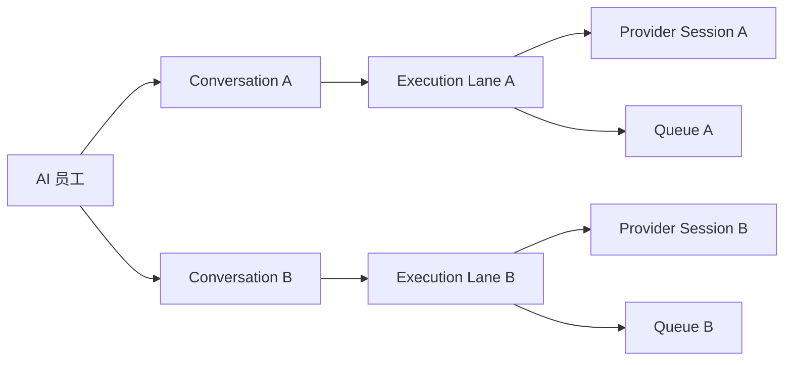

# 产品决策与范围

## 1. 问题定义

用户把“与某个 AI 员工的一次会话”理解为独立工作上下文：可以单独开始、后台运行、回来查看、继续追问，也可以同时开启另一项工作。

当前产品却把以下概念压缩成了一个对象：

- AI 员工；
- 私聊 channel；
- Provider Session；
- 当前运行任务；
- 员工级任务队列；
- 页面显示的消息历史。

因此出现两个 P0 体验问题：

1. 用户 `/new` 后发送消息，又回到旧会话，无法确认新会话是否成立。
2. 旧会话正在运行时，新会话显示“排队中”，让用户误以为一个 AI 员工一次只能处理一个会话。

### 1.1 已确认的证据

| 证据 | 现象 | 产品影响 |
| --- | --- | --- |
| 用户截图 | `/new` 后新消息出现在原来的长消息流 | 新建动作不可预测，信任受损 |
| 页面路由 | 新建状态只有 `new=1`，发送后只保留员工 focus | 没有稳定会话地址，必然回到员工默认流 |
| 本地历史 | 历史快照存储于浏览器 `localStorage` | 无法跨设备恢复，也不能作为调度身份 |
| Router 身份 | 登录用户的聊天按 requester 聚合 | 同一用户的多个会话共享 Router Session |
| 队列领取 | active task 按“用户 + 员工”阻塞 | 不同会话被错误串行 |
| Daemon 活动模型 | 同一 Runtime 已支持多个 task count | 员工级排队不是 Runtime 的硬性限制 |

## 2. 核心产品模型

### 2.1 AI 员工是联系人，不是会话

AI 员工提供身份、能力、权限、模型和 Runtime 绑定。它可以拥有多个会话，但不直接拥有“当前唯一消息流”。

### 2.2 Conversation 是用户可感知的一等对象

Conversation 表达一次连续工作上下文，拥有：

- 不可变 ID；
- 所属 workspace、发起人和 AI 员工；
- 独立消息流；
- 一句话摘要；
- 独立运行状态；
- 独立历史入口；
- 一个或多个 Execution Lane。

### 2.3 Execution Lane 是技术串行边界

直接私聊中，一个 Conversation 只有一个 AI 员工，因此只有一个 Execution Lane。

群聊中，一个 Conversation 可能触发多个 AI 员工。为避免两个员工互相阻塞，技术上使用 `conversationId + employeeId` 形成 Execution Lane。用户仍只看到一个会话，系统在会话内部维护多个员工执行泳道。

### 2.4 Provider Session 归属于 Execution Lane

Provider Session 不能归属于员工或 channel。新 Conversation 必须产生新的 Router Session，首次执行产生新的 Provider Session；后续消息只恢复同一 Execution Lane 的 Provider Session。

## 3. 设计原则

1. **边界可见**：页面标题、URL、历史和运行状态都指向同一个 Conversation。
2. **默认并行**：不同 Conversation 默认可并行，同一 Conversation 默认有序。
3. **状态就近**：运行中、排队、失败只显示在对应会话，不污染员工列表中的其它会话。
4. **动作可逆**：创建新会话不结束旧会话；切换只是导航，不改变后台执行。
5. **真实持久化**：历史、摘要和恢复身份由服务端保存，浏览器缓存只用于加速。
6. **兼容降级**：Runtime 容量不足时显示资源等待，不能伪装成会话逻辑排队。
7. **一致反馈**：`/new`、新建按钮和深链 `/new` 必须调用同一创建流程。

## 4. 方案比较

| 方案 | 是否解决回跳 | 是否解决跨会话排队 | 历史可靠性 | 结论 |
| --- | --- | --- | --- | --- |
| 继续使用 `new=1`，发送时清空 session | 否 | 否 | 浏览器本地 | 不采用 |
| 为每个员工增加多个前端 message snapshot | 部分 | 否 | 浏览器本地 | 不采用 |
| 只修改队列 SQL，按 channel 串行 | 否 | 私聊仍只有一个 channel | 服务端仍无会话 | 不采用 |
| Conversation 一等对象 + Execution Lane 队列 | 是 | 是 | 服务端持久化 | **采用** |

## 5. 目标

- `/new` 后 100% 留在新的稳定会话地址。
- 同一 AI 员工的两个 Conversation 可同时运行。
- 同一 Conversation 连续发送多条消息时保持顺序，不产生并发 Provider resume。
- 旧会话在后台运行时，新会话不显示“排在旧会话之后”。
- 历史按 AI 员工聚合，每条记录以一句话摘要识别。
- `/resume` 打开当前 AI 员工的历史，并恢复选中的真实 Conversation。
- 会话在刷新、跨标签页和换设备后仍可访问。

## 6. 非目标

- 本期不重做整个消息中心或联系人系统。
- 不把群聊 channel 拆成多个不可见 channel。
- 不承诺无限并发；资源上限由 Runtime capacity policy 控制。
- 不允许同一个 Provider Session 被两个任务同时 resume。
- 不用本机 Jenkins 部署或验证。
- 不在部署文件中创建 PostgreSQL、Redis 或 RabbitMQ。

## 7. 术语

| 术语 | 定义 |
| --- | --- |
| Employee | AI 员工身份与能力配置 |
| Conversation | 用户可见的一次独立聊天上下文 |
| Execution Lane | `conversation + employee` 的有序执行边界 |
| Router Session | 平台侧一次 Conversation Lane 的路由与记忆容器 |
| Provider Session | Codex、Claude 等 Provider 返回的原生 session |
| Conversation Queue | 用户概念；表示该会话待执行消息的顺序 |
| Runtime Capacity Wait | Runtime 资源不足导致的等待，不属于 Conversation Queue 逻辑冲突 |

## 8. 产品不变量

- `C1 != C2` 时，`Q1` 与 `Q2` 不互相阻塞。
- `L1` 内只允许一个 active task。
- `S1` 绝不能被 `L2` 使用。
- Employee 相同不代表 Conversation、Lane、Session 或 Queue 相同。
