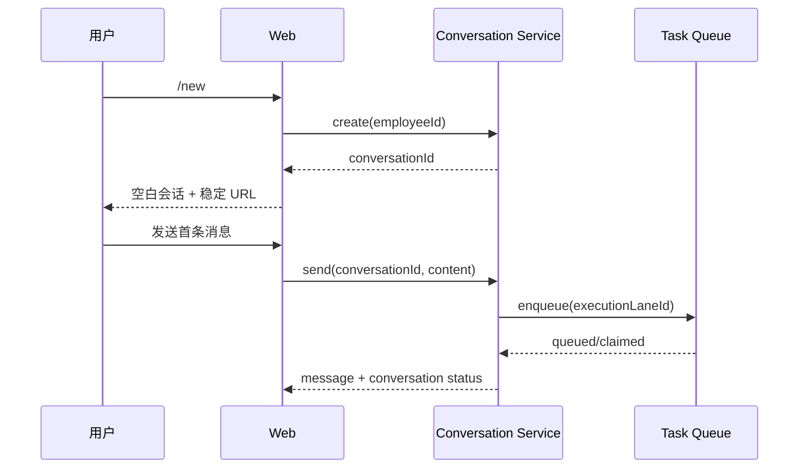

# 用户旅程与交互规格

## 1. 信息架构

历史入口按 AI 员工聚合，但列表项是 Conversation。

```text
消息
+-- AI 员工：Codex E2E
|   +-- 当前会话：优化视频脚本并生成成片        运行中
|   +-- 历史会话：排查模型流式响应中断          失败
|   +-- 历史会话：制作 Deterministic Smoke      已完成
|   +-- 新开会话
+-- AI 员工：Xim
    +-- 当前会话 ...
```

员工列表仍用于选择联系人。Conversation 列表只在选中员工后展示，避免把所有员工的历史混在一起。

## 2. `/new` 完整流程

### 2.1 Happy path

1. 用户在 Codex E2E 会话中输入 `/new`，或点击“新开会话”。
2. 客户端调用创建 Conversation 接口。
3. 服务端返回 `conversationId` 和 `draft` 状态。
4. 页面导航到稳定地址：`/im?focus=<employee>&conversation=<id>`。
5. 页面显示空白会话，标题为“新会话”，输入框保持当前 AI 员工。
6. 旧会话继续后台运行，员工历史入口显示其运行状态。
7. 用户发送首条消息，任务进入新 Conversation 的 Execution Lane。
8. 首条消息成功持久化后，会话从 `draft` 变为 `active`。
9. 服务端以首条用户消息生成临时摘要，后台再更新为一句话摘要。
10. URL 始终保留 `conversationId`，不回到员工默认消息流。



### 2.2 创建失败

- 不离开当前会话。
- 显示“新会话创建失败，请重试”。
- 不清空草稿、附件或引用。
- 不生成本地伪历史记录。

### 2.3 首条消息发送失败

- 保留新的 Conversation 和稳定 URL。
- 保留草稿、附件和引用。
- Conversation 保持 `draft` 或进入 `failed`，允许重试。
- 绝不能回退到旧 Conversation 再发送。

### 2.4 空白会话治理

- 空白 draft 不进入普通历史列表。
- 用户离开后 24 小时仍无消息，可由清理任务软删除。
- 若已上传附件或产生审计记录，则保留并标记 `abandoned`，不得硬删除关联数据。

## 3. 后台运行与切换

### 3.1 用户预期

旧会话运行中时创建新会话：

- 旧会话继续运行；
- 新会话可立即执行；
- 用户可在两个会话之间切换；
- 每个会话显示自己的运行状态；
- 完成通知必须带 Conversation 摘要，点击回到正确会话。

### 3.2 状态文案

| 内部状态 | 会话列表文案 | 会话内反馈 |
| --- | --- | --- |
| `draft` | 新会话 | 等待第一条消息 |
| `queued` | 待执行 | 已加入当前会话的执行顺序 |
| `running` | 运行中 | 正在处理本会话消息 |
| `capacity_wait` | 等待执行资源 | Runtime 暂无可用容量 |
| `idle` | 可继续 | 无 |
| `failed` | 执行失败 | 展示可重试原因 |
| `archived` | 已归档 | 只读，可恢复 |

不同 Conversation 并行时，不应在新会话显示“排队中”。只有以下两种情况允许等待：

1. 同一 Execution Lane 已有 active task，后续消息进入该会话自己的队列；
2. Runtime 有显式并发容量上限，显示“等待执行资源”，不能暗示被其它会话逻辑阻塞。

## 4. 历史会话入口

### 4.1 入口

- 位于会话列表顶部，与“新开会话”相邻。
- 图标按钮有 tooltip 和无障碍名称“历史会话”。
- 点击后打开当前 AI 员工的历史面板。

### 4.2 列表项

每项包含：

- 一句话摘要，主视觉信息，单行截断；
- 状态：运行中、失败、可继续、已归档；
- 最近更新时间；
- 可选的未读完成标记；
- 更多菜单：重命名、归档、删除。

摘要规范：

- 中文建议 12 至 40 字，最大 60 字；
- 英文建议 6 至 14 个词，最大 100 字符；
- 描述任务目标或结果，不使用“新会话”“聊天记录 1”等无信息标题；
- 首条消息发送后立即使用清洗后的首句作为 fallback；
- 后台摘要成功后原位更新，不改变列表顺序。

示例：

- “优化视频脚本并生成最终 MP4”
- “排查 DeepSeek 流式响应中断”
- “整理季度销售数据并输出趋势”

## 5. `/resume` 行为

`/resume` 是导航命令，不是发给 AI 员工的消息。

1. 用户输入 `/resume`。
2. 打开当前 AI 员工的历史面板。
3. 默认把运行中和最近使用的 Conversation 排在前面。
4. 用户选择某条记录。
5. 页面进入该 Conversation 的稳定 URL，并加载其消息、Provider Session 状态和待执行队列。
6. 用户下一条消息在该 Conversation 的 Execution Lane 中继续。

若 Provider Session 已失效：

- Conversation 和消息历史仍保留；
- 页面提示“原运行会话已失效，将基于本会话历史重新开始”；
- 用户确认发送后只重建本 Conversation 的 Provider Session；
- 不创建另一条不可见 Conversation。

## 6. 页面结构建议

```text
+-------------------------------------------------------------+
| Codex E2E                         [历史] [新建]               |
| 优化视频脚本并生成最终 MP4                   运行中           |
+-------------------------------------------------------------+
|                                                             |
| 本 Conversation 的消息流                                    |
|                                                             |
+-------------------------------------------------------------+
| [附件] [引用]                         Runtime 默认 [发送]     |
+-------------------------------------------------------------+
```

历史面板：

```text
+------------------------------------------+
| Codex E2E 的历史会话              [关闭] |
| [搜索会话]                               |
|------------------------------------------|
| 优化视频脚本并生成最终 MP4       运行中  |
| 今天 16:35                               |
|------------------------------------------|
| 排查模型流式响应中断             失败    |
| 今天 15:39                               |
|------------------------------------------|
| 制作 Deterministic Smoke         可继续  |
| 8 月 19 日                               |
+------------------------------------------+
```

## 7. 可访问性与反馈

- 新建、历史、关闭使用图标按钮时必须提供 tooltip 和 `aria-label`。
- 状态不能只靠颜色，必须有文本或可访问名称。
- 切换 Conversation 后焦点回到会话标题或输入框，避免屏幕阅读器失去上下文。
- 新建成功应通过路由和标题变化反馈，不额外弹出成功 toast。
- 失败 toast 必须说明动作是否已发生，例如“会话已创建，但消息发送失败”。
- 历史列表支持键盘上下选择、Enter 打开、Escape 关闭。

## 8. 防误操作规则

- 运行中的 Conversation 允许归档前必须二次确认；归档不取消任务。
- 删除只允许无审计保留要求的空会话；有消息的会话默认只归档。
- “停止”只停止当前 Conversation 当前 Lane 的任务，不影响同员工其它 Conversation。
- “重试”只重试失败 task，不重复写入用户消息和附件。
