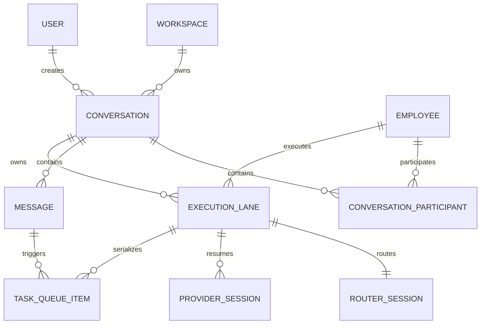

# 领域模型与接口契约
> **实现状态（本次会话）**：§2 数据模型四表与 `agent_task_queue` 新列已建；§3 Router key 已改为 `conversation:<id>`；§5.1/5.2/5.5/5.6 API（创建/列表/读取/摘要/归档/恢复）已实现。§5.3/5.4 消息加载与发送 API、§8 摘要生成 worker 未实现（消息仍按 channel 存储，尚未加 `conversation_id`）。


## 1. 领域关系



Conversation 是消息与历史的边界，Execution Lane 是执行有序性的边界。

## 2. 数据模型

### 2.1 `conversation`

```text
conversation
  id                         // conversation-<opaque id>
  workspace_id
  kind                       // direct | group
  channel_id                 // 复用现有 channel，但不作为会话身份
  created_by_user_id
  status                     // draft | active | idle | failed | archived | abandoned
  title                      // 用户可编辑
  summary                    // 服务端一句话摘要
  summary_source             // fallback | generated | user
  last_message_at
  last_activity_at
  created_at
  updated_at
  archived_at?
  version                    // CAS / 乐观并发
```

约束：

- `id` 永不复用；
- `channel_id` 可相同，表示同一员工联系人或同一群组下的多个 Conversation；
- `draft` 为空时不进入普通历史；
- `archived` 不等于取消运行；
- `summary` 允许先写 fallback，再异步生成。

### 2.2 `conversation_participant`

```text
conversation_participant
  conversation_id
  participant_type           // human | employee
  user_id?
  employee_id?
  display_name_snapshot
  joined_at
  left_at?
```

直接会话至少包含一个 human 和一个 employee。群聊 Conversation 从 channel 成员建立快照，但权限判断仍读取当前 workspace/channel 权限。

### 2.3 `conversation_execution_lane`

```text
conversation_execution_lane
  id
  workspace_id
  conversation_id
  employee_id
  router_session_id
  active_provider_session_id?
  work_dir?
  status                     // idle | queued | running | capacity_wait | failed | stopped
  active_task_queue_id?
  last_error_code?
  created_at
  updated_at

UNIQUE(workspace_id, conversation_id, employee_id)
```

直接会话只有一个 Lane。群聊中每个被触发的 employee 有独立 Lane，同一 Conversation 内可并行执行不同员工任务。

### 2.4 `conversation_provider_session`

```text
conversation_provider_session
  id
  execution_lane_id
  provider
  runtime_id
  provider_session_id
  status                     // active | invalid | superseded | closed
  started_at
  last_used_at
  invalidated_at?
  invalid_reason?
```

不把 Provider Session ID 直接当作产品 Conversation ID。Provider 切换、session 丢失或安全策略拒绝时，可以在同一 Lane 下创建替代 session，而不破坏历史 URL。

### 2.5 `message`

现有消息记录增加：

```text
message
  conversation_id            // 新增，最终 NOT NULL
  execution_lane_id?          // agent/process 消息可关联
  source_task_queue_id?
  ... existing fields
```

规则：

- 用户消息必须先持久化并获得 ID，再创建 task；
- pending、progress、final、error 消息沿用同一 `conversation_id`；
- 同一 task 的 pending/final 替换不能跨 Conversation 查询；
- 历史加载必须按 `conversation_id`，不能只按 channel。

### 2.6 `agent_task_queue`

增加：

```text
agent_task_queue
  conversation_id             // 新增
  execution_lane_id            // 新增
  source_message_id            // 提升为结构化列或保持 payload + 索引
  ... existing fields
```

迁移后约束：

- chat trigger 的 `conversation_id` 与 `execution_lane_id` 必填；
- workflow/manual task 可以为空，继续使用自己的并发策略；
- `router_session_id` 必须属于同一 Execution Lane；
- chat task claim 以 `execution_lane_id` 判断 active 冲突。

## 3. Router Session 身份

当前按 requester 聚合的 conversation key 必须替换。

```text
旧：user_conversation:<requesterUserId>
新：conversation:<conversationId>
```

`agent_router_session` 本身已有 `workspace_id + agent_id + conversation_key` 唯一语义。由于 `agent_id` 已在 Router Session 上，直接使用 `conversation:<id>` 即可让群聊中不同员工形成不同 Router Session。

解析优先级：

1. payload 中存在合法 `conversationId`：使用 `conversation:<id>`；
2. 迁移期 legacy chat task：使用确定性 legacy conversation key；
3. workspace task：使用现有 issue/task key。

任何浏览器提交的 `conversationId` 都必须校验：

- 属于当前 workspace；
- 当前用户有读取和发送权限；
- 目标 employee 是 Conversation participant；
- channel 与 Conversation 绑定一致；
- Conversation 未被不可恢复地删除。

## 4. Conversation Execution State

现有 `conversationExecutionWorkspaces` 使用 `kind + channel + agent` 作为 key，只能表达每个 channel/agent 一个状态。目标是以 Lane 为 key：

```text
conversationKey = conversation:<conversationId>:employee:<employeeId>
```

迁移完成后，Provider Session、workDir、auto continuation 和 last task 都写入 Lane 或引用 Lane，不再覆盖同员工其它 Conversation。

`workDir` 继续按 Router Session 隔离。相同 employee 的两个 Conversation 不共享可变工作目录，除非通过显式 artifact/reference 传递文件。

## 5. API 契约

### 5.1 创建会话

```http
POST /api/workspaces/:workspaceId/conversations
Content-Type: application/json
Idempotency-Key: <client-operation-id>

{
  "kind": "direct",
  "employeeId": "emp-codex-e2e",
  "channelId": "direct-codex-e2e"
}
```

返回：

```json
{
  "conversation": {
    "id": "conversation-01k...",
    "status": "draft",
    "summary": "新会话",
    "employeeId": "emp-codex-e2e",
    "createdAt": "2026-08-20T16:35:00.000Z"
  }
}
```

重复相同 Idempotency-Key 返回同一 Conversation。

### 5.2 当前员工的会话列表

```http
GET /api/workspaces/:workspaceId/employees/:employeeId/conversations
  ?status=active,idle,running,failed,archived
  &cursor=<opaque>
  &limit=30
```

返回服务端摘要、状态、最近时间和未读状态，不返回完整消息。

排序：

1. `running` 和 `capacity_wait`；
2. 有未读完成结果；
3. `last_activity_at DESC`；
4. `id DESC` 保证稳定。

### 5.3 加载消息

```http
GET /api/workspaces/:workspaceId/conversations/:conversationId/messages
  ?before=<message-id>
  &limit=50
```

只能按 Conversation 读取。channel 作为授权与展示上下文，不能作为消息过滤主键。

### 5.4 发送消息

```http
POST /api/workspaces/:workspaceId/conversations/:conversationId/messages
Content-Type: multipart/form-data
Idempotency-Key: <send-operation-id>

content=<text>
attachments=<files>
attachmentReferences=<ids>
skillReferences=<ids>
replyToMessageId=<id>
```

服务端事务步骤：

1. 校验 Conversation、参与者、channel 和 employee 权限；
2. 幂等持久化用户消息；
3. 找到或创建 Execution Lane；
4. 创建 task，写入 `conversation_id` 和 `execution_lane_id`；
5. 更新 Conversation `last_message_at` 和状态；
6. 返回 message、task 和 conversation projection。

不得再接受 `newConversation=true` 作为最终身份。迁移期可读取该字段，但必须先解析或创建真实 Conversation。

### 5.5 更新摘要或标题

```http
PATCH /api/workspaces/:workspaceId/conversations/:conversationId

{
  "title": "优化视频脚本并生成最终 MP4"
}
```

用户手动标题的 `summary_source=user` 优先级最高，后台摘要不得覆盖。

### 5.6 归档与恢复

```http
POST /api/workspaces/:workspaceId/conversations/:conversationId/archive
POST /api/workspaces/:workspaceId/conversations/:conversationId/unarchive
```

归档不取消 task。若产品需要“归档并停止”，必须作为显式的第二动作。

## 6. 前端路由契约

推荐稳定 URL：

```text
/w/:workspace/im?focus=<employee-focus>&conversation=<conversationId>
```

规则：

- `conversation` 存在时，它是唯一消息流选择条件；
- `focus` 用于员工列表定位和权限上下文；
- 两者不匹配时，以 Conversation 服务端 participant 为准并规范化 focus；
- `/new` 创建后必须立即导航到带 `conversation` 的 URL；
- 刷新、浏览器前进后退和分享内部链接都能回到同一 Conversation；
- 不再使用 `new=1` 表达已创建会话。

## 7. 事件契约

所有聊天实时事件增加：

```ts
interface ConversationEventEnvelope {
  workspaceId: string;
  conversationId: string;
  executionLaneId?: string;
  employeeId?: string;
  messageId?: string;
  taskQueueId?: string;
  type: string;
  occurredAt: string;
}
```

客户端只把事件应用到匹配 `conversationId` 的打开页面。其它 Conversation 的完成事件更新历史列表状态并产生通知，不插入当前消息流。

## 8. 摘要生成契约

```text
输入：Conversation 中已完成的用户与 AI 消息
输出：单句摘要 + 语言 + version
约束：无敏感诊断、无 Markdown 标题、无换行、长度受限
```

生成策略：

1. 首条用户消息写 fallback；
2. 首个 AI 最终回复后异步生成正式摘要；
3. 任务目标明显变化或用户手动请求时可刷新；
4. 使用 `summary_version` CAS，旧任务不能覆盖新标题；
5. 生成失败不影响 Conversation 和任务执行。

## 9. 授权边界

- 创建：当前用户必须可使用目标 employee，并可访问关联 channel；
- 读取：用户是 participant 或拥有 workspace 审计权限；
- 发送：Conversation active 且当前权限仍允许；
- 历史：只返回该用户可读且 employee 匹配的 Conversation；
- 队列：浏览器不能指定 `executionLaneId`、`routerSessionId`、`providerSessionId` 或 `runtimeId`；
- 服务端从 Conversation 和当前绑定重新推导所有执行身份。
