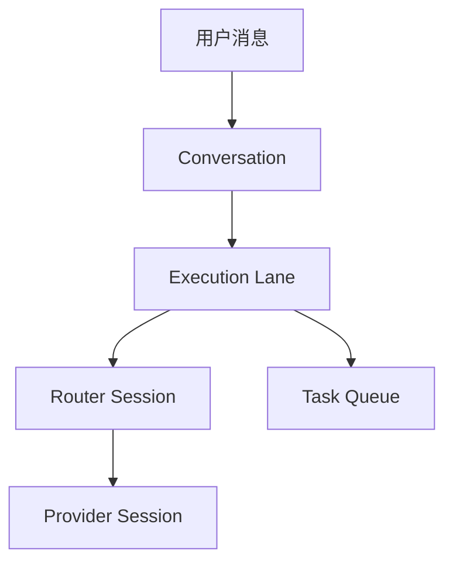

# 每会话队列与并发架构

## 1. 调度目标

调度系统必须同时满足：

1. 同一 Conversation、同一 employee 的任务严格有序；
2. 同一 employee 的不同 Conversation 可以并行；
3. 同一用户的不同 Conversation 可以并行；
4. 同一 Runtime 上不同 Execution Lane 可以并行；
5. 同一个 Provider Session 不能被并发 resume；
6. 运维操作仍可对 Runtime 保持独占；
7. Runtime 明确配置容量上限时，资源等待与会话排队分开表达。

## 2. 串行键

### 2.1 直接会话

```text
serialization_key = executionLaneId
executionLaneId = unique(workspaceId, conversationId, employeeId)
```

一个直接 Conversation 只有一个 employee，因此在产品层等价于“一会话一队列”。

### 2.2 群聊会话

```text
Conversation A
+-- Lane(A, Atlas)  -> 串行
+-- Lane(A, Vega)   -> 串行
```

不同 Lane 可并行。同一 Lane 的连续消息保持顺序。这样既符合“一会话拥有自己的队列”，又不会让群聊里的不同员工无意义互锁。

## 3. 领取规则

### 3.1 目标 SQL 语义

聊天 task 只有在相同 `execution_lane_id` 没有 active task 时才可领取：

```sql
SELECT queue.id
FROM agent_task_queue queue
WHERE queue.runtime_id = :runtime_id
  AND queue.status = 'queued'
  AND NOT EXISTS (
    SELECT 1
    FROM agent_task_queue active
    WHERE active.execution_lane_id = queue.execution_lane_id
      AND active.id <> queue.id
      AND active.status IN ('claimed', 'running', 'preparing_commit')
  )
ORDER BY queue.priority DESC, queue.created_at ASC, queue.id ASC
LIMIT 1;
```

必须删除聊天任务上的以下互锁条件：

```text
requested_by_user_id + employee_id
```

它们属于授权和归因，不是串行身份。

### 3.2 兼容非聊天任务

并非所有 task 都有 Conversation。建议按 task class 选择并发键：

| Task class | 串行键 |
| --- | --- |
| direct/channel chat | `execution_lane_id` |
| workflow node | workflow 自有 concurrency contract |
| workspace task | issue/task identity 或现有规则 |
| agent output mention | 继承目标 Conversation 的 Lane |
| auto continuation | 继承原 task 的 Lane |
| maintenance operation | Runtime 独占槽 |

迁移期 legacy chat task 没有 Lane 时，可以回退到 `router_session_id`，但不得回退到“用户 + 员工”作为长期方案。

## 4. Router 与 Provider Session



### 4.1 `/new`

- 创建新 Conversation；
- 创建新 Execution Lane；
- 创建新的 Router Session；
- `active_provider_session_id = null`；
- 首个 task 不携带旧 `channelSessionId`、旧历史路径或旧 Router memory；
- 旧 Conversation 的 Lane、task 和 Provider Session 不变。

### 4.2 后续消息

- 查找相同 Lane；
- 如果 Lane 已有 running task，新 task 在该 Lane 内 queued；
- 如果没有 active task，直接可领取；
- Provider resume 只选择该 Lane 的 active Provider Session；
- Provider Session 无效时，在同一 Lane 重建，不换 Conversation。

### 4.3 Agent 输出中的提及

Agent 输出触发另一员工时，必须携带原 `conversationId`，并路由到目标 employee 的 Lane。不能因为缺 requester 或由 agent 发起而创建员工级全局 Router Session。

### 4.4 自动续跑

auto continuation 继承：

- `conversationId`；
- `executionLaneId`；
- `routerSessionId`；
- 当前 Provider Session；
- 原始 requester 归因。

停止自动续跑只停止该 Lane，不影响同 employee 其它 Conversation。

## 5. Runtime 并发与容量

Daemon 已能跟踪同一 Runtime 的多个 active task。目标模型继续允许并行，但增加显式容量策略：

```text
runtime_task_capacity
  runtime_id
  max_concurrent_tasks
  max_concurrent_tasks_per_provider?
  source                 // default | admin | provider_policy
```

默认值应基于 Runtime 类型和资源基线，不应隐式等于 1。

当容量已满：

- task 状态可保持 `queued`，但 projection 映射为 `capacity_wait`；
- UI 文案为“等待执行资源”；
- 不显示“等待上一会话完成”；
- 指标中单独记录 `capacity_wait_ms`；
- 容量释放后按优先级与等待时间领取。

Runtime 维护、安装、MCP 配置等操作继续使用 exclusive slot。它们与聊天并发策略分离。

## 6. 公平性

只按全局 `priority DESC, created_at ASC` 可能让高频 Conversation 占用全部容量。推荐两层选择：

1. 找出无 active task 的可运行 Lane；
2. 每个 Lane 只选最早一条 queued task；
3. 在 Lane 候选间按 priority、最早 queued time 排序；
4. 可选对持续高优先级任务应用 aging，避免低优先级饥饿。

```sql
WITH lane_heads AS (
  SELECT queue.*,
         ROW_NUMBER() OVER (
           PARTITION BY queue.execution_lane_id
           ORDER BY queue.created_at ASC, queue.id ASC
         ) AS lane_rank
  FROM agent_task_queue queue
  WHERE queue.runtime_id = :runtime_id
    AND queue.status = 'queued'
)
SELECT *
FROM lane_heads
WHERE lane_rank = 1
  AND NOT EXISTS (...same lane active...)
ORDER BY priority DESC, queued_at ASC, id ASC
LIMIT 1;
```

PostgreSQL 实现应使用事务和行锁保证多个 daemon 并发 claim 不重复。SQLite/local 实现保留单写事务语义。

## 7. 幂等与竞态

### 7.1 双击发送

- 客户端生成 send Idempotency-Key；
- 相同 key 只创建一个用户消息和一个 task；
- 返回同一 message/task projection。

### 7.2 `/new` 双触发

- 创建 Conversation 使用操作幂等键；
- 快速按 Enter 或双击按钮只生成一个 draft；
- URL 以服务端返回 ID 为准。

### 7.3 同 Lane 并发 claim

- 两个 daemon 同时 claim 时，只有一个 task 从 `queued` 进入 `claimed`；
- `NOT EXISTS` 检查与状态更新必须处于同一事务；
- 建议 PostgreSQL 使用 advisory lock 或对 Lane head 使用 `FOR UPDATE SKIP LOCKED`；
- 测试必须覆盖 claim race，而不只覆盖顺序调用。

### 7.4 迟到完成

task 完成回调必须校验：

- task 仍属于该 Lane；
- claim generation/attempt 匹配；
- 结果只能更新相同 Conversation 的 pending message；
- 旧 Provider Session 的迟到结果不能覆盖 Lane 的新 active session；
- Conversation 被归档时仍可接收结果，但只更新历史与通知。

## 8. 状态投影

服务端根据 Lane 和 task 聚合 Conversation 状态：

```text
任一 Lane running                   -> conversation.running
无 running，任一 Lane capacity_wait -> conversation.capacity_wait
无 active，存在 queued              -> conversation.queued
最近 task failed                    -> conversation.failed
否则                                -> conversation.idle
```

员工列表状态不应简单显示“员工思考中”。建议显示：

- “2 个会话运行中”；
- 最近活动 Conversation 的一句话摘要；
- 点击员工后进入最近访问的 Conversation，而不是强制合并消息。

## 9. 可观测性

每个 task event 和日志至少包含：

- `workspaceId`；
- `conversationId`；
- `executionLaneId`；
- `routerSessionId`；
- `taskQueueId`；
- `employeeId`；
- `runtimeId`；
- `providerSessionId`（若已产生）；
- `requestedByUserId`。

核心指标：

- `conversation_task_queue_wait_ms`；
- `runtime_capacity_wait_ms`；
- `active_conversations_per_employee`；
- `active_lanes_per_runtime`；
- `conversation_session_crosslink_total`，目标必须为 0；
- `conversation_message_mismatch_total`，目标必须为 0；
- `new_conversation_returned_to_previous_total`，目标必须为 0。

## 10. 故障恢复

- daemon 崩溃：按现有 lease/recovery 重排 task，但保持 Lane ID；
- Provider session 丢失：同 Lane cold rebuild，不合并到员工其它 Lane；
- Runtime 下线：task 进入 capacity/resource wait，Conversation 保持可访问；
- 浏览器关闭：服务端继续运行，完成后历史状态和通知更新；
- 实时事件丢失：重新加载 Conversation projection，不读取员工级合并流补偿。
