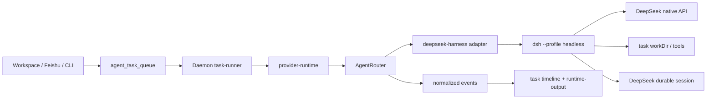

# DeepSeek Harness Runtime 架构设计与接入契约

## 1. 关键决策

采用“独立 provider + AgentRouter adapter + 现有 task queue”的分层：



AgentSpace 负责任务、权限、workspace、产物和审计；DeepSeek Harness 负责 agent loop、插件组合、模型调用和其内部 session。两者通过显式进程/协议契约连接，不共享内部数据库。

## 2. 标识与类型

建议新增：

```ts
type DaemonProvider =
  | "claude" | "codex" | "antigravity" | "gemini"
  | "opencode" | "openclaw" | "nanobot" | "hermes"
  | "deepseek-harness";

type AgentRouterHarness =
  | "claude" | "codex" | "antigravity"
  | "opencode" | "openclaw" | "hermes"
  | "deepseek-harness";
```

Provider label 为 `DeepSeek Harness`。不要使用 `deepseek` 作为 provider id，避免与模型服务中的官方 provider route 混淆。

协议能力建议新增内部 capability `deepseek_native`。它表示“由 DeepSeek Harness 原生 adapter 选择模型并发起请求”，不等同于 OpenAI Chat Completions 或 Responses。若 Models 服务暂不支持该 capability，P0 使用 runtime-local allowlist，禁止把它错误标成 `openai`。

## 3. P0 headless 进程契约

### Launch

```text
executable: dsh
args: ["--profile", "headless", taskPrompt]
cwd: taskWorkDir
env:
  DEEPSEEK_API_KEY: task-scoped credential
  DEEPSEEK_BASE_URL: optional managed/direct endpoint
  DSH_HOME: isolated profile directory
  DSH_TOOLS_MODE: runtime-approved value
```

`dsh --profile headless "task"` 的稳定边界来自上游文档：成功时最终 assistant 文本写 stdout、stderr 为空、退出码为 0；错误原因写 stderr、退出码为 1；进程不监听端口。stdout 必须被视为用户输出，stderr 只进入脱敏诊断，不得混入最终答案。

### Session

P0 每个 queued task 启动一个 fresh session。`providerSessionId` 可暂存为本地生成的 invocation id，但不能假装具备 resume 能力。任务 payload 中已有的 channel session 只作为上下文，不直接传给 headless runner。

### Event normalization

headless 没有稳定的 JSON event stream，因此 adapter 至少产生：

| AgentRouter event | 产生方式 |
| --- | --- |
| `harness_detected` | 启动前 `dsh --version` 或 executable probe |
| `harness_started` | 子进程 spawn 后 |
| `text_delta` | P0 可在进程结束时发送单个 final chunk；不要伪造实时 delta |
| `session_updated` | invocation/session id 生成后 |
| `harness_exited` | 进程退出时 |
| `tool_*` | P0 不可从纯 stdout 安全推断，保持缺省；P2 JSON-RPC 再实现 |

如果 stdout 含协议噪声或 JSON，不应猜测其含义；返回 `harness.protocol_parse_failed`。

## 4. P2 JSON-RPC/ACP 契约

DeepSeek Harness 的 `examples/jsonrpc-agent` 通过 newline-delimited stdio 提供 JSON-RPC，拥有可传入 `--provider`、`--model`、`--session-id`、`DSH_CWD`、`DSH_SESSION_ROOT` 的客户端契约。P2 适配器应采用长驻 child process 或每 runtime 一个受控 worker：

1. `initialize`/health 握手通过后才把 runtime 标记为可领取。
2. 每个 Dofe task 映射一个 JSON-RPC request id 和 DeepSeek session id。
3. 将 notifications 映射到统一 `text_delta`、`tool_started`、`tool_output`、`tool_finished`、`approval_requested`。
4. cancel 必须同时取消 Dofe task lease 和上游 turn；超时后销毁 session，不能复用半死连接。
5. 进程重启后通过 session root 恢复只读历史；恢复失败触发一次 fresh-session fallback，并在 timeline 中明确记录。

ACP 仅在需要编辑器/外部 automation client 时接入，不作为 P0 的隐藏依赖。

## 5. 凭据与配置隔离

### 环境变量

| 变量 | 来源 | 作用 |
| --- | --- | --- |
| `DEEPSEEK_API_KEY` | managed credential bundle | 必填，不能出现在 argv |
| `DEEPSEEK_BASE_URL` | managed credential bundle 或 runtime config | 可选，默认由 DeepSeek Harness 使用官方 endpoint |
| `DSH_HOME` | runtime profile | 隔离 profile、settings、credentials、session |
| `DSH_CWD` | task context | JSON-RPC 模式下的 workspace |
| `DSH_MODEL` | runtime config | 仅作为模型默认值，task 显式 model 优先 |

托管 runtime 必须沿用 `buildProviderEnv` 的“清空宿主 provider key、再注入 task-scoped credential”策略，并把 `DEEPSEEK_API_KEY`、`DEEPSEEK_BASE_URL` 加入 redaction 和 managed-key 清单。

### Profile

每个 managed runtime 使用独立 `DSH_HOME/profiles/headless` 和 session root，禁止多个 workspace 共用可写 profile。P0 只允许受控的 `cordis.patch.yml`，不允许用户任务通过 prompt 修改插件树或 credential 文件。

## 6. 健康检查

健康状态至少包含：

1. executable：`dsh --version` 能在目标节点运行。
2. profile：`dsh --profile headless --help` 成功，且无端口监听。
3. credential：通过内存中的 HTTP probe 或一次受限 model request 验证 key，key 不进入 argv。
4. model：明确验证 `deepseek-v4-flash` 与 `deepseek-v4-pro` 的可用性，不以“DeepSeek endpoint 可访问”代替模型级证据。
5. workspace：任务 workDir 可读写；bash/filesystem/MCP 能力与 Dofe runtime capability 交集明确。

健康探测结果写入现有 `providerHealth` metadata，失败使用统一 provider error category；不要把模型业务错误当成 CLI missing。

## 7. 与现有队列和数据面的关系

- `agent_task_queue`、claim lease、binding generation、workflow fence、失败收口和 cleanup 全部复用。
- `runProviderTask` 只负责根据 `runtime.provider` 分发到 adapter；task-runner 不添加 DeepSeek 分支。
- `runtime-output`、task messages、Feishu outbox 和审计沿用现有事件通道。
- P0 不把 DeepSeek 内部 JSONL session 导入 Dofe 数据库；仅持久化 provider session id、摘要和诊断引用。

