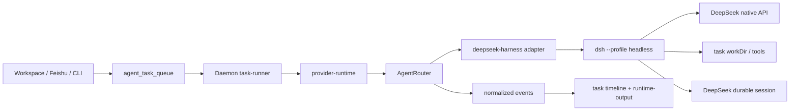

# DeepSeek Harness Runtime 架构设计与接入契约

> 决策状态（2026-08-23）：独立 provider、`deepseek_native`、headless P0 已 Accepted 并实现；默认关闭的一次性 JSON-RPC 协议基础已实现，P2a 长驻 worker 仍为 Proposed，P2b 受上游 wire 阻断；ACP 暂不实施。

## 1. 关键决策

采用“独立 provider + AgentRouter adapter + 现有 task queue”的分层：



AgentSpace 负责任务、权限、workspace、产物和审计；DeepSeek Harness 负责 agent loop、插件组合、模型调用和其内部 session。两者通过显式进程/协议契约连接，不共享内部数据库。

## 2. 标识与类型

建议新增：

```ts
type DaemonProvider =
  | "claude" | "codex" | "antigravity" | "gemini"
  | "opencode" | "openclaw" | "nanobot" | "hermes"
  | "deepseek-harness";

type AgentRouterHarness =
  | "claude" | "codex" | "antigravity"
  | "opencode" | "openclaw" | "hermes"
  | "deepseek-harness";
```

Provider label 为 `DeepSeek Harness`。不要使用 `deepseek` 作为 provider id，避免与模型服务中的官方 provider route 混淆。

协议能力建议新增内部 capability `deepseek_native`。它表示“由 DeepSeek Harness 原生 adapter 选择模型并发起请求”，不等同于 OpenAI Chat Completions 或 Responses。若 Models 服务暂不支持该 capability，P0 使用 runtime-local allowlist，禁止把它错误标成 `openai`。

## 3. P0 headless 进程契约

### Launch

```text
executable: dsh
args: ["--profile", "headless", "--patch", runtimeOverlay, taskPrompt]
cwd: taskWorkDir
env:
  DEEPSEEK_API_KEY: task-scoped credential
  DEEPSEEK_BASE_URL: optional managed/direct endpoint
  DSH_HOME: isolated profile directory
  DSH_PERMISSION_MODE: workspace-write
  DSH_TELEMETRY_DISABLED: "1"
  DSH_TOOLS_MODE: ""
```

`dsh --profile headless "task"` 的稳定边界来自上游文档：成功时最终 assistant 文本写 stdout、stderr 为空、退出码为 0；错误原因写 stderr、退出码为 1；进程不监听端口。stdout 必须被视为用户输出，stderr 只进入脱敏诊断，不得混入最终答案。

### Session

P0 每个 queued task 启动一个 fresh session。`providerSessionId` 可暂存为本地生成的 invocation id，但不能假装具备 resume 能力。任务 payload 中已有的 channel session 只作为上下文，不直接传给 headless runner。

### Event normalization

headless 没有稳定的 JSON event stream，因此 adapter 至少产生：

| AgentRouter event | 产生方式 |
| --- | --- |
| `harness_detected` | 独立 `detect`/health 操作中的 `dsh --version` probe |
| `harness_started` | 子进程 spawn 后 |
| `text_delta` | 当前 P0 不发送；最终 stdout 作为 `outputText` 返回 |
| `session_updated` | 当前 P0 不发送；headless 每次创建 fresh session，且不暴露可恢复 id |
| `harness_exited` | 进程退出时 |
| `tool_*` | P0 不可从纯 stdout 安全推断，保持缺省；P2 JSON-RPC 再实现 |

如果 stdout 含协议噪声或 JSON，不应猜测其含义；返回 `harness.protocol_parse_failed`。

## 4. P2 JSON-RPC/ACP 契约

2026-08-24 更新：上游 fork 已提供 `session/cancel`、`session/resume`、`session/approval-policy`、仅允许非机密 `DEEPSEEK_BASE_URL` 的 per-session environment overlay，以及 `protocolVersions`/`protocolVersion` 握手；AgentSpace one-shot 已发送并严格校验 `2.0` 协商结果，目前仍只在外部 abort 前 best-effort 发送 cancel，随后关闭整个 runtime。turn cancel ACK、逐请求 approval、session close、bounded worker、provider session 映射和真实恢复证据仍未交付。

DeepSeek Harness `0.1.1-rc.2` 的受支持 SDK wire 是 newline-delimited JSON-RPC 2.0。runtime executable 只接收 Cordis config 路径；provider/model/cwd 在 `initialize` params 中传递，session id 在 `session/prompt` params 中传递，`DSH_SESSION_ROOT` 是进程环境。不得把 Python 示例参数误写成 executable argv 契约。

当前 fork wire 已提供 `initialize`、`session/prompt`、`session/cancel`、`session/resume`、`session/approval-policy`、`shutdown`，并支持 `protocolVersions`/`protocolVersion` 协商；它仍没有 turn cancel ACK、session close、approval request/response，也不能证明进程重启后的真实 resume；服务端可调用 `agents.resume`，但当前证据仍未证明进程重启后的实际恢复。AgentSpace 每个远端任务的 Skill、credential attribution、gateway 日志路径均为 task-scoped 环境，直接复用进程会把前一任务环境带入后一任务，因此现有 overlay 只隔离非机密 endpoint，Skill、credential attribution 与 gateway 日志仍是 task-scoped，因此在取得完整环境隔离与真实恢复证据前不得开启跨任务 bounded worker。npm `@deepseek-ai/dsh` 不包含生产 `dsh-jsonrpc-agent`；固定上游 tag `dsh-v0.1.1-rc.2` 已提供 `deepseek-harness-runtime-bin` wheel 与 `dsh-jsonrpc-agent-pkg-<platform>-<arch>` 单文件构建链，发布 bundle 同时要求相邻的 `-rg`，macOS 还要求 `-spawn-helper`。本工作站尚未构建或安装该 bundle。

当前 AgentRouter 协议基础只在请求同时满足 `mode=jsonrpc` 与 `deepSeekJsonRpcEnabled=true` 时进入。直接协议测试仍可显式进入 spike 路径；provider queue 只有在 daemon 操作员将 `DOFE_AGENT_DEEPSEEK_JSONRPC_ENABLED` 严格设为 `1`，并提供 carrier/config 绝对路径以及 carrier、config、`-rg` 和 macOS `-spawn-helper` 的精确 SHA-256 时才设置该门禁。配置探测采用 disabled/valid/invalid 三态；显式开启但平台所需发布配置不完整或格式错误时不注册 runtime、不回退到 PATH，也不执行 legacy `dsh --version`。release config 还必须逐字等于仓库内 `deploy/daemon/runtimes/deepseek-jsonrpc/cordis.yml`，即上游固定 tag `dsh-v0.1.1-rc.2` 默认 composition，批准 SHA-256 为 `048031be7331f2b68c81b3cbfacacc06ee767dae1e8f00cbdc3137c1e55001af`；操作员不能用任意自签名 config 摘要绕过 composition 审查。adapter 将 executable、Cordis config 与平台所需 sidecar 解析为 canonical 普通文件并校验精确字节摘要，要求可执行文件具备 execute bit，脚本 carrier 使用固定绝对解释器；任一不一致均在 spawn 前拒绝。release child 丢弃动态加载/解释器启动变量，并以 daemon PATH 取代 task/Skill PATH。operator Cordis 路径覆盖 task/Skill 同名变量，全部 release 控制变量不会进入 provider child。standalone runtime 直接走上述校验；带 managed marker 的 runtime 还必须具有专用镜像烘焙的 `DOFE_AGENT_DEEPSEEK_JSONRPC_MANAGED_BUNDLE=1` attestation，并同时提供镜像内 `provenance.json` 的绝对路径、固定 source commit 与 wheel SHA-256。catalog、任务和 health 使用同一 verifier 重新读取 provenance，要求它与 carrier 位于同一 canonical 目录、严格匹配固定 fork/ref/commit、wheel 发行元数据，以及 carrier/`-rg` 的实际 pin；缺失、篡改、脱离目录或多余 schema 字段都在 spawn 前拒绝。standalone 不设置也不需要这三项 managed-only provenance pin。marker 和 image label 均不替代运行时文件校验。provider health 只有在 verifier 全部通过后才执行有界 `initialize→shutdown→EOF→SIGTERM→SIGKILL` 握手，并要求精确 `serverInfo={name:"deepseek-harness-sdk-runtime",version:"0.0.1"}`；无 credential/model canary 时只标记 `degraded`。默认仍是 headless，且尚无真实 bundle/E2E 发布证据。任务路径同样锁定该 server identity，并校验 root session 的连续 `seq`、合法 `time`、owned receipt、`turn/start→step/start→step/end→turn/end` 边界及 turn/step 归属。`assistant/chunk` 覆盖上游七类 `StreamChunk`，同时跟踪 block start/end、usage 和 terminal finish 顺序；每个 attempt 的 text delta 暂存至成功 finish 后按原粒度提交，失败 attempt 的部分文本丢弃，`llm/retry→llm/retry-started` 配对成功后为同一 step 重置 attempt 状态。该策略保证 transport retry 不污染最终消息，但当前协议基础不宣称失败前的乐观 token 级实时展示。finish 后 chunk、block 不匹配、未知 required event 与失败后的后续帧均 fail-closed。tool call/result 等待 durable event，reasoning 既不进入输出也不进入非零退出诊断。usage 的全部计数字段必须为非负安全整数，同一 attempt 的 chunk/message 值必须完全一致且只发一次，并保留 cache/reasoning 字段；统一任务事件映射继续保留 `cache_read_tokens`、`cache_write_tokens`、`reasoning_tokens` 供审计，但最终计费回传只接受带 gateway request id 的 Models gateway usage，避免 provider 与 gateway 双计费。它每任务使用随机 session 并在 `idle` 后 shutdown；发送 shutdown 后先等待有界 ACK，无论 ACK 是否到达都进入独立 EOF exit grace，再由公共子进程控制器执行 SIGTERM→SIGKILL。launch plan 未启动即被 capability 门禁拒绝时也会释放 overlay/home。故该路径不能宣称 session resume 或 P2a 同进程复用。

因此 P2 分两段：

上游 wire 扩展已先落地 session cancel/resume/approval-policy/per-session endpoint overlay；下一阶段只在真实 carrier 验证后补版本协商、turn cancel ACK、逐请求 approval、session close，再实现 AgentSpace 的 bounded connection manager。

1. P2a：受控 Cordis config、专用 managed Dockerfile、bundle build context、wheel 导入器、source commit/wheel/carrier/sidecar provenance 双层校验和 managed attestation 准入代码已交付。镜像构建脚本还会在 tag 前运行 `dofe-agent-daemon verify-deepseek-release`，以同一 verifier 和有界 health wire 生成确定性的 `release-evidence.json`；独立 Python verifier 要求来源、摘要、composition、server identity、initialize/shutdown 和 stdout purity 完全匹配，失败不会覆盖旧证据。发布后模型门禁由 `run-deepseek-runtime-canary.sh` 对不可变 `image@sha256` 依次执行 Flash/Pro 完整 one-shot JSON-RPC 回合；runner 要求 image repository、独立 64 位 image SHA-256 与完整 image ref 三者逐字一致，再将公钥与 release evidence 通过 `O_NOFOLLOW` 一次读取到 `0700` 私有目录，要求公钥快照匹配独立批准 SHA-256，并在 Docker/API key 暴露前以该快照和隔离环境执行 `cosign verify --key`。缺 key、摘要/仓库不符、拒签或验签超时均 Docker 零调用。验签通过后 runner 显式覆盖 managed image 的常驻 daemon entrypoint，并以唯一容器名、宿主 deadline、证据大小上限、Docker client TERM→KILL 与无条件按名称删除约束外层执行。carrier 使用 release-only 环境 allowlist，只接收 DeepSeek key/可选 endpoint 与必要网络变量，不继承其他 provider credential。canary evidence 只保存 image digest、release pins、签名公钥 SHA-256、模型通过状态、canonical usage 与官方/自定义 endpoint 身份哈希，禁止 prompt/output/key/明文 endpoint/主机路径；独立 verifier 使用同一公钥/release 快照重新计算身份并原子落盘，避免验签与证据绑定之间的路径替换。受控 `deploy-deepseek-runtime.sh` 在同一 shell 环境完成签名与双模型 canary 后，才以 `--pull never --no-build` 启动专用 Compose；Compose 仅能拼出 `${repository}@sha256:${64hex}`，不存在远端 `build:` 或 mutable tag fallback。通用 remote-images 不依赖 DeepSeek 发布变量，本地 compose 保留 bundle 构建路径。当前只完成 fake carrier、cosign 与 Docker runner/deploy shim 契约测试，仍需从 fork CI 取得真实 wheel、产出并签名不可变镜像/release evidence，再用测试 key 实际生成 model canary evidence。bounded 长驻 worker 必须先取得 per-session task environment 隔离能力，再实现 provider session 映射和同进程多轮；超时/取消在 turn cancel wire 交付前只能关闭整个 runtime 进程，并使该 worker 上的会话全部失效。
2. P2b：上游 fork 已提供 session cancel、resume、approval-policy、per-session environment 与版本协商；仍需 turn cancel ACK、逐请求 approval、session close，再实现 AgentSpace 的 bounded connection manager、provider session 映射和崩溃恢复。真实载体和恢复证据到位前，相关 capability 必须保持 false。
3. `session.event` 是完整 durable event envelope，映射到统一 `text_delta`/`tool_*` 前必须建立逐类型 contract test；不能按未知 JSON 猜测。

ACP 仅在需要编辑器/外部 automation client 时接入，不作为 P0 的隐藏依赖。

## 5. 凭据与配置隔离

### 环境变量

| 变量 | 来源 | 作用 |
| --- | --- | --- |
| `DEEPSEEK_API_KEY` | managed credential bundle | 必填，不能出现在 argv |
| `DEEPSEEK_BASE_URL` | managed credential bundle 或 runtime config | 可选，默认由 DeepSeek Harness 使用官方 endpoint |
| `DSH_HOME` | runtime profile | 隔离 profile、settings、credentials、session |
| `DSH_CWD` | task context | JSON-RPC 模式下的 workspace |
| `DSH_MODEL` | runtime config | 仅作为模型默认值，task 显式 model 优先 |
| `DOFE_AGENT_DEEPSEEK_JSONRPC_ENABLED` | daemon operator config | 严格为 `1` 才允许 standalone queue 选择 JSON-RPC |
| `DOFE_AGENT_DEEPSEEK_JSONRPC_EXECUTABLE` / `*_SHA256` | daemon operator config | 锁定 standalone carrier 的绝对路径与精确字节摘要 |
| `DOFE_AGENT_DEEPSEEK_JSONRPC_CORDIS_CONFIG` / `*_SHA256` | daemon operator config | 锁定仓库内 `dsh-v0.1.1-rc.2-default` composition 的绝对路径与批准摘要；不接受任意自签名配置 |
| `DOFE_AGENT_DEEPSEEK_JSONRPC_RIPGREP_SHA256` | daemon operator config | 锁定 carrier 相邻 `-rg` sidecar；所有平台必填 |
| `DOFE_AGENT_DEEPSEEK_JSONRPC_SPAWN_HELPER_SHA256` | daemon operator config | 锁定 carrier 相邻 `-spawn-helper`；macOS 必填 |
| `DOFE_AGENT_DEEPSEEK_JSONRPC_PROVENANCE` / `SOURCE_COMMIT` / `WHEEL_SHA256` | managed image build/runtime contract | 专用镜像根据已验证 build inputs 烘焙；托管 catalog/task/health 在 spawn 前重新验证严格 provenance；standalone 不设置 |
| `DEEPSEEK_RUNTIME_SOURCE_COMMIT` | managed image build input | 必须为 `dsh-v0.1.1-rc.2` 在 fork 中的固定 commit `b150a551b8d465e31e418e1b2eaf5e79bbb7d28e` |
| `DEEPSEEK_RUNTIME_WHEEL_SHA256` | managed image build input | 锁定导入的 Linux x64 runtime wheel；与 provenance 和 image label 一致 |
| `DEEPSEEK_RUNTIME_EVIDENCE_OUTPUT` | managed image release output | 必须为绝对路径；build 后/tag 前原子写入无 credential/无主机路径的确定性 wire evidence |
| `DOFE_AGENT_DEEPSEEK_RUNTIME_IMAGE_DIGEST` | model canary container contract | 必须为 `sha256:<64 hex>`；由 runner 从不可变 image ref 提取，绑定 canary evidence |
| `DEEPSEEK_RUNTIME_IMAGE` | post-push canary input | 必须是 `registry/repository@sha256:<64 hex>`，拒绝 mutable tag |
| `DEEPSEEK_RUNTIME_IMAGE_REPOSITORY` | post-push canary input | 独立批准的精确 repository；与 image digest ref 前缀不一致时验签和 Docker 均不执行 |
| `DEEPSEEK_RUNTIME_IMAGE_SHA256` | post-push canary/deploy input | 不带 `sha256:` 前缀的 64 位小写摘要；必须与完整 image ref 一致，专用 Compose 用它结构化拼接不可变引用 |
| `DEEPSEEK_RUNTIME_RELEASE_EVIDENCE` | post-push canary input | 已验证 release evidence 的绝对普通文件路径 |
| `DEEPSEEK_RUNTIME_COSIGN_PUBLIC_KEY` | post-push canary input | 绝对、非 symlink、受大小限制的 PEM 公钥；runner 冻结私有快照后用于校验精确 image digest |
| `DEEPSEEK_RUNTIME_COSIGN_PUBLIC_KEY_SHA256` | post-push canary input | 独立批准的 PEM 字节摘要；快照不匹配时验签和 Docker 均不执行 |
| `DEEPSEEK_RUNTIME_COSIGN_TIMEOUT_SECONDS` | post-push canary input | cosign 宿主 deadline，默认 60 秒、范围 1..300；超时执行 SIGTERM→SIGKILL 且不调用 Docker |
| `DOFE_AGENT_DEEPSEEK_COSIGN_PUBLIC_KEY_SHA256` | model canary container contract | runner 验签后注入公钥摘要；daemon evidence 与独立 verifier 必须精确一致 |
| `DEEPSEEK_MODEL_CANARY_EVIDENCE_OUTPUT` | post-push canary output | 绝对路径；双模型成功且证据校验后原子替换，失败保留旧证据 |

托管 runtime 必须沿用 `buildProviderEnv` 的“清空宿主 provider key、再注入 task-scoped credential”策略，并把 `DEEPSEEK_API_KEY`、`DEEPSEEK_BASE_URL` 加入 redaction 和 managed-key 清单。

P0 runtime overlay 还会禁用 `tool-web`、DeepSeek Web search、subagent、workflow 和 Ralph 等尚未接入 AgentSpace 审批/事件模型的插件行。该 overlay 不包含凭据，文件权限为 `0600`。

### Profile

每个 managed runtime 使用独立 `DSH_HOME/profiles/headless` 和 session root，禁止多个 workspace 共用可写 profile。P0 只允许受控的 `cordis.patch.yml`，不允许用户任务通过 prompt 修改插件树或 credential 文件。

## 6. 健康检查

健康状态至少包含：

1. executable：legacy headless 路径验证 `dsh --version`；JSON-RPC release 路径先完成平台所需配置解析，以及 carrier/config/`-rg`/macOS `-spawn-helper` 的 canonical 文件、精确摘要、execute bit 与固定解释器校验，绝不对未验证载体执行通用 CLI probe。
2. profile：legacy 发布门禁要求 `dsh --profile headless --help` 成功且无端口监听；JSON-RPC bundle preflight 通过后再运行有界 initialize/shutdown wire handshake。仅有 bundle + wire 证据、未提供 credential/model probe 时只标记 `degraded`，不能替代真实模型 canary。
3. credential：通过内存中的 HTTP probe 或一次受限 model request 验证 key，key 不进入 argv。
4. model：发布门禁要求明确验证 `deepseek-v4-flash` 与 `deepseek-v4-pro`；已交付不可变镜像双模型 canary runner，但尚未用真实测试 key 执行并取得 evidence。常规 health 对 `${DEEPSEEK_BASE_URL}/models` 的认证请求不能替代该模型级 canary。
5. workspace：任务 workDir 可读写；bash/filesystem/MCP 能力与 Dofe runtime capability 交集明确。

健康探测结果写入现有 `providerHealth` metadata，失败使用统一 provider error category；不要把模型业务错误当成 CLI missing。

## 7. 与现有队列和数据面的关系

- `agent_task_queue`、claim lease、binding generation、workflow fence、失败收口和 cleanup 全部复用。
- `runProviderTask` 只负责根据 `runtime.provider` 分发到 adapter；task-runner 不添加 DeepSeek 分支。
- `runtime-output`、task messages、Feishu outbox 和审计沿用现有事件通道。
- P0 不把 DeepSeek 内部 JSONL session 导入 Dofe 数据库；仅持久化 provider session id、摘要和诊断引用。
