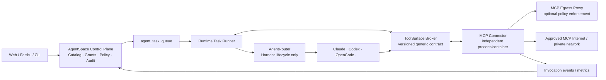

# AgentSpace MCP 独立化架构方案

> 状态：Proposed（2026-08-26）
>
> 目标：让 MCP 成为拥有独立联网能力、生命周期和可观测性的系统；AgentRouter 与 runtime 只依赖稳定的通用工具契约，不再依赖 MCP gateway 的实现细节。

## 1. 背景与现状证据

当前实现已经具备目录、连接、审批、短期 grant、egress lease 和审计能力，但执行链仍把三类职责绑在一起：

1. `packages/daemon/src/remote-daemon/task-execution.ts` 在任务执行过程中 claim MCP session、创建共享 `McpGateway`，再把 URL 传入 `runProviderTask`。
2. `packages/daemon/src/agent-router/types.ts` 暴露 `mcpGatewayUrl`、`codexMcpInjectionEnabled` 等 MCP 专属字段；Claude/Codex adapter 负责拼接各自的 MCP 配置。
3. `packages/daemon/src/mcp/client.ts` 在 daemon 进程内执行远端 MCP 连接、工具发现和调用；`egress-client.ts` 再把部分流量转发到独立 egress proxy。

这三个事实说明：控制面治理、runtime 网络、provider 启动配置和 MCP 协议执行仍共享同一个任务进程边界。结果是新增 MCP 需要修改 task-runner、AgentRouter adapter、网络环境和多套测试；gateway 故障还会被误判成 harness 故障。

## 2. 架构目标与非目标

### 2.1 目标

- MCP Connector 独立部署、独立进程/容器、独立网络命名空间，拥有 DNS、TLS、代理和连接池能力。
- AgentRouter 只处理 harness 生命周期、模型协议和通用 `ToolSurface`，不出现 MCP URL、MCP secret、MCP catalog 类型。
- Runtime 只通过版本化 Connector API 获取工具清单、打开任务会话和执行调用；provider 不接触远端 endpoint 或凭据。
- 控制面继续负责 catalog、连接状态、审批、租约、审计和计费归属，但不承载数据面网络请求。
- 新增一种 MCP 只需提交 catalog/release、Connector transport profile 和能力声明，不修改 AgentRouter adapter。

### 2.2 非目标

- 不复制任务队列，不为 MCP 建第二套员工/会话权限模型。
- 不在 Docker Compose 中新增 PostgreSQL、Redis 或 RabbitMQ；这些依赖仍由共享基础设施提供。
- 不允许“独立联网”绕过 egress policy。Connector 可以直连获批目标，也可以连接独立 egress proxy；代理是网络治理组件，不是 AgentRouter gateway。

## 3. 目标拓扑



### 网络边界

| 区域 | 可访问对象 | 禁止对象 | 所有者 |
| --- | --- | --- | --- |
| Control Plane | DB、队列、Connector 管理 API | 任意 MCP endpoint | Web/Services |
| Runtime network | Models gateway、任务文件、ToolSurface Broker | 任意未声明公网地址 | Runtime team |
| MCP egress network | 目录允许的 MCP host/port、可选 egress proxy | Control Plane DB、其他 runtime | MCP team |
| Provider sandbox | 工作目录、通用 ToolSurface client | MCP secret、控制面 token、任意外网 | AgentRouter team |

Connector 的网络策略以 connection release 为单位生成，DNS 解析、私网地址拒绝、TLS/CA、重定向、速率和并发限制均在 Connector 或 egress proxy 内完成。provider 看到的只是短期 `toolSession` 句柄。

## 4. 模块职责与依赖规则

### 4.1 Control Plane（现有 services/db/web）

- 管理 `McpCatalogItem`、`RuntimeMcpConnection`、approved tools、secret envelope、health 状态和 egress policy revision。
- 通过认证的 task claim API 发放一次性、短 TTL 的 `McpTaskGrant`；grant 只包含连接引用和工具授权，不下发明文 secret 到 provider。
- 接收 Connector 的健康、工具发现、调用审计和 usage 事件，执行幂等去重。
- 不调用 MCP SDK，不解析远端响应，不持有长连接。

### 4.2 MCP Connector（新增独立组件）

- 负责 Streamable HTTP/SSE/managed service/stdio transport、连接池、协议握手、工具发现和调用。
- 负责独立网络出口；每个连接使用 policy snapshot + 短期 lease，过期或撤销立即拒绝。
- 维护 task-scoped `toolSession`，调用时再次向 control plane 或本地签名缓存做授权 fencing。
- 产生结构化状态：`connecting`、`ready`、`degraded`、`revoked`、`failed`；原始 endpoint、secret、tool arguments 不进入日志。
- 向 runtime 暴露本地 Unix socket（优先）或 loopback mTLS HTTP；不向公网监听。

### 4.3 ToolSurface Broker（新增通用边界）

`ToolSurface` 是 AgentRouter 与任何工具提供方之间的唯一运行时契约。MCP 只是其中一种实现。

```ts
export interface ToolSurfaceProvider {
  id: string; // 例如 "mcp"、"skill-runner"、"browser"
  contractVersion: "1";
  openSession(input: {
    taskId: string;
    runtimeId: string;
    requestedCapabilities: string[];
  }): Promise<{ sessionId: string; tools: ToolDescriptor[]; clientConfig: unknown }>;
  call(input: { sessionId: string; toolId: string; arguments: unknown }): Promise<ToolCallResult>;
  close(input: { sessionId: string; reason: string }): Promise<void>;
}

export interface ToolDescriptor {
  id: string;
  name: string;
  description: string;
  inputSchema: Record<string, unknown>;
  risk: "low" | "medium" | "high";
}
```

`clientConfig` 是 provider-native 配置片段或本地 broker 句柄，必须由 ToolSurface adapter 生成；AgentRouter 不读取或解释其内容。

### 4.4 AgentRouter

- 保留 harness detect、launch、stdout/stderr、取消、超时、事件归一化和错误分类。
- `AgentRouterRunRequest` 删除 `mcpGatewayUrl`、`codexMcpInjectionEnabled` 及所有 MCP 类型，改为可选的通用 `toolSurface?: ToolSurfaceLaunchContext`。
- adapter 只消费 `ToolSurfaceLaunchContext` 的 opaque `clientConfig` 和通用权限列表；MCP server key、endpoint、lease header 由 Connector adapter 生成。
- AgentRouter 不导入 `packages/daemon/src/mcp/*`，不创建 MCP client，不负责 MCP 审计。

### 4.5 Runtime Task Runner

- 从 control plane claim `McpTaskGrant`，调用 Connector `openSession`，把 opaque session/config 交给 ToolSurface Broker。
- 任务结束、取消、超时和失败时可靠调用 `close`；Connector 负责清理连接和撤销句柄。
- runtime 仍负责 workspace、credential attribution、runtime-output 和任务状态，不负责远端 MCP 网络。

## 5. API 与事件契约

### 5.1 Connector API（v1）

| 方法 | 作用 | 幂等键 | 失败语义 |
| --- | --- | --- | --- |
| `POST /v1/sessions` | 打开 task-scoped 工具会话 | `taskId + attemptId` | 授权/网络/协议错误，fail closed |
| `GET /v1/sessions/:id/tools` | 获取工具清单 | session id | 返回上次成功 discovery 快照或 `degraded` |
| `POST /v1/sessions/:id/calls` | 执行工具调用 | `eventId` | 超时可重试；服务端按 eventId 去重 |
| `DELETE /v1/sessions/:id` | 关闭并撤销会话 | session id | 关闭必须最终收敛，重复调用返回 204 |
| `GET /v1/health` | Connector 自检 | 无 | 不包含 secret/endpoint |

所有请求带 `X-Dofe-Task-Id`、`X-Dofe-Runtime-Id`、`X-Dofe-Contract-Version`；Connector 通过 daemon identity/mTLS 或 Unix socket peer credential 校验来源。

### 5.2 事件

```text
mcp.session.opened
mcp.discovery.completed
mcp.call.started
mcp.call.completed
mcp.call.failed
mcp.connection.health_changed
mcp.session.revoked
```

事件最小字段为 `eventId、workspaceId、runtimeId、taskId、connectionId、toolId、status、latencyMs、policyRevisionId`。输入参数、输出正文、授权 header 和 endpoint 只保留哈希或安全摘要。

## 6. 安全与可靠性

1. **凭据隔离**：secret 只在 Connector 内存或受限 stdio 子进程环境中出现；runtime/provider 环境变量不得包含 MCP secret。
2. **授权 fencing**：open、call 两次校验 task、runtime、connection、approved tool、policy revision 和 lease；连接被禁用后已有 session 立即变为 `revoked`。
3. **网络隔离**：Connector 使用独立 Docker network/sidecar；默认 deny-all，按 host、port、path、TLS CA 和速率放行。`MCP_EGRESS_ENFORCE=true` 时必须配置独立 proxy，不能回退到 runtime network。
4. **资源上限**：单连接并发、请求/响应字节、调用超时、发现工具数、连接池空闲时间和每任务总预算均有硬上限。
5. **故障收口**：Connector 不可用只影响声明依赖 MCP 的任务；没有 MCP 的任务不应经过 Connector。调用失败返回结构化错误，AgentRouter 不把它改写成 harness crash。
6. **审计一致性**：调用 eventId 在 control plane 唯一；Connector 重试不得产生重复账单或重复外发动作。

## 7. 迁移策略

### 阶段 A：兼容层（默认）

- 新建 `packages/mcp-connector` 和 `ToolSurface` 类型；现有 `McpGateway` 作为 legacy provider 实现同一接口。
- `task-execution.ts` 通过 feature flag 选择 `legacy-gateway` 或 `connector-v1`，两者共用 claim、审批和审计 API。
- AgentRouter 暂时保留旧字段但标记 deprecated；新增 harness 不得依赖旧字段。

### 阶段 B：双写与灰度

- Connector 与 legacy gateway 对同一组 fake/测试 MCP 运行契约测试，比较工具清单、调用结果、审计和超时行为。
- 先按 workspace 灰度，再按 runtime/provider 灰度；失败只回退 ToolSurface provider，不回退任务队列或删除连接。
- 观察 7 天：成功率、P95 延迟、网络拒绝率、重复 event、连接泄漏和 Connector CPU/内存。

### 阶段 C：切换与清理

- 默认使用 Connector；保留 legacy gateway 只读回滚开关 2 个发布周期。
- 删除 `mcpGatewayUrl`、`MCP_GATEWAY_SERVER_KEY` 和 adapter 内 MCP 专属分支；迁移旧配置为 ToolSurface clientConfig。
- 最后移除 daemon 内 `RuntimeMcpClient` 远端调用路径和共享 gateway pool。

## 8. ADR

### ADR-0826-01：MCP 数据面独立于 AgentRouter

**决策**：MCP 网络连接、协议执行和连接生命周期迁移到独立 MCP Connector；AgentRouter 仅依赖通用 ToolSurface。

**理由**：降低新增 MCP 的改动面，避免 provider adapter 携带 endpoint/secret 语义，并使 MCP 网络故障与 harness 故障可区分。

**代价**：新增部署单元、Connector API、跨进程认证和运维指标；迁移期需维护兼容 gateway。

### ADR-0826-02：独立联网不等于绕过治理

**决策**：Connector 拥有独立 egress，但仍执行 control plane 签发的 lease/policy；可选 egress proxy 只作为网络策略执行点。

**拒绝方案**：让 provider 直接拿远端 MCP URL/secret，或把 MCP 连接塞回 AgentRouter 进程。前者扩大泄露面，后者保留当前强耦合。
