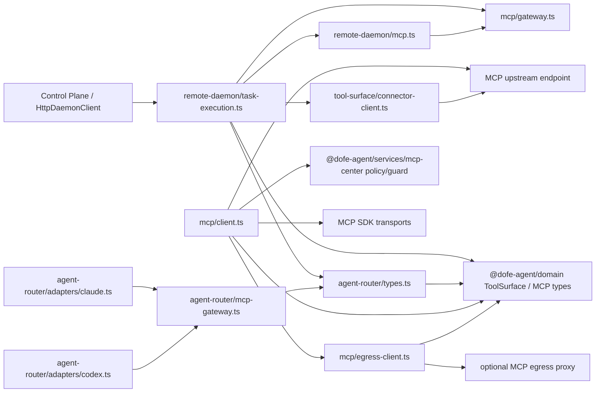

# W0 依赖图与影响半径记录

> 记录日期：2026-08-27  
> 范围：AgentRouter、Runtime daemon、MCP client/Connector 现状基线  
> 记录状态：已完成可复现的仓库扫描；待具备 `code-review-graph` MCP 的会话补充图工具校验

## 1. 工具与证据边界

本次会话未暴露 `code-review-graph` MCP 工具，因此无法生成工具原生的节点 ID、调用边置信度和影响半径评分。以下记录采用可复现的只读扫描形成，命令均在仓库根目录执行：

```sh
rg -n '^import|^export .* from' packages/daemon/src/remote-daemon/task-execution.ts \
  packages/daemon/src/agent-router/types.ts \
  packages/daemon/src/agent-router/mcp-gateway.ts \
  packages/daemon/src/mcp/client.ts \
  packages/daemon/src/mcp/egress-client.ts

rg -n 'task-execution|mcp-gateway|mcp/client|mcp/egress-client' \
  packages/daemon apps scripts --glob '*.ts' --glob '*.tsx' --glob '*.mjs'
```

验证补充使用 TypeScript 类型检查、定向 Node tests、Connector tests 和浏览器回归；扫描结果不冒充正式图工具输出。

## 2. 当前依赖图



### 2.1 关键边说明

| 边 | 代码证据 | 当前含义 | 解耦风险 |
| --- | --- | --- | --- |
| `task-execution -> remote-daemon/mcp` | `task-execution.ts:34` | 任务流程负责选择并装配 MCP 会话 | 任务生命周期与 MCP transport 绑定 |
| `task-execution -> mcp/gateway` | `task-execution.ts:35`，约 `349-353` | legacy gateway 的工具名和权限名直接进入任务流程 | 删除 gateway 会影响审批名称、审计和回滚 |
| `task-execution -> connector-client` | `task-execution.ts:36`，约 `311-332` | Connector 是任务流程中的条件分支 | 新 Connector 类型需要修改任务执行分支 |
| `task-execution -> AgentRouter request` | `task-execution.ts:467-472` | 同时传递 `toolSurface`、`mcpGatewayUrl` 和实验开关 | 通用 ToolSurface 与 legacy 字段并存 |
| `agent-router/adapters -> agent-router/mcp-gateway` | `claude.ts:18`、`codex.ts:27` | provider adapter 知道 MCP native config 和 gateway URL | 新 harness 仍需经过 MCP 专属模块 |
| `mcp/client -> services/mcp-center` | `client.ts:11`、约 `443-483` | Runtime client 直接执行 endpoint/policy/脱敏规则 | MCP transport 与控制面策略实现耦合 |
| `mcp/client -> egress-client` | `client.ts:12`、约 `187-244` | Runtime client 负责决定 direct/proxy 并推送 policy | Connector 化时需迁移 proxy 选择逻辑 |
| `mcp/egress-client -> domain` | `egress-client.ts:2` | egress proxy client 绑定 domain policy snapshot | 独立 Connector 需复制或抽取契约 |

## 3. 影响半径

影响半径按“直接调用者、运行路径、测试锚点、变更风险”记录；这是 W0 的人工基线，待图工具可用后补充自动评分。

| 节点 | 直接调用者/依赖者 | 受影响运行路径 | 已有测试锚点 | 风险 |
| --- | --- | --- | --- | --- |
| `remote-daemon/task-execution.ts` | `remote-daemon.ts`、`remote-daemon/poll.ts`、`remote-daemon.test.ts`、`direct-mcp.test.ts` | 普通任务、direct MCP、Connector session、legacy gateway、取消/超时清理 | Remote Daemon 49 项、direct MCP tests | 高 |
| `agent-router/types.ts` | 全部 harness adapter、`runProviderTask` 调用方、router 类型测试 | 所有 Provider 启动请求与结果协议 | AgentRouter adapter regression | 高 |
| `agent-router/mcp-gateway.ts` | Claude/Codex adapter、`mcp-gateway.test.ts`、task execution 权限名生成 | Claude/Codex MCP 参数注入、URL 脱敏、legacy 回滚 | MCP gateway tests | 中高 |
| `mcp/client.ts` | `verify-executor`、geo live flow、Runtime MCP client 调用方、client tests | endpoint guard、DNS/TLS、discover、callTool、direct/proxy transport | MCP client/verify tests、daemon tests | 高 |
| `mcp/egress-client.ts` | `mcp/client.ts`、egress client tests | policy snapshot 推送、lease/session header、proxy 请求 | Egress client tests | 中高 |

### 3.1 当前测试覆盖与缺口

- 已覆盖：direct MCP 多 endpoint、Connector open/close、工具审批、policy error code、legacy gateway 参数生成、MCP client endpoint guard、egress header 构造。
- 已覆盖：无 MCP 任务不创建 Connector 的路径，以及任务 finally 的 session 关闭路径（Remote Daemon 定向测试）。
- 缺口：正式 dependency graph MCP 的节点/边校验、真实测试 MCP 的跨容器 E2E、删除 gateway 后 AgentRouter 无 MCP import 的静态门禁。
- 运行时事实：本地 Web `1455` 与 Connector `8787` 已完成 HTTP/浏览器回归；这证明当前实现可运行，不等同于 W4 解耦已完成。

## 4. W0 结论与后续门禁

W0 基线记录现已具备：

1. 现状耦合节点和直接边有文件/行号证据。
2. 任务执行、AgentRouter、Runtime MCP、egress proxy 的影响半径已登记。
3. 测试锚点、已验证路径和未覆盖的真实 E2E/静态门禁已区分。
4. `code-review-graph` 工具不可用这一证据边界已明确标注。

W4 解耦完成前不得将以下项目标记为通过：

- `packages/daemon/src/agent-router` 不再 import MCP 专属模块。
- `task-execution.ts` 不再同时编排 direct、Connector、legacy gateway 三种实现；选择逻辑下沉到 ToolSurface session provider。
- `mcp/client.ts` 与 `mcp/egress-client.ts` 的 transport/policy 实现迁移到独立 Connector，daemon 只保留协议客户端 stub。
- 新增 MCP demo 不修改 AgentRouter 文件，并有真实 Connector E2E 和回滚证据。

具备 `code-review-graph` MCP 的后续会话应重新执行影响半径查询，并将自动结果附录到本文件；若自动图与本记录冲突，以源码和通过测试复核后修订本文件。
